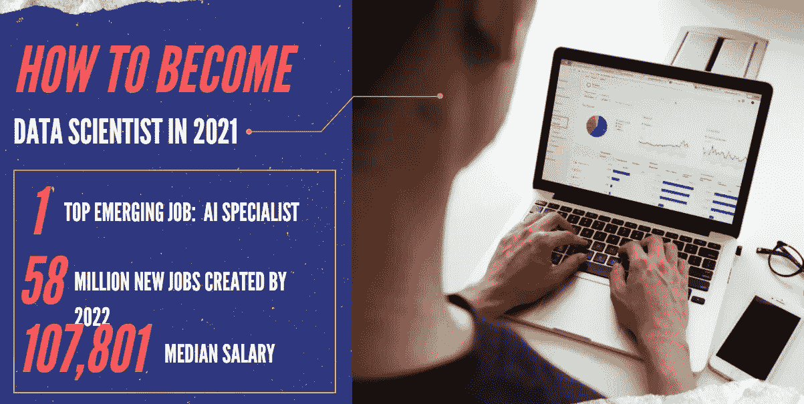
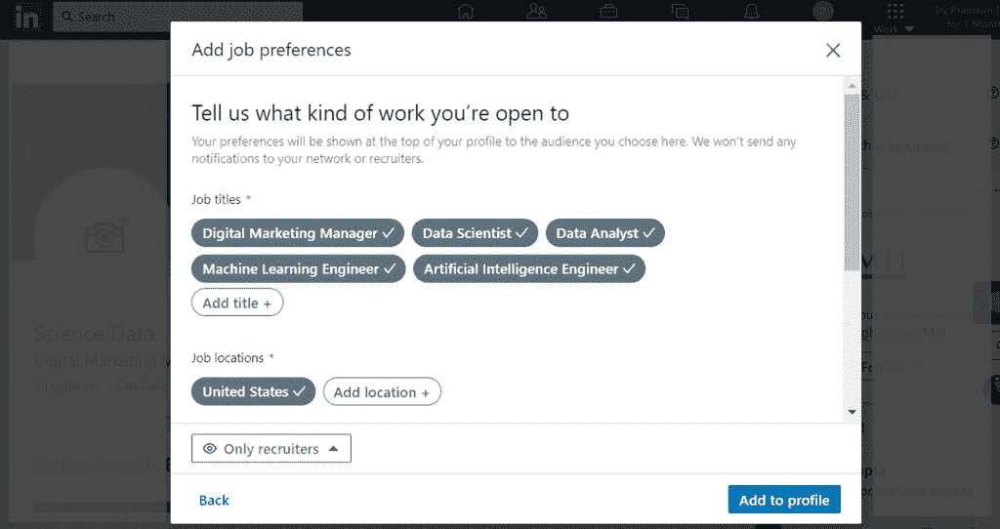
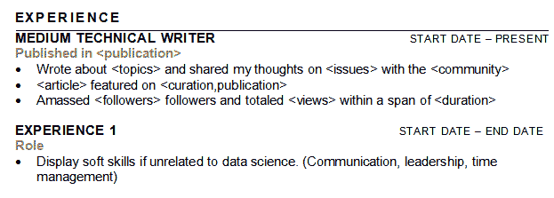
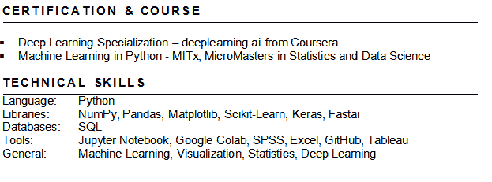

# 如何成为 2021 年的数据科学家

> 原文：<https://towardsdatascience.com/how-to-become-a-data-scientist-in-2021-9e0535924d45?source=collection_archive---------27----------------------->

## 让你被雇用的完整指南

*图片作者，照片(右)来自* [*unsplash*](https://unsplash.com/)

如果你渴望在 2021 年成为一名数据科学家，那你来对地方了。在这本大规模的深度指南中，我将带您一步一步地了解我成为数据科学家的过程。当然，从零开始成为一个人需要决心、动力和大量的自律。如果你认为你已经准备好迎接挑战，请继续阅读。

**内容**

1.  你应该成为一名数据科学家吗？
2.  你在数据科学领域的理想角色
3.  资格检查
4.  提升您的数据科学技能
5.  从事项目工作
6.  建立你的在线形象
7.  Linkedin 和网络
8.  打造你的简历
9.  被录用！

# 1.你应该成为一名数据科学家吗？

你应该问的第一个问题是，为什么是数据科学家？

围绕数据科学话题的炒作是非常真实的，但这不应该是你进入这一领域的唯一原因。事实是，成为一名数据科学家绝非易事。数据科学家需要某种查看数据的诀窍，这涉及大量的实验、研究、批判和分析思维。媒体经常将数据科学描绘成邻家的酷孩子，致力于人工智能等令人惊叹的技术，但每个热门词汇的背后都是数小时的辛勤工作和毅力。

如果你认为你已经做了你应该做的研究，并且决定 Data Scientist 适合你，这里有一个好消息。

现在是进入数据科学的最佳时机。

除了这样一个事实:

1.  Linkedin 报道称，人工智能专员是 2020 年排名第一的新兴工作，
2.  [世界经济论坛](http://reports.weforum.org/future-of-jobs-2018/shareable-infographics/)预测，2022 年，数据科学和相关行业将净增 5800 万个工作岗位
3.  [Glassdoor](https://www.cnbc.com/2020/01/14/glassdoor-best-tech-jobs-for-2020.html) 显示，数据科学家的平均基本工资是 107，801 美元

近年来，数据科学也已基本成熟，其潜力得到了大多数行业的广泛认可。像医疗保健、金融、农业、零售、国防等领域已经看到了它们的运营受到人工智能的影响，并且只会有更多的影响。这意味着，无论是哪个行业，掌握数据科学技能对雇主来说都是有价值的。

此外，学习数据科学从未如此简单！对数据科学的巨大兴趣导致了数据科学资源的爆炸式增长，使该领域的初学者和从业者都受益。视频讲座、博客文章和电子书，各种各样的教学材料可供学习者公开使用。另外，线下面对面的课程现在也很受欢迎，我将在接下来的几节中介绍它们。

那么你应该成为一名数据科学家吗？如果你相信数据科学的潜力，有动力和驱动力，我会说去做吧。

# 2.你在数据科学领域的理想角色

尽管我把一切都概括为数据科学家，但要明白数据科学中有多种角色。

*   数据分析师
*   数据科学家
*   机器学习专家
*   数据工程师
*   商业分析员
*   人工智能研究科学家，等等

每个角色的细节超出了本指南的范围，但是这篇[博客文章](/what-kind-of-data-science-role-is-right-for-you-9d2f4b117e81)很好地总结了这一点。

为什么这很重要？你选择的角色决定了你需要磨练的技能。业务分析师关注产品细节和业务知识，而机器学习专家专注于模型构建。知道你希望专攻哪种角色有助于更好地规划你的学习之旅。一条建议是利用你可能有的任何先前的经验。这样，你可以让自己更受招聘者的欢迎，因为你拥有特定领域的数据分析技能。

在这个阶段做一些自我反省，找到自己真正想要的角色。尽管本指南主要关注数据科学家，但其中许多内容仍然适用于任何其他角色。

# 3.资格检查

现在检查什么？

现在是时候评估您过去的资历，看看您应该从哪里开始您的数据科学学习之旅。重新开始不重要，重要的是知道在哪里开始。

基本上，您应该尝试检查成为数据科学家所需的这些基本技能；

1.  概率与统计
2.  微积分和线性代数
3.  编程；编排
4.  数据可视化
5.  机器学习

你们中的许多人在这个阶段会怀疑自己，怀疑自己的资格是否能够在数据科学领域建立职业生涯。我可以，我向你保证你一定可以。除了像人工智能研究科学家这样的更学术的工作，你当然不需要博士甚至更高的学位来擅长数据科学。

# 4.提升您的数据科学技能

一旦你知道从哪里开始，就该付诸行动了。学习数据科学通常有三种方式。

1.  训练营
2.  研究生学位(硕士或博士)
3.  大规模开放在线课程(MOOCs)

这些根据个性化学习的能力进行排名，1 为最不可定制，3 为最灵活。没有一条完美的路，只有一条最适合你。

## 训练营

训练营基本上是密集的校园训练，时间从几周到几个月不等。他们的目标是在短时间内覆盖尽可能多的内容，所以你会看到一个非常陡峭的学习曲线。时间也是一个因素，因为这通常需要在课程中投入大量时间。因此，这个选项只推荐给那些能够安排时间的全日制学习者。

另外，这也是这个榜单上最不个性化的选项。主要是因为大多数新兵训练营假设零知识，并试图从零开始教授一切，所以没有必要定制你的经验，因为每个人都是平等的。

新兵训练营的一个好处是有机会和志同道合的人联系。你的学习伙伴会和你一样有动力，每个人都有一个共同的目标。利用这段时间与他人交流，构建您的数据科学圈。

## 研究生学位

研究生学位通常从 1-2 年的硕士学位到 3-4 年的博士学位。这些都是专业的研究生课程，具有针对您选择的专业的经过验证的课程。一些例子是麻省理工学院的商业分析硕士和哥伦比亚大学的数据科学硕士。此外，这些课程提供了一定程度的个性化，你可以选择你想学习的课程。你将能够掌控你的学习，决定你想要的专业。然而，在这里陈述显而易见的，这也是最昂贵的选择，你必须考虑到这一点。

参加研究生学位课程通常是一个巨大的承诺，所以要确保你已经做了研究。

## 大规模开放在线课程(MOOCs)

自 MOOCs 诞生以来，它已经走过了漫长的道路。公认的大学正在发布他们的一些模块作为 MOOCs，甚至像谷歌这样的主要科技公司也推出了他们自己的在线课程。MOOCs 不受欢迎、公司越来越接受自学者的时代已经一去不复返了。使用正确的资源和正确的学习途径，任何人都可以通过在线课程建立自己的数据科学技能库。

此外，已经出现了从校园教学到网上授课的转变。对于那些想要在线课程的灵活性和大学的可信度的人来说，edX 或 Coursera 已经与主要大学合作，在他们的平台上提供硕士课程。这将 MOOCs 带到了一个新的高度，改变了在线课程的定义。

无论您选择哪条道路，提升您的数据科学技能只是成为数据科学家的第一步。

# 5.从事项目工作

虽然课程告诉雇主你了解数据科学，但项目向他们展示了你作为数据科学家的能力。做项目不仅能增加你的简历，还能帮助你建立作为数据科学家的技能。

## 卡格尔

图片来自[https://www.kaggle.com/](https://www.kaggle.com/)

Kaggle，最好的数据科学竞赛平台。即使 Kaggle 因其竞争而闻名，但在 Kaggle 上工作本身就是一个项目。竞争数据集通常是由公司提供的真实数据，目的是利用社区的力量来解决他们的业务问题。比赛过程中，你会经历数据采集->数据处理->建模->评估->和优化的全过程，类似于任何现实生活中的数据科学项目。

如果你是 Kaggle 的新手，可以参加几个类别的比赛。首先，有操场或知识竞赛来测试您的基础知识，而特色竞赛可供数据科学家竞争和获奖。如果可能的话，参加一些有特色的比赛，因为在排行榜上给自己排名是一个很好的经历，也是对你简历的一个很好的补充。

然而，主要的缺点是来自 Kaggle 的数据集是预先清理的。在 Kaggle 举办比赛之前，提交公司已经对数据进行了基本的预处理，这大大减少了你的工作量。如果您没有听说过，数据科学家通常会花费 70%以上的时间处理数据，而只有 30%的时间用于建模。

## 自发项目

我也建议你走出去，做一些自发的项目。它不一定是改变游戏规则或拯救生命。只要新颖和创新就可以了。如果你知道你希望从事的行业，从事与该行业相关的项目可以是一个很好的开始。找到免费可用的数据集或废弃一个网站，经历实验过程，体验作为数据科学家的感觉。没有比拥有自己的宠物项目更好的建议了，你可以自豪地向全世界(和招聘人员)展示。

# 6.建立你的在线形象

你说的在线状态是什么意思？要成为数据科学家，我需要成为有影响力的人吗？

不完全是，但是接近了。在包括数据科学在内的技术领域，在线业务变得越来越重要。对于像我们这样的自学者来说，在线展示有助于验证我们在数据科学方面的工作和资格。这种确认来自于你在网上的追随者、评论和同行评论。然而，这不是任何社交媒体追随者或参与，我指的是阅读并发现你的文章有趣的人，在该领域与你分享相同想法或问题的人，甚至是从你的想法中获得灵感并使用你的项目的人。

是的，建立你的在线形象最简单的方法就是写下你的想法并分享你的作品。

## 中等

图片来自[https://medium.com/](https://medium.com/)

Medium 是一个在线出版平台，作家可以在这里免费撰写和分享他们的文章。你不需要域名或者主机服务器来在线发布你的内容。只需注册一个帐户，建立您的个人资料，然后写信。Medium 也成为发布数据科学文章的首选平台，使其成为您开始的最佳选择(您认为您为什么会在这里找到这篇文章)。

那么写什么呢？它可以是任何东西或一切。主要目标是写下你的想法，你的旅程，并吸引像你一样的人。

一些博客创意；

1.  与他人分享您的数据科学课程
2.  回顾你参加的课程
3.  关于您的数据科学项目/竞赛的简短报道
4.  关于数据科学相关问题的思考

## 开源代码库

图片来自 https://github.com/

哦，是的，Github。

如果你不知道 GitHub，你就不是真正的技术人员。GitHub 是一个开发平台，用户可以以存储库(repo)的形式上传他们的开源代码，以管理或共享他们的项目。此外，它具有强大的内置版本控制功能，这有利于软件工程师和数据科学家，并允许专业人员之间的协作。因此，开一个 GitHub 账户对于在技术领域获得关注大有帮助。一些潜在的雇主甚至可能要求您的 GitHub 评估您的项目、代码和技术能力！

那么你能用 GitHub 做些什么呢？

1.  上传项目
2.  Fork 有趣的回复
3.  提交至其他回购

# 7.LinkedIn 和网络

永远不要低估网络的力量。当走进未知领域时，伸出援助之手很少是件坏事。

这是 LinkedIn 作为社交平台的优势所在。LinkedIn 允许用户建立自己的职业档案，并把有相似背景的人联系起来。您可以在一个平台上找到相似空间中的人，向他们发送个性化消息，并建立有意义的联系。

这里有 4 个技巧可以帮助你优化你的 LinkedIn 个人资料。

# 商务化人际关系网

## 1)添加专业的个人资料图片

首先，登录 LinkedIn 后，点击“查看个人资料”来编辑您的个人资料。

个人资料图片和封面图片用于在 LinkedIn 上代表您自己。这是人们在阅读你的个人资料之前看到的第一件事，良好的第一印象很重要。

图片来自 https://www.linkedin.com/

## 2)填写您的个人资料部分

您的个人资料被分成几个部分，每个部分都讲述了您的一些情况。最重要的部分是你的经历、教育、证书和项目。首先，单击“添加个人资料部分”,将这些部分分别添加到您的个人资料中。

你可以在背景下找到“经验”、“教育”和证书，而“项目”可以在成就下找到。炫耀你的成就，这是你的个人资料，你应该为你所取得的成就感到骄傲。没有什么太微不足道，给自己应得的功劳。也就是说，你的简介应该保持真实。诚实是最好的策略。

## 3)个性化你的介绍

接下来，个性化你的介绍，按下封面图片下的铅笔符号。改变你的标题以反映你当前的状态。它可以是你目前在公司的角色，目前的教育，甚至是关于你自己的一般陈述。

举个例子，

*   XYZ 公司的数据分析师
*   斯坦福大学计算机科学专业
*   数据科学爱好者与志同道合的人联系

任何能真实描述你的东西。标题会出现在你的个人资料图片旁边，所以这也是你的第一印象所在。让它有价值。

## 4)让招聘人员找到你

完成你的个人资料后，最后一步是让招聘人员知道你对机会持开放态度。回到你的个人资料页面，点击“添加个人资料部分”,在简介下找到“寻找工作机会”。

*作者图片*

设置完成后，它将出现在您的个人资料中，但仅对招聘人员可见。

现在你已经完成了，拿出你的联系人或前往建议的网络并开始连接。快乐链接。

# 建立工作关系网

LinkedIn 并不是建立关系网的唯一途径。事实上，与他人面对面交流会给人留下更有影响力的印象，当然也更有意义。加入您当地的数据科学社区，参加聚会，或参加一些数据科学会议。即使你正在使用 LinkedIn，也不要错过这些社交渠道。所有这些都是认识人、收集想法的好途径，谁知道呢，你可能会在其中找到你的下一任老板。

# 8.打造你的简历

最后，你准备好去找一份数据科学的工作。或者是？

还有最后一个障碍——让雇主注意到你的简历。招聘人员和雇主每次招聘都会收到数百份简历，那么如何让你的简历脱颖而出，而不被过滤掉呢？

## 1)简介

除了您的姓名，请确保添加您的社交和在线个人资料。这是为了让招聘人员可以很容易地找到你，如果他们想的话。

## 2)项目

如果您没有任何数据科学相关的经验，我们建议您优先考虑数据科学项目，然后再考虑经验。这样，无论谁阅读它，它都与工作范围相关。

从最有影响力的项目开始，列出你的前三个项目。尝试在你的项目中有一些变化，以显示广泛的能力。

对于每个项目；

*   确保标题不言自明(例如，使用 Twitter 的推文情绪预测标准普尔 500 的价格)
*   描述项目:以一个强有力的行动动词开始->你使用的工具->你取得的成果
*   保持简短，但要客观地展示你的能力

## 3)经验

*作者图片*

接下来是经验部分，列出你 2-3 个最相关和最近的工作经验。

如果你没有任何技术经验，这里是你的博客经验可以派上用场的地方。这可能看起来不多，但它肯定会显示你在数据科学领域的热情和动力。

至于其他经历，让它们与雇主相关。即使你的经历与数据科学无关，也要重新措辞，宣传你的软技能，如沟通、领导能力或时间管理。对于一名数据科学家来说，所有这些都和你的技术技能一样重要。

## 4)技能

*作者图片*

在这一部分要有战略性和相关性。虽然你几乎可以在这里写任何东西，但是只写最重要的几个，尤其是在“认证和课程”部分。除非你的证书被广泛认可，否则大多数雇主不会在意你参加了什么 MOOCs。只陈述那些受欢迎的或来自高可信度大学的。

至于技术技能，不要列出所有你认为你知道的技能。要有策略。以公司的职位描述为参考，写出你申请的职位所需要的内容。

尽量把你的简历控制在一页以内，最多两页。简洁是关键，在点击发送按钮之前，根据你申请的职位个性化你的简历。

# 9.被录用

现在，你已经准备好被聘为数据科学家，继续发送你的简历，并希望一切顺利。作为一名自学成才的数据科学家，我对那些走同样道路的人的建议是坚持不懈。数据科学从来都不容易，成为一名数据科学工作者也是如此。评估你的能力，不要害怕从更低的起点开始。

不要等待，积极行动，开始工作，和我一起加入这个令人兴奋的数据科学家职业。