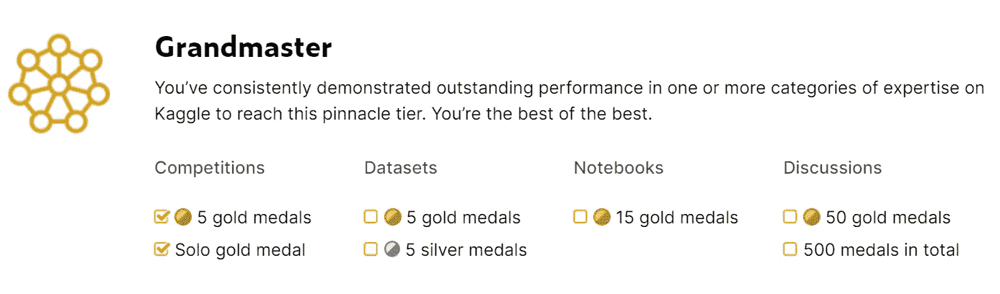
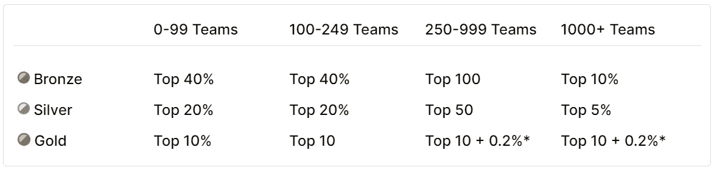

# 如何成为 Kaggle 比赛的特级大师

> 原文：<https://towardsdatascience.com/how-to-become-a-kaggle-competitions-grandmaster-9d77431c5b7d?source=collection_archive---------15----------------------->

## 这并不容易，但你能做到，而且值得

在这篇文章中，我将分享几条来自我个人经历的久经考验的建议，关于如何在 Kaggle 上达到最高级别——竞赛大师。这将包括两者——要做的具体实际的事情，以及更多理论性的长期指导方针。现在，让我们去赢得一些奖牌吧！

照片由 [Nghia Le](https://unsplash.com/@lephunghia?utm_source=medium&utm_medium=referral) 在 [Unsplash](https://unsplash.com?utm_source=medium&utm_medium=referral) 上拍摄

让我们先简单介绍一下，什么是 Kaggle，特别是特级大师头衔。

Kaggle 是一个在线数据科学和机器学习社区，提供许多不同的东西——数据集、课程、讨论，当然还有竞赛。我不会深入描述 Kaggle 的细节——如果你不熟悉它，可以去 kaggle.com 亲自看看，或者在 YouTube 上观看这个 1 分钟长的介绍视频。

主要要知道的是，在数据科学和机器学习的世界里，Kaggle 是一个非常值得尊敬的东西。你应该能找到相当多的招聘广告，声称良好的成绩是获得这份工作的一个优势。在 Kaggle 比赛中表现出色可以极大地促进你在数据科学领域的职业生涯。

## 你是大师吗？

你可以在 Kaggle 上实现的最重要的事情之一是达到比赛大师级。

为了更好地了解大师级是什么，让我们来看看如何获得它。如果你查看 Kaggle 对这一层的描述，你会发现，它需要 5 枚金牌+其中一枚必须是“单人”金牌。

截图自 kaggle.com

为了全面了解需要做什么，我们需要了解如何获得金牌。让我们也检查一下 Kaggle 提供的描述。

> 竞赛奖牌颁发给最高的竞赛成绩。每场比赛颁发的奖牌数量因比赛规模而异。

截图自 kaggle.com

> *(前 10 名+ 0.2%)表示比赛中每增加 500 支队伍，将额外颁发一枚金牌。例如，有 500 支队伍的比赛将把金牌授予前 11 支队伍，有 5000 支队伍的比赛将把金牌授予前 20 支队伍。

5000 支队伍中的 20 支是很小的一部分。事实上，在任何一项卡格尔比赛中获得金牌都是非常困难的。但是难不代表不可能。你可以做一些事情来增加你的机会。

## 如何在 Kaggle 上获得金牌？

一开始我必须警告你——那不会很快。我花了大约 2 年的时间收集了所有需要的奖牌，并获得了特级大师的头衔。当然，有些人会更快达到这个目标(谁知道呢，也许你就是其中之一)，但我认为平均至少需要 2 年。

所以，让我们从一些实用的建议开始，记住让这条路更短…

> 明智地选择比赛。

在 Kaggle 中，通常在任何给定的时刻都会有几场正在进行的比赛。我建议你一次只打一个。一枚金牌比两枚银牌更有价值。

根据自己的兴趣选择一个比赛。如果你熟悉信用风险评分，并且有一个类似的竞争正在进行，这应该是一个不错的选择。

请记住，表格竞赛通常更受欢迎。他们正在吸引更多的竞争对手，这反过来使他们更难获得更高的位置。

另一方面，计算机视觉竞赛吸引的竞争者往往少得多，主要是因为数据量大。因此，如果你擅长计算机视觉任务，这可能是一个更容易获得金牌的好选择。拥有巨大的计算资源也是一个巨大的优势。它允许参加超大数据集大小(接近或超过 100 Gb)的比赛。不是每个人都有资源在这样的比赛中认真战斗，所以许多强大的竞争者甚至不会进入。这反过来又使我们更容易达到我们的目标——金牌。

根据参赛者的数量来选择比赛是一种选择，但是，我建议更多地关注第一点——根据你的兴趣来选择。

> 走自己的路。

史蒂文·勒勒姆在 [Unsplash](https://unsplash.com?utm_source=medium&utm_medium=referral) 上拍摄的照片

这是非常诱人的分叉得分最高的公共内核，并开始调整其参数，以跳转到更高的排行榜。但是从长远来看，这没有意义。你几乎肯定不会通过调整一些公共笔记本中的参数来获得金牌。

相反，从探索数据开始。理解你被要求解决的问题。熟悉评估指标。对于某些指标，有一些特殊的技巧可以提高分数。你必须像所有顶级竞争者一样了解和使用它们！

阅读竞争论坛中的讨论——有时一些竞争对手会在那里分享非常有趣和有用的发现。

只有当你做了所有提到的事情，只有当你熟悉了问题和数据，开始建立你的模型。

> 不要重新发明轮子。

数据探索和交叉验证是在比赛中表现良好的两个最重要的事情。遵循这些良好的实践。从所有可能的角度探索数据，以找到重要的见解，并设计相应的功能来捕捉它们。并使用交叉验证来检查新功能。

根据给定数据集的具体情况，并非所有的交叉验证方案都适用(例如，对于时间序列数据，不应使用未来数据)。熟悉不同的验证方法(KFold、GroupKFold 等)，以及它们的优缺点。这将允许您为给定的数据集选择最合适的一个。

特性生成有不同的标准方法(如目标编码、宁滨、一键编码等)，您应该知道并在适当的时候使用它们。互联网上有许多关于特征工程技术的有用资源。

> 跳出框框思考。

[Erda Estremera](https://unsplash.com/@erdaest?utm_source=medium&utm_medium=referral) 在 [Unsplash](https://unsplash.com?utm_source=medium&utm_medium=referral) 上拍摄的照片

在之前的建议中，我告诉你不要重新发明轮子…但是你应该发明一个新的，如果可能的话！最有可能的是，仅仅遵循一个标准的预定义列表，比如如何制作特性、如何调整模型超参数等等，你不会赢得竞争。当然，你也应该做和检查标准的事情，但是要在比赛中真正成功，你需要做更多的事情。

通常，数据中隐藏着一些重要的见解。一些非常强的特征，一些相关性。一些可以显著提高分数的东西。如果它能被标准技术发现，将会有许多竞争者，他们将会发现它。但是，如果它隐藏在更深的地方，可能需要一些非标准的方法。如果你能成功找到这样一种非标准的洞察力，这将是一个非常强大的竞争优势。

不要害怕测试奇怪的想法。大部分都会失败。但有时，一些奇怪的想法可能会起作用——这可能是一个超级功能，让你赢得一些竞争。因为大多数其他竞争者不会发现它——因为它很奇怪。关于测试奇怪的想法，只有一个建议——确保你检查它们，如果它们不起作用就迅速失败。否则，你可能会发现自己花了所有的时间去检查其中的几个。

> 组成一个团队。

不需要一个人比赛。嗯……除了你要争夺单人金牌的那种情况。但是对于获得剩下的 4 枚金牌来说，成为一个团队的一部分会有很大的帮助。它不仅给你更多的资源，更多的想法，和更多的手来检查所有的想法。这也让竞争变得更加有趣。

从一方面来说，你的队友越多，你的想法就越多，人手也就越多。但是，根据我的观察——有时候，拥有一个非常大的团队并不像看起来那么有益。作为一个大团队的一员，一个人可能会开始依赖这个团队中的“其他人”来完成一些最困难的工作。这反过来可能会导致没有人 100%工作，大团队实际上不如只有 2-3 人的小团队高效。

我个人喜欢较小的团队(最多 4 人)，但那只是我个人的偏好。一般来说，这更多的取决于团队成员的个性。

> 别忘了这是一场比赛。

有些事情在现实生活任务中没有任何意义，但在比赛时却完全有效。

这些问题包括数据泄露、竞赛数据准备的不同问题。其他竞争对手很可能会试图从这些问题中获得一些好处，所以如果你想保持竞争力，你也应该这样做。

另一个非常具体的竞争是所谓的排行榜调查。这基本上意味着进行各种特制的提交，通过观察这些特定提交上的公共排行榜分数来收集关于测试集的信息。

利用数据泄漏或探测测试集并不是真正的数据科学。然而，这些方法并没有被禁止，并且在一些比赛中被许多选手积极使用，所以你应该意识到这一点。

> 祝你好运！

…您肯定会需要它！在一些比赛中，运气起着非常重要的作用。由于数据的性质和选择的评估标准，当决定谁将获得金牌时，一些比赛实际上可能非常接近彩票。

我不能给你任何关于如何变得更幸运的建议。所以我只能祝你——好运！专注于成为 Kaggle 比赛大师的目标，你一定会成功的！