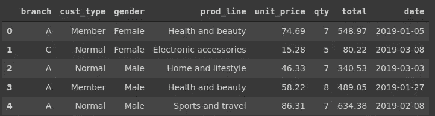
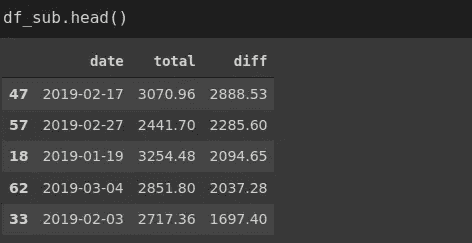
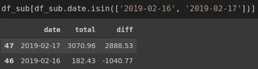
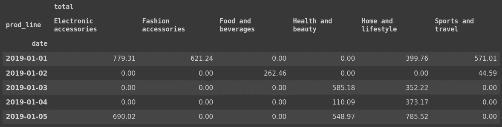

# 如何成为熊猫绝地武士

> 原文：<https://towardsdatascience.com/how-to-become-a-pandas-jedi-bad82667b34c?source=collection_archive---------21----------------------->

## 提高数据分析技能的实用指南


(图片由作者提供)

Pandas 是一个流行的 Python 数据分析和操作库。它提供了各种操作、转换和分析数据的功能。

了解函数的作用是很重要的。但是，更重要的是，我们应该知道对于给定的任务使用哪些函数。在一个典型的例子中，我们没有被告知应用一个特定的函数。相反，我们被赋予一项任务，并期望完成它。

要成为熊猫的主人，我们应该在选择和应用适当的功能来完成任务时感到舒适。它需要对功能的全面理解和大量的实践。

在本文中，我们将在一个超市的数据集上进行一些典型的数据分析和操作任务。重点不是熊猫的某个功能。相反，我们专注于给定的任务，并试图实现一个有效的解决方案。

这是数据集的概述。我已经删除了 [Kaggle](https://www.kaggle.com/aungpyaeap/supermarket-sales) 上的原始版本中的一些专栏。

```
import numpy as np
import pandas as pddf = pd.read_csv("/content/supermarket.csv", parse_dates=['date'])
df.head()
```



(图片由作者提供)

**注意** : Parse_dates 参数存储数据类型为 datetime 的给定列。这在处理日期和时间时很重要。

让我们假设，对于一个特定的分支机构，我们需要计算连续两天之间总销售额的最大差值。这可能有助于我们理解增加销售的因素。我们也可以发现是否有非常情况。

最好在编写代码之前设计我们的解决方案。我们可以按如下方式完成这项任务:

*   过滤属于感兴趣分支的数据点(即行)
*   选择“日期”和“总销售额”列
*   按日期将数据点分组并计算总和
*   按日期对结果排序
*   计算两个连续日期之间的差异
*   选择最大值

这似乎是一个非常复杂的操作。然而，熊猫提供了多功能和强大的功能，使我们能够轻松地处理这些任务。

这是我们的解决方案:

```
df[df.branch == 'A'][['date','total']]\
.groupby('date', as_index=False)\
.sum()['total'].diff().max()2888.53
```

让我们详细说明代码。第一行筛选属于分支 A 的数据点，并选择日期和总计列。第二行按日期对行进行分组。group by 函数的输出自动按日期排序，因为我们使用日期作为分组列。如果没有，我们可以在 groupby 函数之后使用 sort_values 函数。

第三行计算每组的总量(即每天)。然后，我们选择 total 列并应用 diff 函数。它计算一行与其前一行之间的差异。因为这些行是连续的几天，所以我们最终得到的是连续两天的销售额之差。最后，我们使用 max 函数来查看最大差异。

我们知道最高的差异，但不知道日期是没有用的。因此，我们应该稍微改进我们的解决方案。

```
df_sub = df[df.branch == 'A'][['date','total']]\
.groupby('date', as_index=False).sum()df_sub['diff'] = df_sub['total'].diff()df_sub.sort_values(by='diff', ascending=False, inplace=True)
```

第一个操作创建一个 dataframe，其中包含分支 a 的每日总销售额。第二个操作创建一个列，其中包含连续两天的总销售额之差。最后，我们根据降序对行进行排序。

df_sub 的第一行显示了与前一天差异最大的日期。



(图片由作者提供)

我们可以通过检查 2019 年 2 月 16 日和 2019 年 2 月 17 日的总金额来确认结果。



(图片由作者提供)

需要注意的是，这可能不是这项任务的唯一解决方案。Pandas 提供了各种功能和技术，这使它成为一个多用途和强大的数据分析工具。因此，我们可能会为给定的任务提出多种解决方案。

销售分为 6 个产品线。对于一个特定的分支，我们可能希望将数据帧转换成一种格式，在这种格式中，产品线被表示为列。日期将构成行，值是每天的总销售额。

我们可以按如下方式完成这项任务:

*   过滤属于感兴趣分支的数据点(即行)
*   选择“产品线”、“日期”和“总计”列
*   按产品线和日期对数据点进行分组，并计算每组的总销售额
*   将数据帧从长格式转换为宽格式

这是我们的解决方案:

```
df_new = df.query('branch == "A"')[['prod_line','date','total']]\
.groupby(['prod_line','date'], as_index=False).sum()\
.pivot_table(index='date', columns='prod_line', fill_value=0)
```

我们使用查询函数只是为了演示过滤行的另一种方式。然后，我们选择所需的列并应用 groupby 函数。

pivot_table 函数创建一个类似 excel 的数据透视表。index 参数表示在我们的例子中是日期的行。数据透视表中的值成为总销售额，因为这是唯一合适的选项。如果有多个候选值，我们可以使用 values 参数来指定。

如果某个产品系列在某个特定日期没有销售额，该值将变为“NaN ”,但是我们可以使用 fill_value 参数来更改它。

以下是新数据框架的概述:

```
df_new.head()
```



(图片由作者提供)

## 结论

我认为这篇文章展示了熊猫的力量。它简单高效。语法非常直观，这使得代码易于理解。然而，掌握熊猫就像其他工具一样需要练习。

知道一个函数做什么是一回事，但是我们应该能够组合多个函数来完成一个给定的任务。它需要全面理解函数以及它们如何一起使用。

感谢您的阅读。如果您有任何反馈，请告诉我。