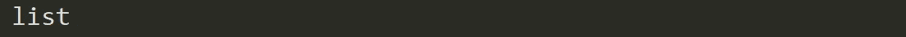

# 如何开始你的 NLP 之旅

> 原文：<https://towardsdatascience.com/how-to-begin-your-nlp-journey-5dc6734dfb43?source=collection_archive---------42----------------------->

## 了解如何使用 Python 处理文本


图片由[巴新设计](https://unsplash.com/@_pngdesign?utm_source=medium&utm_medium=referral)在 [Unsplash](https://unsplash.com?utm_source=medium&utm_medium=referral) 上拍摄

**自然语言处理(NLP)** 是人工智能中最令人兴奋的领域之一。它允许机器以多种方式处理和理解人类语言，并引发了我们与系统和技术互动方式的革命。

在之前的一篇文章中，我谈到了 NLP，它在现实世界中的应用，以及一些核心概念。现在我想向您展示 NLP 是真实的，任何人都可以开始学习它。怎么会？让我们从一个简单的文本开始，并使用一些 NLP 技术围绕它执行一些探索性的数据分析(EDA)。这样，在忙于任何模型或更复杂的任务之前，我们可以用简单而强大的工具来理解数据。

# 定义您的文本

斯蒂芬·霍金曾经说过:

> “人工智能(AI)可能是人类遇到的最好或最糟糕的事情”

我完全同意他的观点，时间会告诉我们到底会发生什么。然而，这是测试一些 NLP 技术的合适句子。为此，让我们首先将短语保存为一个名为“text”的变量:

```
text = “Artificial Intelligence (AI) is likely to be either the best or the worst thing to happen to humanity.”
```

使用 **langdetect** 库，我们可以检查它的语言，并找出用该语言编写的概率:

```
import langdetect
from langdetect import detect_langs
print(detect_langs(text))
```


有超过 99.9%的把握，我们可以说这个短语是用英语写的。您还应该考虑使用 [**拼写检查功能**](https://textblob.readthedocs.io/en/dev/quickstart.html) 来纠正任何语法错误。

人物数量呢？

```
len(text)
```


我们有 102 个字符，包括空格。不同字符的数量呢？

```
len(set(text))
```


让我们来看看它们:

```
print(sorted(set(text)))
```


这里有些有趣的东西。我们不仅计算像“(”和“.”这样的非字母数字字符此外，大写字母和小写字母被认为是不同的字符。

# 标记化

标记化是将连续文本分割成句子和单词的过程。本质上，它的任务是将文本切割成称为*记号的片段。*我们使用 **NLTK** 库来执行这项任务:

```
import nltk
from nltk.tokenize import word_tokenize
tokenized_word = word_tokenize(text)
print(tokenized_word)
```


我们可以看到，标记化产生了一个单词列表:

```
type(tokenized_word)
```



这意味着我们可以调用其中的元素。

```
tokenized_word[2:9]
```


我们有多少代币？

```
len(tokenized_word)
```


还有独特的代币？

```
len(set(tokenized_word))
```


现在我们可以计算与文本的词汇丰富度相关的度量:

```
len(set(tokenized_word)) / len(tokenized_word)
```


这表明不同的单词的数量占总单词数的 85.7%。

# 小写和标点符号

现在，让我们将文本小写以标准化字符，并为将来删除停用词做准备:

```
tk_low = [w.lower() for w in tokenized_word]
print(tk_low)
```


接下来，我们删除非字母数字字符:

```
nltk.download(“punkt”)
tk_low_np = remove_punct(tk_low)
print(tk_low_np)
```


让我们想象一下单词的累积频率分布:

```
from nltk.probability import FreqDist
fdist = FreqDist(tk_low_np)
fdist.plot(title = ‘Word frequency distribution’, cumulative = True)
```


我们可以看到单词“to”和“the”出现的频率最高，但它们并没有真正给文本添加信息。它们就是所谓的*停用词*。

# 停用词移除

这个过程包括去掉英语中常见的冠词、代词和介词，如“and”、“the”或“to”。在该过程中，一些看起来对 NLP 目标提供很少或没有价值的非常常见的单词被过滤并从要处理的文本中排除，因此移除了对相应文本没有信息性的广泛和频繁的术语。

首先，我们需要创建一个停用词列表，并从我们的标记列表中过滤它们:

```
from nltk.corpus import stopwords
stop_words = set(stopwords.words(“english”))
print(stop_words)
```


我们将使用 NLTK 库中的这个列表，但是请记住，您可以创建自己的停用词集。让我们在列表中查找单词“the ”:

```
print(‘the’ in stop_words)
```


现在，让我们清除文本中的这些停用词:

```
filtered_text = []
for w in tk_low_np:
   if w not in stop_words:
      filtered_text.append(w)
print(filtered_text)
```


我们可以看到,“是”、“是”、“the”和“or”这些词被从我们的文本中删除了。让我们更新单词的累积频率分布:


删除停用词应该以一种非常有意识的方式进行，因为它会在执行其他任务(如情感分析)时带来巨大的问题。如果一个单词的上下文受到影响(例如，通过删除单词“not”，这是对一个成分的否定)，该动作可以改变文章的意思。

除了这个例子之外，可能有必要处理其他类型的特征，如 [**缩写**(如单词“不”，应该扩展为](https://www.analyticsvidhya.com/blog/2020/04/beginners-guide-exploratory-data-analysis-text-data/))，或 [**重音和音调符号**(如单词“陈词滥调”或“天真的”，应该通过删除它们的音调符号来规范化)](https://nlp.stanford.edu/IR-book/html/htmledition/accents-and-diacritics-1.html)。

# 正则表达式

[正则表达式](https://docs.python.org/3/howto/regex.html)(称为 REs，或 RegExes)是一种嵌入在 Python 中的小型、高度专业化的编程语言，可通过 **re** 模块获得。通过使用它们，您可以为想要匹配的一组可能的字符串指定规则。你可以问这样的问题“这个字符串和模式匹配吗？”，或者“在这个字符串中有匹配的模式吗？”。

例如，让我们搜索以“st”结尾的单词:

```
import re
[w for w in filtered_text if re.search(‘st$’, w)]
```


或者数一数第一个词的元音数(“人工”):

```
len(re.findall(r’[aeiou]’, filtered_text[0]))
```


您甚至可以根据条件修改文本。例如，将第二个单词(“intelligence”)中的字母“ce”替换为字母“t”:

```
x = re.sub('ce', 't', filtered_text[1])
print(x)
```


你可以在[这个链接](https://www.w3schools.com/python/python_regex.asp)后面找到更多正则表达式的例子。

# 结论

我们只是触及了所有可能的和更复杂的 NLP 技术的表面。你可能不仅想分析结构化文本，还想分析从对话、声明甚至推文中生成的所有数据，这些都是非结构化数据的例子。**非结构化数据**并不完全符合关系数据库的传统行列结构，而是代表了现实世界中可用的绝大多数数据。这是混乱和难以操纵的。

由于数据访问的巨大改进和计算能力的增加，NLP 正在蓬勃发展，这使我们能够在医疗保健、媒体、金融和人力资源等领域取得有意义的成果。

> 我的建议是:**了解 NLP。**尝试不同的数据源和技术。实验，失败，提升自己。这一学科将影响每一个可能的行业，我们很可能在未来几年达到一个让我们震惊的进步水平。

> **对这些话题感兴趣？在**[**Linkedin**](https://www.linkedin.com/in/lopezyse/)**或** [**Twitter**](https://twitter.com/lopezyse) 上关注我