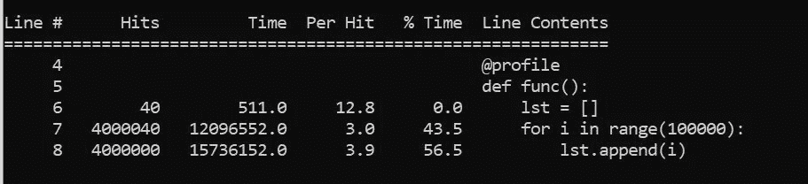
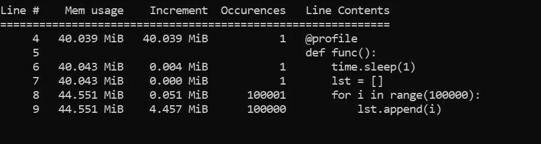

# 如何对 Python 中的函数进行基准测试

> 原文：<https://towardsdatascience.com/how-to-benchmark-functions-in-python-ed10522053a2?source=collection_archive---------34----------------------->

## 在本文中，我们将讨论 Python 中基准函数的 4 种方法


在 [Unsplash](/s/photos/timer?utm_source=unsplash&utm_medium=referral&utm_content=creditCopyText) 上由 [Veri Ivanova](https://unsplash.com/@veri_ivanova?utm_source=unsplash&utm_medium=referral&utm_content=creditCopyText) 拍摄的照片

前三种方法将帮助我们测量函数的执行时间，而最后一种方法将帮助我们测量内存使用情况。

# 目录

*   使用时间库
*   使用 timeit
*   使用线条轮廓器
*   使用内存概要分析器
*   结论

# 使用时间库

这是计算函数执行时间的最简单的方法之一。我们实际上是在调用函数之前和之后获得了以秒为单位的时间。两者之差可以给我们一个函数时间的估计。我说估计，因为这是测量单次运行的时间。一个更好的基准测试应该是多次运行它并计算平均花费的时间。

```
import timedef func():
   lst = [i for i in range(100000)]
   start = time.perf_counter()func()
print(f"Completed Execution in {time.perf_counter() - start} seconds")
```

下面是输出

```
Completed Execution in 0.007916 seconds
```

# 使用 timeit

[Timeit](https://docs.python.org/3/library/timeit.html) 是 Python 中的内置方法。它让我们指定运行函数的次数，这有助于我们计算函数运行的平均时间。这是比单次运行的执行时间更好的度量。但是，对于耗时较长的复杂函数，这种方法可能并不理想。

一般语法如下

```
timeit.Timer(funcName).timeit(number=number)
```

**number** 是我们希望函数执行的次数。它返回所有单个运行时的总和。为了得到平均值，我们可以用总数除以运行次数。

下面是我们如何测量函数 **func()** 的平均执行时间

```
import timeitnum_runs = 10
duration = timeit.Timer(func).timeit(number = num_runs)
avg_duration = duration/num_runs
print(f'On average it took {avg_duration} seconds')
```

输出如下

```
On average it took 0.004649160000000001 seconds
```

我们还可以使用 **repeat()** 方法多次运行实验(运行函数 n 次)。更简单的说，如果我们把一个实验看作是运行我们的函数 **func()** 10 次，我们就可以把这个实验做 3 次，得到每个实验的执行时间。

一般语法是

```
timeit.Timer(funcName).repeat(repeat=num_repetions,number=num_runs)
```

下面是用它来测试我们的函数 **func()**

```
num_runs = 10
num_repetions = 3
ex_time = timeit.Timer(func).repeat(
                     repeat=num_repetions,
                     number=num_runs)
print(f'It took {ex_time}')
```

这将返回以下输出

```
It took [0.0494772, 0.04936369999999998, 0.048738000000000004]
```

类似于 **timeit()** 方法，它返回 10 次运行的总时间。我们可以用 **max()** 得到最差时间， **min()** 得到最佳时间， **sum(lst)/len(lst)** 得到平均执行时间。

# 使用线条轮廓器

line_profiles 是一个非常酷的库，可以对函数进行逐行分析。在使用这个库之前，我们需要安装它

```
conda install -c anaconda line_profiler
```

我们需要在函数之前添加一个装饰器

```
@profile
def func():
    lst = []
    for i in range(100000):
       lst.append(i)
```

因为 line-profiler 提供了逐行分析，所以使用它来理解列表没有多大意义。

在 Anaconda 提示符下键入以下命令

```
kernprof -l main.py
python -m line_profiler main.py.lprof
```

第一个命令运行我们的 python 脚本，并将日志存储在一个文件中。第二个命令以易于理解的表格形式显示日志。

下面是第二个命令的输出



line_profiler 的屏幕截图

*   **Hit-** 该行被执行的次数。
*   **时间-** 该行花费总时间
*   **-**每次点击生产线所用的平均时间
*   **% Time-** 总执行时间的一部分。从上图中我们可以看到，append 函数占用了大约 57%的执行时间。

如果要更改 line_profiler 函数的执行次数，请使用以下代码

```
prof = profile(func)
for i in range(10):
   prof()
```

这将运行该函数 10 次。

# 使用内存概要分析器

它与 line_profiler 非常相似，不同之处在于生成的日志告诉我们内存使用情况，而不是花费的时间。

首先，我们需要安装库

```
conda install -c anaconda memory_profiler
```

我们将不得不像以前一样添加相同的装饰

```
@profile
def func():
    lst = []
    for i in range(100000):
       lst.append(i)
```

然后在 Anaconda 提示符下键入以下命令

```
python -m memory_profiler main.py
```

下面是输出



memory_profiler 屏幕截图

*   **内存使用量** -该行的总内存使用量
*   **递增** -每次执行该行时内存使用量
*   **出现次数** -该行被执行的次数

# 结论

如果您想要对一段代码或一个函数进行快速的时间性能测试，您应该尝试使用 **time** 库来测量执行时间。然而，如果你想要一个更好的估计，考虑使用 **timeit** 库。

如果您想要更详细的逐行分析，可以考虑使用行分析器和内存分析器。

> 在 [LinkedIn](https://www.linkedin.com/in/rahulbanerjee2699/) 上与我联系
> 
> 我最近开始了一个修改版的#100daysofcode 挑战。我的目标是每天写与 Python、数据科学或编程相关的内容。在 [Twitter](https://twitter.com/rahulbanerjee99) 、 [Medium](https://medium.com/daily-programming-tips) 、 [Dev.to](https://dev.to/rahulbanerjee99) 、 [Hashnode](https://realpythonproject.hashnode.dev/series/daily-programming-content/) 或 [my WordPress 博客](https://www.realpythonproject.com/category/daily-programming-tips/)上关注我的进展

*原载于 2021 年 3 月 23 日*[*【http://www.realpythonproject.com】*](https://www.realpythonproject.com/how-to-benchmark-functions-in-python/)*。*