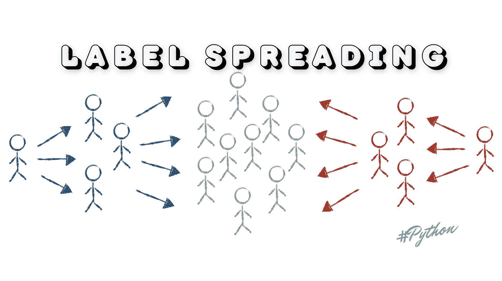
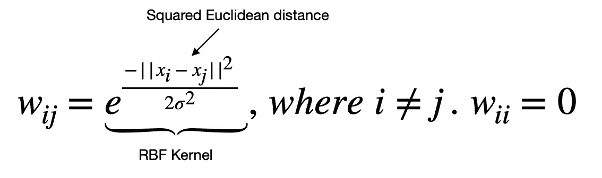
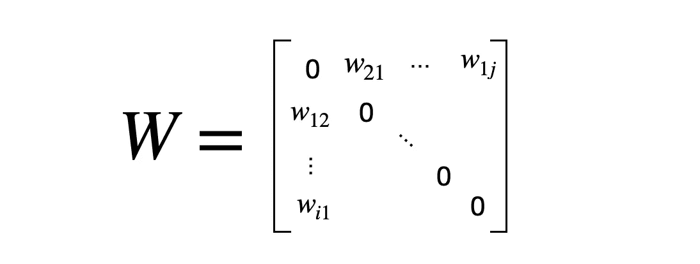
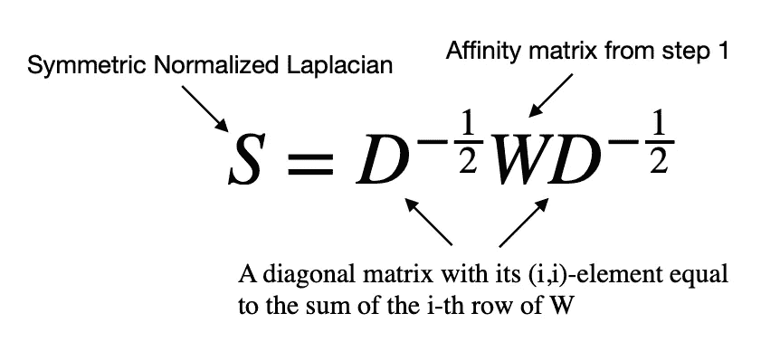
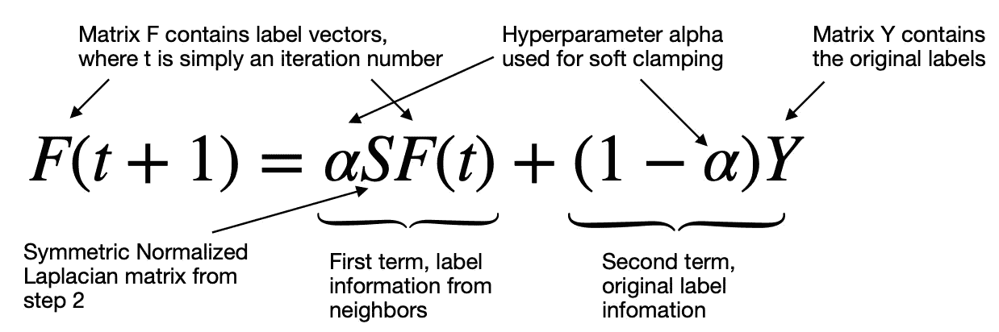
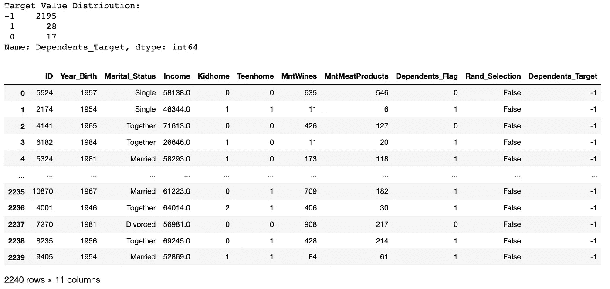
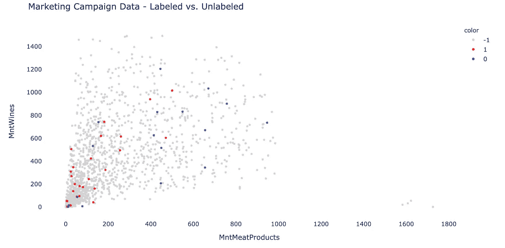
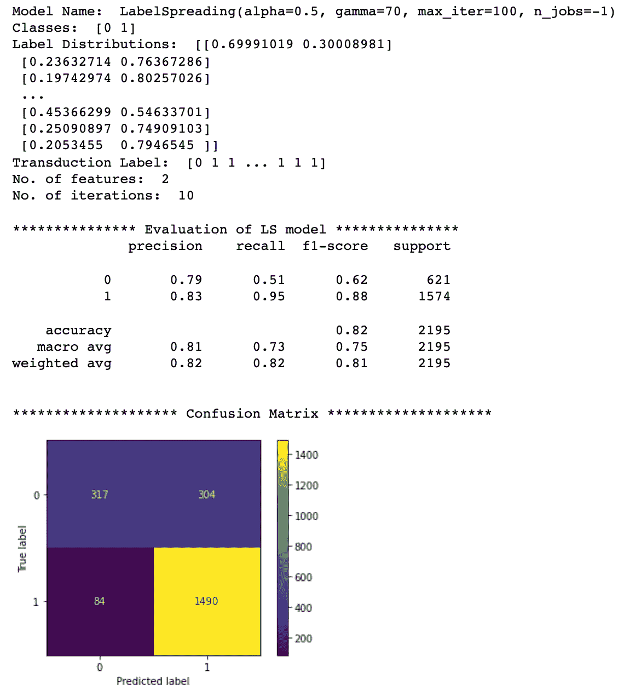
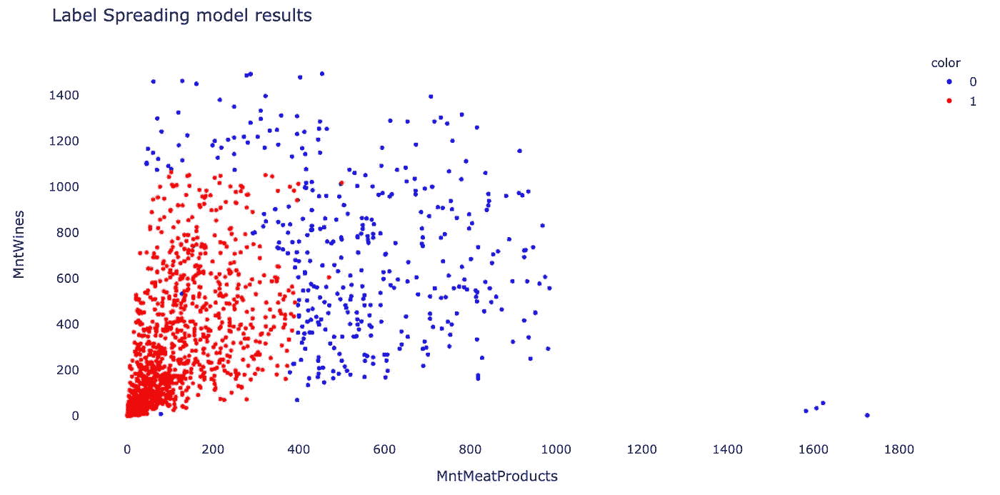

# 如何从标签扩散算法的半监督学习中获益

> 原文：<https://towardsdatascience.com/how-to-benefit-from-the-semi-supervised-learning-with-label-spreading-algorithm-2f373ae5de96?source=collection_archive---------4----------------------->

## 机器学习

## 标注扩散算法如何与 Python 示例一起工作的详细说明



标签扩散。图片由[作者](https://solclover.com/)提供。

# 介绍

这是关于半监督学习的第二篇文章，其中我探索了使用有标签和无标签数据来构建更好的模型的方法。

这次我将重点放在**标签扩散**算法上，该算法试图基于已知的已标记和未标记点揭示的内在结构来构造一个平滑的分类函数。

虽然与[标签传播](/semi-supervised-learning-how-to-assign-labels-with-label-propagation-algorithm-9f1683f4d0eb)相似，但标签传播做了一些不同的事情，这将在本文后面探讨。

# 内容

*   标签传播在机器学习算法领域中的位置
*   标签传播和标签传播的主要区别
*   标签传播工作原理的简要说明
*   Python 中如何使用标签扩散？

# 机器学习算法领域内的标签传播

有时，我们发现自己混合了已标记的数据(非常适合分类或回归等监督学习)和未标记的数据(非常适合聚类或降维等非监督学习)。

然而，为了获得最佳结果，将这两组数据结合起来通常是有益的。这种情况是我们希望使用半监督学习方法的一个很好的例子，标签扩散算法是我们的选项之一。

下面的**交互式**旭日图显示了不同 ML 算法的分类。确保点击👇对各种类别进行**放大，揭示更多的**。

机器学习算法分类。由[作者](https://solclover.com/)创建的互动图表。

***如果你喜欢数据科学和机器学习*** *，请* [*订阅*](https://solclover.com/subscribe) *每当我发布一个新故事时，你都会收到一封电子邮件。*

# 标签扩散和标签传播的区别

如果您已经熟悉标签传播算法，您可能希望了解标签传播与该算法的两个不同之处。如果您不熟悉标签传播，请随意跳到下一节。

## 对称归一化拉普拉斯算子与随机游走归一化拉普拉斯算子

标签传播算法在其计算中使用对称归一化图拉普拉斯矩阵，而标签传播使用随机游走归一化拉普拉斯矩阵。

但是，请注意，这两个矩阵是相似的，一个可以从另一个导出。因此，从本文的角度来看，理解这两个矩阵的细微差别对我们来说并不重要。

## 软箝位与硬箝位

标注传播使用硬箝位，这意味着最初标记的点的标注永远不会改变。

同时，标签扩散采用软箝位，由超参数***【α(alpha)***控制，该超参数规定了该点从其邻居获得的信息与其初始标签信息的相对量。

# 标签传播工作原理的简要说明

四个步骤描述了标签扩散算法如何操作。

**1。**定义点之间的成对关系，称为亲和矩阵 **W** 。该矩阵是在径向基函数核(也称为 RBF 核)的帮助下创建的，用于确定边权重。注意，矩阵 **W** 在对角线上包含 0，因为没有边将一个点连接到其自身。



连接每对点的边的权重计算。图片由[作者](https://solclover.com/)提供。

```
Note, sklrean's implementation of RBF kernel looks slightly different as it replaces **1/2sigma^2** with a hyperparameter **gamma**. The effect is the same as it allows you to control the smoothness of the function. High gamma extends the influence of each individual point wide, hence creating a smooth transition in label probabilities. Meanwhile, low gamma leads to only the closest neighbors having influence over the label probabilities. 
```


Sklearn 的 RBF 内核实现。图片由[作者提供。](https://solclover.com/)

这是亲和矩阵的样子:



亲和矩阵。图片由[作者](https://solclover.com/)提供。

**2。**创建对称归一化图拉普拉斯矩阵。这一步采用亲和矩阵 **W** 并将其对称归一化，这有助于步骤 3 中的收敛。



对称归一化图拉普拉斯矩阵 S. Image by [作者](https://solclover.com/)。

**3。**第三步是迭代，利用矩阵乘法将信息从标记点扩散到未标记点。



寻找标签的迭代过程。图片由[作者](https://solclover.com/)提供。

每个点接收来自其邻居的信息(第一项)，并且还保留其初始信息(第二项)。参数**α**(α)通过控制从邻居接收的信息与初始标签的比例来实现软箝位。Alpha 接近 0 保留所有初始标签信息(相当于硬箝位)，alpha 接近 1 允许大部分初始标签信息被替换。

注意 F(0)=Y，所以迭代过程从初始标签信息开始。

**4。在步骤 3 中的过程收敛或达到指定的最大迭代次数之后，我们到达分配标签的最后步骤。**

矩阵 **F** 包含标签向量，表示每个点属于特定类别(即，具有特定标签)的概率。然后使用 argmax 操作选择最终标签，这意味着该算法分配具有最高概率的标签。

[](https://solclover.com/membership)[](https://www.linkedin.com/in/saulius-dobilas/)

# Python 中如何使用标签扩散？

终于到了在真实数据上使用标签传播的时候了。

注意，对于这个例子，我们选择了有标签可用的营销活动数据，这将帮助我们评估我们的半监督模型的性能。

当然，在我们拟合模型之前，我们将屏蔽大多数标签，以模拟主要包含未标记数据的场景。

## 设置

我们将使用以下数据和库:

*   [Kaggle 的营销活动数据](https://www.kaggle.com/rodsaldanha/arketing-campaign)
*   [Scikit-learn library](https://scikit-learn.org/stable/index.html)for
    1)特征缩放([minmax scaler](https://scikit-learn.org/stable/modules/generated/sklearn.preprocessing.MinMaxScaler.html))；
    2)展开标签([展开标签](https://scikit-learn.org/stable/modules/generated/sklearn.semi_supervised.LabelSpreading.html))；
    3)模型评估([分类 _ 报告](https://scikit-learn.org/stable/modules/generated/sklearn.metrics.classification_report.html)、[混淆 _ 矩阵](https://scikit-learn.org/stable/modules/generated/sklearn.metrics.confusion_matrix.html)、[混淆矩阵显示](https://scikit-learn.org/stable/modules/generated/sklearn.metrics.ConfusionMatrixDisplay.html))
*   用于数据可视化的 [Plotly](https://plotly.com/python/) 和 [Matplotlib](https://matplotlib.org/)
*   [熊猫](https://pandas.pydata.org/docs/)进行数据操作

第一步是导入我们上面列出的库。

接下来，我们下载并摄取营销活动数据(来源: [Kaggle](https://www.kaggle.com/rodsaldanha/arketing-campaign) )。这一次我们将只使用两个特征来展开标签。因此，我将摄取限制在几个关键列，而不是读取整个表。

此外，您将看到，我们已经派生了一些创建带有屏蔽标签的目标变量所需的附加字段。

下面的代码片段显示了目标变量的数据和分布。



来自 [Kaggle](https://www.kaggle.com/rodsaldanha/arketing-campaign) 的营销活动数据。图片由[作者](https://solclover.com/)提供。

请注意，我们保留了 2%的实际标签(1 和 0)，并屏蔽了剩余的 98% (-1)。因此，我们的目标包含关于购物者是否有任何依赖项(1)，没有任何依赖项(0)，或者该信息被屏蔽(-1)的信息。

我们在这里雄心勃勃，因为我们的目标是仅使用 45 个已知标签为 2，195 个数据点分配标签。

我们使用的特征是 *MntMeatProducts* (购物者每年在肉制品上的花费) *MntWines* (购物者每年在葡萄酒上的花费)。现在，让我们看看当我们把数据绘制在图表上时，它是什么样子的。



半监督学习中标记和未标记数据的组合。图片由[作者](https://solclover.com/)提供。

## 应用标签扩散算法

下一段代码由几个步骤组成，帮助我们准备数据、拟合模型和打印结果。

结果如下:



标签传播结果。图片由[作者](https://solclover.com/)提供。

正如你所看到的，尽管非常雄心勃勃，我们还是取得了相当好的结果，模型准确率达到了 82% *(为了使评估公平，我们只使用了带有屏蔽标签的记录进行模型性能评估)*。

让我们再次绘制 2D 图，看看新分配的标签是如何分布的。



标签扩散模型结果的 2D 图。图片由[作者](https://solclover.com/)提供。

我们可以看到蓝点(无家属)和红点(有家属)的明显区别，决策边界位于肉类花费约 400 英镑，葡萄酒花费约 1000 英镑。所以，根据这些数据，看起来没有孩子的人倾向于吃更多的肉，喝更多的酒。

# **结论**

当您只有少量已标记的示例，并且希望对大量未标记的数据应用自动标记时，标签扩散是一种非常好的算法。

然而，和所有半监督学习技术一样，你需要谨慎对待它。通过创建具有已知标签的测试样本或手动检查标签扩散结果的子样本来评估模型总是值得的。

我希望您喜欢阅读这篇文章，我鼓励您在下一个数据科学项目中尝试半监督学习！如果您有任何问题或建议，请随时联系我们。

干杯👏
**索尔·多比拉斯**

***如果你已经花光了这个月的学习预算，下次请记得我。*** *我的个性化链接加入媒介是:*

<https://solclover.com/membership>  

您可能感兴趣的其他文章:

</semi-supervised-learning-how-to-assign-labels-with-label-propagation-algorithm-9f1683f4d0eb>  </t-sne-machine-learning-algorithm-a-great-tool-for-dimensionality-reduction-in-python-ec01552f1a1e> 