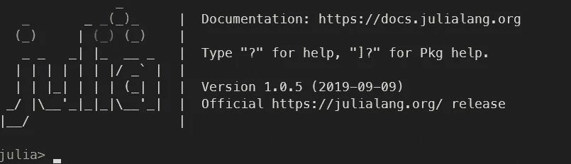
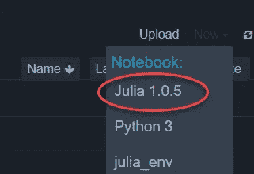
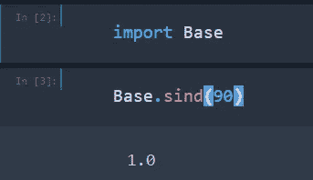
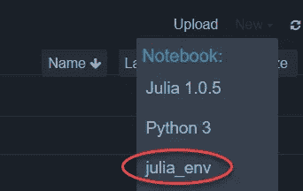
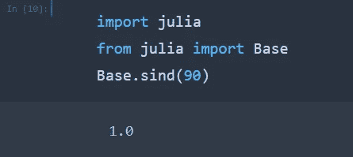
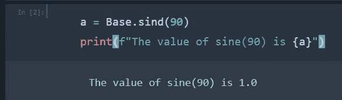
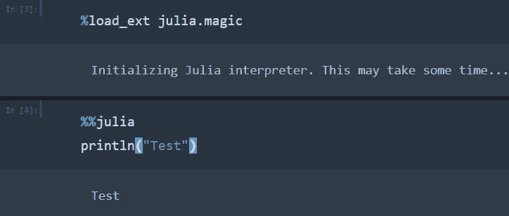

# 如何最好地利用 Jupyter 和 Julia

> 原文：<https://towardsdatascience.com/how-to-best-use-julia-with-jupyter-82678a482677?source=collection_archive---------6----------------------->

## 如何将 Jupyter 代码添加到您的 Jupyter 笔记本中，并使您能够在同一个笔记本中同时使用 Python 和 Julia

来自 [Pexels](https://www.pexels.com/photo/black-laptop-computer-turned-on-showing-computer-codes-177598/?utm_content=attributionCopyText&utm_medium=referral&utm_source=pexels) 的 [Markus Spiske](https://www.pexels.com/@markusspiske?utm_content=attributionCopyText&utm_medium=referral&utm_source=pexels) 摄影

Julia 是一种真正令人兴奋的高级、高性能、动态编程语言。它的语法易于理解，预计将成为未来数据科学的主要编程语言之一。

Jupyter 笔记本是一个很棒的多语言 IDE，我总是用它作为我的默认环境，在将我的代码移植到专门的 python 脚本之前，探索数据并编写初步的代码例程等，这些脚本更适合完整的生产目的，例如在 AWS 上运行的 docker 等。

在下面的步骤中，我将解释如何安装 Julia，以及如何将它作为一个内核添加到 Jupyter 中，这样你就可以有效地用 Jupyter 编写 Julia 代码。

我还解释了如何使用 PyJulia 在 python 笔记本中使用 Julia。这个额外的选项非常强大，因为您可以使用这两种语言的优点，特别是在数据探索和数据可视化方面。

我已经列出了应该完成的步骤，首先说明先决条件，然后安装 Julia，然后解释如何集成 Jupyter 和 Julia，最后详细说明如何在同一个笔记本中混合搭配 Python 和 Julia 代码。

# 安装 Julia 并在 Jupyter 笔记本中使用

## 先决条件

这里需要注意的是，我假设你使用的是 Linux 发行版，不管是在专用的 Linux 机器上还是通过 WSL 或 virtualBox，只要你使用的是 Linux 环境，这都无关紧要。此外，您应该已经安装了 Jupyter，并在您的本地机器上进行编码等工作。

## 安装朱莉娅

首先做一个 Julia 语言的基本安装，从 https://julialang.org/downloads/下载 Julia tar，确保使用稳定版本(目前是 1.6.2)

接下来，只需在终端中解压缩文件，就可以使用了。
`tar -xvzf julia-x.y.z-linux-x86\_64.tar.gz`

将 Julia 添加到**路径**变量中，方法是在。zshrc 文件。这假设您使用 zsh 作为 shell，但是如果您使用标准 bash，只需在您的。bashrc 文件。
`export PATH="$PATH:/path_to_julia_file/julia-1.0.5/bin"`

您可能需要为要更新的路径启动一个新的终端窗口，或者您可以在终端中使用下面的命令来强制刷新当前会话，以使用更新的 zshrc/bashrc 文件:

`source ~/.zshrc`

通过在终端中键入`julia`来检查这是否有效，它应该会启动朱莉娅 read(读取-评估-打印-循环)，如下所示。

作者图片

## 将 Julia 内核添加到 Jupyter

要给 Jupyter 添加一个 Julia 内核，我们只需添加 IJulia 包。

为了做到这一点，首先从你的终端启动朱莉娅 REPL 像你以前做的那样。

`julia`

然后在 REPL 内部首先通过键入以下命令开始使用 Pkg:

`using Pkg`

然后通过键入以下命令添加 IJulia 包:

`Pkg.add("IJulia")`

第一次添加包时，它也会构建它，但是如果你更新了某些东西，比如下一次添加的路径，你也需要在添加后构建 IJulia。只有当你改变了 Julia 安装文件的位置并更新了指向新文件的路径时，这才有意义。

`Pkg.build("IJulia")`

> 要删除软件包，只需打开朱莉娅 REPL 和运行:
> 
> `Pkg.rm("IJulia")`

如果您启动一个 Jupyter 会话，您现在应该能够选择一个 Julia 内核，如下所示:

作者图片

一旦你用这个内核启动了一个笔记本，你就可以直接开始写 Julia 代码了，就像下面这样，我们直接导入基本库，用它来计算 sine(90)。

作者图片

**成功了！在 Jupyter 中，您现在应该有了一个完整的 julia-1.0.5 内核，您可以在其中编写本机 julia 代码。只需启动 Jupyter 并为您的内核选择 Julia，您就万事俱备了。**

照片由[塞巴斯蒂安·沃特曼](https://www.pexels.com/@sebastian?utm_content=attributionCopyText&utm_medium=referral&utm_source=pexels)从 [Pexels](https://www.pexels.com/photo/girl-jumping-on-the-bridge-wearing-black-jacket-214573/?utm_content=attributionCopyText&utm_medium=referral&utm_source=pexels) 拍摄

# 在同一个笔记本中使用 Julia 和 Python

如果你想在 Python 内核中使用 Julia，在同一个 Jupyter 笔记本中混合使用两种语言的代码，我们需要做一些额外的设置。

这个额外的选项很有用，因为它意味着你可以保留现有的 python 代码，并添加 Julia 单元格等，而不是将所有的 Julia 和 Python 代码保存在单独的笔记本中。

> 我个人认为使用 python 作为主要基础语言，然后使用诸如 **PySpark** 和 **Julia** 这样的语言作为导入语言是很好的，这意味着你可以从 **PySpark** 中进行 ETL，在 **Julia** 中进行快速数据分析，以及一些 **python 机器学习都在同一个笔记本**中。

应该注意的是，就生产代码而言，使用 Julia 的最佳方式是在完整的 Julia 内核中，如前一节所述，但我觉得下面的选项在数据探索阶段很有用，在这一阶段，您可以使用两种语言的优点，以新的令人兴奋的方式探索数据。

为了建立这种双语言设置，我们首先需要 ***创建一个自定义版本的 Python*** ，使用静态和动态 Python 库作为 ***，这将确保我们不会失去 Julia 的速度和执行时间优势。***

## 构建 Python 的自定义安装

首先安装下面的包，因为 Python 需要它们。
T0

(如果您忘记了可以在之后安装它们，只需在 python 发行文件夹中重新运行`make`和`make install`)

接下来从 http://www.python.org/download/[下载 python 3.7](http://www.python.org/download/)

> (Python 3.7 与 spark2.x 一起工作时很有用，而 spark3.0 与 Polynote 等一起工作时仍有一些问题)

将 python 安装文件移动到您希望在系统上存储这个定制 Python 安装的文件夹中，展开 tar python 安装文件，并在您的终端中运行下面的配置行。
`tar -xvf Python-3.7.8.tgz`
`cd Python-3.7.8`
`./configure --enable-shared --prefix=/your/custom/path`
`make``make test`
`make install`

这就完成了我们的定制 Python 安装的设置。

我们现在将继续讨论如何使用这个定制的 Python 设置在同一个笔记本中编写 Python 和 Julia 代码。

## 安装 PyJulia

为了在 python 笔记本中使用 Julia，我们需要使用 PyJulia 库。首先，我们创建一个新的虚拟环境，它链接到我们刚刚创建的自定义 Python 设置。

`mkvirtualenv -p /your/custom/path/bin/python3.7 julia_env`

> (请注意，我使用 **virtualenvwrapper** 来创建我的 python 虚拟环境，并强烈推荐它作为保持虚拟环境良好维护的好方法。更多详情请见此链接[https://virtualenvwrapper.readthedocs.io/en/latest/](https://virtualenvwrapper.readthedocs.io/en/latest/)

接下来，在这个虚拟环境中，我们使用下面的命令安装 pyJulia:

`python -m IPython`
`pip install julia`

最后，在虚拟环境中添加一个新的 Jupyter 内核，链接到这个 Julia 环境。
`python -m ipykernel install --user --name=julia_env`

现在你应该能够打开 Jupyter，选择你刚刚创建的内核，如下所示

作者图片

一旦你使用 julia_enc 内核启动了一个 notebok，你现在就可以使用 julia 了，你可以在你的笔记本的任意一个单元格中输入下面的命令来获得正弦值(90)。

作者图片

更好的是，您可以在同一个单元中使用 Python 和 Julia 代码。为了测试这一点，请尝试下面的代码行，在使用 Python 打印 f 字符串中“a”的值之前，我们首先使用 Julia Base 获得正弦值(90)并将其赋给变量“a”。

作者图片

您还可以使用 cell magic 将一个单元格更改为 native Julia，这应该由命令`%load_ext julia.magic`加载。加载后，你可以在任何单元格中使用 Julia，只要以`%%julia`开头。

例如，在一个单元格中键入下面几行，您应该会得到一个使用本机 Julia 语法的单词“Test”的打印输出。

作者图片

如果你没有使用我们的自定义版本的 Python，它同时使用静态和动态库，你会得到下面的错误，但是因为我们已经建立了我们自己的自定义 Python 安装，我们已经安全地避免了这一点:)

`Your Python interpreter is statically linked to libpython`

## 摘要

现在，您应该已经成功地在 Jupyter 中安装了 Julia，并且能够在同一个 Jupyter 笔记本中混合使用 Julia 和 Python 代码。有了所有这些选项，您应该可以成为 Julia 编程语言的专家，并处于数据科学新数据科学工具和库的最前沿。

照片由[负空间](https://www.pexels.com/@negativespace?utm_content=attributionCopyText&utm_medium=referral&utm_source=pexels)从[像素](https://www.pexels.com/photo/grayscale-photo-of-computer-laptop-near-white-notebook-and-ceramic-mug-on-table-169573/?utm_content=attributionCopyText&utm_medium=referral&utm_source=pexels)拍摄