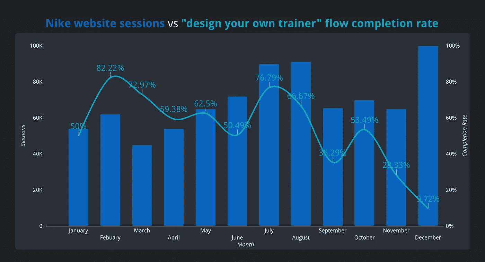

# 如何在 Google Data Studio 中融合数据，让你的网站数据活起来？

> 原文：<https://towardsdatascience.com/how-to-blend-data-in-google-data-studio-to-visualise-how-users-are-using-your-website-e920fb050c57?source=collection_archive---------23----------------------->

## 通过一个耐克电子商务的例子。

使用数据为决策提供信息对于产品管理至关重要。或者其他任何东西。谢天谢地，我们并不缺少它。任何在线应用都会产生大量的数据，我们有责任收集这些数据，然后理解它们。

Google Data Studio 帮助我们理解数据背后的含义，使我们能够构建美丽的可视化和仪表盘，将数据转化为故事。如果不是的话，数据素养和学习读写一样是一项基本技能。或者肯定会是。

没有什么比数据民主更强大了，组织中的任何人都可以根据数据定期做出决策。作为实现这一目标的一部分，我们需要能够以一种让数据变得生动、更易访问的方式来可视化数据。我最近一直在学习如何做到这一点，并想分享一些你可以在谷歌数据工作室做到这一点的酷方法。

无论是自动化一些日常的手动分析，你都会发现一些很好的用例，帮助你了解用户如何使用你的数字服务。如果你知道 Google Data Studio，并且可能会问自己是否值得花力气去了解更多，那么这就是为你写的。你可能会想，如果你已经从一些现有的数据源(例如其他谷歌产品)中获得了一些现成的分析，为什么还要投入更多的时间呢？你还能真正获得什么价值？基本上，我是为自己写作，6 个月前。

所以，我假设你知道基本知识(比如连接到数据源)，但是如果你不知道，这里有一个很棒的教程。在这篇文章中，我将介绍一些你可以做的更高级的事情，比如**混合数据、**创建**自定义计算字段**，使用**度量级别过滤器**以及创建**组合图表**，所有这些都使用我基于耐克网站创建的一个假数据集。

产品经理的一个常见用例是比较完成某个体验的一组用户占总用户的百分比。这些被称为**比率指标**。例如，假设你作为一名设计师为 Nike 工作，想了解有多少用户使用你花了很长时间设计的“设计你自己的”训练器功能，想了解有多少用户完成了所有的定制步骤。

Stephan Schmid 在 [Unsplash](https://unsplash.com?utm_source=medium&utm_medium=referral) 上拍摄的照片

一般来说，每当用户与网站的某些部分进行交互时，就会触发 [Google Events](https://support.google.com/analytics/answer/1033068?hl=en) 。您将有一个用户进入定制流程的事件，中间的所有事件，然后是一个用户完成流程的最终事件。您可以通过以下计算手动创建比率指标:

> 结束流量*事件* /进入流量*事件* =完成率(新的比率指标)

在 Data Studio 中，您可以通过以下步骤创建它:

1.  插入一个以**唯一事件**为度量的记分卡，然后创建一个指定您感兴趣的事件标签的过滤器(例如*进入流*)。
2.  插入第二个记分卡，执行与步骤 1 相同的操作，使用您感兴趣的第二个事件标签创建第二个过滤器(例如 *ends flow* )。
3.  通过点击两个记分卡并点击**“混合数据”来混合两者。**

如果你是一个更加视觉化的学习者，这里有一个视频向你展示这是如何工作的:

在 Google Data Studio 中混合数据和记分卡，以创建计算指标。

这对于全面了解你最近设计的东西非常有用。但是为了优化这一点，你需要观察它在一段时间内的趋势。您每次都可以手动计算，但是让您尝试优化的指标自动计算将非常有用，并在未来为您节省大量时间。

对此最好的视觉化是一个组合图。其中比较了用户与该功能交互的会话，以及您试图优化的完成率(您刚刚通过混合数据创建的自定义指标)。

下面的视频将向您展示我们如何实现这一目标的每一步。总的来说，它包括以下四个方面:

1.  **混合相同数据源中的数据**，使用 **JOIN** **键**(每个数据源中的共享维度)，它将是月份(但也可以是任何时间维度，这取决于您希望图表有多详细)。
2.  创建两个单独的**指标**，它们只包含您感兴趣的**事件标签** 的**唯一事件**。这将通过使用度量级别**过滤器**来实现，该过滤器过滤您感兴趣的事件标签(例如，用户进入流/用户结束流)。
3.  选择您的维度，指标#1(会话)并创建一个新字段，该字段是生成指标#2 的计算
4.  设计图表的样式，使其看起来像一个组合图表，并在左右轴上显示两个数据系列。

这里有一个视频向你展示这是如何做到的:

展示如何在组合图表上创建计算指标的视频，包括混合数据和高级指标级别过滤器。

一旦我们为它添加了一些样式元素和标题，我们就完成了如下的可视化:

显示 Nike 网站整体会话和教练定制流程完成率的组合图。

有了这样清晰的可视化数据，数据就变得生动起来，你对这个特性有了更清晰的了解。你可以立即看到，随着时间的推移，趋势正在下降。这可以帮助您了解您是否进行了影响完成率的产品更改(例如，流程中的额外步骤或更复杂的步骤)。如果你想要更准确的图片，你可以创建一个谷歌分析部分，只包括用户有机会定制他们的教练的会议(因为不是所有的教练都有这个选项)。这不会改变你的完成率，但可能会减少总会话数。

我使用耐克的例子，因为这有望与大多数人相关。但是还有很多其他的电子商务用例。例如:

*   有百分之多少的人在 AirBnB 上使用某些滤镜？
*   用户将您的产品添加到购物篮中的会话比例是多少？
*   有百分之多少的用户登陆你的结账页面，然后决定不买东西？

在仪表板中可视化重要指标意味着您可以更好地优化它们。并轻松衡量您正在构建的任何东西的成功程度。

我希望你觉得这很有用。我不是谷歌数据工作室的专家，但在过去的 6 个月里，我花了很多时间来学习。一旦我学会了，我很想分享它。

如果你想看到最终的可视化和它是如何配置的，[这里是数据工作室报告](https://datastudio.google.com/reporting/bdc0f478-b32e-498f-8a29-f54de7041d0c)和[这里是谷歌表，其中包含一些基于耐克网站](https://docs.google.com/spreadsheets/d/1VrTrYZQW1-mff0_NgKjyWSgjH5ZjHOZyqD98sckY6mE/edit?usp=sharing)的虚假数据。

如果你觉得这很有趣，可以看看我写的其他一些不用写代码就能构建应用的东西:[https://UX design . cc/build-an-app-with-Google-sheets-and-glide-1 efcb 0173055](https://uxdesign.cc/build-an-app-without-writing-a-single-line-of-code-with-google-sheets-and-glide-1efcb0173055)或者用一个启动文档启动项目:[https://UX design . cc/start-product-initiatives-with-a-kick-off-document-here-is-my-template-77](https://uxdesign.cc/start-product-initiatives-with-a-kick-off-document-here-is-my-template-7ffa64dbe82f)