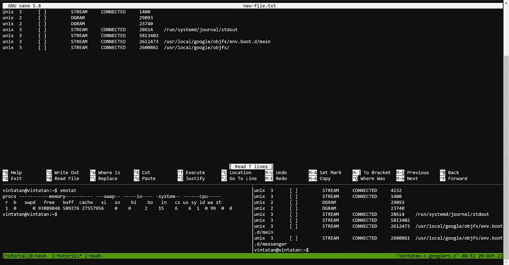
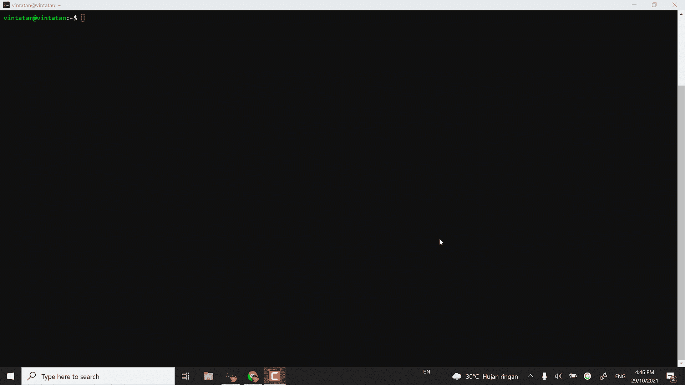
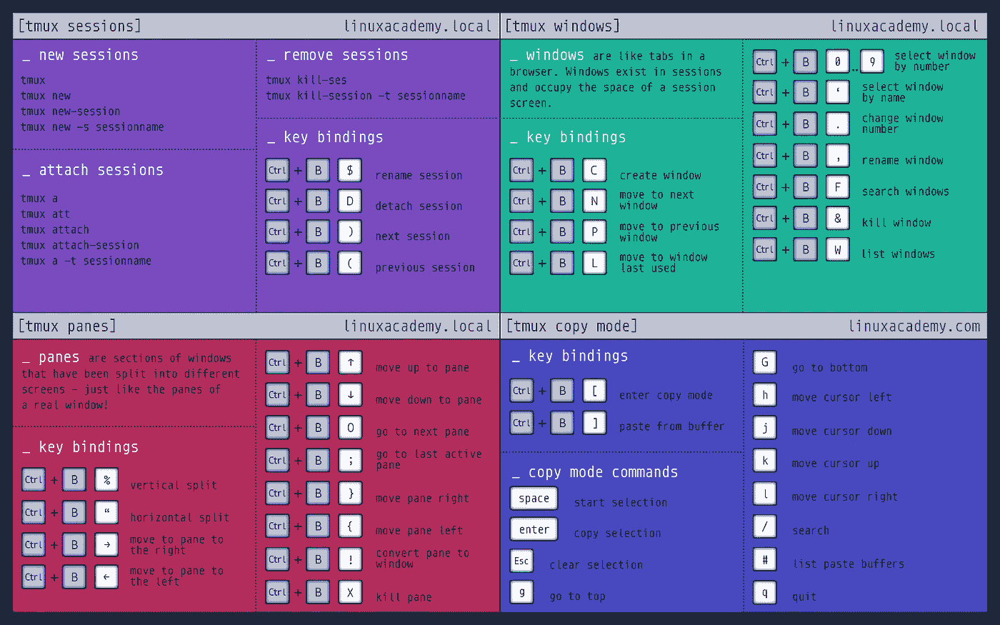
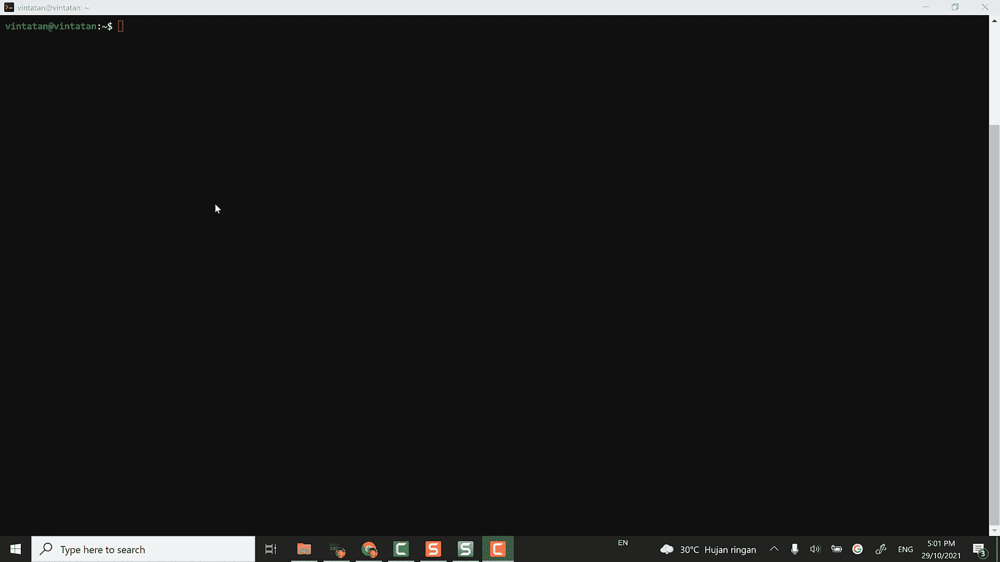

# 如何通过 Tmux 将工作效率提高 10 倍

> 原文：<https://towardsdatascience.com/how-to-boost-10x-productivity-with-tmux-ead3d3d452f9?source=collection_archive---------6----------------------->

## 给高效数据科学家的个人建议

## 对于数据科学家和软件工程师来说



Tmux 是一个终端多路复用器。这意味着您可以在一个会话中查看多个终端视图和历史记录(由作者提供)

# 问题陈述

> 哦不，我关闭了我的终端，失去了我的进度运行
> 
> 哦，不，我忘记了部署脚本的命令
> 
> 我希望有简单的方法来跟踪我在多个数据项目中的运行

欢迎来到 Tmux

# Tmux 是什么？

Tmux 代表终端多路复用器。Tmux 类似于 GNU screen，托管多个终端(在一个会话中)并跟踪当前或以前的脚本运行历史。所有这些都在命令行(CLI)环境中的窗格中。

## Tmux 将使您的工作效率提高 10 倍，因为:

*   **审计**:管理多个运行项目的脚本历史
*   持久化(Persistence):通用布局，你可以一直使用它来记住你的脚本运行，即使你不小心关闭了终端。
*   **多主机**:在一个终端上轻松切换多个程序，然后分离并重新连接它们。您现在可以连接并跳转到同步 SSH 会话，并跟踪您的 ML 服务器运行。

**这里有一张 gif 图，让你对 tmux 能为你做什么感到兴奋。**



tmux 使用(来源于作者)

> **注意，我在一个会话中运行了一些操作:**

1.  在 tmux 中将我的会话分成多个窗格
2.  在一个窗格中运行 vmstat
3.  在一个窗格中运行 netstat
4.  编辑 new-file.txt 以保存 netstat 结果
5.  移动到单独的会话窗格并查看 new-file.txt

> 请注意，如果没有 tmux，您需要在一个终端视图中运行任务，如果您关闭终端，就会丢失您的进度。
> 
> 有了 tmux，一切都可以以无故障的方式快速完成。
> 
> 让我们跳到 tmux！

# 让我们安装 Tmux

Tmux 作为开源托管在 Github 上(也就是说是免费的！).安装 tmux 非常简单。只需运行以下命令

```
# For Ubuntu and Debian
sudo apt install tmux# For CentOS and Fedora
sudo yum install tmux# For macOS
brew install tmux
```

# 给我看看 tmux

## 创建会话

tmux 是基于会话的。要在 tmux 中启动一个新的会话，只需在终端中键入`tmux new`。一旦你进入 tmux，唯一明显不同的是底部一直存在的绿色条*(参见* ***自定义主题*** *部分的自定义选项)*。

Tmux 围绕着会话，存储命令和历史的大项目。它是概念单元块，供您“附加”/同步到您的项目中。

*   **创建新会话** : `tmux new -s tutorial`
*   **附加到现有会话** : `tmux attach -t tutorial`

一旦您连接到一个会话，您将面对一个不同的终端界面(绿色条在底部)。

要退出会话/窗格，可以运行`exit`命令。另一个绕过所有出口并退出会话的命令是运行`detach`

# 运行 tmux 命令

## 使用前缀

Tmux 中的所有命令都以前缀快捷键开始(默认为 ctrl+b)。每次我们想运行 tmux 命令时，都会使用这个前缀。要启动提示，输入`ctrl+b`和`:`。

**注意**:我们可以配置新前缀为`Ctrl+a`。这有助于你更快地执行命令，因为与`Ctrl+b.`相比`Ctrl+a`更容易输入

## Tmux 命令

有一些您经常使用的重要命令:

*   重命名会话`Prefix + $`
*   分离会话`Prefix + D`
*   创建垂直分割`Prefix +%`
*   创建水平分割`Prefix + “`

为了获得更多的信息，我附上了一张有用的备忘单。感谢 linuxacademy.local



tmux 快捷方式(来源 linuxacademy.com)

## 配置 tmux 命令设置和键绑定

请注意，有一些键绑定并不直观。例如，要创建一个水平分割，您需要运行`Prefix + “`。这很容易忘记，所以我们需要将键绑定配置成更直观的方式。

自定义 tmux 可以在`.tmux.conf file`中找到，你可以通过在你的 bash 终端中运行`nano`命令来编辑文件，或者用任何文本编辑器打开它。

你可以按照我的配置，根据你的喜好进行更新。

```
# Set prefix (Ctrl+a)
set-option -g prefix C-a
unbind-key C-a
bind-key C-a send-prefix

# Use Alt-arrow keys to switch panes (Alt+left/right/up/down)
bind -n M-Left select-pane -L
bind -n M-Right select-pane -R
bind -n M-Up select-pane -U
bind -n M-Down select-pane -D

# Shift arrow to switch windows (Shft+left/right/up/down))
bind -n S-Left previous-window
bind -n S-Right next-window

# Mouse mode to alter windows
setw -g mouse on

# Set easier window split keys
bind-key v split-window -h
bind-key h split-window -v

# Easy config reload
bind-key r source-file ~/.tmux.conf \; display-message "~/.tmux.conf reloaded."#Set Tmux plugin to resurrect every time workstation restarted (Ctrl+A Ctrl+S to Save / Ctrl+A Ctrl+R to Resurrect)
set -g [@plugin](http://twitter.com/plugin) 'tmux-plugins/tpm'
set -g [@plugin](http://twitter.com/plugin) 'tmux-plugins/tmux-sensible'
set -g [@plugin](http://twitter.com/plugin) 'tmux-plugins/tmux-resurrect'
set -g [@plugin](http://twitter.com/plugin) 'tmux-plugins/tmux-continuum'# Automatically restore tmux windows when tmux starts.
set -g [@continuum](http://twitter.com/continuum)-restore 'on'# Don't auto-launch tmx at machine boot.  Give me a chance to gcert first.
set -g [@continuum](http://twitter.com/continuum)-boot 'off'# Preserves what was readable in each pane.
set -g [@resurrect](http://twitter.com/resurrect)-capture-pane-contents 'on'
set -g [@resurrect](http://twitter.com/resurrect)-strategy-vim 'session'# Initialize TMUX plugin manager (keep this line at the very bottom of tmux.conf)
run '~/.tmux/plugins/tpm/tpm'
```

> 仅此而已！恭喜你，你刚刚学到了提高工作效率的重要技巧

# 复活你的 Tmux！

## Tmux 复活拯救

我想这个教程如果不提到 tmux resurrect 就永远不会完整。要问的关键问题是“我们如何在重启后保存 tmux 历史”。

> 这个想法类似于在最终幻想游戏中保存你的记忆文件。
> 
> 你在新的地牢里升级了。你沿途收集物品并升级你的角色的装备。在一天结束的时候，你教他们新的技能来对抗老板。
> 
> 但是在冒险在 boss 战斗中死亡之前，你跑到保存点希望保持角色的当前状态。
> 
> 当你输了这场战斗，你松了一口气，知道你保存了你的游戏，可以再次尝试，直到你胜利。
> 
> 类似地，tmux resurrect 保存并加载您的最新状态。

这非常有用，尤其是在您运行构建文件来试验您的新模型并生成一个快速的。运行无监督学习的 sh 脚本代码。最可怕的事情是丢失所有访问 ML 日志的命令历史。

因此，如果您丢失了进度，明智的做法是将最新状态加载到内存中。然后，您可以快速跳转到该项目，并在几秒钟内控制所有最新的终端状态。

要用 tmux resurrect 保存状态，只需运行`Prefix + Ctrl+S`。


保存的 tmux 消息(来源于作者)

要将您的状态加载到一个新的会话中，您只需运行`Prefix + Ctrl+R`。

如果操作正确，您将恢复对当前项目很重要的所有命令历史和会话。



Tmux 恢复加载(来源于作者)

> 恭喜你，现在你已经准备好用 tmux 做一些很酷的事情了！

# 参考:

下面是一些参考资料，你应该在迷上 tmux 之后阅读。

*   [tmux 之道](https://leanpub.com/the-tao-of-tmux/read)
*   [Tmux 快捷键](https://medium.com/@carlesanagustin/tmux-short-cuts-2c8c0e554806)

# 总之:Tmux 将您的生产力提高了 10 倍

*   审计:管理多个运行项目的脚本历史
*   持久化(Persistence):通用布局，你可以一直使用它来记住你的脚本运行，即使你不小心关闭了终端。
*   **多主机**:在一个终端上轻松切换多个程序，然后分离并重新连接它们。您现在可以连接并跳转到同步 SSH 会话，并跟踪您的 ML 服务器运行。

我希望这有助于您理解为什么 tmux 是重要的，并使用它来交付真实的数据影响。

索利·德奥·格洛丽亚

# 关于作者

文森特用 ML @ Google 对抗网络滥用。文森特使用高级数据分析、机器学习和软件工程来保护 Chrome 和 Gmail 用户。

除了在谷歌的工作，文森特还是[乔治亚理工学院计算机科学硕士校友](/5-biggest-tips-to-juggle-work-and-study-as-data-scientists-7cad143f10a)、三项全能运动员和[面向数据科学媒体的特约作家，该杂志在全球拥有 100 多万观众，为有志于数据科学的人和数据从业者提供指导](https://medium.com/@vincentkernn)。

最后，请通过 [**LinkedIn**](http://www.linkedin.com/in/vincenttatan/?source=post_page---------------------------) **，** [**Medium**](https://medium.com/@vincentkernn?source=post_page---------------------------) **或** [**Youtube 频道**](https://www.youtube.com/user/vincelance1/videos?source=post_page---------------------------) 联系文森特