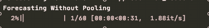
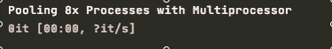

# 如何通过多重处理提高预测

> 原文：<https://towardsdatascience.com/how-to-boost-forecasting-with-multiprocessing-e78bc5ba6dbc?source=collection_archive---------9----------------------->

## [理解大数据](https://towardsdatascience.com/tagged/making-sense-of-big-data)

## 何时以及如何通过集中 CPU 和与 Python 并行计算，使用 ARIMA、脸书·预言家和皮托奇·LSTM 神经网络来促进时间序列预测。


由[托马斯·凯利](https://unsplash.com/@thkelley?utm_source=medium&utm_medium=referral)在 [Unsplash](https://unsplash.com?utm_source=medium&utm_medium=referral) 上拍摄

预测时间序列数据时，有时既需要速度，又需要精度。当使用 Python 在笔记本电脑上工作时，尝试多处理以获得两个世界的最佳效果。

# 这篇文章可能适合你，如果:

*   您正试图在本地机器上优化 Python 中的多处理问题
*   您正在使用 Statsmodels ARIMA、脸书预言家或 PyTorch LSTM 预测时间序列数据
*   如果您无法使用 GPU，您正在尝试确定多处理是否是 PyTorch LSTM 的最佳配置

# 有数据，需要时间

大多数时候你有大量的数据。有些时候，你有足够的时间来分析数据，但大多数时候，你需要在任何时候都产生一些东西。但是，随着数据量的增加，您需要更大更好的模型来产生有用的信息。无论你是需要加快调试代码的速度，还是在黄金时间展示一些东西，大数据和深度模型都将吃掉你不能失去的宝贵时间。

> 在没有 GPU 的情况下，我能在 MacBook 上更快地进行深度学习吗？

当用脸书预言家预测数据时，考虑到机器有 8 个内核，将进程数设置为 8 似乎是一个最佳选择。

# 多重处理的动机

为了预测准确的趋势和未来的数据点，你需要大量的数据，一个很好的模型，或者两者兼而有之。但是调试可能具有挑战性。可能需要 5 分钟、10 分钟或 20 分钟才能知道一行代码没有正确运行，因为这是模型运行所需的时间。

为了减少你需要在变化中循环的时间，一个更快的机器，一个 GPU，或者某种云解决方案可以做到这一点——但是如果你以上都没有呢？在花钱进行基于云的工作之前，您希望确保您的模型正常运行吗？或者，如果这是您要在应用程序中部署的内容，该怎么办？无论如何，我们想要更快的速度！

在本文中，我分享了几个实验的结果，这些结果可能有助于您构建自己的多处理解决方案来提高速度。

当使用 statsmodels ARIMA 预测数据时，考虑到机器有 8 个内核，将进程数设置为 6 似乎是最佳选择。

# 调查的结果

首先，一个警告。我只是一个拿着笔记本电脑做了一些实验的人——你的结果可能会有所不同，我的发现和代码应该被仔细检查。除了警告，我认为这些发现值得分享，可以节省你一些时间，或者至少让你思考一些有趣的问题。

1.  用 ARIMA、脸书·预言家和 PyTorch 在 python 中实现多重处理是可能的
2.  对于脸书先知来说，**8 核机器上的 8 倍池化进程似乎可以产生最佳结果**——对于相同的数据和相同的计算，时钟时间减少了 70%。
3.  对于 ARIMA 的 statsmodels， **6x 池化进程产生了最佳结果**，但是 6 个和 8 个处理器之间的差异可以忽略不计——时钟时间减少了 50%。
4.  对于用 PyTorch 建造的单层 LSTM，有两个有趣的发现。首先，**标准配置(无多重处理)优于所有其他配置**使用池化进程，完成任务的时钟时间随着池化进程而逐渐变差。第二，通过平均绝对百分比误差(MAPE)测量的误差似乎随着过程数量的增加而稳步下降。

*注意时钟时间等:我对每个配置的三次运行结果进行了平均，并将时钟时间作为开始时间和结束时间与 time.time()之间的差值。*

当使用 LSTM 预测数据时，合并过程似乎比不合并过程表现得相对更差，但是 MAPE(误差)似乎减少了。“LSTM-1”是指两个 LSTM 实验中的第一个，其中的输入只是一系列价格。

# 如何使用多重处理进行预测

更快的结果？听起来不错，但是怎么做呢？在接下来的几节中，我将逐步介绍如何修改 ARIMA、预言家和 LSTM 模型来实现多重处理的关键要点。

## 使用 Statsmodels ARIMA 的多重处理

使用自回归综合移动平均模块，或简称为“ARIMA”，您可能会对预测具有某种季节性的趋势感兴趣。由于在许多其他文章中已经很好地涵盖了 ARIMA 基础知识[这里](https://medium.com/@josemarcialportilla/using-python-and-auto-arima-to-forecast-seasonal-time-series-90877adff03c)和[这里](/time-series-forecasting-arima-models-7f221e9eee06)，我将直接演示一个多处理设置。

**ARIMA 的基本设置**

```
**# import dependencies**
from statsmodels.tsa.arima.model import ARIMA# some data...
x_i = [4.1, 3.1, 2.5, 4.0]**# a simple model on the data**
m = ARIMA(x_i, order=(0,1,0))**# fit the model** 
m_fit = m.fit()**# forecast/predict the next n steps**
yhat = m_fit.forecast(steps=1)**# then, compare yhat predictions to y targets...**
```

**准备预测数据**

由于 ARIMA 最擅长预测训练集之后的几步，所以我修改了一个数据分块脚本，该脚本适用于具有日期时间列和数据列的数据帧。在我的实验中，数据是从上午 9 点到下午 4 点的交易日中每分钟的股票价格。

```
# dataframe examplecolumns -> 'ds', 'y''ds' data -> 2019-01-01 09:00:00, ...'y' data -> 1.4, ...
```

data_chunker.py 中的函数返回数据帧的元组列表，其中每一对都是 15 分钟的数据块。

给定一些分块数据，我们可以遍历数据帧列表，用 ARIMA 的函数包装器计算每个块的预测。

**为 ARIMA 做好预测准备**

如上所述，给定一些分块数据和 ARIMA 的函数包装器，我们可以通过迭代分块数据来调用 run_arima()函数，分块数据只是一个数据帧列表。

**将数据组织成一个可迭代对象并将 arima 作为一个函数应用于该对象的这一步非常重要，因为它决定了如何实现多重处理。如果你把这部分做对了，多重处理就变成了一个简单的任务。**

```
**# from main.py, run arima as list comprehension**model = run_arimaresults = [model(i) for i in chunked_data]# from main, iterate through a list of data and with arima function
# within arima function, iterate through the list of chunked data
# return a forecast of each 15 minute period
```

**进口 PyTorch 多处理器**

因为我们使用的是脸书 API(PyTorch 和脸书 Prophet)，所以我导入了 py torch 多处理器库，它覆盖了基本的多处理器库。

```
import torch.multiprocessing as mp
# the torch mp is basically the same as
# import multiprocessing as mp# get number of available processes
process_count = mp.cpu_count()
```

**理解 cpu_count()**

方法返回可用进程的总数。据我所知，在 8 核的 MacBook Pro 上，cpu_count()返回值 16——我相信这意味着每个内核有 2 个超线程 cpu 进程。在性能测试期间，如上所述，8 倍进程池的性能优于 2 倍进程，也优于 14 倍进程。我的简短结论是，2x 个进程没有充分利用潜在的计算资源，而 14x 个进程相对更差，因为这些进程在每个内核上争夺资源。

**为 ARIMA 实施多处理**

现在我们已经有了分块数据、arima 函数包装器和迭代 arima 函数的方法，是时候实现多处理了。

```
**# this needs to be run from main.py or something similar
# import dependencies as required here
# import helper functions and arima wrapper here****# functions must be guarded in this**
if __name__ == '__main__': model = run_arima **# set a pool of 8**
  p = mp.Pool(8) **# iterate run_arima over chunked data**
  results = list(p.imap(model, chunked_data))

  **# close and join pools per the docs**
  p.close()
  p.join()
```

上面的代码片段展示了一个简化的例子，但是下一个代码要点展示了如何在多重处理时管理函数参数的发送，以及如何添加 tqdm 进度条。



运行相同函数时，使用和不使用多重处理时每秒迭代次数的比较。左:没有池，每秒约 1.5 次迭代。右图:使用池，每秒最多 11 次迭代。

## 多重处理框架

基于上面 ARIMA 的例子，我们有了一个多重处理的模板。

*   将数据组织成块，作为一个像数据帧列表一样的可迭代对象
*   将预测模型应用于分块对象

## 将多重处理框架应用于脸书先知

脸书先知的步骤非常相似。主要的例外是 Prophet 的实际代码，它期望使用数据帧，并对时间戳的列名为“ds”和数据的列名为“y”有一定的要求。

与 ARIMA 类似，我们可以将 run_prophet 函数分配给一个模型对象，并在模型和数据上迭代池。

## 将多重处理框架应用于 LSTM

在这里，LSTM 的框架与 ARIMA 或先知的框架并不完全相同，但没关系，他们是非常不同的模型。LSTM 有什么不同？ARIMA 和脸书先知学习一个模型并预测紧随其后的序列，而我们可以使用 LSTM 来预测远在训练窗口之外的序列。举个简单的例子，ARIMA 和预言家可能擅长根据一周的数据进行训练并预测下一周，但他们可能在未来几个月的预测中表现不佳——这是 LSTM 可以做得很好的地方。

我改编了 PyTorch 的示例代码来创建 LSTM 的多处理版本。给定一个创建 LSTM 模型的函数和一个实现训练迭代的函数，下面的多重处理应用可以工作。

```
# given a model of LSTM
# given a dict of params
# given a function called train_modelmodel.share_memory()

processes = []# assign processes
for rank in tqdm(range(8)):
    # pool data for train_scaled to function train_model
    p = mp.Process(target=train_model, kwargs=params)
    p.start()
    processes.append(p)# join processes after compute
for p in tqdm(processes):
    p.join()
```

我从 PyTorch 示例中获得的关键见解是， **train_model()函数应该迭代通过模型和数据加载器对象**、**，同时调用一个单独的函数在每个时期**执行训练。考虑到没有多重处理，上面对 train_model()的调用可以简单到调用函数并将数据和参数作为字典传递。

```
# given a dictionary of params
train_model(**params)
```

我认为这突出了像 LSTM 这样的神经网络和像 ARIMA 这样的更简单的模型之间的一个有趣的区别，但是我需要更多地了解计算在每个过程中是如何工作的——也许这是未来帖子的主题。

在不深入研究如何实际构建 LSTM 的情况下(这是一个完全独立的主题)，这里有三个配置架构的技巧，假设您对这个主题有所了解:

1.  在 train_model()中，调用 PyTorch DataLoader 对象、loss 函数并初始化优化器，然后循环 n 个时期。在每个 epoch 内，调用另一个函数 train_epoch()。
2.  在 train_epoch()中，枚举 DataLoader 对象并在那里应用 LSTM 模型。
3.  在 main.py 中，为了传递 LSTM 的所有参数，即层数和批量大小等，创建一个字典并将其作为 **kwargs=params** 传递给流程函数。然后，在 train_model 的函数签名中，确保有一个 ****kwargs** 参数来接收字典值。

值得一提的是，至少在我的项目实现中，虽然这种池化的方法“有效”,但与不使用池化相比，它在速度方面表现相对较差。仅在这一方面，它可能不值得花时间来实现。另一方面，我可能错过了让它更有效工作的重要步骤，因为我有一些隐式嵌套的 for 循环。此外，还有一个奇怪的情况，为什么当我们有许多进程并行运行时，错误似乎会有所改善——这是一个有趣的话题，改天再来探讨。

这里的完整实现:[https://github.com/justinhchae/stocks](https://github.com/justinhchae/stocks)以及我的项目合作伙伴(内的[知识)对 LSTM 模型配置的生产信用。](https://github.com/knowledgewithin)

# 结论

在本文中，我展示了如何在同一个数据集上采用多重处理框架来预测 ARIMA 和脸书预言家的模型。在这两种情况下，**多重处理通过增加每秒的迭代次数导致了 70%到 50%的时间减少。**此外，我还演示了如何应用 PyTorch *Hogwild* 示例让 LSTM 的多处理工作起来。然而，**与 ARIMA 和先知不同，LSTM 在速度方面并没有提高，事实上，随着更多的进程，它的性能下降了。然而奇怪的是，随着并行进程数量的增加，LSTM 误差得到了改善——这是一个值得进一步研究的课题。**

我浏览了一些相对琐碎的步骤，以提供如何应用多处理概念的概述，但它们仍然很重要。要了解从数据处理到模型设置的细节，请查看我的 [GitHub 库](https://github.com/justinhchae/stocks)。

我最初开始尝试在没有 GPU 的笔记本电脑上改善深度学习，即通过在 MacBook 上共享 CPU 来更快地学习 LSTM。不幸的是，似乎池化的 CPU 并不能为 LSTM 提供速度优势，在这种情况下，更好的硬件可能最终是必要的。

至于接下来的步骤，应该值得将这些代码迁移到类似于 [Google Colab](https://colab.research.google.com/) 的地方，看看它在 GPU 上的表现如何。

**编辑:如果你正在寻找一个更深入的话题，从头开始学习 Python 中的多处理，可以看看我写的一篇涵盖所有基础知识的文章。**

<https://python.plainenglish.io/how-to-design-python-functions-with-multiprocessing-6d97b6db0214>  

# 资源

*   [项目库](https://github.com/justinhchae/stocks)
*   Statsmodels ARIMA，[文档](https://www.statsmodels.org/stable/generated/statsmodels.tsa.arima.model.ARIMA.html?highlight=arima#statsmodels.tsa.arima.model.ARIMA)
*   [TDS 应用预测文章](/time-series-forecasting-predicting-stock-prices-using-an-arima-model-2e3b3080bd70)
*   [Spike 的 Prophet 多处理](https://medium.com/spikelab/forecasting-multiples-time-series-using-prophet-in-parallel-2515abd1a245)框架来源
*   [数据分块脚本](https://yaoyao.codes/pandas/2018/01/23/pandas-split-a-dataframe-into-chunks)
*   [PyTorch 多处理最佳实践](https://pytorch.org/docs/stable/notes/multiprocessing.html)
*   [脸书先知 API](https://facebook.github.io/prophet/docs/quick_start.html#python-api)
*   [关于 Contentsquare 引擎的多处理](https://medium.com/contentsquare-engineering-blog/multithreading-vs-multiprocessing-in-python-ece023ad55a)
*   关于 [LSTM](https://medium.com/contentsquare-engineering-blog/multithreading-vs-multiprocessing-in-python-ece023ad55a) ，由 TDS 提供