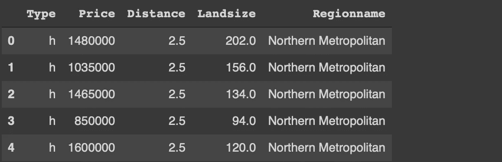
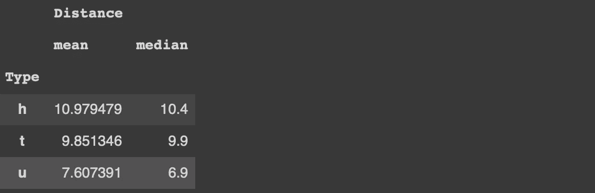
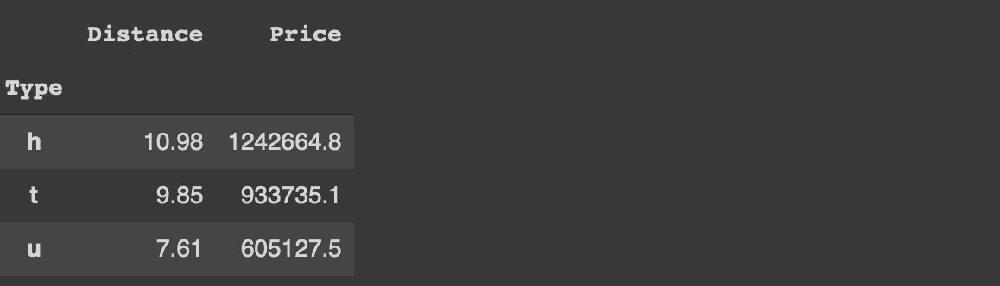
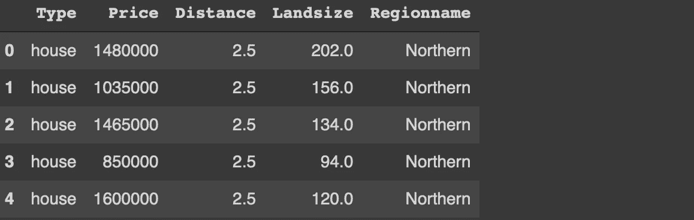

# 如何用 Python 字典增强熊猫的功能

> 原文：<https://towardsdatascience.com/how-to-boost-pandas-functions-with-python-dictionaries-35da25e250d7?source=collection_archive---------6----------------------->

## [*小窍门*](https://towardsdatascience.com/tagged/tips-and-tricks)

## 举例说明


由[比尔·杰伦](https://unsplash.com/@billjelen?utm_source=unsplash&utm_medium=referral&utm_content=creditCopyText)在 [Unsplash](https://unsplash.com/s/photos/rocket?utm_source=unsplash&utm_medium=referral&utm_content=creditCopyText) 拍摄的照片

Pandas 是一个非常流行的数据分析和操作库。由于简单直观的 Python 语法，Pandas 通常是有抱负的数据科学家的首选。其强大而高效的功能让大量有经验的数据科学家也对熊猫青睐有加。

Pandas 提供了丰富的功能选择，加快了数据分析过程。默认的参数设置在大多数情况下做得很好，但是我们可以通过定制参数做得更好。

除了常量值或列表之外，一些参数还接受字典参数。在本文中，我们将通过几个例子来演示如何使用字典来增加函数的价值。

我们将使用 Kaggle 上提供的墨尔本住房[数据集](https://www.kaggle.com/dansbecker/melbourne-housing-snapshot)中的一个小样本作为示例。我们首先使用 read_csv 函数读取 csv 文件。

```
import numpy as np
import pandas as pdcols =['Price','Landsize','Distance','Type','Regionname']melb = pd.read_csv(
   "/content/melb_data.csv",
   usecols = cols,
   dtype = {'Price':'int'},
   na_values = {'Landsize':9999, 'Regionname':'?'}
)melb.head()
```



(图片由作者提供)

dtype 参数用于指定数据类型。通过使用字典，我们能够分别为每一列指定数据类型。

现实生活中的数据通常是混乱的，所以我们很可能会遇到缺失值的不同表示。na_values 参数处理这种表示。

考虑这样一种情况，即“土地面积”和“区域名称”列中缺失的值用 9999 和“？”表示，分别为。我们可以向 na_values 参数传递一个字典来处理特定于列的缺失值。

字典也使得 agg 函数更加有用和灵活。agg 函数通常与 groupby 函数一起使用。例如，我们可以计算每种类型房屋的平均值和中值，如下所示。

```
melb[['Type','Distance']].groupby('Type').agg(['mean','median'])
```



(图片由作者提供)

如果我们想为多个列计算不同的聚合值，该怎么办？对于每种类型，我们可能需要计算平均距离和总价(以百万为单位)。这项任务可以很容易地用字典来完成。

```
melb.groupby('Type').agg(
   {
      'Distance':'mean',
      'Price':lambda x: sum(x) / 1_000_000
   }
)
```


(图片由作者提供)

正如您在上面的截图中看到的，聚合值是带 6 个小数点的浮点数。如果我们把他们围起来，他们会更好看。此外，在大多数情况下，我们不需要这样的精度。

round 函数可用于向上舍入浮点数。我们可以传递一个整数来将所有的值四舍五入到相同的小数点位数。但是，如果我们想对不同的列使用不同的小数点位数，我们可以使用字典。

```
melb.groupby('Type').agg(
   {'Distance':'mean','Price':'mean'}
).round(
   {'Distance':2, 'Price':1}
)
```



(图片由作者提供)

距离四舍五入到两位小数，而价格只有一个小数点。

字典还向用于替换数据帧中的值的替换函数添加值。通过使用嵌套字典，我们可以指定列、要替换的值以及用作替换的值。

假设我们需要将 type 列中的值“h”替换为“house ”,将 region name 列中的值“Northern Metropolitan”替换为“Northern”。

```
melb.replace(
   {
      'Type':{'h':'house'},
      'Regionname':{'Northern Metropolitan':'Northern'}
   }
).head()
```



(图片由作者提供)

## 结论

我们已经做了几个例子来演示字典如何增加价值或增强 Pandas 功能的能力。默认设置在大多数情况下做得很好，但最好还是想办法充分利用一个功能。

此外，根据给定的任务定制函数的行为可能会好得多。在某些情况下，使用字典作为参数可以让我们在一个步骤中完成需要多个步骤才能完成的事情。

感谢您的阅读。如果您有任何反馈，请告诉我。