# 如何在 20 天内打破一个模型——生产模型分析教程

> 原文：<https://towardsdatascience.com/how-to-break-a-model-in-20-days-a-tutorial-on-production-model-analytics-25497e2eab9c?source=collection_archive---------14----------------------->

## [理解大数据](https://towardsdatascience.com/tagged/making-sense-of-big-data)

## 模型如何在生产中失败，以及如何发现它

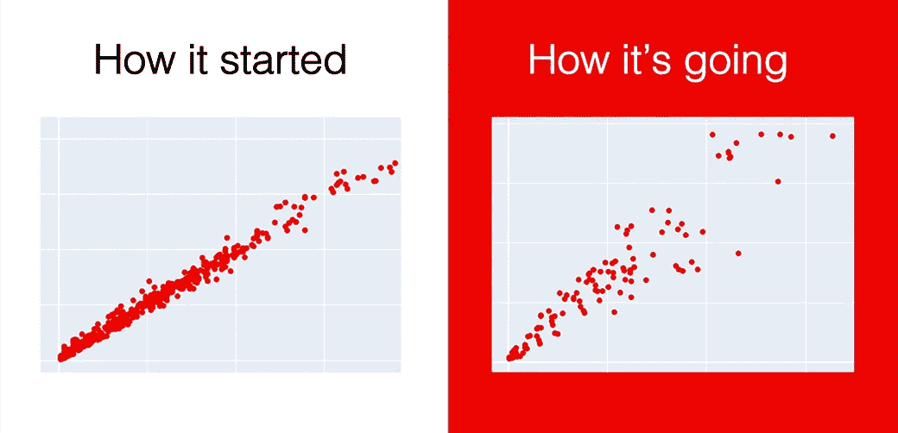

图片作者。

假设你训练了一个预测模型。并将其设置为常规使用。欢迎学习生产中的机器学习！

现在，您依靠它来做出业务决策。你必须维护、重新培训和关注你的模型。

它会出什么问题，如何保持跟踪？让我们看一个例子。

这是一个关于我们如何训练一个模型，模拟生产使用，并分析其逐渐衰退的故事。

# 手头的任务:自行车需求预测

在本教程中，我们将处理一个需求预测问题。

**数据集。**我们拿了一个关于自行车共享需求的 [Kaggle 数据集](https://www.kaggle.com/c/bike-sharing-demand/data)。我们的目标是预测每小时的自行车租赁量。为此，我们有一些关于季节、天气和星期几的数据。

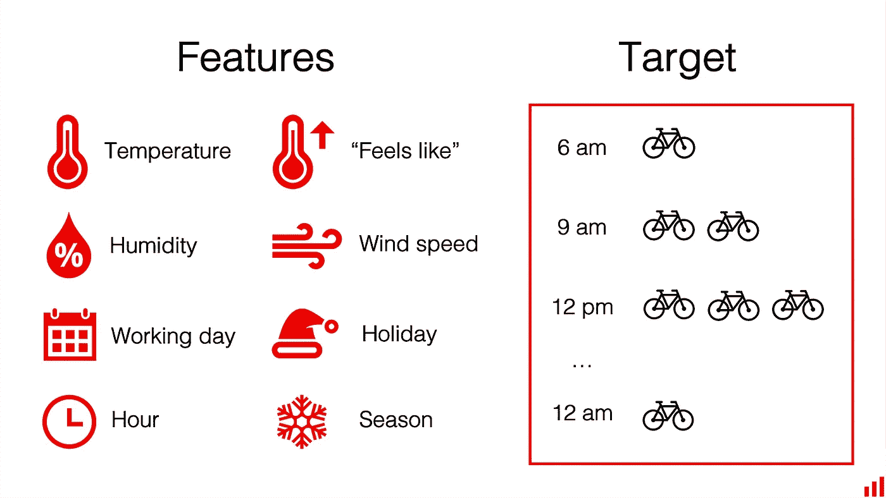

图片作者。

**型号。**我们使用从一月份开始的四周数据训练了一个随机森林模型。让我们想象一下，在实践中，我们只是开始收集数据，这是所有可用的数据。经过训练的模型的性能看起来还可以接受，所以我们决定试一试。

**反馈。我们假设我们只在每个周末了解基本情况(实际需求)。**

这是现实世界机器学习中的一个现实假设。集成和更新不同的数据源并不总是简单的。甚至在实际事件发生之后！也许日常使用数据存储在本地，每周只发送一次并合并到数据库中。

当您为不同的未来期间生成预测时，可能会出现类似的延迟。如果你提前一周预测，这个地平线就成了你的等待时间。

**模特体检。**由于实际数据每周仅提供一次，我们决定每次都运行常规模型分析。没有实时监控。相反，我们安排了一个生成标准周报告的作业，供数据科学家查看。

# 如何分析模型性能？

为了在生产中分析我们的模型，我们将明显地使用。它是一个开源工具，可以生成关于模型性能的交互式预建报告。

为了运行它，我们将我们的性能数据准备为熊猫数据帧。
它应该包括:

*   **模型应用日志** —进入模型的特征及相应的预测；和
*   **地面真实数据**——作为我们“目标”的每小时实际租赁的自行车数量

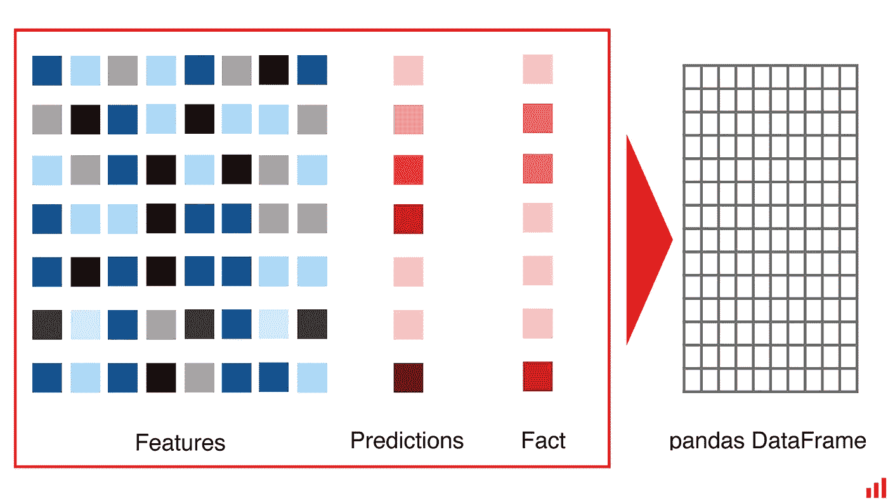

图片作者。

您可以使用这个[示例 Jupyter 笔记本](https://github.com/evidentlyai/evidently/blob/main/evidently/tutorials/bicycle_demand_monitoring_tutorial.ipynb)跟随我们的步骤。

**让我们先来看看我们创建的模型的性能。**一旦我们训练了一个模型，我们就将训练数据集和预测指定为“参考”数据。敬请关注:这也将有助于我们日后参考这些数据。

```
reference = raw_data.loc[‘2011–01–01 00:00:00’:’2011–01–28 23:00:00']
```

我们可以直接从数据帧中选择这个时间段，因为它有 datetime 作为索引。

我们还映射了各个列，以显示该工具是什么，并执行正确的分析:

```
target = 'count' 
prediction = 'prediction' 
numerical_features = ['temp', 'atemp', 'humidity', 'windspeed', 'hour', 'weekday'] 
categorical_features = ['season', 'holiday', 'workingday']
```

默认情况下，显然使用索引作为绘图中的 x 轴。在本例中，它是 datetime，所以我们不显式添加任何内容。否则，我们必须在列映射中指定它。

接下来，我们为回归模型调用相应的报告。

```
regression_performance_dashboard = Dashboard(reference, **None**,  column_mapping=column_mapping, tabs=[RegressionPerformanceTab])
```

并将结果显示在 Jupyter 笔记本上。

```
regression_performance_dashboard.show()
```

我们还将它保存为. html 文件，以便于共享。

```
regression_performance_dashboard.save('regression_performance_at_training.html')
```

我们可以看到，鉴于我们只对四周的数据进行了训练，该模型具有良好的质量！

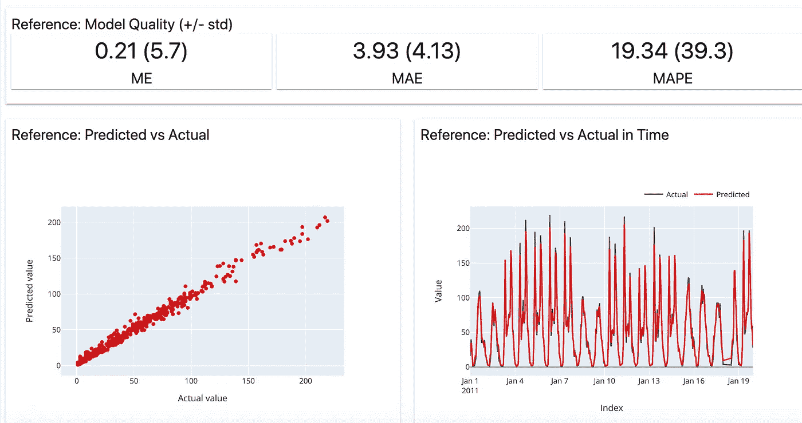

显然报道截图。

更多好消息:误差是对称的，分布在零附近。没有明显的低估或高估。

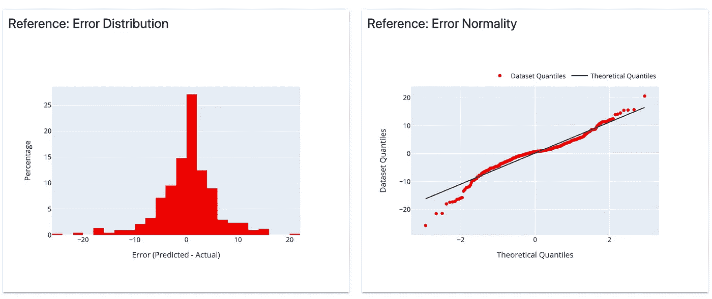

显然报道截图。

**我们将继续把训练中模型表现的数据集作为我们的“参考”**这让我们对我们的模型在生产使用中的质量有了很好的感受。因此，我们可以将未来的性能与该基准进行对比。

# 到野外:生产的第一周

观察生产中的模型有直接的目标。我们想检测是否有问题。理想情况下，提前。

我们还想诊断根本原因，并快速了解如何解决它。也许，模型退化太快，我们需要更频繁地重新训练它？或许，误差太高，需要我们对模型进行适配重建？哪些新模式正在出现？

**在我们的例子中，我们简单地从检查模型在训练数据之外的表现开始。**我们的第一周变成了一个原本会被搁置的数据集。

我们继续使用[示例 Jupyter 笔记本](https://github.com/evidentlyai/evidently/blob/main/evidently/tutorials/bicycle_demand_monitoring_tutorial.ipynb)。出于演示目的，我们一次性生成了未来几周的所有预测。实际上，当数据进来时，我们会按顺序运行模型。

为了选择分析期间，我们将在数据框中指明行。

让我们先来比较一下第一周的表现和我们在训练中看到的。前 28 天是我们的参考数据集；接下来的 7 部是制作。

```
regression_performance_dashboard = Dashboard(reference, production.loc['2011-01-29 00:00:00':'2011-02-07 23:00:00'],  column_mapping=column_mapping, tabs=[RegressionPerformanceTab])
```

报告出来了！我们可以快速地将生产性能与我们的参考进行比较。

预计会出现一些衰退，但总体来看情况并不那么糟糕。

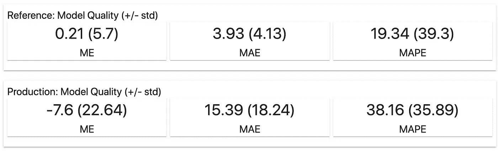

来自明显报道的截图。

误差略有增加，并倾向于低估。

让我们检查一下我们的目标是否有任何统计上的变化。为此，我们将生成[目标漂移报告](https://evidentlyai.com/blog/evidently-014-target-and-prediction-drift)。

我们称这份报告为明显的标签。在回归模型中，我们的目标是数值，所以我们选择一个匹配的报告:

```
target_drift_dashboard = Dashboard(reference, production.loc['2011-01-29 00:00:00':'2011-02-07 23:00:00'], 
column_mapping=column_mapping, tabs=[NumTargetDriftTab])
```

我们可以看到，实际租赁自行车数量的分布仍然十分相似。更确切地说，相似性假设并没有被拒绝。没有检测到漂移。

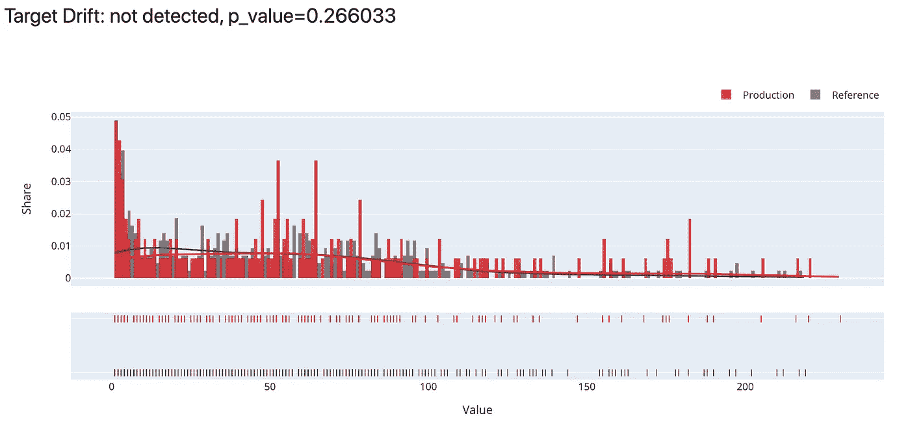

显然报道截图。

我们预测的分布也没有太大变化。

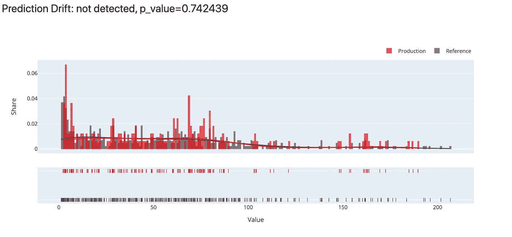

显然报道截图。

尽管如此，一个合理的决定是通过包含新一周的数据来更新您的模型。这样模型就能继续学习，我们大概也能改善误差。

为了演示的目的，我们将坚持看看事情有多快变糟。

进入下一周！

# 第二周:跟不上

我们再次根据参考数据集对新的一周进行基准测试。

```
performance_drift_dashboard = Dashboard(reference, production.loc['2011-02-07 00:00:00':'2011-02-21 23:00:00'], 
column_mapping=column_mapping, tabs=[RegressionPerformanceTab])
```

乍一看，第二周的车型表现相差不大。

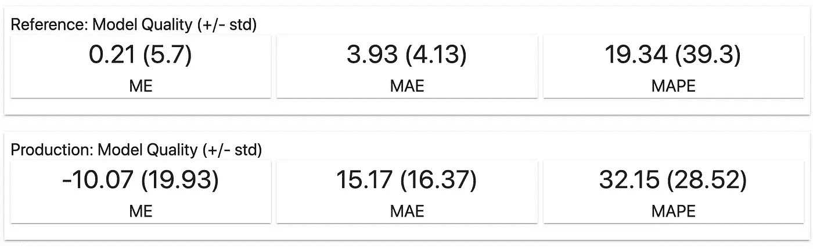

显然报道截图。

梅几乎保持不变。但是，低估倾向继续增长。看来错误不是随机的！平均来说，我们低估了 10 辆自行车。

为了了解更多，我们转向情节。我们可以看到，该模型很好地捕捉了总体每日趋势。所以它学到了有用的东西！但是，在高峰时段，实际需求往往高于预测。

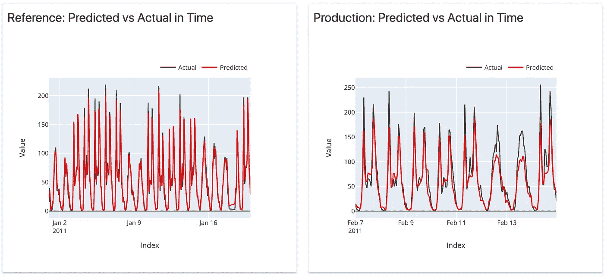

显然报道截图。

在误差分布图中，我们可以看到它如何变得“更宽”，因为我们有更多的高误差预测。向左的转变也很明显。在一些极端的例子中，我们有 80 到 40 辆自行车出现了以前没有发现的错误。

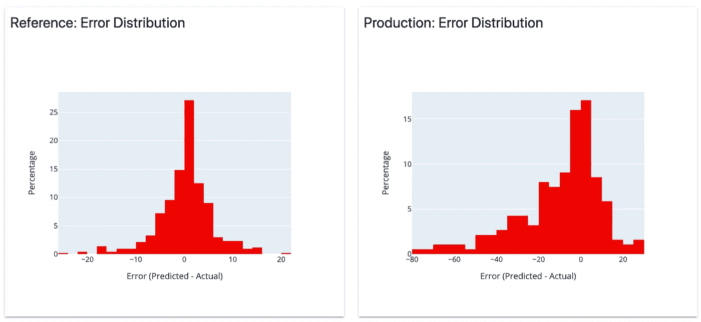

显然报道截图。

让我们也检查一下我们的目标。

```
target_drift_dashboard = Dashboard(reference, production.loc['2011-02-07 00:00:00':'2011-02-14 23:00:00'], 
column_mapping=column_mapping, tabs=[NumTargetDriftTab])
```

事情越来越有趣了！

我们可以看到目标分布现在不同了:相似性假设被拒绝。从字面上看，人们租用更多的自行车。这是一个统计上不同于我们训练期间的变化。

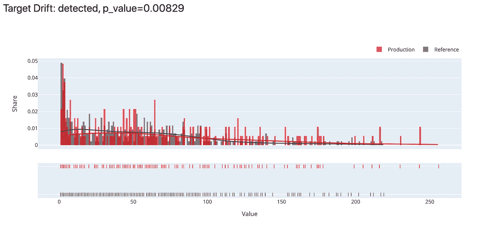

显然报道截图。

但是，我们预测的分布并没有跟上！这是模型衰退的一个明显例子。世界上发生了一些新的事情，但它错过了模式。

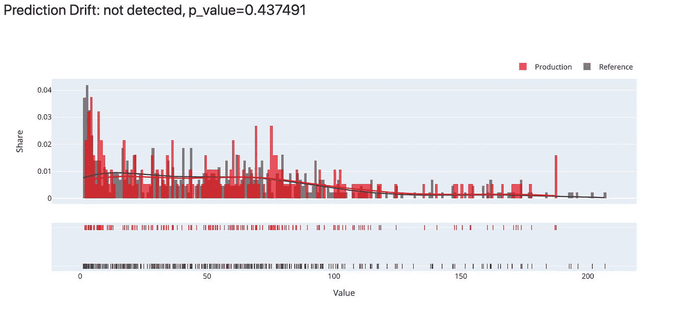

显然报道截图。

人们很想进一步调查。数据中有什么可以解释这种变化的吗？如果有一些新的信号，再训练可能有助于模型跟上。

在目标漂移报告中，有一个部分可以帮助我们探索特征和目标(或模型预测)之间的关系。

浏览单个功能时，我们可以检查是否注意到任何新的模式。我们知道预测没有改变，所以我们只关注与目标的关系。

例如，随着出租自行车数量的相应增加，似乎有向更高温度(以摄氏度衡量)的转变。

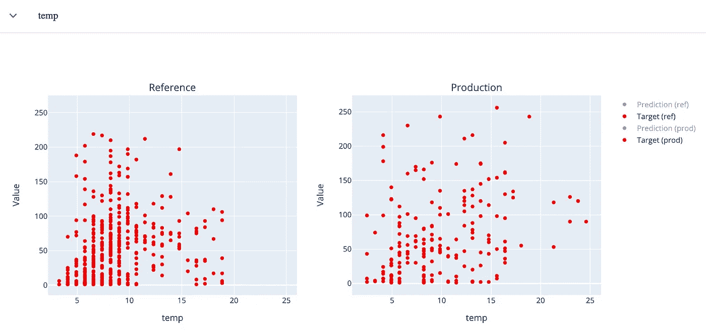

显然报道截图。

这是新款！

也许，它会在再培训中采用这些模式。但是现在，我们只是简单地进入下一周，没有任何更新。

# 第三周:当事情变糟时

好吧，现在事情看起来很糟糕。在第三周，我们面临一个重大的质量下降。

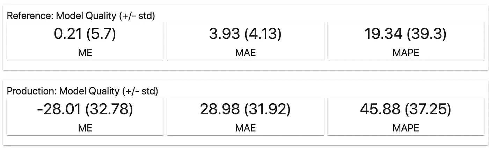

显然报道截图。

绝对误差和百分比误差都显著增加。

如果我们看看这些图，模型预测明显是分散的。我们还面临着模型未能预测到的高需求新数据段。

但是，即使在目标值的已知范围内，模型现在也会出错。训练之后事情确实发生了变化。

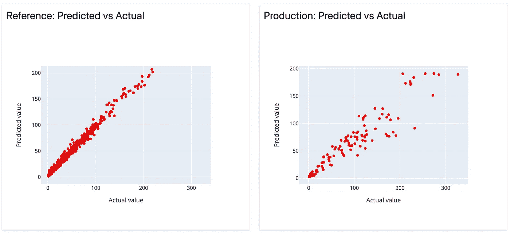

显然报道截图。

我们可以看到，该模型没有很好地外推。预测需求保持在相同的已知范围内，而实际值达到峰值。

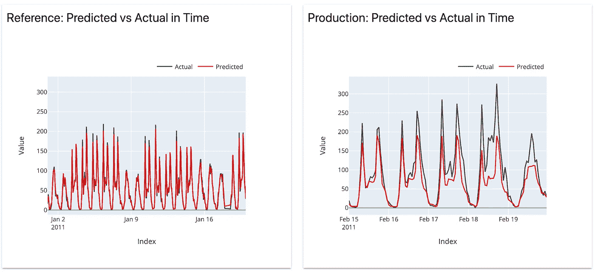

显然报道截图。

如果我们放大特定的日子，我们可能会认为在一天中特定的(活跃的)时间里误差更大。我们从晚上 10 点到早上 6 点都很好！

然而，我们在解释这种模式时应该小心。这也可能是由于一些其他相关因素，如在同一时间温度较高。

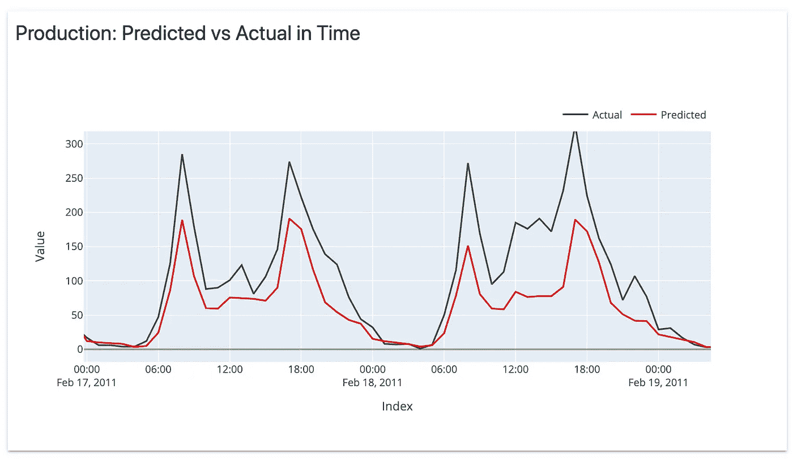

显然报道截图。

显然会生成更多的图来显示误差。在当前的背景下，这些是描绘同一个故事的不同方式。我们有一个很高的误差，它明显倾向于低估。

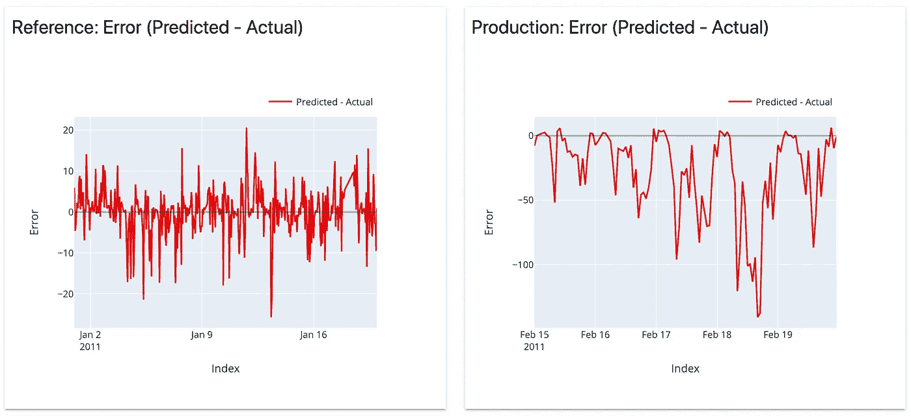

显然报道截图。

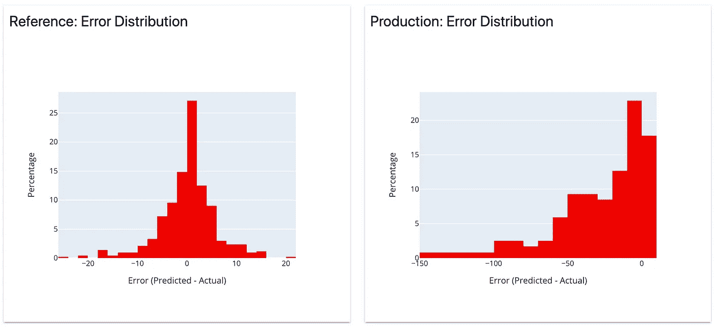

显然报道截图。

在过去几周，这些相同型号质量问题的早期迹象就已经显现。随着变化的积累，它们被放大了。

**[**回归业绩报告**](https://evidentlyai.com/blog/evidently-016-regression-model-performance) **还会生成一组深入了解表现不佳的细分市场的见解。**目标是探究特定特征范围是否可以解释错误。**

**在我们的例子中，我们特别想了解模型低估目标函数的部分。**

**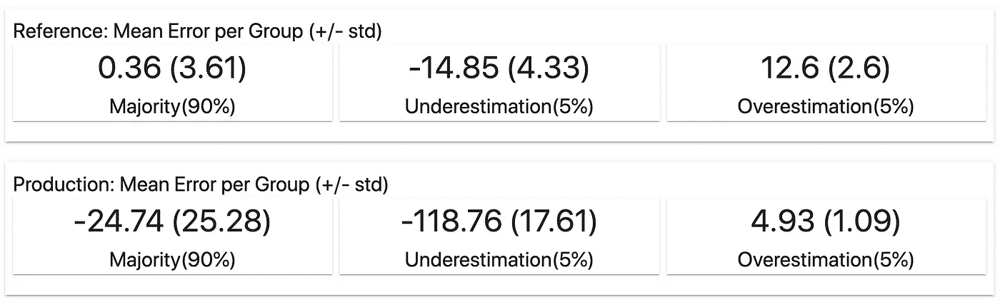**

**显然报道截图。**

**误差偏差表给出了更多细节。**

**我们按“范围%”字段对其进行排序。如果特定特性的值在模型低估或高估的组中显著不同，则该特性将排名靠前。**

**在我们的例子中，我们可以看到极端误差取决于“temp”(温度)和“atemp”(类似感觉的温度)特性。**

**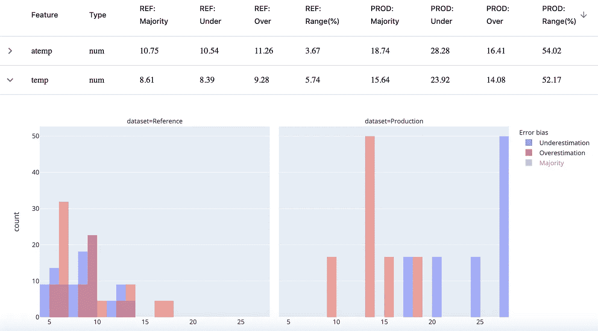**

**显然报道截图。**

**在训练中，情况并非如此。我们在不同的温度下有各种各样的误差，没有一致的模式。**

> **经过快速分析后，我们对模型性能及其缺点有了更具体的了解。这款车型面临新的、异常高的需求。鉴于它是如何被训练的，它倾向于低估它。最重要的是，这些错误根本不是随机的。至少，它们与我们观察到的温度有关。越高，低估越大。**
> 
> **它提出了与天气相关的新模式，这是模型以前无法学习的。天气变暖了，模特变得不听话了。**

**如果我们运行目标漂移报告，我们还会看到特征和目标之间的线性相关性的相关变化。温度和湿度很突出。**

**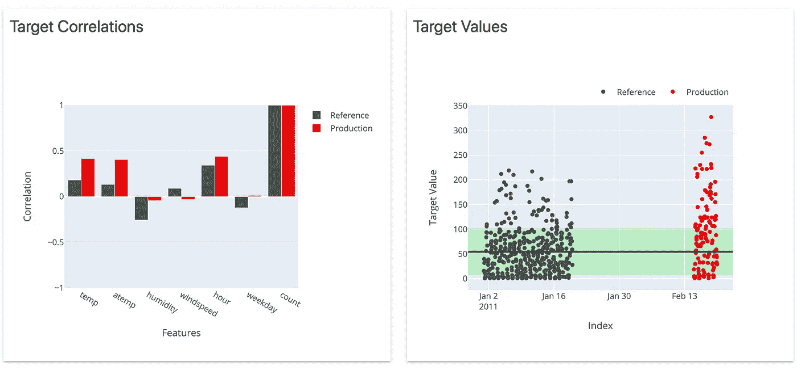**

**显然报道截图。**

****在这一点上，这个模型似乎毫无用处。**这是一个生动的例子，说明在有限的数据集上训练的模型无法捕捉季节模式。**

**我们应该尽快重新训练，并经常这样做，直到我们学会所有的模式。如果我们对频繁的重新训练感到不舒服，我们可能会选择一种更适合时间序列或者在外推方面更好的算法。**

# **打破之前:数据和预测漂移**

**在实践中，一旦我们收到地面真相，我们确实可以迅速纠正航向。如果我们在第一周之后重新训练这个模型，它可能不会戏剧性地结束。**

****但是如果我们没有可用的基本事实呢？**我们能提前捕捉到这样的衰变吗？**

**在这种情况下，我们可以[分析数据漂移](https://evidentlyai.com/blog/evidently-001-open-source-tool-to-analyze-data-drift)。我们不需要实际数据来计算误差。相反，我们的目标是查看输入数据是否发生了变化。**

**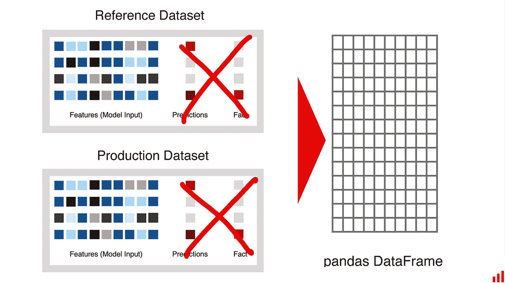**

**图片作者。**

**再一次，让我们比较生产的第一周和我们在培训中的数据。**

**当然，我们可以看看我们所有的特征。但我们也可以得出结论，分类特征(如“季节”、“假日”和“工作日”)不太可能改变。我们只看数字特征！**

**我们指定这些特性，以便工具应用正确的统计测试。在这种情况下是 Kolmogorov-Smirnov。**

```
column_mapping = {}
column_mapping['numerical_features'] = numerical_features
```

**然后，我们将所选期间的漂移报告称为:**

```
data_drift_dashboard = Dashboard(reference, production.loc['2011-01-29 00:00:00':'2011-02-07 23:00:00'], 
column_mapping=column_mapping, tabs=[DriftTab])
```

**一旦我们显示了报告，它就会返回一个答案。我们可以看到，在第一周，特征分布已经有了统计上的变化。**

**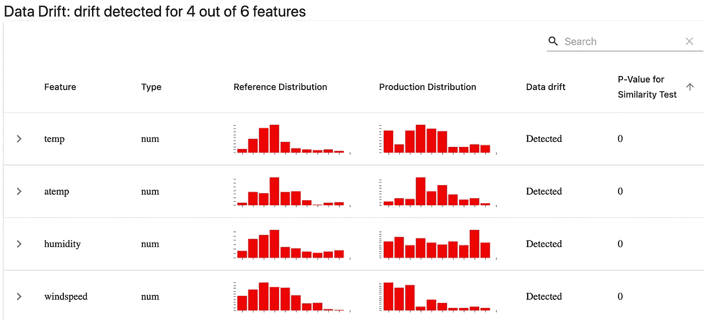**

**显然报道截图。**

**让我们放大我们通常的怀疑——温度。**

**该报告为我们提供了关于特征分布如何随时间演变的两种观点。我们可以注意到观测到的温度是如何一天比一天高的。**

**这些值明显偏离了我们在培训中看到的绿色通道(平均值的一个标准差)。看着稳定的增长，我们可以怀疑有上升的趋势。**

**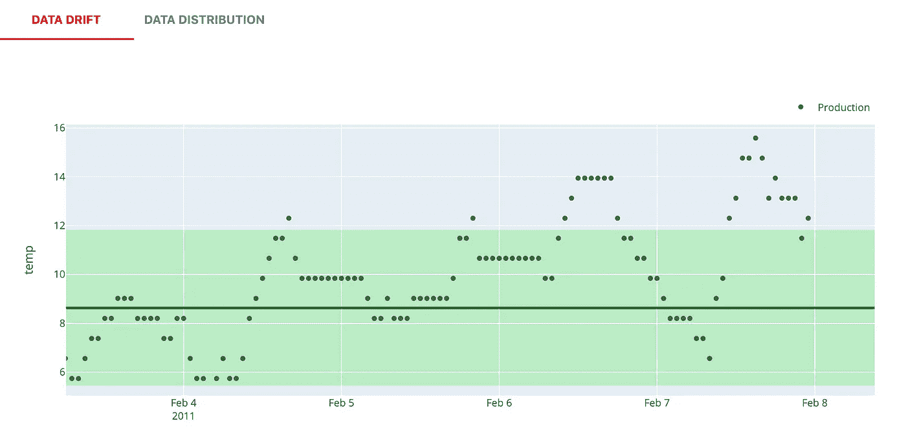**

**显然报道截图。**

**在这个情节中，我们也看到:天气变暖了。这不是我们的模型所习惯的！**

**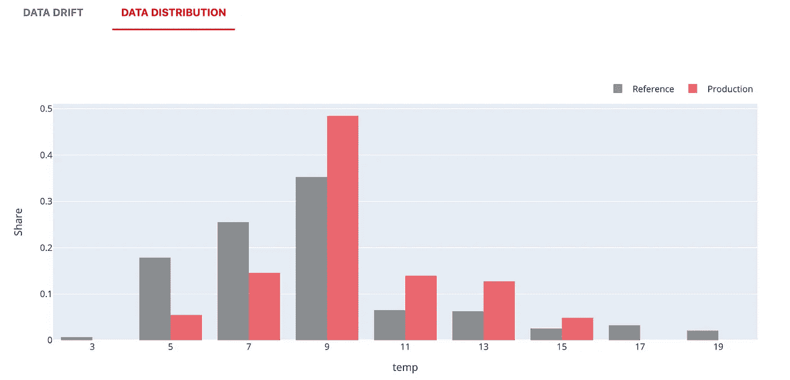**

**显然报道截图。**

**正如我们之前所检查的，在第一周之后，我们没有发现模型预测的漂移。鉴于我们的模型不擅长外推，我们不应该真的期待它。**

**这种预测漂移可能仍然会发生，并发出诸如输入数据损坏之类的信号。否则，如果我们有一个更敏感的模型，我们会观察它。**

**尽管如此，数据漂移本身就提供了出色的早期监控，可以检测到变化并对其做出反应。**

# **结束语**

**频繁的再培训是解决生产模型维护的一种方法。监控和可观察性增加了一层来保证模型质量。**

**为什么要把它包含在我们的工作流程中？**

*   **它加快了调试的速度。无论何时你的模型失败，你都需要找出根本原因。预建的仪表板使它更快。**
*   ****它详细地展示了性能。**如果在交叉验证中仅依赖于总体模型性能，可能会掩盖重要的模式。您的模型可能会在特定部分无声地失败，需要重新构建。**
*   ****它有助于改进模型**。您可以探索模型在哪里以及如何出错。它有助于确定最佳的模型体系结构、再培训计划、为特征工程产生想法。或者，向您的主题专家提出正确的问题。**
*   **它让你变得积极主动。数据输入的变化可能是模型质量的领先指标。我们希望在问题导致模型失败之前抓住它们。**

# **我能为我的模型做同样的事情吗？**

**当然啦！转到 [Github](https://github.com/evidentlyai/evidently) 或 **pip 安装显然**能够为您的模型生成这些报告。**

***最初发表于*[*https://evidentlyai.com*](https://evidentlyai.com/blog/tutorial-1-model-analytics-in-production)*并与* [*埃琳娜·萨穆伊洛娃*](https://www.linkedin.com/in/elenasamuylova/) *合著。***

***At 显然 AI，我们构建* [*开源工具*](https://github.com/evidentlyai/evidently) *来分析和监控机器学习模型。***

**想留在圈子里吗？ [*报名*](https://evidentlyai.com/sign-up) *获取我们的更新和产品消息，关注上*[*Twitter*](https://twitter.com/EvidentlyAI)*和*[*Linkedin*](https://www.linkedin.com/company/evidently-ai/)*获取更多关于生产机器学习的内容，或者加入我们的* [*Discord 社区*](https://discord.gg/xZjKRaNp8b) *进行聊天和联系。***