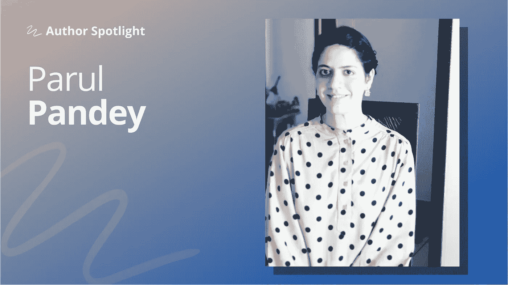

# 作为一名数据科学家，如何打破孤岛并找到社区

> 原文：<https://towardsdatascience.com/how-to-break-down-silos-and-find-community-as-a-data-scientist-c9c8c862f30e?source=collection_archive---------21----------------------->

## [作者聚焦](https://towardsdatascience.com/tagged/author-spotlights)

## "我决定把我的努力集中在我的能力上，而不是我的缺点上。"

*在 Author Spotlight 系列中，TDS 编辑与我们社区的成员谈论他们在数据科学领域的职业道路、他们的写作以及他们的灵感来源。今天，我们很兴奋地分享* [*帕鲁尔·潘迪*](https://medium.com/u/7053de462a28?source=post_page-----c9c8c862f30e--------------------------------) *与* [*本·胡伯尔曼*](https://medium.com/u/e6ad8abedec9?source=post_page-----c9c8c862f30e--------------------------------) *的对话。*

照片由 Parul Pandey 提供

[Parul](https://pandeyparul.medium.com/?source=user_popover) 目前在 [H2O.ai](https://www.h2o.ai/) 工作，这是一家总部位于加州的基于自动机器学习的初创公司。在学术上，她是一名电气工程师，之前在印度塔塔电力公司从事配电领域的工作。她还是[女性编码&数据科学(WiCDS)](https://www.wicds.org/) 的创始人，这是一个非营利组织，旨在支持和促进数据科学、机器学习和人工智能领域的女性和性别少数群体。Parul 也是笔记本类别的 [Kaggle 大师](https://www.kaggle.com/parulpandey)，并且是 2019 年 Linkedin 软件开发类别的[顶级声音之一](https://www.linkedin.com/pulse/linkedin-top-voices-2019-software-development-daniel-bean/)。

## 你是如何决定进入数据科学的，更具体地说，是如何进入你目前专注的数据科学领域的？

我的数据科学之旅非常有趣。我是一名电气工程师；毕业后，我在印度首都的一家电力公司工作。我的日常工作围绕着电力变压器、电网和变电站。然而，幸运的是，我有机会在一个叫做高级计量基础设施(AMI)的电子仪表部门工作，在那里我们将筛选海量的电子仪表数据，以识别仪表中潜在的欺诈或故障。对我来说，这是一个改变人生的时刻，因为我开始看到数据可以给任何企业带来的巨大价值。我开始研究，实际上打开了潘多拉的盒子，尽管是以一种积极的方式。

当时，我并不知道有一个叫做数据科学的领域。我想知道我是否能适应，或者像我这样有经验的人是否能给这个领域带来价值。大约在那个时候，我休了一次产假，我想，那决定了我的命运。这给了我时间思考我的未来。最终，我大胆地辞去了工作。我和一个小家伙在一起，没有工作，没有睡眠，还有很多东西要学。回到基础，从零开始研究一切，既具有挑战性，同时又令人兴奋。我有编程和数学背景，所以这是一个额外的收获。在经历了学习、遗忘、失败、成功和拒绝的阶段后，我改变了职业生涯的轨迹。

我目前在 [H2O.ai](https://www.h2o.ai/) 工作，是一家自动化机器学习公司。我们的目标是通过让每个人，而不是少数人，都能获得机器学习的力量，来实现机器学习的民主化。

## 回顾那次转变，你不得不面对什么样的挑战或障碍？

有很多，我相信这对于从非计算机科学背景过渡到数据科学的人来说是很常见的。最大的问题是打入这个领域。公司想要有一些机器学习经验的候选人，不幸的是，我们没有。不管我们的简历有多好，不管我们准备为这份工作付出多少努力，我们就是达不到要求。这既令人沮丧又危险。许多公司以提供经验为借口，剥削应聘者，让他们免费工作。这种不正之风在这个领域很普遍，我也是受害者。

在经历了类似的痛苦经历后，我不再申请任何角色。相反，我决定把努力的重点放在自己的能力上，而不是缺点上。我从孤岛中走出来，开始参与社区活动。我意识到像我一样的其他人也在同一条船上航行。这些约定慢慢变成了聚会和网络研讨会。我开始在像 [LinkedIn](https://www.linkedin.com/in/parulpandeyindia/) 和 [Twitter](https://twitter.com/pandeyparul) 这样的平台上与人们接触。最后，写作是缺失的部分。它给了我发言权、知名度和信心，让我在数据科学领域扬名立万。

## 你最喜欢现在这个角色的哪一点？这些天你倾向于做什么项目？

作为 H2O.ai 的数据科学布道者，我的角色通常位于数据科学和社区的交叉点。一方面，我致力于人工智能领域的一些最新技术，另一方面，我也可以与社区互动。我喜欢创造关于数据科学的意识，尤其是 H2O.ai 的产品。正如盖伊·川崎所说，“*福音不是一个职位；这是一种生活方式。”*

我的工作需要很多自我意识和在角色中延伸和成长的意愿。我认为自己很幸运能在这个领域工作，并通过我的工作感动了许多人。

除此之外，我还参与为女性和弱势群体建立社区。我和他们经历了同样的挑战，我想用我的知识来帮助他们。作为[wics](https://www.linkedin.com/company/68521118/admin/)的一部分，我们[几个月前组织了一次博客聚会](https://www.linkedin.com/posts/parulpandeyindia_wicdss-data-science-and-machine-learning-activity-6746406566687203328-eKpl/)，唯一的目的是[鼓励人们写](https://medium.com/wicds/wicdss-data-science-and-machine-learning-blogathon-7472f98c1776)。

我们还与政府机构一起组织了辅导会议，帮助指导女大学生。我们鼓励他们[和他们的导师](https://www.linkedin.com/posts/parulpandeyindia_wicds-female-mentors-activity-6730484655033749504-vtzM/)一起创建项目，这样他们就能理解构思、创新、创造和思考的重要性。

除此之外，[我们还定期组织网络研讨会](https://www.youtube.com/playlist?list=PLu7C4CdT4qvhZKG_MmaeWgJDoCZ6785YO)，以便社区了解行业动态。此外，这也为演讲者提供了一个磨练公开演讲技巧的平台。

由于印度的疫情局势，我们不得不后退一步，但事情正在解决，我们将重新启动一些其他举措。

## 你之前提到过公共写作——是什么激励你开始写作的，它与你的其他职业活动有什么关系？

老实说，我从未想过我会公开写作。已经有杰出的作家了，为什么还有人读我的文章？这些想法使我在相当长的一段时间里不敢写作。忘掉写作；我甚至对在社交媒体上公开发布东西都很谨慎。然后，在 2018 年，我发布了我的第一条标注为[吴恩达](https://twitter.com/AndrewYNg?ref_src=twsrc%5Egoogle%7Ctwcamp%5Eserp%7Ctwgr%5Eauthor)的推文，令我完全惊讶的是，他不仅转发了这条推文，还在他的时事通讯中做了专题报道。这很有趣，很快我的追随者开始增加。这对我是一个很大的教训。我意识到将你的作品公之于众是多么重要。

然后我用我的文章做实验。我在 Medium 上发表了几篇博文，但反响不太好。反馈是冠军的早餐，对我来说，我一点也没有。然后慢慢地，事情开始好转。媒体上的出版物开始找我投稿。通过出版物发布突然成倍增加你的访问者数量。不久之后，我开始从人们那里得到关于我下一步应该写什么或者应该涵盖哪些主题的建议。这让事情有了转机，我的作家生涯开始了。写作的美妙之处在于它很充实，很有收获。即使在今天，当我写完一篇文章并点击发表按钮时，也会带来一种愉快的成就感。

写作也是我在 H2O.ai 工作中不可或缺的一部分。事实上，我们都非常鼓励写作，因为我们相信“内容为王”的哲学我们经常更新软件，发布新产品和新的解决方案，我们通过博客和文章告知公众。除了我为 H2O 写的技术文章，我还经营着一个 Kaggle Grandmaster 系列，在那里我在 H2O.ai 上展示了[老牌数据科学家和 ka ggle grand master](/meet-the-data-scientist-who-just-cannot-stop-winning-on-kaggle-dfc0e6fe88f8)的故事，他们分享了他们的旅程、灵感和成就。

</meet-the-data-scientist-who-just-cannot-stop-winning-on-kaggle-dfc0e6fe88f8>  

当人们因为我写的一篇文章而联系我时，这种感觉尤其强烈。仅仅通过写作这个媒介，我就和许多不同国籍的人建立了联系。

## 展望未来，你希望在数据科学和人工智能社区中看到什么样的变化？

与几年前不同的是，今天许多来自不同领域和背景的人正在涉足数据科学。这是积极的一步。

数据科学是一个多样化的领域。因此，将不同性别、背景和种族的人聚集在一起更有意义。这样，我们可以带来更多的创造力，让知识、发现和创新蓬勃发展。这需要社会的共同努力，使多样性和包容性成为生态系统的重要组成部分。

除此之外，我希望看到更多来自企业界的“有益的数据科学”倡议。数据有很大的力量，社会的很大一部分可以从中受益。疫情告诉我们，财富不平等正在加剧，并且影响到我们所有人。因此，作为一个社会，我们应该站出来，用我们的技能和技术来帮助那些有需要的人。数据科学应该用于社会公益事业，重要的是要超越利润，把社会作为一个整体来考虑。

想了解更多关于 Parul 与 H2O.ai、WiCSD 和 beyond 的工作和项目吗？在[媒体](https://pandeyparul.medium.com/)、[推特](https://twitter.com/pandeyparul)、 [LinkedIn](https://www.linkedin.com/in/parulpandeyindia/) 上关注她。

以下是 Parul 在*上关于数据科学的深度档案中一些我们最喜欢的帖子。*它们包括入门指南和实践教程、采访以及对高级主题的深入探讨。

*   "[通过三个简单的步骤自动化您的数据科学项目结构](/automate-your-data-science-project-structure-in-three-easy-steps-277c92328d24)(2021 年 6 月，TDS)
    了解如何快速高效地简化您的数据科学代码存储库和工具。
*   "[理解梯度下降背后的数学](/understanding-the-mathematics-behind-gradient-descent-dde5dc9be06e)"(2019 年 3 月，TDS)
    机器学习中常用的优化算法之一背后的简单数学直觉。
*   "[我使用 Keras 进入深度学习的旅程](/my-journey-into-deeplearning-using-keras-part-1-67cbb50f65e6)(novembr 2018，TDS)
    在 Keras 中从头开始构建和训练神经网络的介绍。
*   "[使用 H2O 可视化大型数据集](/visualizing-large-datasets-with-h2o-ffe9af40371b)"(2020 年 11 月，TDS)
    了解如何使用 H2O 聚合器函数有效地减少数据的大小。
*   "[极客女孩崛起:神话还是现实](/geek-girls-rising-myth-or-reality-81e1897433c8)"(2019 年 12 月，TDS)
    对 2019 年 Kaggle ML 和 DS 关于机器学习和数据科学领域女性代表性调查的分析。
*   "[Python 中函数式编程的元素](/elements-of-functional-programming-in-python-1b295ea5bbe0)"(2019 年 7 月，TDS)
    学习如何使用 Python 中的 lambda、map、filter 和 reduce 函数来转换数据结构。

请继续关注我们即将推出的下一位专题作者。如果你对你想在这个空间看到的人有建议，请在评论中给我们留言！