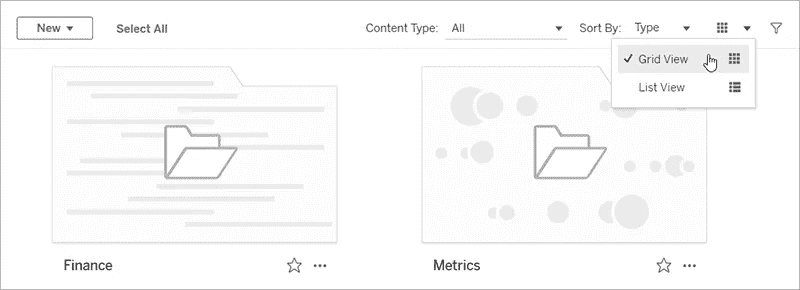
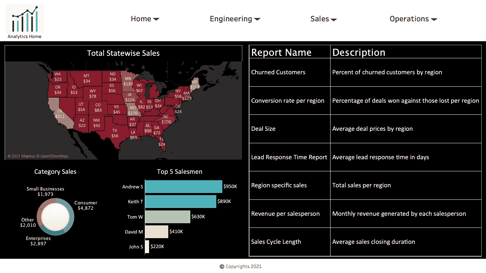
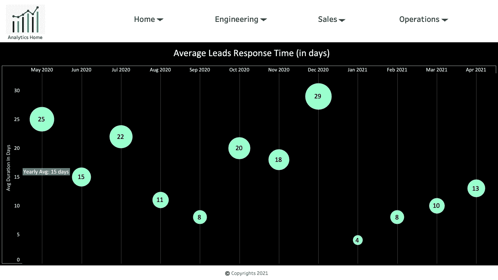
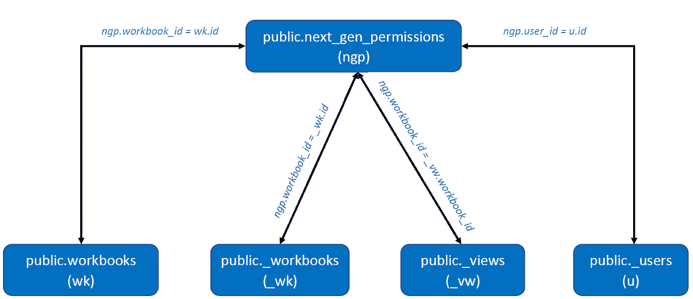

# 如何为所有 Tableau 仪表板构建中央仪表板

> 原文：<https://towardsdatascience.com/how-to-build-a-central-dashboard-for-all-your-tableau-dashboards-f6831acc5701?source=collection_archive---------20----------------------->

## 为所有 Tableau 服务器仪表板创建一个简单的类似网站的界面

对于那些日复一日发布 Tableau 仪表板并在 Tableau 服务器上发布了数百个仪表板的人来说，要知道使用 Tableau 的开箱即用文件导航系统来浏览它们可能有点麻烦和乏味。如果您想创建一个报告界面，为您的用户提供类似于访问所有 Tableau 仪表板的网站的体验，这里有一种方法可以实现。

来源:[https://www . Reddit . com/r/noisygifs/comments/1 krhxe/you _ just _ blow _ my _ mind/](https://www.reddit.com/r/noisygifs/comments/1krhxe/you_just_blew_my_mind/)

我们先了解一下，把手头的问题分解一下。当 Tableau 开发人员将仪表板发布到 Tableau 服务器时，每个仪表板都会获得一个唯一的 url。当您与同事分享这些链接时，他们会将它们加入书签以供将来参考。随着你不断分享更多的链接，你很快就会意识到这种协作方式很难管理和跟踪。如果所有用户都没有查看所有仪表板的权限，这将变得更加困难。拥有一些具有深入查看功能的仪表板可能是一个潜在的解决方案，但是如果您有超过 50 个仪表板呢？将所有用户集中到一个中心链接来访问所有报告会更加方便用户。它还可以帮助您将报告产品化。

Tableau 的开箱即用解决方案部分解决了这个问题。您的用户可以使用 Tableau 的文件夹结构在仪表板之间导航。然而，这种体验仍然缺乏用户访问一个中央仪表板的技巧，比如网站的主页，然后根据需要转到其他仪表板。当您的用户群渴望通过一次点击操作来查看主控制面板，以便在深入查看具体报告以了解更多详细信息之前快速了解团队的整体健康状况时，这一点尤为重要。

Tableau 服务器文件夹结构。来源:[https://community . tableau . com/s/question/0d 54t 00000 c 6 BIH/folder-structure](https://help.tableau.com/current/pro/desktop/en-us/navigating.htm)

**构建您的报告应用程序**

Tableau Server 附带了一个存储库，用于存储用户、组、项目、工作簿名称、描述、视图 URL 和其他相关数据。我们将使用这个存储库来构建我们的主仪表板，它将充当您的应用程序的*主页*。

下面是主页的图像。我们将尝试创建顶部导航菜单和该仪表板的右侧，该仪表板以表格结构包含每个出现在 Tableau 服务器上的报告。

作者图片

用户可以单击任何报告，在单独的选项卡中查看其全部详细信息。下面就是一个这样的例子。通过随时访问顶部导航，他们可以随时导航到主页。

作者图片

主页将只是我们将创建的另一个 Tableau 仪表板，它将包括服务器上所有报告的列表。这些信息包括报告名称、描述(表格格式)以及发布报告的文件夹(顶部导航)。单击报告描述，查看者将被带到相应的报告 URL。每个用户只能看到他们有权访问的视图。

**访问 Tableau 存储库**

Tableau 存储库是一个 PostgreSQL 数据库，可以从 Tableau Desktop 访问。只有 Tableau 管理员可以访问 Tableau 服务器存储库。默认情况下，Tableau 服务器存储库有两个用户— *tableau* 和 *readonly* 。用户 *tableau* 可以访问几个数据库视图，这些视图可用于分析服务器活动。 *readonly* 可以访问额外的数据库表。尽管这两个用户已经可以在 Tableau 上使用，但是他们没有设置密码。要访问 Tableau 服务器存储库，只需启用对数据库的访问并为 *readonly* 用户设置密码。可以使用 TSM 命令并重新启动 Tableau 服务器来设置密码。

您将需要下表来访问服务器上发布的工作簿，获取它们的说明，并查看有权访问它们的用户。[这里是](https://tableau.github.io/tableau-data-dictionary/2021.1/data_dictionary.htm?_fsi=MTvqMjo2)完整的 Tableau 存储库数据字典。

public.workbooks —此表保存代表服务器上存在的工作簿的每条记录。出于这个用例的目的，我们需要*名称*和*描述*列。

公共的。_workbooks —此表中的每条记录都包含有关服务器上工作簿的更多详细信息。我们需要这个表中的*项目名称*和*项目 id* 列。

公共的。_views —此表中的每条记录都包含工作簿中的一个视图。我们需要这个表中的 *view_url* 列。

公共的。_users —此表包含与用户相关的信息。我们需要这个表中的*名称*列。

public.next _ gen _ permissions 保存他们有权访问的用户和工作簿/视图的信息。使用 *authorizable_id* 和 *grantee_id* 列，我们将知道有权访问各自工作簿视图的用户/组。 *authorizable_type* 描述被指定权限的事物。对象可以是“项目”、“工作簿”、“数据源”、“视图”或“NamedResource”。 *grantee_type* 描述谁被授予了权限；*用户*或*组*。对于这个用例，我们将假设访问是在*用户*级别提供的。

现在我们知道了所有需要的表，让我们看看如何连接这些表。下图描述了它们之间的关系:

作者图片

**创建顶部导航**

您可以使用 public 的 project_name 列中的文件夹名(或项目名)来构建它。_ 工作簿表。在“行”工具架中拖动“项目名称”列，并在“标记”工具架中选择一个看起来像下拉箭头的自定义形状。阅读[本](https://www.tableau.com/drive/custom-shapes#:~:text=To%20select%20additional%20shapes%2C%20click,name%20it%20an%20informative%20name.)了解定制形状的更多详情。

尝试构建一个像这样的 Tableau 报告界面，以提高您的仪表板的可见性和吸引力。

特别感谢 [Sheeraja Rajakrishnan](https://medium.com/u/234a0c81aeb1?source=post_page-----f6831acc5701--------------------------------) 合作撰写这篇博客。你可以在 https://sheerajarajakrishnan.wordpress.com/阅读更多她的博客。