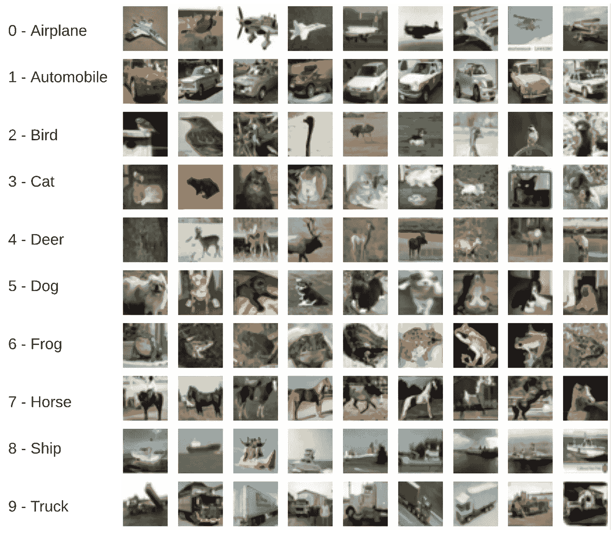
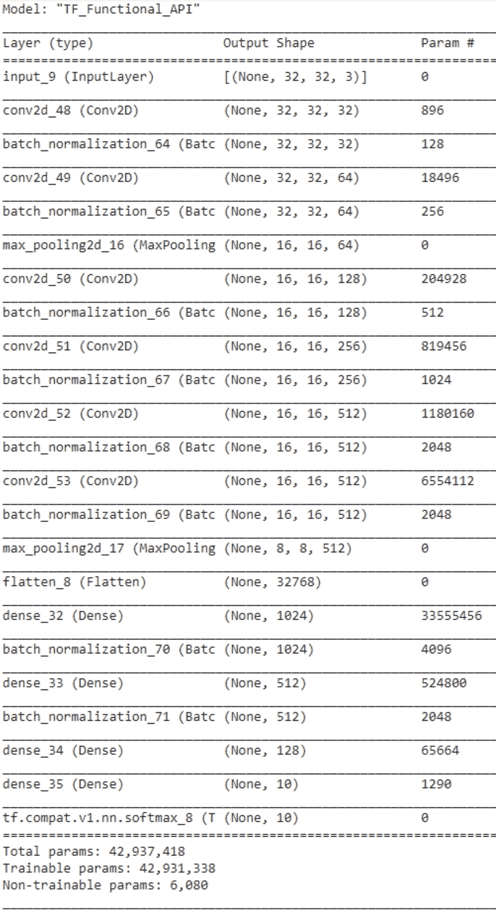
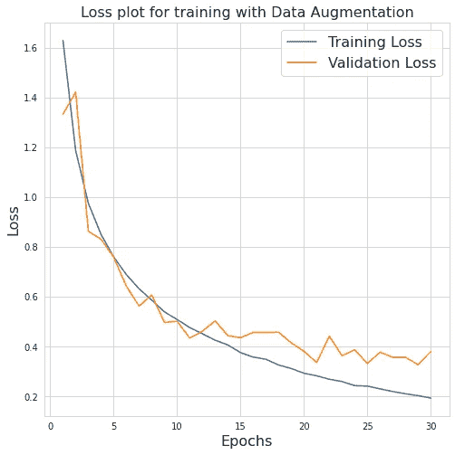
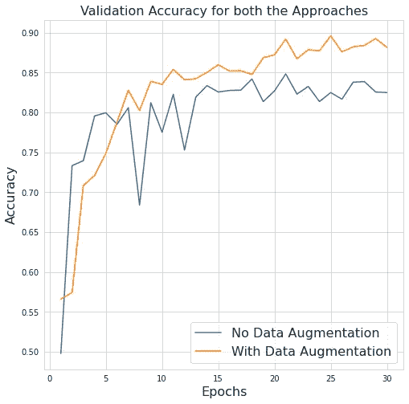

# 如何使用 tf.keras 为图像分类从零开始构建卷积神经网络

> 原文：<https://towardsdatascience.com/how-to-build-a-convolutional-neural-network-from-scratch-using-tf-keras-for-image-classification-ee4482de8453?source=collection_archive---------31----------------------->

## Keras 中的影像分类实践教程



作者对 CIFAR-10 类的可视化

> 在本文中，我们将使用 tf.keras 的函数 API 逐层构建一个卷积神经网络，接下来，我们将探索并集成 keras 中 ImageDataGenerator 类提供的数据增强技术。

***TF . keras 是什么？***

*   [**tf.keras**](https://www.tensorflow.org/api_docs/python/tf/keras) 是 TensorFlow 对 Keras API 的实现。
*   Keras 需要一个后端来训练定制的神经网络。在从 v1.1.0 开始切换到 [TensorFlow](https://www.tensorflow.org/) 之前，它使用[theno](https://github.com/Theano/Theano)作为其默认后端。

本教程还提供了一个 Google Colab 笔记本，供您亲身体验。

我们将使用 [**CIFAR-10**](https://www.cs.toronto.edu/~kriz/cifar.html) 数据集，这是图像分类任务的常用基线。CIFAR-10 数据集是 60000 幅大小为 32x32 的 RGB 图像的集合。它由 10 个类组成，每个类有 6000 个图像。有 50000 幅图像可用于训练，还有 10000 幅测试图像。

让我们开始吧。

导入必要的库-

```
import numpy as np
from tensorflow.keras import *
from keras.preprocessing.image import ImageDataGenerator
import matplotlib.pyplot as plt
import seaborn as sns
```

# 1.数据准备

正在下载 CIFAR-10 数据集-

```
(X, y), (test_X, test_y) = datasets.cifar10.load_data()
```

在可用于训练的 50000 幅图像中，我们将使用 3000 幅图像创建一个验证集，并使用剩余的 47000 幅图像进行训练。

```
train_X = X[:47000]
train_y = y[:47000]
val_X = X[-3000:]
val_y = y[-3000:]
```

# 2.模型架构

我们将使用 TensorFlow [**功能 API**](https://www.tensorflow.org/guide/keras/functional) ，因为与顺序 API 相比，它为我们提供了对每一层的更多控制和访问。

**(Conv2D→batch norm→Conv2D→batch norm→Maxpooling2D)* 3 →( Dense→batch norm)* 3→soft max**

我们将使用的图层-

*   [**Input()**](https://www.tensorflow.org/api_docs/python/tf/keras/Input)**实例化一个符号张量对象**
*   **[**Conv2D()**](https://www.tensorflow.org/api_docs/python/tf/keras/layers/Conv2D) 创建一个与层输入卷积的内核。我们将使用它来执行图像的空间卷积。**
*   **[**【batch normalization()**](https://www.tensorflow.org/api_docs/python/tf/keras/layers/BatchNormalization)**层**，**在训练时使用当前输入批次的均值和标准差，而在推断时使用训练时看到的批次均值和标准差的移动平均。****
*   ******MaxPooling2D()** 用于 2D 空间数据的池化操作****

*   ****[**Dense()**](https://www.tensorflow.org/api_docs/python/tf/keras/layers/Dense) 图层是一个常规的 NN 图层，可以在方法本身中添加激活和正则化选项。****
*   ****[**softmax()**](https://www.tensorflow.org/api_docs/python/tf/keras/activations/softmax) 应用 softmax 激活功能****

****选择合适的核大小、步长和填充是设计卷积神经网络的重要参数。斯坦福大学的 [**CS231n**](https://cs231n.github.io/convolutional-networks/) 指南为这些参数选择合适的值提供了一个美丽的直觉，并解释了如何确定每层之后的输出尺寸。****

```
**input = Input(shape=(32, 32, 3))x = layers.Conv2D(32, (3,3), activation='relu',padding='same')(input)x = layers.BatchNormalization()(x)
x = layers.Conv2D(64, (3,3), activation='relu',padding='same')(x)
x = layers.BatchNormalization()(x)
x = layers.MaxPooling2D(2)(x)x = layers.Conv2D(128, (5,5), activation='relu',padding='same')(x)
x = layers.BatchNormalization()(x)
x = layers.Conv2D(256, (5,5), activation='relu',padding='same')(x)
x = layers.BatchNormalization()(x)x = layers.Conv2D(512, (3,3), activation='relu',padding='same')(x)
x = layers.BatchNormalization()(x)
x = layers.Conv2D(512, (5,5), activation='relu',padding='same')(x)
x = layers.BatchNormalization()(x)
x = layers.MaxPooling2D(2)(x)x = layers.Flatten()(x)
x = layers.Dense(1024, activation='relu')(x)
x = layers.BatchNormalization()(x)
x = layers.Dense(512, activation='relu')(x)
x = layers.BatchNormalization()(x)
x = layers.Dense(128, activation='relu')(x)
x= layers.Dense(10)(x)output= activations.softmax(x)model = Model(inputs=input, outputs=output,name="TF_Functional_API")model.summary()**
```

****每层涉及的参数数量和层输出的尺寸可以用[](https://www.tensorflow.org/api_docs/python/tf/keras/Model#summary)****()**方法查看。******

********

****Keras 中用于模型训练和评估的 3 种主要方法是 ***编译*** 、 ***拟合、*** 和 ***评估*** 。TensorFlow 为这些方法中的每一种提供了 [**综合指南**](https://www.tensorflow.org/api_docs/python/tf/keras/Model#methods_2) 。****

*****一些超参数-*****

*   ****损失函数→ [稀疏分类交叉熵](https://www.tensorflow.org/api_docs/python/tf/keras/losses/SparseCategoricalCrossentropy)****
*   ****优化器→ [亚当](https://keras.io/api/optimizers/adam/)****
*   ****学习率→ 0.001****
*   ****批量→ 64****
*   ****纪元→ 30****

# ****3.运行我们的模型(没有数据扩充)****

```
****model.compile**(loss=losses.SparseCategoricalCrossentropy(),optimizer=optimizers.Adam(learning_rate=0.001),metrics=['accuracy'])**model.fit**(train_X, train_y.flatten(), batch_size=64, epochs=30, validation_data=(val_X,val_y.flatten()))**model.evaluate**(test_X, test_y.flatten(), verbose=2)**
```

****该模型在测试集上给出了 81.59 %的准确率。****

****fit 方法返回一个“History”对象，其中属性“History.history”是各个时期的训练和验证指标(损失和准确性)的字典。因此，它维护一个日志，该日志可用于可视化这些指标，我们将在后面看到。****

# ****4.使用 ImageDataGenerator 类的数据扩充****

****现在，我们将看到如何使用数据增强技术来提高我们的模型的准确性。数据增强有助于防止*过度拟合*，并帮助神经网络模型更好地概括测试图像的未知变化。归一化、水平翻转、微小旋转、调整大小是最常用的增强技术。****

****我们将在 Keras 中使用[**imagedata generator**](https://keras.io/api/preprocessing/image/)类。它为输入图像提供了一系列的变换，我们可以很容易地将它们合并到我们的训练中。****

```
**datagen_train=ImageDataGenerator(featurewise_center=True,
                                featurewise_std_normalization=True, 
                                rotation_range=20,
                                width_shift_range=0.2,
                                height_shift_range=0.2,
                                horizontal_flip=True)% For testing and validation set, we just normalize the images
datagen_test=ImageDataGenerator(featurewise_center=True,
                               featurewise_std_normalization=True)datagen_train.fit(train_X)
datagen_test.fit(val_X)
datagen_test.fit(test_X)**
```

****培训和评估-****

```
**model.compile(loss=losses.SparseCategoricalCrossentropy(),optimizer=optimizers.Adam(learning_rate=0.001),metrics=['accuracy'])model.fit(datagen_train.flow(train_X, train_y.flatten(), batch_size=64), steps_per_epoch=len(train_X) / 64, epochs=30, validation_data=datagen_test.flow(val_X, val_y.flatten(), batch_size=64))model.evaluate(datagen_test.flow(test_X, test_y.flatten(), batch_size=1), verbose=2)**
```

****我们达到了 88.30 % 的测试精度，已经实现了大约 7%的提升****

# ****5.结果****

****这是训练进展的视觉化图像****

****************

# ****6.结论****

*   ****我们看到了一般的图像分类流程，从数据准备和可视化、模型设计、超参数选择、训练和评估开始。****
*   ****TensorFlow 中的 Keras API，尤其是函数式 API，使得用户设计神经网络非常方便。****
*   ****在训练中仅仅引入数据扩充就使模型的测试精度提高了约 7 %,从而证明了所讨论的技术的好处。****
*   ****我们使用 CIFAR-10 数据集进行演示，但是，该模板可以扩展到任何图像数据集。****
*   ****[**这里的**](https://www.pyimagesearch.com/2019/10/21/keras-vs-tf-keras-whats-the-difference-in-tensorflow-2-0/) 是一篇对 Keras 和 tf.keras 之间的主要差异进行广泛讨论的文章****

> ****代码可在 [**这里**](https://gist.github.com/Abhishek0697/147bcbde2eb7a8fba1841169a6435aa4) 进一步开发。****

# ****7.进一步探索****

****提高准确性的一些技巧:****

1.  ****使用具有跳过连接的架构，如 [**ResNet**](https://arxiv.org/abs/1512.03385) ，这些架构已被证明对图像表现良好。****
2.  ****我们可以用**迁移学习**。例如，加载在更大的相关数据集(如[](http://www.image-net.org/)**)上预先训练的模型，然后在我们的数据集上进行微调。由于大小和类别的相似性，预训练的 CIFAR-100 模型在 CIFAR-10 数据集上可能更有益。******
3.  ******调整使用的层和超参数。例如，SGD 优化器、更高的批量、改变过滤器尺寸和每层中的过滤器数量。******
4.  ******使用 [**学习率调度**](https://keras.io/api/optimizers/learning_rate_schedules/) 随着模型的学习，用历元衰减学习率。******
5.  ****使用正则化技术，如[](https://keras.io/api/layers/regularization_layers/dropout/)****和高级策略，如 [**CutMix**](https://arxiv.org/abs/1905.04899) **、** [**标签平滑**](https://www.pyimagesearch.com/2019/12/30/label-smoothing-with-keras-tensorflow-and-deep-learning/) **、** [**混合训练**](https://arxiv.org/pdf/1710.09412.pdf) 等。********

> ****注意:****
> 
> ****我们应该注意到，ResNet 模型最初是为更大尺寸的图像设计的。即来自 ImageNet 的 224x224。因此，它使用最大池操作和更高的卷积步长来降低层间图像的维度。因此，对于 CIFAR-10 图像，我们应该自己实现模型层，并相应地更改过滤器大小和步幅值。****