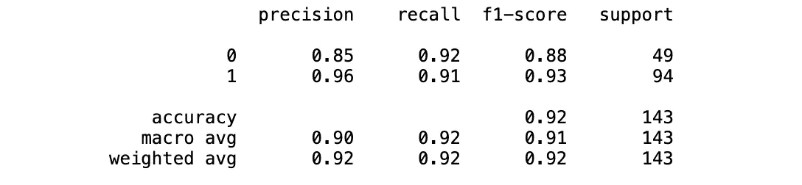
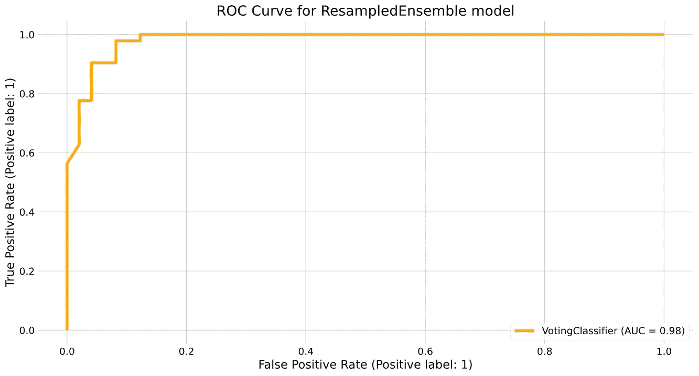
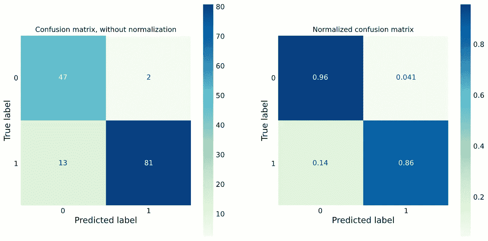

# 如何为 scikit-learn 构建自定义评估器

> 原文：<https://towardsdatascience.com/how-to-build-a-custom-estimator-for-scikit-learn-fddc0cb9e16e?source=collection_archive---------10----------------------->

## [实践教程](https://towardsdatascience.com/tagged/hands-on-tutorials)

## 为不平衡数据实现具有欠采样的定制集成模型

这篇文章将向您展示如何实现您自己的模型，并使其符合 scikit-learn 的 API。最终结果将是一个模型，不仅可以拟合和用于预测，还可以与网格搜索和管道等其他 scikit-learn 工具结合使用。

# 介绍

这个帖子可以追溯到几个月前。在我的一门机器学习课程中，我们讨论了不平衡数据的话题，以及当数据不平衡时，算法如何很难学习。对于我们的学习算法来说，我们试图预测的事件是如此罕见，以至于在提高评估分数的过程中，我们的模型很少会预测这一类别。我一接触到这个话题就知道它超级重要。我以前见过不平衡的数据，非常清楚现实生活不像玩具数据集那么容易。最能引起我共鸣的案例是预测客户流失。

总之，在我们的课堂上，我们看到了许多可以避免或试图缓解不平衡数据问题的方法，但有一个解决方案让我特别感兴趣:整体重采样。我们在听安德里亚斯·米勒的讲座。在这一节中，他提到了一篇论文“[针对类别不平衡学习的探索性欠采样](https://cs.nju.edu.cn/zhouzh/zhouzh.files/publication/tsmcb09.pdf)”。在本文中，作者描述了一种有趣的方法来改善不平衡数据集中的分类，他们称之为 EasyEnsemble。基本思想是使用欠采样来训练集成模型，每次重新采样，并组合集成的整体结果。这种模型的好处是减少了欠采样过程中丢弃的数据量。

# 构建模型

定制模型的具体实现在很大程度上取决于您试图扩展或构建的模型。如果你是从零开始，一个好的开始是 [BaseEstimator](https://scikit-learn.org/stable/modules/generated/sklearn.base.BaseEstimator.html) 。我们可以从为我们的模型构建类开始:

我们需要实现一些方法，但是首先，我们可以继续创建那个`__init__`方法。

此时，我们基本上只是传递所有的参数并将它们存储为属性。为了实现实际的模型，我们还需要做一些其他的事情。我们需要一种方法来生成合奏。为此，我们将定义一个函数来生成估计量:`_generate_estimators`。

该方法不接受任何参数，因为我们需要的所有数据都已经存储在实例的属性中。我们首先创建一个评估者列表。这将是我们的最终结果；评估者列表。估计器的数量由属性`self.n_estimators`决定，所以我们只在 for 循环中创建每个估计器。为了构建每个估计器，我们[克隆](https://scikit-learn.org/stable/modules/generated/sklearn.base.clone.html)的`self.base_estimator`，使用所有参数设置它，并用它制作一个管道。我们需要使用[不平衡学习的](https://github.com/scikit-learn-contrib/imbalanced-learn)管道( [docs](https://imbalanced-learn.org/stable/references/generated/imblearn.pipeline.make_pipeline.html) )而不是使用 scikit-learn 的管道，这样我们就可以进行欠采样。

现在我们可以回到`__init__`函数并生成这些估计量:

很好，现在拼图的最后一块是生成一个单独的估计，它对来自集合的结果做出决定。我们将使用[投票分类器](https://scikit-learn.org/stable/modules/generated/sklearn.ensemble.VotingClassifier.html)，它将获得估计器的结果，并使用[软投票](https://www.oreilly.com/library/view/machine-learning-for/9781783980284/47c32d8b-7b01-4696-8043-3f8472e3a447.xhtml)得出最终结论。

最后，我们需要实现一些其他的方法来实现这个功能，但是不要担心，这是最难的部分，剩下的就很简单了。

我们将实现`fit`、`predict`和`classes_`方法，我们将通过调用`VotingClassifier`方法来简单地委派责任。

最后但同样重要的是，我们需要实现一个`set_params`方法。正如在[文档](https://scikit-learn.org/stable/modules/generated/sklearn.base.clone.html)中提到的，这个函数是非常基本的，因为它在网格搜索中被用来更新模型的参数。在我们的例子中，这相当简单:

将所有这些放在一起，我们得到了自己的模型，可以与其他 scikit 模型和工具结合使用。我们可以在管道中使用它，进行网格搜索，并像其他模型一样对其进行评分。

剩下唯一要做的就是测试它！

# 使用模型

如果您将我们刚刚构建的类存储在一个`resampled_ensemble.py`文件中，导入您的模型就像下面这样简单:

从现在开始，它基本上就像一个 scikit-learn 模型，所以我们可以按通常的方式进行:

我们将实例化该模型，拟合它并检查它的执行情况:

适合我们的模型的分类报告

我们还可以绘制 ROC 曲线和混淆矩阵:

我们的重采样组件模型的 ROC 曲线

我们模型的标准化和绝对混淆矩阵

然而，我认为最好的部分是我们现在可以在管道和网格搜索中使用它:

# 结论

如您所见，为 scikit-learn 构建您自己的定制模型非常简单，同时还可以利用 scikit-learn 提供的其他工具。您可以构建任何您想要的模型，并且仍然能够将它与度量、管道和网格搜索一起使用。在这篇文章中，我展示了一个为不平衡数据实现模型的例子，但是可能性确实是无穷无尽的。例如，同样的方法可以用于在 scikit-learn 中实现概率编程的[贝叶斯模型。我想我们将不得不在以后的帖子中讨论它…](https://www.youtube.com/watch?v=zGRnirbHWJ8)

刘小燕，吴俊杰，周志宏(2008)。类别不平衡学习的探索性欠采样。 *IEEE 系统、人和控制论汇刊，B 部分(控制论)*， *39* (2)，539–550。

穆勒(2018)。高级 Scikit-learn，GitHub 资源库，[https://github.com/amueller/ml-training-advanced](https://github.com/amueller/ml-training-advanced)

米勒和圭多(2016 年)。*Python 机器学习简介:数据科学家指南*(第 1 版。).奥莱利媒体。