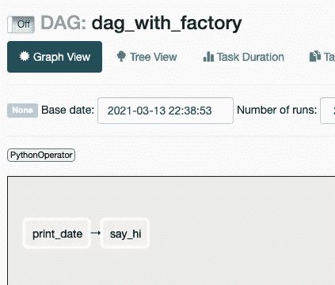

# 如何在气流上建造 DAG 工厂

> 原文：<https://towardsdatascience.com/how-to-build-a-dag-factory-on-airflow-9a19ab84084c?source=collection_archive---------2----------------------->

## 用一半代码构建高效 Dag 的指南


照片由[克里斯里德](https://unsplash.com/@cdr6934?utm_source=medium&utm_medium=referral)在 [Unsplash](https://unsplash.com?utm_source=medium&utm_medium=referral) 拍摄

# 为什么是达格工厂？

让我们看一个非常简单的 DAG，它有两个任务…

在 Airflow 上执行两个简单的 python 脚本所需的样板代码数量是不是很奇怪？不管你写了多少 Dag，你肯定会发现自己在很多不同的 Dag 中写了几乎所有相同的变量，只有微小的变化。

记住，在编码中，通常最好是**写一段你以后可以调用的代码，而不是每次你需要那个过程**时都写同样的代码。这就叫[干**干**干](https://en.wikipedia.org/wiki/Don%27t_repeat_yourself)。

如果您的许多 Dag 共享相似的值，例如*电子邮件地址*、*开始日期*、*计划间隔*、重试*次数*等等，那么最好有一段代码来实现这些值。这就是我们试图用工厂类实现的目标。

在 Airflow 上使用 DAG 工厂，我们可以**将创建 DAG 所需的线路数量减少一半**。

## 让我们看看下面的例子

这里，我们想要一个简单的 DAG，它打印今天的日期，然后打印“hi”。

这是它在气流上的样子:



注意我们减少了多少混乱。我们还没有指定使用什么操作符、任务的 id 是什么、计划间隔、谁创建了 DAG 以及它是何时创建的。

我们还可以看到，我们使用字典指定了任务和依赖项，并最终转化为正确的任务依赖项😄

让我们看一个稍微复杂一点的例子:

在这个 DAG 中，我指定了两个参数，我想从缺省值中覆盖它们。这些是 DAG 的所有者及其重试次数。我还在`get_airflow_dag()`方法中指定了我想要的每日日程表。

此 DAG 有 3 项任务。`say_bye()`和`print_date()`都依赖于`say_hi()`。让我们看看这在气流上是什么样子。


现在，让我们看看如何构建 DAG 工厂😃

# 怎么编码？

老实说，这很简单。我们首先创建一个类，它将包含我们需要运行的所有方法，以便创建一个包含其任务的 DAG。

下面是 DAG 工厂的完整代码。

为了获得完全可用的 DAG，我们将调用的主要方法是`get_airflow_dag()`。

该方法将接收两个强制参数:DAG 的名称和它应该运行的任务。其余的参数是可选的，因为我们可以在函数的实现中设置默认值。在实现时，根据您的用例，可以随意将这些可选参数设置为强制参数，例如，将 *cron* ( `schedule_interval`)设置为强制参数或者甚至是 DAG 的所有者可能会很有用。

`default_args`参数将是一个字典，保存您可能想要覆盖的任何键和值。如果未指定，将使用默认的 default_args。

在我们的例子中，缺省值是:

```
DEFAULT_ARGS = {
'owner': 'Data Engineer',
'depends_on_past': False,
'start_date': datetime(2021, 1, 1),
'email': ['data_engineers@company.com'],
'email_on_failure': True,
'email_on_retry': False,
'retries': 1,
'retry_delay': timedelta(minutes=5),
}
```

其他 3 个参数是用于描述 DAG 的主要参数。有更多的选项，所以请随意指定更多。

`get_airflow_dag()`将运行`create_dag()`来创建 DAG 对象并返回它。`add_tasks_to_dag()`稍微复杂一点，因为我们想让用户更容易指定一种方法来创建任务的依赖关系，而不必编写*操作符*。

在我们的例子中，我们总是使用 *PythonOperator* 来完成我们的任务，所以假设这是一种规范是有意义的。

该实现旨在方便数据工程师的工作，所以我们避免设置额外的东西，如任务的名称，我们只是假设它与函数的名称相同——所以我们使用一点点*反射*来解决它。

```
for func in tasks:
    task_id = func.__name__
    task = PythonOperator(
        task_id=task_id,
        python_callable=func,
        dag=dag
    )
    aux_dict[task_id] = taskfor func, dependencies in tasks.items():
    task_id = func.__name__
    for dep in dependencies:
        aux_dict[dep.__name__] >> aux_dict[task_id]
```

该函数首先创建一个辅助字典来保存 task name: task object 的键值对。这样做是为了只有一组任务对象，并在以后使用它来设置依赖关系。然后，对于最初提供的任务字典中的每个键，利用辅助字典来设置依赖关系。

完成后，DAG 对象就可以被团队返回和使用了🎉。

## 抓住你了。

文件中有一个小技巧，可以让 Airflow 识别出我们要返回的是一个正确的 DAG。

当 Airflow 启动时，所谓的 DagBag 进程将解析所有文件以查找 Dag。当前实现的工作方式是这样的:

*   dagBag 产生不同的进程，这些进程查看 Dag 文件夹中的文件。
*   这里称为`process_file` [的函数](https://airflow.apache.org/docs/apache-airflow/stable/_modules/airflow/models/dagbag.html)为每个文件运行，以确定那里是否有 DAG。
*   代码运行`might_contain_dag`，根据文件代码中是否包含“dag”和“airflow”返回 True。这里实现。

这就是为什么像这样调用函数`get_airflow_dag`的原因，以便在文件中包含两个关键字，这将导致文件被正确解析。

这是一个很难找到的东西，我花了很多时间试图找出为什么我的 DAG 工厂不工作。关于以非传统的方式创建 Dag 需要考虑什么，没有太多的文档，所以这是您在做类似事情时必须考虑的一个大问题。

# 结论

这篇简单的文章旨在解释如何利用气流上的[工厂模式](https://www.tutorialspoint.com/design_pattern/factory_pattern.htm)，让数据工程师的生活变得更轻松。

希望你喜欢它！请随意点击我的个人资料，查看其他有用的气流和数据工程文章！😄