# 如何在 R Shiny 中搭建一个数据分析 App

> 原文：<https://towardsdatascience.com/how-to-build-a-data-analysis-app-in-r-shiny-143bee9338f7?source=collection_archive---------8----------------------->

## 初学者的循序渐进指南

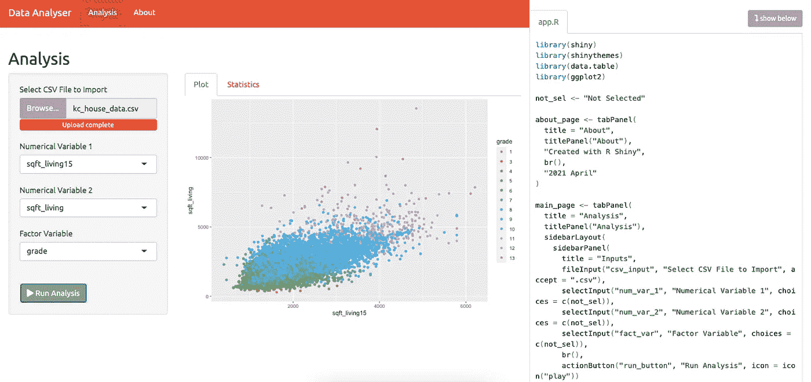

作者截图

[闪亮的](https://shiny.rstudio.com/)是一个 R 包，**让你建立交互式网络应用**。你需要的只是 R，没有 HTML、CSS 或 JavaScript——尽管你当然可以选择用它们来增强你的应用。你可以在你的电脑上运行应用程序，托管在你自己的服务器上，或者使用 RStudio 的云服务。

在这篇文章中，我将从头开始讲述**构建一个简单的数据分析应用程序的过程**。你可以在那里找到很多优秀的基础指南，我的目标是更进一步:我们将做一些**动态 UI 更新、动态输出、动作按钮**、**面板导航**等。

请注意，这不是一个“严肃的”数据分析应用程序，我的目的是展示可能会派上用场的 shiny 的不同功能。然而，一旦我们完成了，向我们的代码添加新的功能应该是相当容易的。

# 有用的链接

你可以看看我们要在 shinyapps.io 上搭建的**app:**[https://matepocs.shinyapps.io/data_analyser/](https://matepocs.shinyapps.io/data_analyser/)。

底层**代码在我的** [**GitHub**](https://github.com/MatePocs/rshiny_apps) 上。

Shiny 是一个非常有据可查的包，在其 [**网站**](https://shiny.rstudio.com/tutorial/) 上有**的优秀指南。其实有点太有案可稽了，很容易迷失在入门视频、教程、文字指南、文章等迷宫中。**

我个人觉得 Hadley Wickham 的[**Mastering Shiny**](https://mastering-shiny.org/index.html)是一个很好很紧凑的源码，强烈推荐。

# 准备

## 规划应用程序

这是我们希望我们的应用程序能够完成的**高级设计草图**。

**用户**:

*   导入一个`.csv`文件；
*   从列中选择最多 2 个数值型和 1 个因子型变量。

然后是 **app** :

*   绘制一个情节；
*   创建汇总表。

有趣的是**我们希望输出根据我们选择的列类型而不同**——如果只是选择一个因子变量，我们希望有不同的图，如果我们有一个因子的数值变量，我们希望有一个更复杂的图。

## 工作环境

我们将在 RStudio 和 r 中工作。要使用`shiny`，您首先需要**安装包**:

```
install.packages(“shiny”)
```

(我们还将使用的其他软件包:`data.table`、`ggplot2`，您可能也需要安装它们。我假设你对这些软件包很熟悉。)

接下来，我们需要**用 app 的名字**创建一个文件夹。我把我的叫做`data_analyser`。我们将继续在这个文件夹中工作。

一个`shiny`应用的框架非常简单:一个 R 脚本**必须被称为** `app.R`。所以我们将在我们的`data_analyser`文件夹中放一个。

(注意:如果你阅读一些旧的指南，你可能会发现这个框架令人困惑。与包含 UI 和服务器功能的 `app.R` *不同，您过去只需要两个脚本:一个* `server.R` *，一个* `ui.R` *。由于传统原因，这种老方法仍然有效，但我认为不推荐使用。此外，您可以在文件夹中有不同的脚本，并在您的应用程序脚本中提供它们。因此，您不必像我们现在要做的那样将所有内容都放在一个脚本中，您可以将您的服务器功能存储在一个单独的* `server.R` *脚本中，并对其进行编译，只要知道这不是一个要求即可。)*

## 闪亮的框架

最小闪亮应用框架看起来像这样:

```
library(shiny)ui <- fluidPage()server <- function(input, output){}shinyApp(ui = ui, server = server)
```

您可以将它复制到您的`app.R`，并且应该能够通过使用**键盘快捷键**(如 Cmd + Shift + Return)或点击 RStudio 中的**运行应用程序按钮**来运行它**(它将自动识别这是一个闪亮的应用程序):**

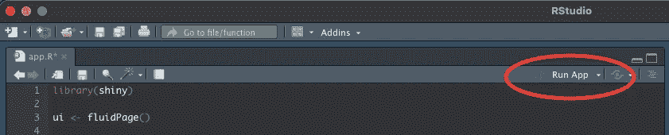

(另一种在本地运行应用程序的方式是简单地在控制台上输入`runApp(…/data_analyser)`，当然是添加文件夹的路径。)

如果你运行这个应用程序，你应该会看到一个空窗口弹出。这是意料之中的，但是是时候改变了！

# 构建步骤

正如这个框架所暗示的，一个闪亮的应用有两个部分:**用户界面，和服务器**。

`ui`对象负责 app 的**布局。它将决定显示什么样的页面或标签，如何格式化显示的文本，需要用户输入什么样的内容，以及将输出放在哪里。(我们还不知道具体的输出是什么，但我们知道它们各自的走向！)**

`server`是**定义** `input` **和** `output` **数据帧**之间的连接 **的函数。它基本上是一个观察器列表，寻找输入值变化的代码块或其他观察器(只是为了保持有趣)来确定屏幕上显示的输出是否应该更新。**

## 布局

我们将首先关注布局，它是在`ui`对象中定义的。

首先，让我们进入页面和选项卡。当我们开始输入第一个原型时，我们将`ui`定义为一个 [**fluidPage**](https://shiny.rstudio.com/reference/shiny/0.14/fluidPage.html) 。我发现很多初学者指南都用 fluidPage，特别是一个[**sidebarLayout**](https://shiny.rstudio.com/reference/shiny/0.14/sidebarLayout.html)，所以这次让我们做点不同的吧！

我们想为我们的应用程序创建单独的页面，就像一个合适的网站，我们可以使用 [**navbarPage**](https://shiny.rstudio.com/reference/shiny/1.2.0/navbarPage.html) 来实现这个目的。这将在顶部创建一个链接到不同页面的标题。让我们放入两页:

```
ui <- navbarPage(
  title = "Data Analyser", 
  main_page, 
  about_page
)
```

代码还不能运行，我们需要定义这两个页面。两者都需要是一个 [**tabPanel**](https://shiny.rstudio.com/reference/shiny/0.12.1/tabPanel.html) 对象。它们不可能是流水账。(如果你开始觉得这令人困惑和特别，你并不孤单，但我们几乎没有新的页面构建概念。)

让我们放入两页:

```
main_page <- tabPanel(title = “Analysis”)
about_page <- tabPanel(title = “About”)
```

如果您现在运行应用程序，您应该会在顶部的看到**导航面板。**

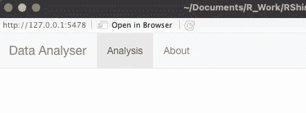

你可以把一些一般信息放在“关于”页面上。当格式化文本时，你有许多选择，请看[这里](https://shiny.rstudio.com/tutorial/written-tutorial/lesson2/)的完整列表。这个页面的存在只是为了展示不同的页面如何工作。

```
about_page <- tabPanel(
 title = “About”,
 titlePanel(“About”),
 “Created with R Shiny”,
 br(),
 “2021 April”
)
```

*(注意:您可以在页面本身和导航面板上使用不同的标题。)*

分析页面将会更加精彩。首先，我们希望输入位于左侧的侧边栏中。然后，我们希望在右边有一个单独的绘图和表格区域。用闪亮的术语来说:我们的主页面，tabPanel 将是一个[](https://shiny.rstudio.com/reference/shiny/0.14/sidebarLayout.html)**侧栏布局，左边是一个【输入】 [**侧栏**](https://shiny.rstudio.com/reference/shiny/0.14/sidebarPanel.html) ，右边是一个 [**主面板**](https://shiny.rstudio.com/reference/shiny/0.14/mainPanel.html) ，它将采用一个 [**tabsetPanel**](https://shiny.rstudio.com/reference/shiny/0.14/tabsetPanel.html) 的形式，有两个**tab panel**。呼。**

**我觉得我没有理由总结这些是做什么的，如果你好奇可以看看链接，但是名字应该是不言自明的。**

**这是主页面的**框架:****

```
main_page <- tabPanel(
  title = "Analysis",
  titlePanel("Analysis"),
  sidebarLayout(
    sidebarPanel(
      title = "Inputs"
    ),
    mainPanel(
      tabsetPanel(
        tabPanel(
          title = "Plot"
        ),
        tabPanel(
          title = "Statistics",
        )
      )
    )
  )
)
```

**如果您现在运行该应用程序，您应该会看到以下内容:**

**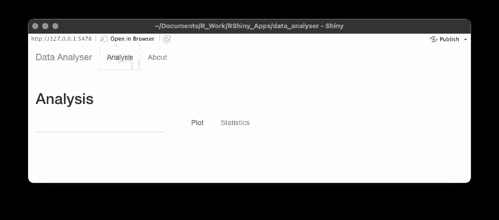**

***(注:这是一个检查 shiny 用这些奇怪的构建模块做什么的好时机。如果您只需在控制台中键入脚本的 main_page 部分，您将看到 shiny 如何将其转换为 HTML。)***

## **输入**

**接下来，我们将使用不同的**用户输入表单**来填充输入部分。文本或数字输入、滑块、下拉选择、单选按钮等。在闪亮的宇宙中被统称为**小部件**。(这里可以找到综合列表[。)](https://shiny.rstudio.com/gallery/widget-gallery.html)**

**每当你添加一个输入小部件时，第一个参数将是它的 ID，这就是我们如何在后面的`server`部分引用那个特定的输入。第二个参数是标签——放置在界面周围的文本字段，告知用户它的用途。**

**同样，我们可以列出各个类型的详细信息，但大多数都很简单。我们将需要 [**文件输入**](https://shiny.rstudio.com/reference/shiny/latest/fileInput.html) ， [**选择输入**](https://shiny.rstudio.com/reference/shiny/latest/selectInput.html) ，和一个 [**动作按钮**](https://shiny.rstudio.com/articles/action-buttons.html) ，有更多的细节在官方网站阅读。我们可以在 main_page 的“输入”侧栏面板中插入以下代码:**

```
fileInput("csv_input","Select CSV File to Import",accept=".csv"),
selectInput("num_var_1","Numerical Variable 1",choices=c(not_sel)),
selectInput("num_var_2","Numerical Variable 2",choices=c(not_sel)),
selectInput("fact_var","Factor Variable",choices=c(not_sel)),
actionButton("run_button","Run Analysis",icon=icon("play"))
```

***备注:***

*   **由逗号分隔的输入将被很好地排列在一起。**
*   ***后面我们将这些输入称为*`input$csv_input`*`input$num_var_1`*等。****
*   ***在选择输入字段中，我认为以一个通知用户还没有选择任何东西的选择开始会很好。这就是为什么 `not_sel` *=“未选中”全局变量诞生了。****
*   ****您可以从* [*字体牛逼*](http://fontawesome.io/icons/) *和* [*字形图标*](http://getbootstrap.com/components/#glyphicons) *库中添加一个* [***图标到页面中。你不需要为这个功能安装任何额外的东西。***](https://shiny.rstudio.com/reference/shiny/0.14/icon.html)***

***如果您现在运行应用程序，您应该会看到以下内容:***

***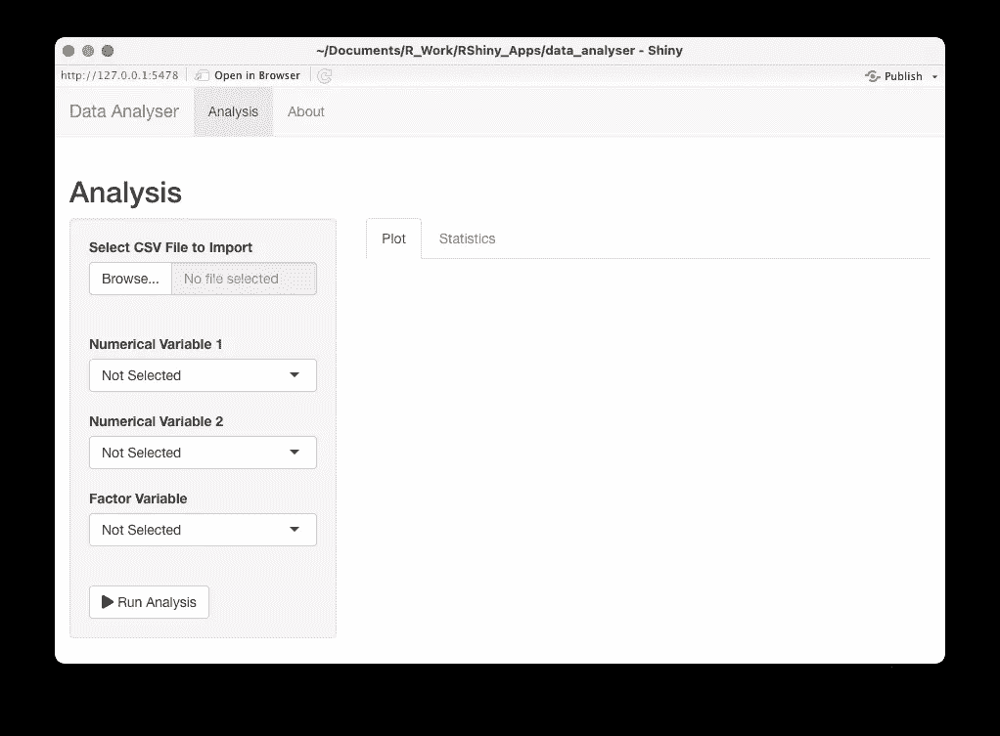***

***我们剩下要做的就是决定输出要去哪里，这样我们就完成了 UI。***

## ***输出***

***输出遵循与输入类似的逻辑。此时，我们所能确定的是:***

*   ***屏幕上的位置；***
*   ***类型(shiny 必须预先知道它将是文本、表格、情节等)；***
*   ***还有身份证。***

***就像输入一样，我们可以简单地在`main_page`的相应区域添加字段，shiny 会智能地填充可用空间。***

***在绘图选项卡上，我们想要添加的只是一个 [**绘图输出**](https://shiny.rstudio.com/reference/shiny/1.6.0/plotOutput.html) :***

```
*plotOutput(“plot_1”)*
```

***统计选项卡将变得更加复杂。我们将利用 [**fluidRow**](https://shiny.rstudio.com/reference/shiny/1.6.0/fluidPage.html) 功能来**将不同的项目并排放置**。*(注意到目前为止每个逗号是如何导致下一行呈现在第一行下面的。我们希望避免我们将要创建的小表出现这种情况，将它们放在一起。)****

***这是更新后的统计选项卡面板:***

```
*tabPanel(
  title = "Statistics",
  fluidRow(
    column(width = 4, strong(textOutput("num_var_1_title"))),
    column(width = 4, strong(textOutput("num_var_2_title"))),
    column(width = 4, strong(textOutput("fact_var_title")))
  ),
  fluidRow(
    column(width = 4, tableOutput("num_var_1_summary_table")),
    column(width = 4, tableOutput("num_var_2_summary_table")),
    column(width = 4, tableOutput("fact_var_summary_table"))
  ),
  fluidRow(
    column(strong("Combined Statistics"))
  ),
  fluidRow(
    column(tableOutput("combined_summary_table"))
  )*
```

***在第一行，我们将有三个标题，代表三个可选变量。这需要是一个`output`，因为它会随着我们选择不同的列而动态变化。***

***接下来，我们放入三个一维汇总表。我们还不用担心它们是什么，我们只知道标题下面会有表格。***

***最后，我们放入一个合并的汇总表，探索所选变量之间的关系。***

****备注:****

*   ****各列的宽度参数显示它们的相对尺寸，遵循* [*自举网格系统*](https://getbootstrap.com/docs/4.0/layout/grid/) *。(Shiny 用的是同样的框架。)****
*   ****将文本放在* `strong()` *中使其加粗。****

***好了，输出已经放好了。如果你现在运行应用程序，你会看到…自上次以来没有任何变化。是时候连接输入和输出了！***

## ***Shiny 中反应式编程的快速总结***

***在我们开始构建我们的应用程序之前，我认为让**快速总结一下** [**反应式编程**](https://en.wikipedia.org/wiki/Reactive_programming) 在 Shiny 中的体现是有益的。如需更详细的指南，请查看本页。***

*****服务器函数基本上将是一长串连接输入和输出的表达式**。有趣的是，这些表达式的顺序通常并不重要，尽管您可能希望保留一些逻辑。***

***屏幕上显示的大多数输出最终将来自一个`render`函数。对于文本输出使用 renderText，对于绘图输出使用 renderPlot，等等。所使用的渲染函数的类型将取决于输出的类型。例如，如果您在 ui 中定义了一个 ID 为“book”的 textOutput，并希望在那里显示文本“Dune ”,您可以这样做:***

```
*output$book <- renderText(“Dune”)*
```

***观察你需要如何渲染文本“沙丘”,即使它看起来已经很有纹理了！***

***当然，您可能希望保持输出的动态性——否则，您可以只在页面上打印标题。***

***下一步是将它连接到一个`input`。假设您有一个 ID 为“title”的 textInput 字段。如果您添加以下行:***

```
*output$book <- renderText(input$title)*
```

***每当您更新 title 字段时，图书输出也会更新。***

***这就是整个系统的美妙之处，如果用户更新了`title`字段，你不必确定会发生什么——你已经建立了连接，而`book`输出会像老鹰一样监视任何变化。***

***下一步，你可以创建**所谓的反应表达式**:这是输入和输出之间的一种**中间步骤。例如，如果要保存两个数字输入的总和，可以将它们保存在一个变量中:*****

```
*sum_of_numbers <- reactive(input$num_1 + input$num_2)*
```

***然后像输入一样使用`sum_of_numbers`。注意，`sum_of_numbers`是一个函数，所以当你在代码中引用它的值时，你必须在它后面加上括号(这肯定是一个容易忘记的事情):***

```
*output$sum <- renderText(sum_of_numbers())*
```

***这种来自输出部分的持续警惕起初听起来很棒，但是您很快就会意识到缺点:**有些情况下，您肯定不希望每次输入改变时都更新输出字段**。这可以通过一个[**event reactive**](https://shiny.rstudio.com/reference/shiny/1.6.0/observeEvent.html)函数来实现，该函数是一个带有额外输入的反应式表达式:它只在所选输入字段的值发生变化时运行。***

***这可能一开始听起来令人困惑，但一旦我们看到实际步骤，就会变得清晰得多。***

***还有一个格式化注意事项:在`server`函数中，大多数表达式遵循以下格式:***

```
*variable_to_create <- some_reactive_function({ 
    code_to_execute
})*
```

***(整个服务器功能也是如此。)花括号只是允许您将代码放在多行中。如果你能把代码放在一行中，你可以省略它们。***

## ***导入。csv 文件***

***好了，现在我们知道了这个理论，让我们开始迂回地应用它！***

***回想一下，我们有一个名为`input$csv_input`的输入项。一旦被填充，这实际上是一个`data.frame`，它的元素之一是`datapath`。(查看[此处](https://shiny.rstudio.com/reference/shiny/latest/fileInput.html)了解更多信息。)**一旦我们知道了文件的路径，我们就可以把它读入** `data.table`，就像我们通常用`fread`读入文件一样。***

***然而，我们还需要一种配料。如果我们只是试图加载输入字段中的任何内容，应用程序将会试图加载一个空文件并立即崩溃。为了防止这种情况，我们需要添加一个[**req**](https://shiny.rstudio.com/reference/shiny/latest/fileInput.html)condition:Shiny 确保我们确实有必要的输入的方法。***

***因此，这将是我们在服务器函数中的第一块:***

```
*data_input <- reactive({
    req(input$csv_input)
    fread(input$csv_input$datapath)
  })*
```

***现在，每当我们上传一个`.csv`文件，app 就会自动将其结果保存在名为`data_input`的`data.table`中。嗯，不完全是。更准确地说，我们有一个`data_input`函数，它返回一个`data.table`。(这个非常容易搞砸！)***

****(注意:我还没有对数据类型进行任何验证。如果你试图导入任何不是. csv 文件的东西，这个应用程序就会毫不客气地死机。请看这里的*[](https://mastering-shiny.org/action-transfer.html)**了解更多关于如何确保它是一个. csv 文件的信息。)*****

## ****基于导入的更新****

****我们有了数据，我们想用它做什么？****

****作为第一步，我们希望**更新输入部分**中的选择—到目前为止，唯一的选项是“未选择”。****

****我们将使用两个新概念:****

*   ****整件事将被包裹在一个 [**观察事件**](https://shiny.rstudio.com/reference/shiny/1.0.3/observeEvent.html) 中。该函数允许您在特定输入字段或反应表达式发生变化时执行一段代码。我们现在要注意的是`data_input`反应表达式。****
*   ****为了动态改变选择，我们使用[**updateSelectInput**](https://shiny.rstudio.com/reference/shiny/1.2.0/updateSelectInput.html)。顾名思义，这个函数接受一个选择输入字段，并对它进行更新，在我们的例子中就是选择。****

****我们还创建了一个变量`choices`，它将是一个****

*   ****“未被选中”，我们总是希望在顶部，****
*   ****和`data.table`中的列。****

****要在服务器功能中输入的相关代码:****

```
**observeEvent(data_input(),{
  choices <- c(not_sel,names(data_input()))
  updateSelectInput(inputId = “num_var_1”, choices = choices)
  updateSelectInput(inputId = “num_var_2”, choices = choices)
  updateSelectInput(inputId = “fact_var”, choices = choices)
})**
```

*****(注意:我最初在这里使用了一个非常奇怪的解决方案来更新选择。在* `ui` *中有一个选项可以添加输出字段，这些字段将在*[***render ui***](https://shiny.rstudio.com/reference/shiny/latest/renderUI.html)*函数的帮助下呈现为输入小部件。因此，您确定了 ui 部分中 ui 元素的位置，但是它是作为输出动态创建的。我发现这个解决方案令人困惑，也不太符合逻辑，因为布局和内容之间清晰明了的区别变得模糊了，但这是可能的。)*****

****我们现在应该看到导入一个`.csv`文件的影响，一旦导入，您应该能够在下拉列表中选择列名:****

****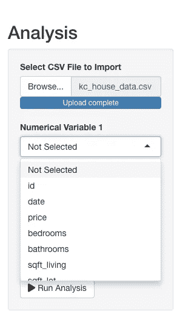****

## ****如果我们按下按钮呢？****

****既然我们可以选择要使用的列，那么就该将它们连接到输出了。****

****让我们试着想象一下，当我们改变其中一个下拉选项时，我们想要看到什么。答案是:我们实际上不想看到任何变化。在我们完成选择之前看到剧情跳跃会很烦人。**我们需要在输入和输出之间设置一道屏障**，这就是运行分析按钮的用途。****

****我们将使用一个[**event reactive**](https://shiny.rstudio.com/reference/shiny/1.0.3/observeEvent.html)表达式。它就像一个常规的反应表达式，但只根据另一个输入的变化进行更新。****

```
**num_var_1 <- eventReactive(input$run_button,input$num_var_1)
num_var_2 <- eventReactive(input$run_button,input$num_var_2)
fact_var <- eventReactive(input$run_button,input$fact_var)**
```

****这样，我们创建了三个表达式，它们的名称与输入源的名称相同(这种命名约定您可能会觉得很讨厌，但我发现这样更简洁)。诀窍在于当`run_button`输入发生变化时，`num_var_1()`表达式只会将其值更新为最新的`num_var_1`输入。****

****对一个按钮的改变将是 10 次点击中的 10 次。****

*****(注意:这些值将是字符值，但是没有必要使用 renderText，因为我们实际上并没有直接将它们放在屏幕上。)*****

## ****画出情节****

****首先，我们需要创建一个绘图对象。就像上面的变量一样，这将取决于按钮的点击。为什么我们不能仅仅依靠价值更新呢？我们将使用 4 个变量:data_input()，num_var_1()，num_var_2()，和 fact_var()。问题是 data_input()不受按钮点击的保护，每当我们选择一个新文件时，值就会更新。****

****这就是我们将要拥有的:****

```
**plot_1 <- eventReactive(input$run_button,{
    draw_plot_1(data_input(), num_var_1(), num_var_2(), fact_var())
  })**
```

****其中`draw_plot_1`是一个常规的 R 函数，它可以在`server`函数之外定义。完整版的`draw_plot_1`功能，**看看我的** [**GitHub**](https://github.com/MatePocs/rshiny_apps/blob/main/data_analyser/app.R) 。我越想聪明地一个块一个块地构建`ggplot`，代码就越不可读，所以我坚持使用一个冗长的 if-else 语句。该函数是这样开始的:****

```
**draw_plot_1 <- function(data_input, num_var_1, num_var_2, fact_var){
  if(num_var_1 != not_sel & 
     num_var_2 != not_sel & 
     fact_var != not_sel){
     ggplot(data = data_input, 
        aes_string(x = num_var_1,y = num_var_2,color = fact_var)) +
        geom_point()
    }**
```

****所以该函数有三个输入，一个`data.table`(注意它不再是`draw_plot_1`函数内部的函数，而是一个真正的常规表，所以不需要使用括号！)，以及三个列名，其中任何一个都可以“未选中”，在这种情况下应该忽略。****

****在上面显示的第一个分支中，使用了所有的变量。在这种情况下，我们需要一个散点图，其中两个轴是两个数值变量，它们被因子变量分成不同的组。****

****当然，你可以根据自己的目的改变这些情节。****

****最后，我们必须呈现服务器函数内部的情节:****

```
**output$plot_1 <- renderPlot(plot_1())**
```

****如果您现在运行代码，您应该能够根据您选择的变量看到绘图的更新。如果这三个变量都被选择，你应该有一个彩色散点图:****

****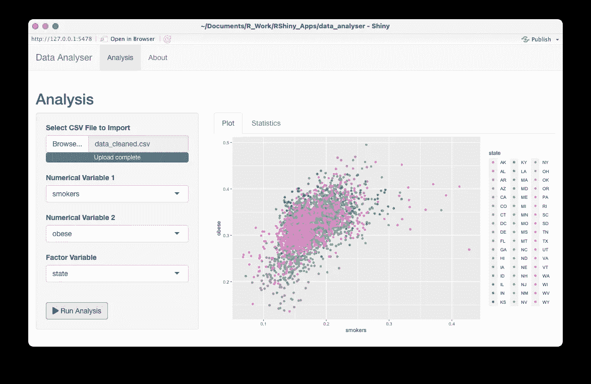****

****(并不是说你会想用颜色来描绘这么多的因素！)****

****如果你只有一个数值变量，它应该画一个小提琴图:****

****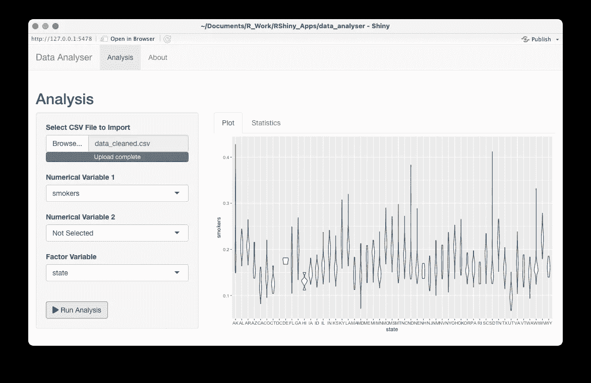****

## ****创建表格****

****我们创建表格的方式将使用类似的逻辑。****

****回想一下，我们为前三个表添加了一些**标题。我们可以这样定义它们的值:******

```
**output$num_var_1_title <- 
  renderText(paste("Num Var 1:",num_var_1()))
output$num_var_2_title <- 
  renderText(paste("Num Var 2:",num_var_2()))
output$fact_var_title <- 
  renderText(paste("Factor Var:",fact_var()))**
```

****不需要将这些放在 eventReactive 中，并使更新以动作按钮为条件，因为底层变量已经只在点击动作按钮时更新。重申一下，例如，我们在上面的公式中使用的`num_var_1()`表达式是这样的:****

```
**num_var_1 <- eventReactive(input$run_button,input$num_var_1)**
```

****而不是`input$num_var_1`本身。****

****如果你现在运行这个应用程序，**你应该会看到标题**(回想一下我们在创建 UI 时把“组合统计”作为一个固定文本放进去):****

****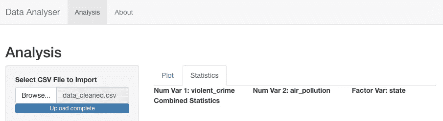****

****我们有四个表要创建，让我们看看**一维数值表**是如何创建的，其余的遵循类似的结构，**查看** [**GitHub**](https://github.com/MatePocs/rshiny_apps/blob/main/data_analyser/app.R) 中的代码。****

****首先，我们使用另一个 eventReactive 表达式，每当单击 action 按钮时运行一个函数:****

```
**num_var_1_summary_table <- eventReactive(input$run_button,{
    create_num_var_table(data_input(), num_var_1())
  })**
```

****接下来，我们定义`create_num_var_table`函数:****

```
**create_num_var_table <- function(data_input, num_var){
 if(num_var != not_sel){
  col <- data_input[,get(num_var)]
  if(length(col)>5000) col_norm<-sample(col,5000) else col_norm<-col
  norm_test <- shapiro.test(col_norm)
  statistic <- c("mean", "median", "5th percentile", 
                 "95th percentile", "Shapiro statistic", 
                 "Shapiro p-value")
  value <- c(round(mean(col),2), round(median(col),2),
             round(quantile(col, 0.05),2), 
             round(quantile(col, 0.95),2),
             norm_test$statistic, norm_test$p.value)
  data.table(statistic, value)
  }
}**
```

****结果将是一个包含两列统计和值的`data.table`。我只是放了一些我能想到的统计数据，还有一个正态性测试，加上你喜欢的任何东西。****

*****(注意:内置的正态性测试有 5000 个样本大小的限制，所以如果导入的* `.csv` *文件比较长，我会随机抽取一个样本。)*****

****最后，我们将表格呈现在屏幕上:****

```
**output$num_var_1_summary_table <- renderTable(num_var_1_summary_table(),colnames = FALSE)**
```

****我不想显示表格的标题，这可以在`colnames`参数中设置。****

****对于其他表，您需要遵循类似的结构。在组合表中，就像我们对图所做的那样，根据我们选择的变量类型，有不同的分支。如果我们选择了所有三个变量，表格将通过因子变量计算不同子组中两个数值变量之间的相关性。****

****不用说，这只是一种方法，一旦结构完成，您可以在这些表中放入任何您想要的东西。****

****如果您运行该应用程序，**您应该会看到以下内容**:****

****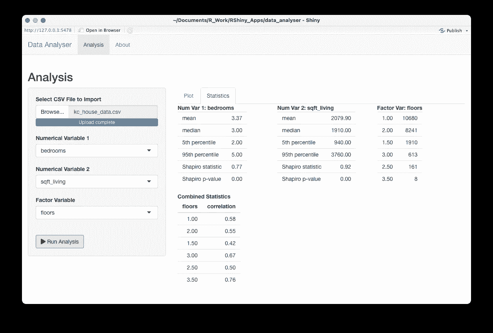****

****我们结束了，对吗？差不多！****

## ****选择一个主题****

****正如永恒的建议所说，永远不要拖欠任何东西！****

****所以我们打算**改变默认主题**。有几种方法可以做到这一点，包括使用自己的 CSS 模板，我们将采取一种非常简单的方法，使用 [**shinythemes**](https://rstudio.github.io/shinythemes/) 。你需要先安装软件包。然后，你需要做的就是选择一个主题，然后**把它放到 ui 对象**中，就像这样:****

```
**theme = shinytheme('united')**
```

****瞧，我们可以看到同一个屏幕，但现在是橙色的(或者你选择的任何东西):****

****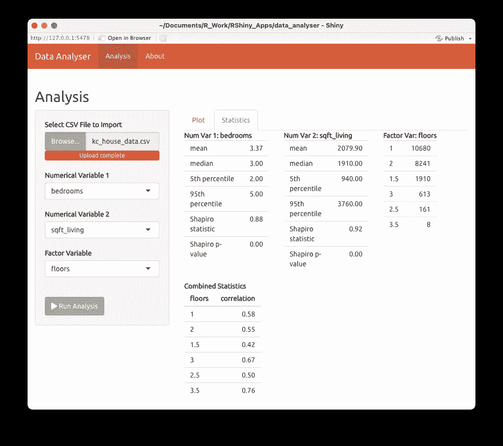****

****现在我们完成了！****

## ****附加注释****

****本指南比我预期的要长得多，有一些细微差别我觉得我不应该提及，但为了完整起见，它们在这里:****

*   ****默认情况下，您可以上传的最大文件大小为 5 MB。您可以通过在服务器函数中输入以下代码来增加该值:
    `options(shiny.maxRequestSize=10*1024^2)` (这将是 10 MB)****
*   ****如果您想使用数字字段作为因子，R 将生成绘图，但会添加一个连续的色标。在`draw_plot`函数中，我从这段代码开始将列转换为因子:
    `if(fact_var!=not_sel){
    data_input[,(fact_var):= as.factor(data_input[,get(fact_var)])]
    }`****
*   ****您可能已经注意到，对于同一个按钮点击，我们使用了很多 eventReactive。将所有东西收集在一个`data.frame`中可能比将它们放在单独的事件中更好。并且绘图和表格绘制函数也使用 eventReactive，即使大多数变量已经在内部“eventReactivated”了。我这样做的原因是因为每次导入新的`.csv`文件时`data_input()`都会更新。相反，添加另一个`data_input_2()`变量可能会更清楚，当您单击按钮时，它会根据`data_input()`进行更新，然后在常规反应表达式中使用该函数以及`num_var_1()`等。这只是一个例子，说明这种反应式编程可能非常动态，但同时也令人困惑。****

# ****App 怎么运行？****

****当实际运行应用程序时，您有三种选择。****

1.  ****您可以在本地**运行它**，例如点击 RStudio 中的**运行应用程序按钮。你也可以用 [**runApp**](https://shiny.rstudio.com/reference/shiny/1.6.0/runApp.html) 函数在不打开脚本本身的情况下运行。******
2.  ****第二个选项是 [**闪亮服务器**](https://www.rstudio.com/products/shiny/shiny-server/) ，用它你可以把它托管在自己的服务器上。我对这个选项没有经验。****
3.  ****或者可以用 [**shinyapps.io**](https://www.shinyapps.io/) ，也就是云服务。****

****我用 shinyapps.io 来托管这个应用程序，你可以在这里查看。****

****使用 shinyapps.io 非常简单，你注册，创建一个帐户，获得一个令牌，用它你可以发布你的应用程序。一个免费的帐户，你可以获得 5 个应用程序和每月 25 个活跃用户小时。****

****[](https://matepocs.medium.com/membership) [## 加入我的推荐链接-伴侣概念

### 作为一个媒体会员，你的会员费的一部分会给你阅读的作家，你可以完全接触到每一个故事…

matepocs.medium.com](https://matepocs.medium.com/membership) 

# 其他有用的链接

再一次，我推荐你掌握哈德利·威克姆的《闪亮》,如果你想以一种好的、有条理的方式学习《闪亮》:

 [## 掌握闪亮

### 这是《掌握闪亮》的在线版本，这本书目前正处于早期开发阶段，计划于 2020 年底出版…

mastering-shiny.org](https://mastering-shiny.org/index.html) 

你可以在这里找到一些有用的备忘单:

[](https://www.rstudio.com/resources/cheatsheets/) [## RStudio 备忘单

### 面向数据科学的开源企业级专业软件

www.rstudio.com](https://www.rstudio.com/resources/cheatsheets/) 

这是一个 GitHub repo，其中有一个 R 包列表，增强了 Shiny 的默认功能:

[](https://github.com/nanxstats/awesome-shiny-extensions) [## nangstats/awesome-shiny-扩展

### 一个令人敬畏的 R 包的精选列表，为 R web framework Shiny 提供了扩展的 UI 或服务器组件。你的…

github.com](https://github.com/nanxstats/awesome-shiny-extensions)****