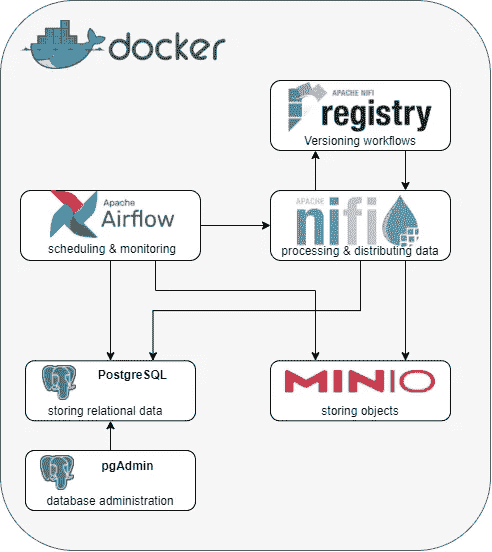
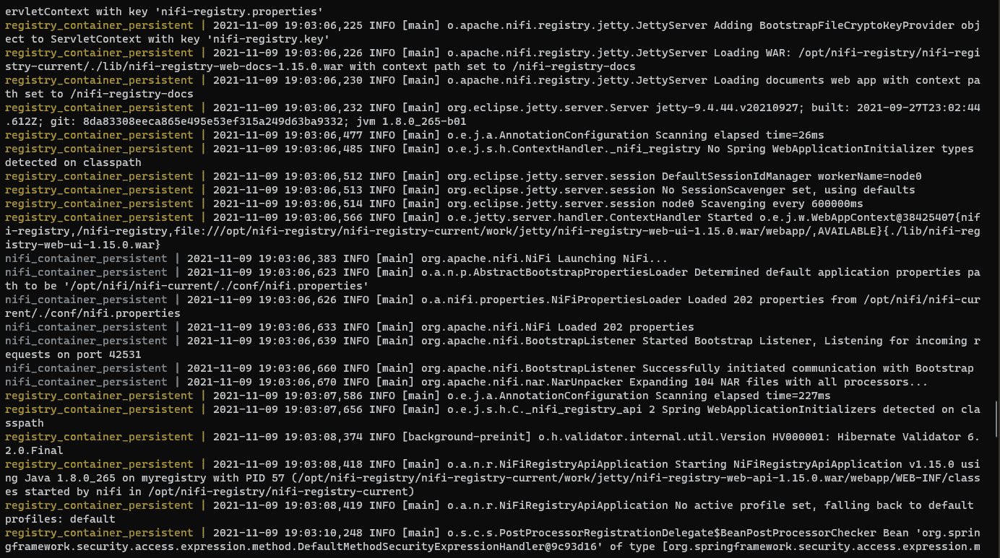
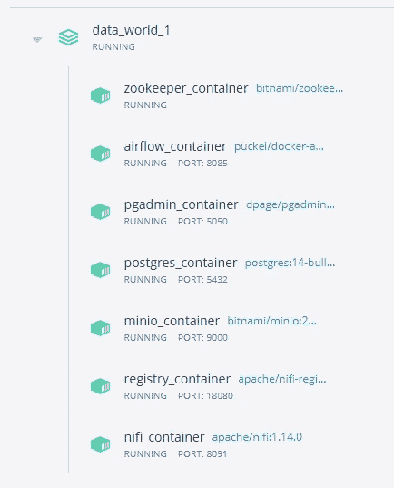
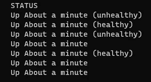

# 如何从零开始构建数据湖—第 1 部分:设置

> 原文：<https://towardsdatascience.com/how-to-build-a-data-lake-from-scratch-part-1-the-setup-34ea1665a06e?source=collection_archive---------3----------------------->

## 如何利用流行技术构建数据工程沙盒的完整教程

在这一系列文章中，我将指导您建立我们自己的数据湖基础设施作为数据工程沙箱。在第一部分中，我将向您展示如何用 docker 托管必要的服务，以及如何配置它们，以便您所做的任何更改都将被完全持久化。在本系列的第二部分中，我将解释如何配置服务以相互通信，以及如何创建模板，通过这些模板，您可以在平台上实现自己的数据项目、概念验证和测试。

您不需要了解 Docker 或任何已使用的服务就能理解本教程，但它可能会帮助您在遇到错误时排除故障。无论如何，我会尽可能具体地让你开始。这些工具被广泛使用，如果你决定深入研究，你可以在网上找到大量的问题、解决方案和指南。

一方面，目标是展示用 docker 托管您自己的数据湖基础设施所需的基础工作，但我也希望您能够理解设计选择和配置背后的原因。为了这个目的，当我认为有必要时，我有时会详细说明:帮助你以后自己找到路。

杰里米·毕晓普在 Unsplash 上拍摄的一张湖上日落的照片。

# 工具箱

数据工程师在概念验证、用例、项目或开发和生产应用中使用许多工具。下面是这些工具的一个小的，但是广泛流行的子集。正如斯坦尼斯拉夫·莱姆在科幻小说《索拉里斯》中的名言:**“没有答案。只有选择。”**本着这种精神，让我来介绍一下 techstack！

我们将使用…

**Apache NiFi 处理和分发数据。**

*   Apache NiFi 支持强大且可伸缩的数据路由、转换和系统中介逻辑的有向图。Apache NiFi 的一些高级功能和目标包括基于 web 的用户界面、高度可配置的服务和数据来源。Apache NiFi 是开源的、可扩展的、安全的服务，背后有一个庞大的社区。点击此处阅读更多内容。
*   使用 Apache NiFi 的公司:三星，花旗集团，戴尔，迪士尼，Hashmap。

**Apache NiFi Registry 用于存储、管理和版本控制 NiFi 资源。**

*   Registry 是 Apache NiFi 的一个子项目，它是一个补充应用程序，为跨一个或多个 NiFi 实例的共享资源的存储和管理提供了一个中心位置。我们将使用它来对我们的数据流进行版本控制，并创建可重复使用的模板。点击此处阅读更多内容。

**Apache Airflow 以编程方式创作、安排和监控工作流。**

*   Airflow 是可伸缩的，因为它的模块化架构，并使用消息队列来编排任意数量的工作器。它的管道是用 Python 编写的，这意味着它允许从代码中动态创建管道，并且可以通过自定义操作符进行扩展。它的 web 用户界面很实用，可以访问管道的所有部分:从源代码到日志。[点击此处阅读更多内容。](https://airflow.apache.org/)
*   使用阿帕奇气流的公司:Airbnb、Slack、Robinhood、Square、9GAG。

作为对象关系数据库的 PostgreSQL。

*   PostgreSQL 是一个强大的开源对象关系数据库系统，它在可靠性、功能健壮性和性能方面享有盛誉。[点击此处阅读更多内容。](https://www.postgresql.org/)
*   使用 PostgreSQL 的公司:NASA，Instagram，Twitch，Reddit，Twitter。

**pgAdmin 作为 PostgreSQL 的管理和开发平台。**

*   pgAdmin 是 PostgreSQL 数据库的开源数据库管理和开发平台。我们将在 docker 上发布它的网络版。[点击此处阅读更多内容。](https://www.pgadmin.org/)

**MinIO 作为 AWS S3 的本地托管替身，作为对象存储。**

*   MinIO 提供高性能、S3 兼容的对象存储。也就是说，我们可以使用任何为 AWS S3 和 MinIO 开发的连接器。这允许我们在本地开发对象存储的概念验证——而不必在 AWS 上托管(并支付)实际的 S3 存储桶——如果我们愿意，以后可以用实际的 S3 存储桶无缝地替换连接。[点击此处了解更多。](https://min.io/)
*   使用 MinIO 的公司:苹果，GitLab，普华永道，万事达，Paypal，Kayak。

**Docker 托管我们的服务。**

*   Docker 让我们几乎可以在任何地方轻松托管、运行、使用和配置应用程序。Docker 托管与环境其余部分隔离的容器，因此允许简化和加速工作流。
*   使用 Docker 的公司有:优步、亚马逊、易贝、纽约时报、Shopify。

这应该让您对构成我们的数据湖基础设施的应用程序有了一个大致的了解。其中一些——如 Apache NiFi Registry——将帮助我们更有效地开发，而其他服务——如 Airflow——将成为我们自己的数据工程沙箱的核心组件。

现在，让我们开始实际设置它们吧！

数据湖组件—由作者创建的图像。维基百科的图标。

# 准备

首先，您需要安装 docker(例如，从[到这里的](https://www.docker.com/products/docker-desktop))。

然后，创建一个空目录，并在其中打开一个终端。

所有必要的代码和文件都将在本文中链接。

# 码头工人

首先，我们需要一个`docker-compose.yml`文件，指定我们希望托管哪些服务以及它们在启动时的配置参数。

根据 docker 官方网站:

> *“组合文件提供了一种记录和配置所有应用服务依赖项(数据库、队列、缓存、web 服务 API 等)的方法。使用编写命令行工具，您可以用一个命令(* `*docker-compose up*` *)为每个依赖项创建和启动一个或多个容器。* [*来源*](https://docs.docker.com/compose/)

我们将在本教程[中使用的`docker-compose.yml`文件可以在这里](https://gist.github.com/CribberSix/bfc8d6fdb30660467305f8e4288f213e)或者在这篇文章的最后找到。将代码复制粘贴到您自己的文件中，或者使用 curl 从终端直接下载到本地文件中:

我们使用以下 docker 映像来托管我们的服务，因为它们在本文撰写时是最新的和/或使设置最容易。通过固定版本(越具体越好)，我们可以确保每个人都将运行完全相同的设置。这也是 docker 的主要优势之一——不再是“但它能在我的电脑上工作”。

1.  气流:`puckel/docker-airflow:1.10.9`
2.  动物园管理员:`bitnami/zookeeper:3.7.0`
3.  倪飞:`apache/nifi:1.14.0`
4.  NiFi 注册表:`apache/nifi-registry:1.15.0`
5.  米尼奥:`bitnami/minio:2021`
6.  Postgres: `postgres:14-bullseye`
7.  pgadmin: `dpage/pgadmin4:6.1`

你可以自由地使用标签`:latest`来代替上面指定的版本，只要在你阅读下面的章节时，确保你知道从上面的版本以来的任何变化。然而，`latest`标签通常是不可预测的，可能会破坏东西，因为随着时间的推移，您将获得不同的图像版本。

# 启动服务

通过在终端中从我们的`docker-compose.yml`文件所在的同一个目录中运行`docker-compose up`命令:

我们告诉 docker 从 web 上提取图像，创建指定的容器并启动文件中定义的服务。运行该命令后，会出现一个日志消息墙，显示服务启动和运行时的日志消息。

日志消息墙—由作者创建的图像。

如果您是 docker 的新手，我建议您使用 Docker 桌面应用程序来跟踪您的服务的健康状况，但是理论上您可以从命令行使用`docker ps --all`和/或`docker stats`来做同样的事情。如果要停止 docker 服务，在带有文本墙的终端中按`CTRL+C`。现在，只要保持服务(和文本墙)运行。

Docker 容器—由作者创建的图像。

如果在使用不同的配置多次停止/启动服务后，服务出现问题，请确保运行`docker-compose up --force-recreate`。附加标志确保 docker 在启动服务之前获取对合成文件的最新更改。

# docker 合成文件的内容

既然您已经复制了`docker-compose.yml`文件并知道如何启动它，我想解释一下组成 compose 文件的不同代码段。

接下来的章节将详细介绍:

1.  命名卷和绑定装载
2.  端口转发
3.  用户定义的网络和网桥
4.  主机名和容器名
5.  环境变量
6.  重启策略
7.  健康检查

我将主要使用来自 [docker-compose.yml](https://gist.github.com/CribberSix/bfc8d6fdb30660467305f8e4288f213e) 文件的 **airflow** 服务的例子:

该文件从指定 docker-compose 软件本身的版本(`3`)开始。以前的版本可能在语法和功能上有所不同。

yml 文件中的下一个键(`services`)指定了容器及其配置。一个这样的服务是 Airflow——在上面的例子中，我们想要从 docker 映像`puckel/docker-airflow:1.10.9`创建一个容器服务。docker 映像基本上是一个特定配置的安装程序，由一组关于如何构建托管特定服务的 docker 容器的指令组成。一个映像的不同版本，甚至不同的映像可能托管相同的应用程序，但是以不同的设置作为起点。

特定于容器的参数将在以下章节中详细讨论。

## 命名卷和绑定装载

一旦容器停止，在 docker 容器中创建和存储的任何数据都将被删除。这是运行 docker 容器的好处之一，因为我们不需要“清理”它们，不需要卸载服务，也不需要删除文件。然而，这也意味着我们在容器运行时实现的任何更改将在我们停止它后永远丢失。

为了持久化对托管服务的更改(比如 NiFi 数据管道或 Airflow DAGs)，我们需要将必要的数据保存在本地机器上的容器之外。我们可以通过使用绑定装载或卷来实现这一点。

**绑定坐骑**有特定的路径来源，一个例子是`./airflow/dags:/usr/local/airflow/dags`。compose 文件旁边的本地目录`./airflow/dags`将被绑定到容器内的文件夹中。我们可以很容易地在我们的项目目录中访问它，并添加/删除数据和文件。绑定挂载是特定于主机系统的，并且不受 Docker 的管理。我们可以将挂载目录*绑定到系统中的任何地方*，因为我们可以通过它在系统中的完整路径来引用它。

**命名卷**不包含路径。一个例子是`airflow-data:/usr/local/airflow/data`。卷`airflow-data`也需要在顶层`volumes`声明的合成文件中声明。 **Docker 管理卷，**意味着非 Docker 进程不应修改卷。您可以使用`docker volume ls`列出所有命名的卷。

两者之间的一个主要区别是它们在第一次启动时的处理方式。举个例子:当绑定挂载一个像 NiFi 的`conf`目录这样的目录时，docker 希望某些文件在启动时存在于挂载的目录中。如果没有，Docker 将失败。另一方面，如果您使用`conf`作为命名卷，docker 将会意识到它还不存在(或者是空的),并在启动时创建默认文件，而不会抛出错误。

在下面的例子中，docker 容器在`/usr/local/airflow/dags`目录(容器内部)中创建的任何数据都将存储在本地机器上我们项目目录中的`./airflow/dags`处。在冒号的左边，我们指定我们挂载的**本地目录**，在右边指定 docker 容器内的**映射目录。**

如您所见，我们还可以挂载单个文件。在这种情况下，我们挂载一个`requirements.txt`文件，以便能够在启动时在容器内安装 Python 包。

目录是绑定装载的还是命名卷取决于您需要如何使用它。docker 容器中需要持久化但不需要手动访问的目录应该总是由 docker 管理，因此是**命名的卷。**另一方面，如果你需要添加/删除/编辑目录中的文件和数据，选择应该落在**绑定挂载上。**有关更多信息和每个选项的不同使用案例，请查阅[官方文档](https://docs.docker.com/storage/)。

## 端口转发

当您使用 docker 运行一个容器时，它的任何端口都不能从“外部”，从您的本地主机访问。Docker 容器在它们自己的网络中运行，但是您可以发布端口并使它们可以从本地主机访问。下面的代码摘录将容器服务的内部标准 http 端口`8080`映射到本地主机的端口`8085`。

这意味着，当您访问`localhost:8085`时，您实际上是在调用 docker 容器的`8080`端口。这样，我们可以托管多个 docker 容器应用程序，并将它们的 http 端口映射到不同的外部本地主机端口。

## 用户定义的网络和网桥

用户定义的网桥在容器之间提供自动 DNS 解析，这意味着一个容器将能够与 docker 容器的同一个网络中的其他容器“对话”。

默认情况下，从`docker-compose.yml`创建的每个容器都加入同一个网络。然而，*默认*桥接网络上的容器只能通过 IP 地址相互访问**，除非您使用-link 选项(这被认为是遗留的)。**

在一个*用户定义的*桥接网络上(就像我们的例子中的`dataworld`),容器可以通过名称或别名相互解析**。这非常实用，因为我们不必手动查找和配置特定的 IP 地址。**

当您考虑到每当我们重启 docker 容器时，IP 地址也会发生变化，这就变得特别好了。我们可以让 docker 网络处理 DNS 名称解析，而不是在每次启动后都重新查找我们的 IP 和配置服务连接。

## 主机名和容器名

为了能够通过名称进行实际解析，我们的 docker 服务需要一个`hostname`。这些名称将用于解析`dataworld`网络中的实际 IP 地址——例如，当我们通过 API `[http://mynifi:8080/nifi-api/...](http://mynifi:8080/nifi-api/....)` [从 Airflow 向 NiFi 发出 API 调用时。](http://mynifi:8080/nifi-api/....)

我们可以另外配置`container_name`——如果我们不这样做，docker-compose 将根据服务名和合成文件的目录分配一个。例如，如果我们没有定义服务的容器名`airflow-webserver`，docker 会给容器命名为`data_world_1_airflow-webserver`。

一旦我们有多个容器在运行，并且需要区分它们时，具体命名容器是很有帮助的(与在任何其他代码段中命名变量一样)。这些名称也为 docker 提供了一个参考点，允许它引用其他容器( [Source](https://docs.docker.com/network/links/#the-importance-of-naming) )。

一般来说，容器或者通过名称(因此，不允许有重复的名称)或者通过 ID 来识别。以下两个语句适用于同一个容器:

当创建容器后在命令行中运行`docker ps --all`时，您可以在最后一列中看到名称。

稍后快速浏览一下`docker-compose.yml`中的相关主机名:

*   尼菲:`mynifi`
*   NiFi 注册表:`myregistry`
*   气流:`myairflow`
*   PostgreSQL-DB: `mypostgres`
*   pgAdmin: `mypgadmin`
*   动物园管理员:`myzookeeper`
*   米尼奥:`myminio`

## 环境变量

Docker compose 将在 shell 中查找环境变量，并替换我们在`docker-compose.yml`中指定的值。一般来说，docker-compose 中的环境变量帮助我们配置服务的某些部分，以便它们与我们的设置特别匹配。

Airflow 服务不使用任何环境变量，但是 NiFi 使用:例如，我们可以手动将`NIFI_ZK_CONNECT_STRING`设置为`myzookeeper:2181`，这样 NiFi 将在启动时自动识别 zookeeper 实例。由于我们创建了一个用户定义的网络，我们可以让 docker 处理名称解析，只使用容器名称而不是 IP 地址。

更多模糊的例子可以在上面看到，如设置一个属性键或在领导者选举周期中的最大等待时间。但是另一个容易理解的例子是 postgres 容器服务，其中我们利用环境变量来指定默认的用户名和密码。

## 重启策略

每当遇到不是`0`的退出代码时，策略`on-failure`将重启容器。当我们手动终止进程时，使用退出代码`0`，在这种情况下，我们不希望容器重启。在应用程序或 docker 容器的所有其他退出代码上，docker 将尝试为我们自动重启容器。

重启策略的其他选项有`no`、`always`或`unless-stopped`。如果你对确切的定义感兴趣，可以看看官方文档。

## 健康检查

健康检查就是检查我们的 docker 容器是否“健康”。在这个上下文中，健康通常意味着它们能够响应 http 请求。Docker 评估返回的 HTTP 代码来决定容器是否健康。

docker 集装箱的健康状态—图片由作者创建。

当我们不指定健康检查时，docker 也无法判断容器是否“健康”。我们的`docker-compose.yml`中的健康检查非常简单，但是也可以编写更加增强和更加敏感的定制健康检查。

一般来说，我们可以使用任何端点进行基本的健康检查，在正常操作期间返回任何类型的数据——自己检查一下在[合成文件](https://github.com/CribberSix/data_world_1/blob/main/docker-compose.yml)中使用的健康检查。

上面的健康检查定义了每 30 秒，命令`curl -f http://myairflow:8080/admin/`应该被执行。将评估响应的 HTTP 代码，以测试容器是否健康。如果没有响应，将在 20 秒后触发呼叫超时。

在这个上下文中值得注意的是:`curl`命令是从 docker 网络内部执行的，因此我们需要使用主机名以及容器的原始端口，而不是映射端口！一些服务还为健康检查提供特定的端点，比如`mypgadmin:80/misc/ping`、`myminio:9000/minio/health/live`或者甚至是特殊的功能，比如 postgreSQL 数据库的`pg_isready`命令。

# 访问服务

在你开始你的容器后

并且您的容器已经启动并运行，您将能够通过以下网站链接访问容器服务:

*   Apache NiFi—[http://localhost:8091/NiFi/](http://localhost:8091/nifi/)
*   Apache NiFi 注册表—[http://localhost:18080/NiFi-Registry/](http://localhost:18080/nifi-registry/)
*   阿帕奇气流—[http://localhost:8085/admin/](http://localhost:8085/admin/)
*   pg admin—[http://localhost:5050/browser/](http://localhost:5050/browser/)
*   minIO—[http://localhost:9000/](http://localhost:9000/)

注意:我们不需要直接访问 postgreSQL 和 Zookeeper。如果你感兴趣的话，动物园管理员有一个网络界面。

请注意，一些容器需要一些时间来启动:NiFi 经历一个领导者选举周期(如果您将扩展并将其作为一个节点集群来启动),这将需要一分钟来完成。如果您不耐烦，可以通过将它的环境变量`NIFI_ELECTION_MAX_WAIT`从`1 min`更改为`30 sec`来减少这个时间。

如果您想移除所有容器，您可以运行`docker-compose down`。如果标志`docker-compose down -v`被设置，该命令也将删除卷。

# 结束语

在本系列的这一部分中

1.  我们选择了要使用的技术堆栈，
2.  我们研究了一个`docker-compose.yml`文件的组成部分
3.  我们完成了数据工程沙箱的设置，以使我们的基础设施正常运行。

艰难的工作已经完成——在本系列的下一篇文章中，我们将介绍功能并编写几个`Hello world!`来展示服务之间的通信和交互。

敬请关注我的 [Medium](https://medium.com/@cribbersix) 系列文章！我也写一些关于数据工程工具以及软件和个人开发的文章。

一如既往，我们永远学不完。了解有关…的更多信息

*   [docker 撰写入门](https://docs.docker.com/compose/gettingstarted/)
*   [Docker 的重启策略](https://docs.docker.com/config/containers/start-containers-automatically/)
*   [为什么要给 docker 容器命名](https://docs.docker.com/network/links/#the-importance-of-naming)
*   [Docker 的存储选项—卷、绑定挂载、tmpfs 挂载和命名管道](https://docs.docker.com/storage/)
*   [阿帕奇气流](https://airflow.apache.org/)
*   [阿帕奇尼菲](https://nifi.apache.org/)
*   [Apache NiFi 注册表](https://nifi.apache.org/registry.html)
*   [PostgreSQL](https://www.postgresql.org/)
*   [pgAdmin](https://www.pgadmin.org/)
*   [MinIO](https://min.io/)

我希望你在玩沙盒的时候有很多乐趣！

而且，正如承诺的那样，[这里的](https://gist.github.com/CribberSix/bfc8d6fdb30660467305f8e4288f213e)是`docker-compose.yml`文件: