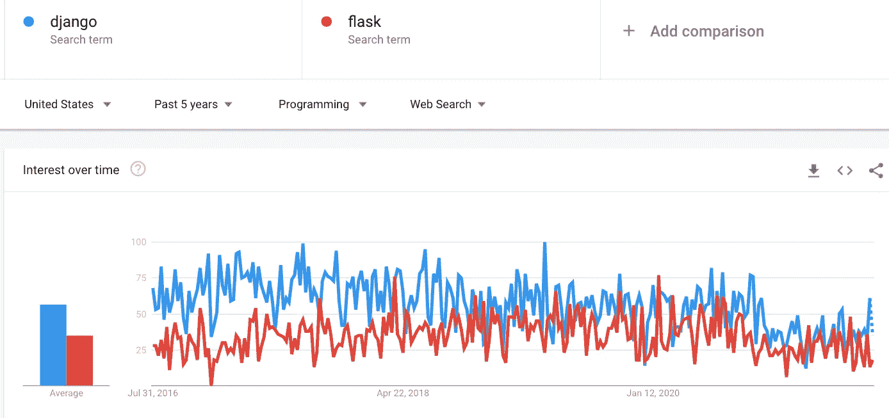

# 如何使用 Python 构建数据科学作品集网站

> 原文：<https://towardsdatascience.com/how-to-build-a-data-science-portfolio-website-using-python-79531426fde5?source=collection_archive---------4----------------------->

## 提高您的 Python 技能，同时构建您自己的数据科学组合网站。


由[设计生态学家](https://unsplash.com/@designecologist?utm_source=medium&utm_medium=referral)在 [Unsplash](https://unsplash.com?utm_source=medium&utm_medium=referral) 拍摄的照片

作为一名数据科学家，你需要有一个组合网站，帮助你在一个地方展示你的项目和个人资料。你可能已经有了 Github 和 LinkedIn 页面，但不要指望潜在雇主会浏览你所有的代码和帖子来了解你更多。

建立一个作品集网站可以像使用 WordPress 或 GitHub 模板一样简单；然而，自己创建一个网站将有助于您在学习 Python 中的新事物的同时添加更多的定制功能。

虽然建立一个网站通常需要 Python 之外的知识，但我们不需要成为其他编程语言的专家来创建一个作品集网站。这就是为什么我决定做这个指南，向您介绍构建和部署您的数据科学组合网站所需的基本材料。

```
**Table of Contents** 1\. [Planning the Website](#1b64)
 - [What to include](#2f09)
 - [Get a Custom Domain Name](#4e22)
2\. [How to Build the Website](#b188)
 - [Backends: Flask vs Django](#0d44)
 - [Front End: Bootstrap (+ HTML, CSS, Javascript)](#c39a)
3\. [Deployment](#2aa5)
```

# 规划网站

## 包括什么

在开始写代码来建立你的作品集网站之前，花些时间来计划网站将会有哪些部分。确保你的作品集网站至少有下面列出的部分。

*   作品集 **:** 这将是网站最重要的页面。列出迄今为止你完成的最重要的数据科学项目。添加简短描述和源代码链接。如果你已经写了一篇关于这个项目的文章，那么包括链接。
*   关于我:这个部分将帮助人们了解你的技能、背景和任何与你相关的事情。
*   联系方式:您应该在这里添加一个表单，以便人们可以填写他们的姓名、电子邮件，并写消息与您联系。除此之外，您还可以将链接添加到您的 GitHub 和 LinkedIn。

如果您完成了许多数据科学项目，并且有很多关于您作为数据科学家的经历要写，则在每个部分创建一个页面，然后添加一个总结其他部分的登录页面。然而，如果你没什么可写的，那么一页纸应该足够包含前面提到的所有部分。

如果有必要，添加更多的部分，使您的投资组合网站脱颖而出。

## 获取自定义域名

域名是网站的位置。它是用户在浏览器窗口中输入的文本，用来访问一个网站；例如，Google 的域名是`google.com`。

虽然我们还没有建立网站，但至少你应该检查一下你想要的域名的可用性。有很多域名注册商，比如 GoDaddy 和 NameCheap，你可以在那里看到该域名是否可用。

万一域名可用，不要等到建好网站再去买，否则几周或几个月后可能就不再可用了。域名通常很便宜，所以万一出了问题，你不会损失很多钱。

# 如何建立网站

## 后端:烧瓶 vs Django

用 Python 构建网站的两个最流行的框架是 Flask 和 Django。Django 是一个高级 Python web 框架，它使开发者能够在没有第三方库和工具的情况下创建网站。相比之下，Flask 是一个微框架，它提供了 web 应用程序的基本功能。它旨在保持其轻量级的简单性和可扩展的使用。

你应该使用哪一种？这在很大程度上取决于你项目的规模。Flask 更适合较小的、不太复杂的应用程序，而 Django 是为较大的、更复杂的、高负载的应用程序设计的。

如果你想创建一个简单的投资组合网站，Flask 可能是最好的选择。它不仅更适合小项目，而且最容易学习。Flask 比 Django 更 Pythonic 化，因为 flask Web 应用程序的代码大多数时候比 Django 代码更显式。这使得 Flask 对于 Python 编码人员来说很容易上手。

也就是说，如果你计划创建一个更复杂的多功能网站，你应该使用 Django。此外，如果你对 web 开发感兴趣，学习 Django 可能更有价值，因为它比 Flask 更受欢迎。下面是我在 Google Trend 上对这两个框架在 5 年内进行的网络搜索比较。



图片来源:谷歌趋势

上图显示 Django 比 Flask 更受欢迎。也就是说，学习这些框架将帮助您提高 Python 技能。在这篇[文章](https://betterprogramming.pub/python-backends-flask-versus-django-5de314fa70ff)中，你可以阅读到这两个框架的更深入的比较。

YouTube 上有很多免费的 Django 和 Flask 课程。我亲自观看了这个完整的 Django 系列，从中你可以学习如何构建一个博客应用程序。在同一频道还有一个[烧瓶](https://youtube.com/playlist?list=PL-osiE80TeTs4UjLw5MM6OjgkjFeUxCYH)系列。在学会基础知识后，我尝试的另一个项目是这个 [Django 电子商务网站](https://www.youtube.com/watch?v=_ELCMngbM0E&list=PL-51WBLyFTg0omnamUjL1TCVov7yDTRng)。完成这些课程后，你可以查看这个[视频教程](https://youtu.be/pLN-OnXjOJg)，它展示了一个非常基本的投资组合简历网站的介绍，因此你可以获得一些灵感，并开始建立自己的网站。

## 前端:引导(+ HTML，CSS，Javascript)

到目前为止，我们已经成功地建立了网站的骨架，但要使网站好看，我们需要使用其他工具。

Web 开发人员需要相当多的 HTML、CSS 和 Javascript 知识来创建一个网站；然而，如果我们的目标是创建一个基本的数据科学组合网站，我们可以使用 Bootstrap 节省几周时间来学习这些编程语言。

Bootstrap 是 HTML、CSS 和 JavaScript 工具的集合，用于创建和构建网页和 web 应用程序。使用 Bootstrap，我们可以专注于开发工作，而不用担心设计，并快速创建一个好看的网站。最重要的是，Bootstrap 是手机友好的，所以网站在手机上看起来仍然不错

这太棒了！多亏了 Bootstrap，我们不需要成为 JavaScript 或 CSS 方面的专家来让你的网站看起来更好(尽管我们仍然需要知道至少一些基础知识)。下面你可以找到一些基本的 Bootstrap 模板，你可以用在你的网站上。

*   [入门模板](https://getbootstrap.com/docs/4.3/getting-started/introduction/)
*   [导航标题](https://getbootstrap.com/docs/4.3/components/navbar/)

确保你遵循我之前提到的 Django/Flask 免费课程。在那里，您将发现何时以及如何在您的代码中实现这些引导模板。

*注意:正如我之前提到的，你至少应该了解 HTML、CSS 和 JavaScript 代码的基础知识。根据我的经验，HTML 的使用频率更高，所以可以考虑查看这个* [*免费 HTML 课程*](https://youtu.be/pQN-pnXPaVg) 。

# 部署

到目前为止，我们建立的网站只能在我们的本地机器上访问。很自然，我们想让所有能上网的人都能访问我们的网站，所以我们将使用 Heroku 来解决这个问题。

Heroku 是一个平台，允许我们轻松地部署和托管应用程序，而不需要我们自己手动设置一切。要使用 Heroku，你必须先[创建一个账户](https://signup.heroku.com/)。在这之后，你需要做一些事情来设置 Heroku。这个过程可能需要几分钟，所以请查看这个[视频教程](https://youtu.be/6DI_7Zja8Zc)，一步一步地学习如何用 Heroku 部署您的 web 应用程序。

注意:虽然你可以用 Heroku 免费主持一个项目，但是如果 30 分钟内没有网站流量，他们会让你的网站进入睡眠状态。如果有人访问您的网站，它会在短暂的延迟后变得活跃。要避免这种行为，可以升级到 Heroku 的爱好计划。

*就是这样！现在，您已经很好地了解了如何使用 Python 构建一个基本的数据科学组合网站。有了这个，你将能够定制你的网站，并学习我们用于数据科学的普通 Python 材料之外的东西。*

[**与 3k 以上的人一起加入我的电子邮件列表，获取我在所有教程中使用的 Python for Data Science 备忘单(免费 PDF)**](https://frankandrade.ck.page/bd063ff2d3)