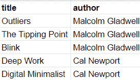
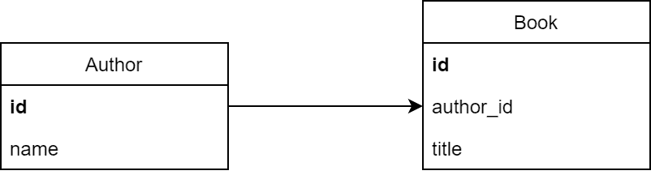
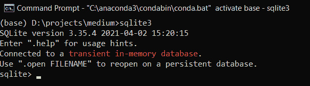
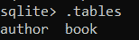
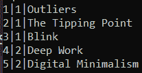
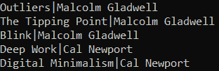

# 如何使用 Python 构建数据库

> 原文：<https://towardsdatascience.com/how-to-build-a-database-using-python-f4b62a19d190?source=collection_archive---------5----------------------->

## 使用 Flask-SQLAlchemy 库实现您的数据库，而不处理 SQL


泰勒·维克在 [Unsplash](https://unsplash.com/s/photos/server?utm_source=unsplash&utm_medium=referral&utm_content=creditCopyText) 上的照片

# 介绍

SQLAlchemy 是一个 Python 库，用于实现 SQL 数据库，而不使用 SQL 语言本身。换句话说，您需要做的就是使用 Python 语言实现您的数据库。

SQLAlchemy 是一个用于连接 Flask 项目中的 SQLAlchemy 库的库，它使您的数据库实现比以往任何时候都更容易。本文将向您展示如何使用 Flask-SQLAlchemy 库构建您的数据库。

没有进一步，让我们开始吧！

# 数据库ˌ资料库

在我们开始实现之前，让我向您解释一下数据库。什么是数据库？数据库是相互集成的数据集合，我们可以使用我们的计算机访问它。

在数据科学中，您可能会以电子表格的形式插入和分析数据。在软件开发领域，就有点不一样了。让我们来看看这个电子表格。



该图像由作者捕获。

在电子表格中，我们可以看到有两列。有书名和作者的名字。如果您查看 author 列，您会看到有些值重复了几次。这种情况我们称之为冗余。

将整个数据集用作一个表并不是最佳做法，尤其是对于那些想要构建网站或应用程序的人。相反，我们必须分离表，我们称之为规范化。

总之，规范化过程会将数据集分成几个表，每个表都包含唯一的标识符。我们将把每个标识符称为主键。如果我们分离上面的数据集，我们将得到如下所示的数据集:



该图像由作者捕获。

从上面可以看到，数据集已经被分成两个表。有图书表和作者表。作者的名字在作者表上。因此，我们不能像在电子表格中那样直接访问名称。

为了检索作者的名字，我们必须通过从 author 表中获取 id 来连接 Book 表和 Author 表。我们将作者的 id 作为 Book 表的外键。

也许这很复杂，但是如果你开始实现一个构建应用程序的数据库，它将提高你的应用程序的性能。

# 履行

## 安装库

在我们开始实现之前，我们需要做的第一件事是在我们的计算机中安装这个库。要安装它，我们可以使用 pip 来完成。以下是安装库的语法:

要加载库，我们可以调用下面的语法:

正如您从库的名称中所知道的，我们还需要加载 Flask 库。

## 启动数据库引擎

加载库之后，下一步是设置 SQLAlchemy 对象和数据库的路径。默认情况下，SQLAlchemy 附带 SQLite 软件。

SQLite 是一个数据库管理系统，我们可以在其中建立和分析我们已经建立的数据库。您可以使用其他 DBMS，如 MySQL、PostgreSQL 或您喜欢的任何 DBMS。要设置我们的数据库，请添加以下代码行:

这段代码将初始化 Flask 和 SQLAlchemy 对象，我们设置一个包含数据库路径的参数。在这种情况下，数据库路径是 SQLite:///C:\ \ SQLite \ \ library . db。

## 实现数据库

设置好对象和参数后，我们就可以开始实现数据库了。让我们回忆一下上面的数据库表:


该图像由作者捕获。

从上面可以看到，上面有两张桌子。每个表都有自己的类，我们可以在其中初始化列名和表之间的关系。我们将继承一个名为 Model 的类来实现我们的表。根据上图，代码如下所示:

## 插入值

创建类之后，我们可以构建数据库。要构建数据库，您可以访问终端并运行以下命令:

现在让我们尝试在我们的表上插入值。对于这个例子，让我们输入上面的电子表格中的数据。您可以按照下面的代码插入值:

## 查询该表

在表中插入值后，现在让我们运行查询来查看数据是否存在。下面是实现这一点的代码:

从上面可以看出，我们的提交是成功的。好吧，这仍然是一个介绍，但我希望你能掌握这个概念，并在一个更大的项目上实施它。

# 附加:SQL 查询

除了 Flask-SQLAlchemy 库之外，我还将向您演示如何使用本地 SQLite 访问数据库。我们这样做是为了确保已经在上面创建了数据库。要访问 SQLite，您可以打开终端并编写以下脚本:

```
**sqlite3**
```

之后，它会这样显示 SQLite 的界面:



该图像由作者捕获。

在下一步中，您可以使用。打开命令，将路径添加到数据库，如下所示:

```
**.open absolute//path//to//your//database.db**
```

为了确保我们已经打开了数据库，请写信。终端上的表格是这样的:

```
**.tables**
```

它会产生这样的结果:



该图像由作者捕获。

很好，有用。现在让我们尝试使用 SQL 语言来查询我们的数据库:

```
**SELECT * FROM books**
```

这是结果:



该图像由作者捕获。

现在让我们试着将两个表合二为一。您可以在终端上编写这行代码:

```
**SELECT Book.title, Author.name FROM Book
INNER JOIN Author ON Book.author_id = Author.id;**
```

这是结果:



该图像由作者捕获。

# 结束语

干得好！现在，您已经使用 Flask-SQLAlchemy 库实现了您的数据库。我希望这篇文章能帮助你在项目中实现数据库，尤其是当你想用 Flask 构建一个 web 应用程序的时候。

如果你对我的文章感兴趣，你可以在媒体上关注我，或者订阅我的时事通讯。还有，如果你有什么问题或者只是想打个招呼，你可以在 [**LinkedIn**](https://www.linkedin.com/in/alghaniirfan/) 上关注我。

谢谢你看我的文章！