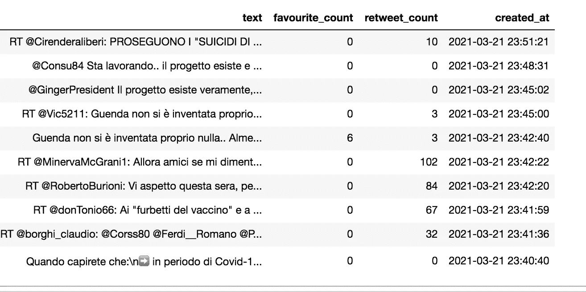
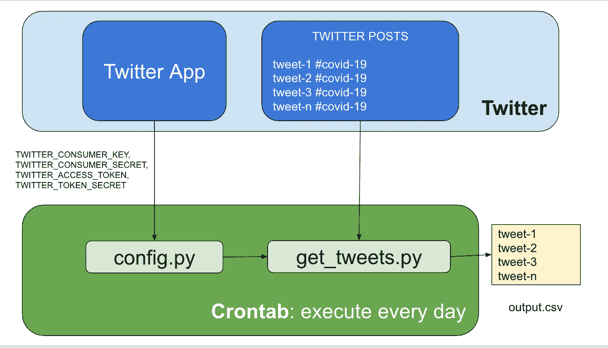
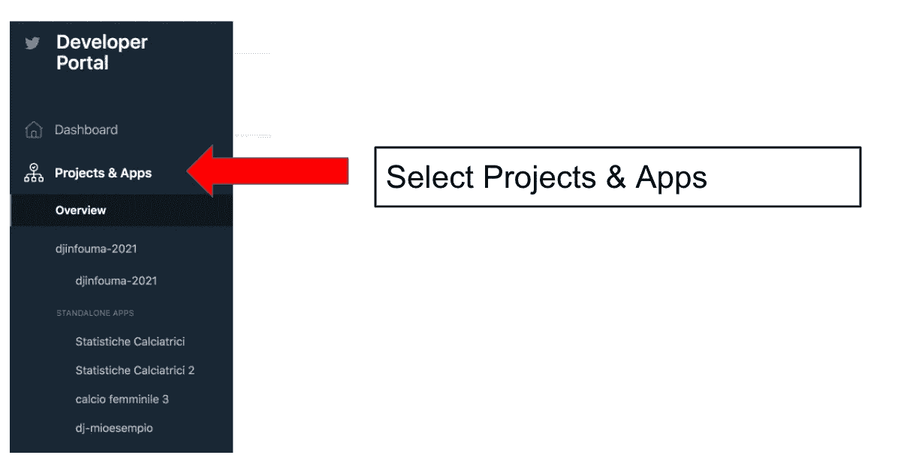
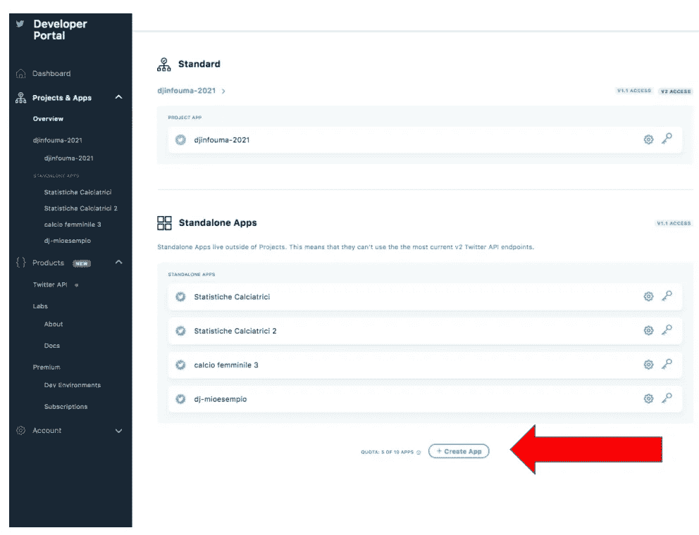
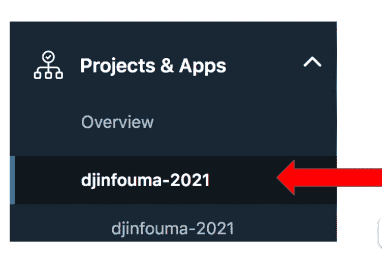
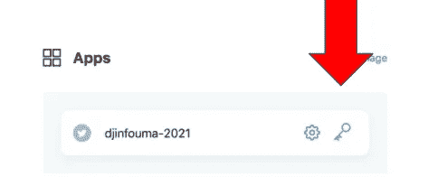
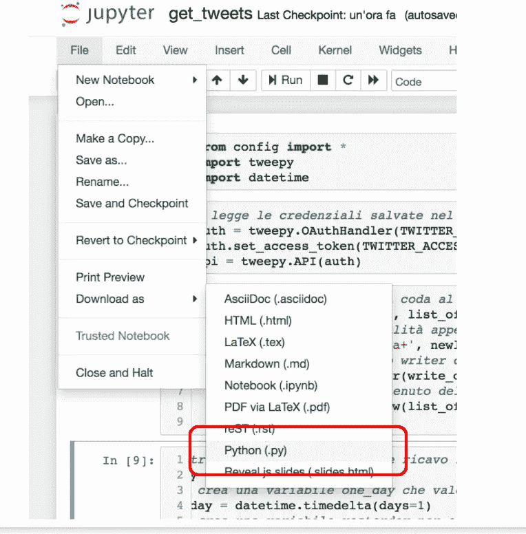

# 如何使用 Python tweepy 从 Twitter 构建数据集

> 原文：<https://towardsdatascience.com/how-to-build-a-dataset-from-twitter-using-python-tweepy-861bdbc16fa5?source=collection_archive---------6----------------------->

## 数据收集

## 一个快速教程和一个现成的脚本来提取推文


图片来自 [Pixabay](https://pixabay.com/?utm_source=link-attribution&utm_medium=referral&utm_campaign=image&utm_content=1795652) 的[照片混合](https://pixabay.com/users/photomix-company-1546875/?utm_source=link-attribution&utm_medium=referral&utm_campaign=image&utm_content=1795652)

在本教程中，我解释了一个使用`tweepy` Python 库从 Twitter 提取数据的非常简单的过程。代码可以从我的 [Github 库](https://github.com/alod83/data-science/blob/master/DataCollection/Twitter/get_tweets.ipynb)下载。

> 具体来说，我将实现一个策略，用#新冠肺炎标签提取前一天的推文，并实现每日提取的自动化。

您可以修改这段代码来提取其他标签。输出数据集如下所示:



作者图片

它包含文本、推文的收藏计数、转发次数和创建日期。

该软件的体系结构由以下元素组成，如下图所示:

*   Twitter 应用程序
*   获取推文
*   Cron 作业(配置为 crontab)



作者图片

# Twitter 应用程序

首先，我需要在 [Twitter 开发者网站](https://developer.twitter.com/)上注册一名 Twitter 开发者。如果我有一个 Twitter 账户，我可以使用它。我应该单击“Apply ”,然后按照向导进行操作。创建我的 Twitter 开发人员档案后，我可以进入 [Twitter 仪表盘](https://developer.twitter.com/en/portal/dashboard)并选择项目和应用:



作者图片

我创建了一个新应用程序:



作者图片

我跟随巫师。在向导结束时，我将提供的秘密注册在一个单独的文件中，名为`config.py`。该文件应该如下所示:

```
TWITTER_CONSUMER_KEY = 'PUT HERE YOUR API KEY'TWITTER_CONSUMER_SECRET = 'PUT HERE YOUR API SECRET'
```

向导结束时，新应用程序会出现在左侧的“项目和应用程序”标题下



作者图片

我点击新应用程序，然后点击关键符号:



作者图片

然后我生成访问令牌和密码，并将它们注册到`config.py`文件中。

```
TWITTER_ACCESS_TOKEN = 'PUT HERE YOUR ACCESS TOKEN'TWITTER_ACCESS_TOKEN_SECRET = 'PUT HERE YOUR SECRET TOKEN'
```

# 获取推文

我可以将 Get Tweet 脚本实现为 jupyter 笔记本，然后我可以将其下载为 Python 脚本。

这个脚本提取了与前天(昨天)相关的带有#新冠肺炎标签的所有推文，并将它们保存到一个. csv 文件中。我用的是`tweepy`库，可以用`pip install tweepy`命令安装。

首先，我导入名为`config.py`的配置文件，它必须位于这个脚本的同一个目录中。

```
from config import *
import tweepy
import datetime
```

我通过使用`OAuthHandler()`类和它的`access_token()`函数建立了到我们 Twitter 应用程序的连接。然后我通过`API()`函数调用 Twitter API。

```
auth = tweepy.OAuthHandler(TWITTER_CONSUMER_KEY, TWITTER_CONSUMER_SECRET)
auth.set_access_token(TWITTER_ACCESS_TOKEN, TWITTER_ACCESS_TOKEN_SECRET)
api = tweepy.API(auth,wait_on_rate_limit=True)
```

现在我安排约会。我需要设置今天和昨天。

```
today = datetime.date.today()
yesterday= today - datetime.timedelta(days=1)
```

我使用`Cursor()`功能在 Twitter 上搜索推文。我将参数`api.search`和查询字符串传递给游标，查询字符串是通过游标的参数`q`指定的。查询字符串可以接收许多参数，例如以下(非强制)参数:

*   `from:` -指定特定的 Twitter 用户资料
*   `since:` -指定搜索的开始日期
*   `until:` -为了指定搜索的结束日期，光标还可以接收其他参数，如语言和`tweet_mode`。如果`tweet_mode='extended'`，则返回 tweet 的所有文本，否则只返回前 140 个字符。

```
tweets_list = tweepy.Cursor(api.search, q="#Covid-19 since:" + str(yesterday)+ " until:" + str(today),tweet_mode='extended', lang='it').items()
```

现在我循环遍历`tweets_list`，对于每条推文，我提取文本、创建日期、转发次数和收藏数。我将每条推文存储在一个名为`output`的列表中。

```
output = []
for tweet in tweets_list:
    text = tweet._json["full_text"]
    print(text)
    favourite_count = tweet.favorite_count
    retweet_count = tweet.retweet_count
    created_at = tweet.created_at

    line = {'text' : text, 'favourite_count' : favourite_count, 'retweet_count' : retweet_count, 'created_at' : created_at}
    output.append(line)
```

最后，我将`output`列表转换为`pandas DataFrame`列表，并存储结果。第一次运行这个脚本时，我使用了没有任何其他参数的`to_csv()`函数。从第二次开始，我应该添加以下参数:`df.to_csv(‘output.csv’, mode=’a’, header=False)`，以便将结果追加到先前存储的输出中，并避免重写头。

```
import pandas as pddf = pd.DataFrame(output)
df.to_csv('output.csv')
```

现在，我可以通过在 jupyter 中选择相应的菜单来下载 Python 代码作为`.py` 脚本。



作者图片

# Cron 作业

cron 作业是调度一些重复性操作的一种方式。在这个例子中，cron 作业用于每天下载前一天的 tweets。
它要求运行 cron 作业的机器在将要运行 cron 作业时打开。

如果您有一台 Linux/Mac OS 计算机，您可以按照以下过程来配置 cron 作业:

*   打开终端并键入`crontab -e`
    该命令打开一个文本编辑器来插入、修改或删除一个任务
*   每个任务必须包含执行的时间和日期。顺序是分钟、小时、一月中的某一天、一月、一周中的某一天。您可以使用*来表示所有值
*   用
    `00 01 * * * python /<path_to_file>/get_tweets.py`
    插入新的一行。这将在每天凌晨一点运行脚本一次。

如果你有一台 Windows 10 机器，你可以按照[这篇文章](https://moreabout.tech/creating-cron-jobs-in-windows-10-and-windows-server-2016/#:~:text=Open%20the%20Windows%20start%20menu,too%20basic%20for%20cron%20jobs).&text=This%20will%20open%20a%20window,Server%202016%20or%20Windows%2010.)中描述的步骤来配置 cron 作业。

现在 Twitter 提取器已经准备好了！好好享受吧:)

# 摘要

在本教程中，我演示了如何通过 Python `tweepy`提取 tweets。这个过程需要三个步骤:Twitter 应用程序设置、代码编写和 cronjob 设置。

当您想要提取多个 hashtag 时，也可以使用所描述的机制。您可以简单地在查询字符串中添加您想要的所有标签。

如果你想了解我的研究和其他活动的最新情况，你可以在 [Twitter](https://twitter.com/alod83) 、 [Youtube](https://www.youtube.com/channel/UC4O8-FtQqGIsgDW_ytXIWOg?view_as=subscriber) 和 [Github](https://github.com/alod83) 上关注我。

# 相关文章

<https://medium.com/analytics-vidhya/how-to-extract-multiple-tables-from-a-pdf-through-python-and-tabula-py-6f642a9ee673>  <https://alod83.medium.com/how-to-extract-data-from-a-search-engine-through-python-and-selenium-35dfe6b20db>  <https://betterhumans.pub/6-tips-for-extending-your-knowledge-with-twitter-af2bc8c16bdb>  

# 保持联系！

*   在[媒体](https://medium.com/@alod83?source=about_page-------------------------------------)上跟随我
*   注册我的[简讯](https://medium.com/subscribe?source=about_page-------------------------------------)
*   在 [LinkedIn](https://www.linkedin.com/in/angelicaloduca/?source=about_page-------------------------------------) 上连接
*   在推特上关注我
*   跟着我一起去脸书
*   在 [Github](https://github.com/alod83?source=about_page-------------------------------------) 上关注我