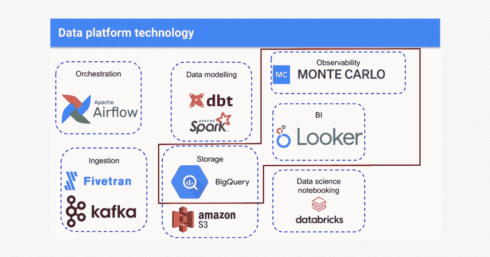
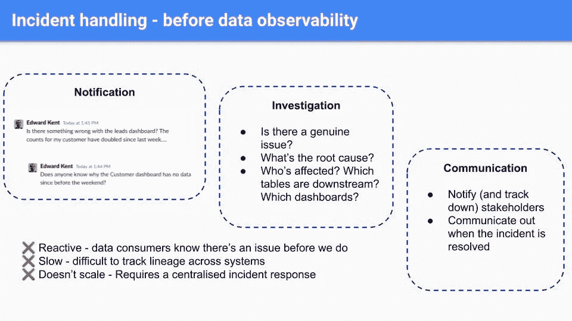
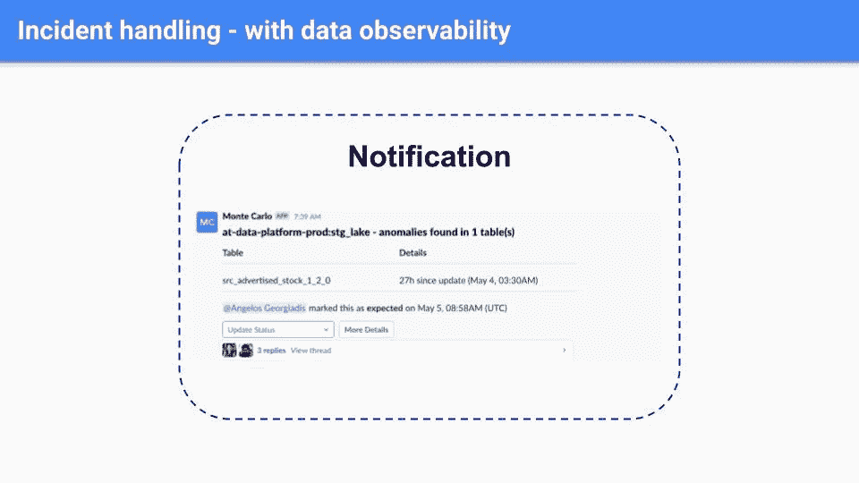
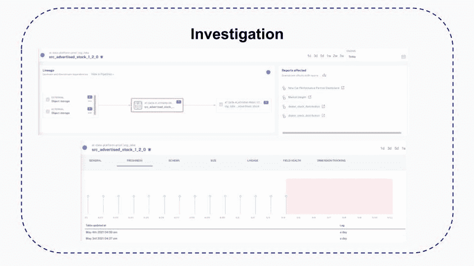
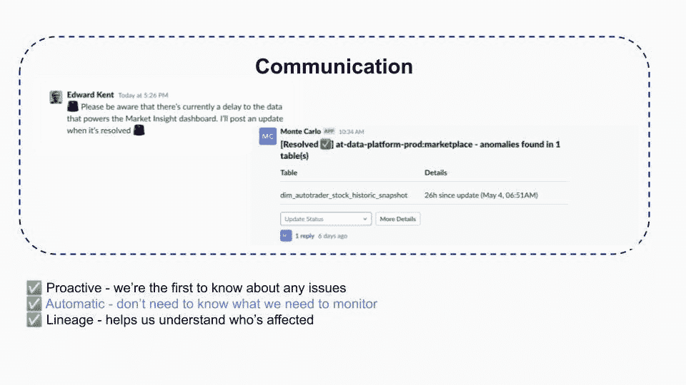
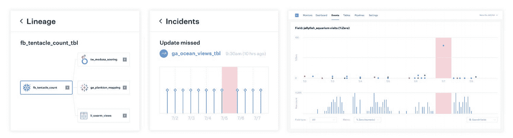
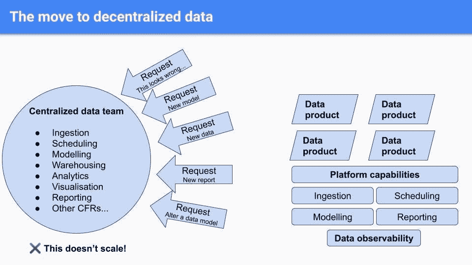
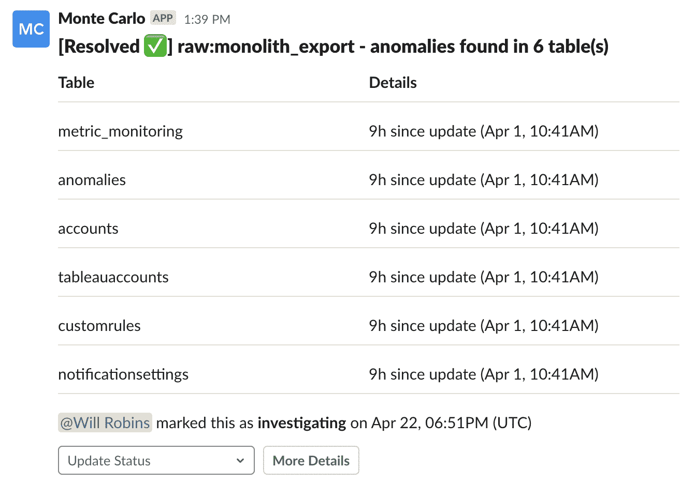

# 如何建立一个分散的数据平台

> 原文：<https://towardsdatascience.com/how-to-build-a-decentralized-data-platform-58158db6409b?source=collection_archive---------16----------------------->

## 一个数据工程团队通过端到端数据信任平衡自助服务平台需求的方法。

图片由 [Unsplash](http://www.unsplash.com) 上的 [Max](https://unsplash.com/photos/_uz8VplmZww) 提供。

[***数据平台***](/how-to-build-your-data-platform-like-a-product-6677e8abe318) *让数据变得比以往任何时候都更容易访问和操作——假设你可以信任它。下面是 Auto Trader 的数据工程团队如何构建一个兼顾分散数据所有权和可靠性的数据平台。*

总部位于曼彻斯特的 [**汽车交易商**](https://www.autotrader.co.uk/) 是英国和爱尔兰最大的数字汽车市场。对于汽车交易商来说，将数百万买家与数千卖家联系起来需要大量数据。

该公司每月有 2.35 亿次广告观看和 5000 万次跨平台访问，每分钟有数千次交互，汽车交易团队可以分析和利用所有数据点来提高效率、客户体验，并最终提高收入。从广告优化到报告，再到 ML 动力汽车估价，数据也为业务成果提供动力。

对于首席开发者 Edward Kent 和他的数据工程团队来说，收集和处理如此大量的数据绝非易事。最近，数据团队一直专注于两项关键任务。

> “我们希望让汽车交易商及其客户能够做出基于数据的决策，”Edward 说，“并通过自助服务平台实现数据访问的民主化。”

这些雄心勃勃的目标与向基于云的现代数据架构的迁移不谋而合，这意味着 Edward 和他的团队必须同时让更多团队更容易访问数据，同时建立对数据质量的信任。毫无疑问，这是一个不小的成就。

## 挑战:建立信任和支持自助数据

“随着我们将可信的内部系统迁移到云，这些旧系统的用户需要相信新的基于云的技术与他们过去使用的旧系统一样可靠，”Edward 说。

如今，Edward 和他的团队拥有强大的数据堆栈。他们通过 Kafka 和 Fivetran 接收数据，在 Apache Airflow 中处理编排和调度，在 BigQuery 和亚马逊 S3 中存储数据，使用 dbt 和 Apache Spark 进行建模，使用 Databricks 进行数据科学记事本，并通过 Looker 向内部消费者提供表面数据。

这些数据吸引了很多眼球。超过 **500 名活跃用户**(超过所有汽车交易商员工的 50%！)每个月都会登录并使用 Looker 中的数据，包括财务报告等复杂、备受瞩目的数据产品。当然，随着海量数据和多层技术堆栈的出现，数据管道出现故障的机会也越来越多，而这些事件几乎总是由 500 个数据消费者中的一个首先注意到。

Edward 和他的团队需要解决 [**数据宕机**](https://www.montecarlodata.com/the-rise-of-data-downtime/) (他们的数据不完整、错误或不准确的时间段)以提高信任度，但与此同时，这也成为了公司其他部门的瓶颈。他们的数据工程师集中团队处理与数据运营相关的一切事务，从构建新管道和报告的请求，到调查数据质量问题的紧急电话。这种方法无法扩展，并导致请求积压，这促使 Edward 和他的团队制定了一项计划，为企业消费者构建一个抽象的自助式平台，供他们自己使用。

> “我们不希望让一个数据团队做所有的事情，而是希望给团队平台级的能力和自主权来构建他们自己的数据产品，”Edward 说。“理想情况下，我们希望让团队管理数据管道生命周期中的一切。所以从摄取到建模到报警，等等。因此，在这种背景下，我们希望将数据可观察性作为一种平台功能来提供。”

## 解决方案:分散数据所有权

图片由爱德华·肯特提供。

为了实现数据信任和分散数据责任，Auto Trader 希望在 BigQuery 和 Looker 之上添加一个监控、警报和沿袭层，big query 和 Looker 是其数据堆栈中可见性最高的层。

“对我们来说，现在比以往任何时候都更重要的是，我们提供的数据是正确、准确和最新的，”Edward 说。

Auto Trader 使用自动化数据可观察性对 BigQuery 中的所有表执行容量和新鲜度检查，以及模式更改警报。Edward 的团队还在几十个关键表中选择了一套 ML 驱动的统计检查，从而轻松获得列级置信度，而无需定义阈值的繁琐过程。这种方法还帮助他们了解了数据中的所有依赖关系。

“我们发现很难理解 BigQuery 中的哪些表出现在 Looker 的哪些报告中，反之亦然，”Edward 说。“跨这两个系统的自动血统跟踪对我们来说非常强大。”

## 结果:建立信任的事件跟踪

在迁移到云之前，当内部消费者向他们发送关于看起来不太正确的 Looker 报告的松散消息时，数据工程团队会发现数据质量问题。

图片由爱德华·肯特提供。

然后，数据团队必须 a)调查是否存在真正的问题；b)尝试确定 [**的根本原因**](https://www.montecarlodata.com/the-data-engineers-guide-to-root-cause-analysis/)；c)找出哪些表或仪表板在下游，哪些消费者会受到影响；d)最后，跟踪并通知相关的利益相关方，告知他们发现了问题，估计问题何时会得到解决，并在问题解决后再次跟进。

爱德华将这一过程描述为“被动的、缓慢的、不可扩展的”

现在，当检测到可能的事件时，Edward 的团队会收到延迟通知。

图片由爱德华·肯特提供。

由于自动化的端到端沿袭，他们可以更快地调查问题，这有助于数据工程师了解可能的上游和下游影响，直到现场级别，并提供对新鲜度、量和分布变化的可见性，这有助于他们查看更新模式并注意可疑的变化。

图片由爱德华·肯特提供。

沟通也是精简的。Edward 的团队不需要追踪利益相关者——再次使用沿袭——并且可以向相关团队的 Slack 通道发送关于问题和解决方案的通知。

图片由爱德华·肯特提供。

随着自动化监控和警报的实施，以及 lineage 加快了事件解决的速度，数据工程团队通过在下游消费者发现问题之前主动解决数据问题，与利益相关方建立了更大的信任。

## 结果:可扩展的监控和对“未知的未知”的可见性

Edward 还将机器学习动力监控归功于他们的分散式方法。

“为了开始获得价值，我们不需要知道我们需要监控什么，”Edward 说。“我们的 ML 可以开始寻找模式，并提醒我们任何异常和偏离这些模式的情况。”

图片由巴尔·摩西提供。

例如，他们的数据可观察性平台在一个很少删除的表中发现了 150，000 行的意外删除。一名数据工程师能够深入到 UI 中，并注意到一个通常只看到添加的表被删除了。使用沿袭跟踪，他们可以查看数据的上游是什么，看到它是通过 ETL 从外部来源进入的，然后去与数据所有者核实，看看这是否合法和有意的，或者是否有什么地方出错了。

“在这种情况下，不需要采取任何行动，”爱德华说。“但知道我们的数据正在发生这种事情真的很有价值，因为这给了我们信心，如果真的有问题，我们会以同样的方式发现它。”

数据工程团队使用定制的 SQL 规则和 dbt 进行手动测试，但由于其数据的规模，依赖数据可观察性作为其平台的基石，因此他们可以捕捉“ [**未知的未知的**](https://www.montecarlodata.com/the-new-rules-of-data-quality/) ”。

“无论是自定义 SQL 规则还是 dbt 测试，您都必须进行预先配置，”Edward 说。“你必须事先知道你要监控的是什么，并经历设置它的过程。对我们来说，我们每天都要定义数百个数据模型和构建数百个表。我们想要的是能够有效地启动并运行的东西，而不需要我们付出努力。模式检查、卷检查、新鲜度检查都可以做到这一点。”

## 成果:增强汽车交易商的自助服务数据平台

图片由爱德华·肯特提供。

这种新方法还支持汽车交易商向分散的自助式数据计划过渡，而不会影响数据质量。

在这种新模式下，分散的警报被发送到适当的团队警报通道。Edward 和他的团队要求将数据所有权和警报与 dbt 中的其他属性一起定义为元数据。yaml 文件，因此拥有特定数据集的产品团队将自动接收到他们自己渠道的警报。

图片由爱德华·肯特提供。

> “分散的数据所有权意味着分散的数据质量责任，”Edward 说。“数据可观察性有助于我们提供这种平台能力。”

## 汽车交易商分散数据所有权的影响

随着汽车交易商寻求在开放访问的同时建立对数据的信任，数据可观察性是确保数据保持准确和可靠的关键。

“我们对数据的了解比以往任何时候都要多得多，”Edward 说。“以前，这些问题中有许多会被数据消费者发现并报告，但现在却被标记出来。从跟踪的角度来看，这种可见性对我们非常重要，因为我们正在向一个分散的数据平台迈进。”

***对学习如何构建更可靠的数据平台感兴趣？把手伸向巴尔摩西和其余的*** [***蒙特卡洛团队***](http://www.montecarlodata.com) ***！***

*特别感谢 Edward Kent 和 Auto Trader 的数据工程团队的其他成员！*