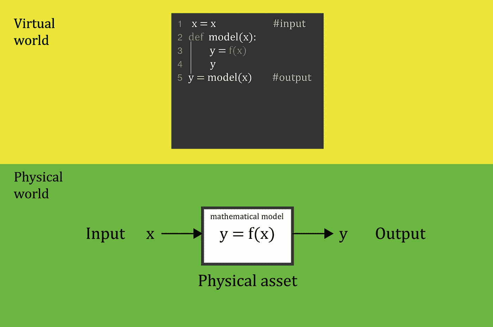
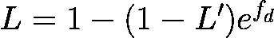
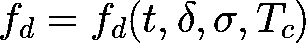
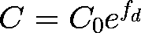
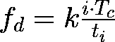
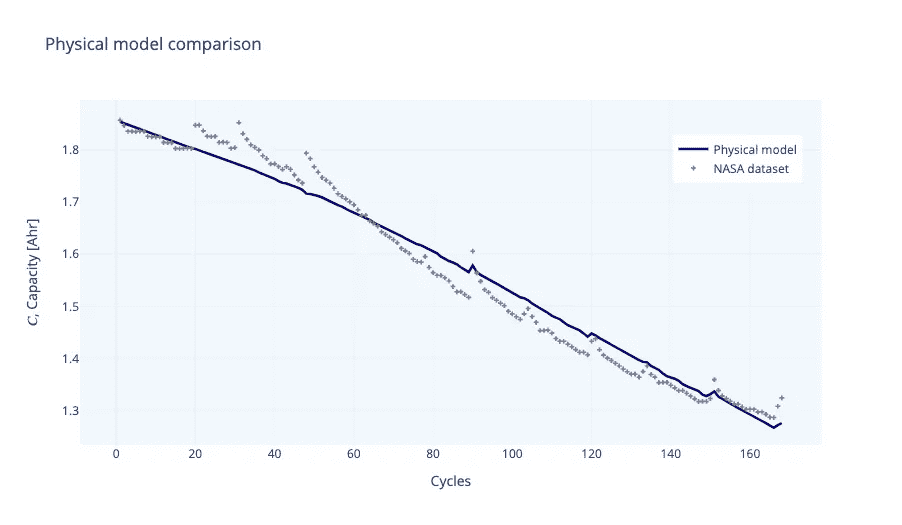
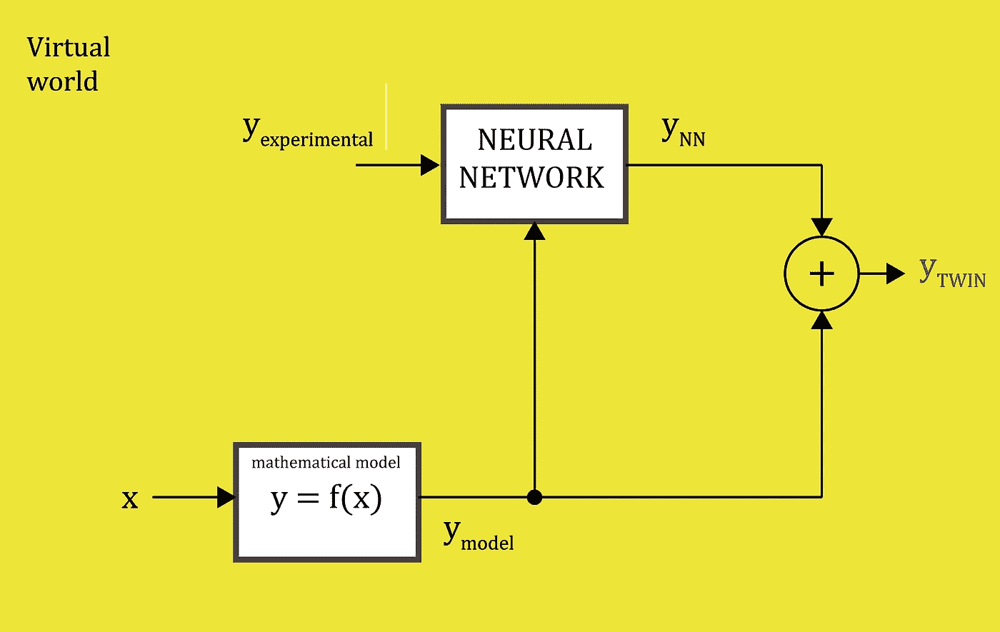
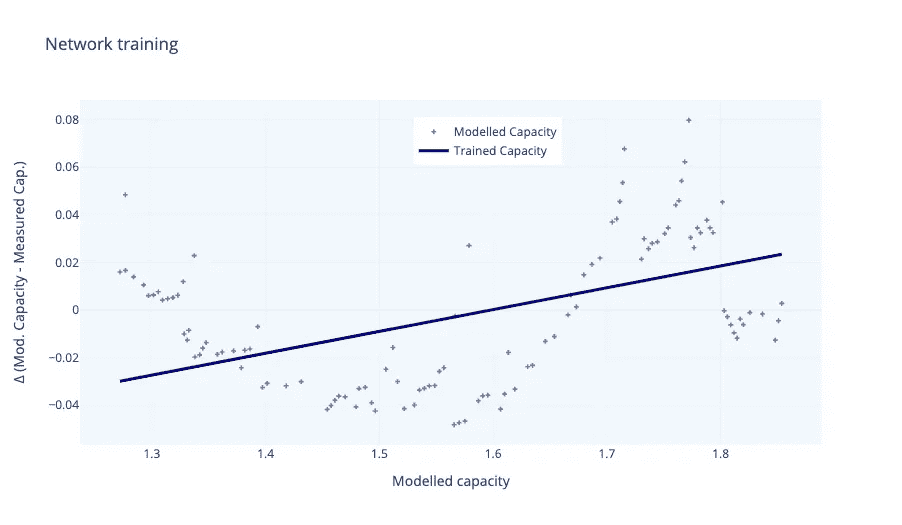
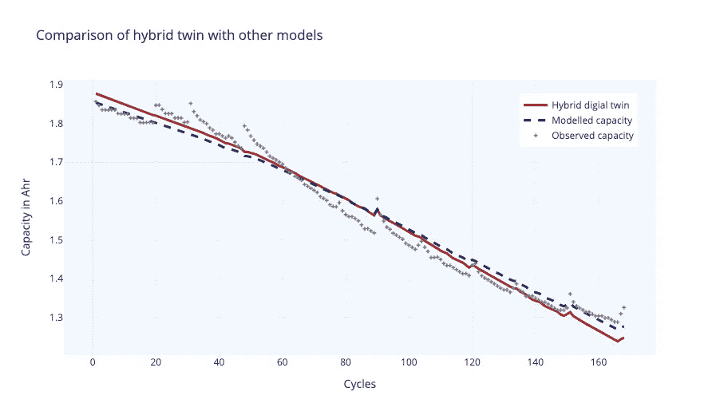
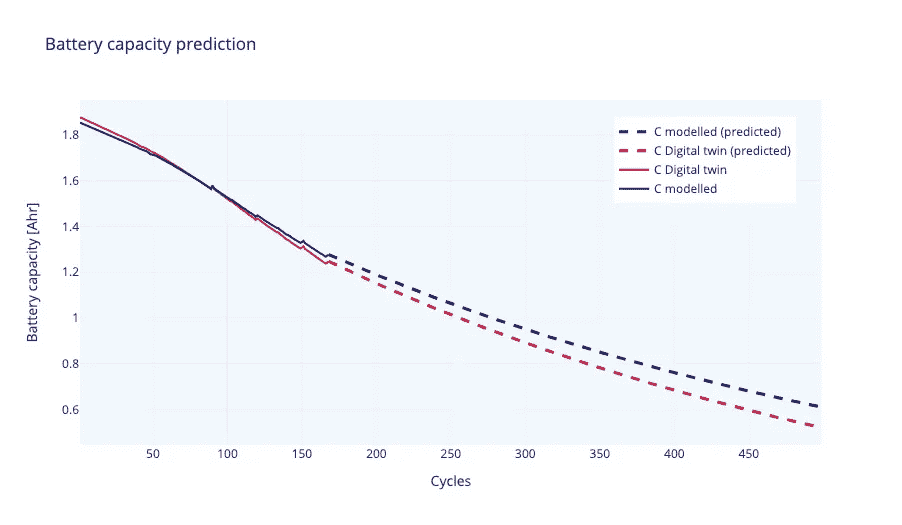

# 如何用 Python 构建数字双胞胎

> 原文：<https://towardsdatascience.com/how-to-build-a-digital-twin-b31058fd5d3e?source=collection_archive---------3----------------------->

## [思想和理论](https://towardsdatascience.com/tagged/thoughts-and-theory)

## 锂离子电池数字孪生的 Python 实现


图片由 Pedro Figueras - Pexels 提供。哈维尔·马林插图。

在本教程中，我们将展示如何用 Python 创建一个简单而实用的数字孪生体。锂离子电池将是我们的有形资产。这个数字孪生将使我们能够分析和预测电池行为，它可以集成到任何虚拟资产管理工作流程中。

# 虚拟系统和数字双胞胎

D 数字双胞胎是工业 4.0 的重要组成部分。其基本原理是在虚拟世界中复制物理资产，以便对其动态进行建模。想象一下，我们在城市水管网的某个地方有一台水泵。水泵消耗能量，并以水流和压力的形式释放出来。术语“复制品”指的是能够模拟这种行为的虚拟对象的创建。

该泵是整个水管网系统的一部分，还有管道、阀门、仪表和其他附件或子系统。这些子系统都是相互联系的。虚拟化系统需要对所有子系统进行同样的操作。之后，我们可以模拟整个系统，包括它的依赖关系。虚拟系统的目标是模拟现实世界，以便引入变更、评估性能或预测该资产或子系统所涉及的场景(例如维护任务)。

如前所述，数字孪生是代表一个子系统的虚拟对象。这个“双胞胎”应该和它的“物理双胞胎”一样对输入变量做出反应。这个虚拟对象必须集成一个模型才能做到这一点。数字双胞胎最重要的特征是一个可以在数字环境中模拟“物理”行为的模型。请记住，当我们说“物理”时，我们指的是任何真实世界的实体(可以是锂离子电池、水泵、人、城市或猫)。任何可以建模的东西都可以被虚拟化(图 1)。



**图一。**通过模型从物理世界到虚拟世界。图片作者。

# ba 电池上锂-i **的数字模型**

可充电锂离子电池是一种尖端的电池技术，其电化学依赖于锂离子。除了便携式技术设备之外，这些电池对于电动汽车和配电网络中的能量存储等应用来说也是重要的资产。这些电池最关键的方面是它们的老化成本。经过反复充放电循环后，电池的电池会退化，导致充电容量减少。这种现象一直是开发更持久电池的关键研究领域。它的建模同样也是一个有争议的话题。电池退化对上述技术规划和操作具有重要影响。

电池寿命下降的物理过程相当复杂。近年来，人们提出了一些测量电池寿命损失的半经验锂离子电池退化模型(Chu et al .，2018；Laresgoiti 等人，2015 年)。报废电池通常被描述为只能提供其额定最大容量 80%的电池。使用其中一个经验模型(Chu 等人，2018 年)，这种退化可以写成如下:



**方程式 1。**电池续航时间。

其中𝐿是电池寿命，是初始电池寿命， *d* 是每单位时间和每循环的线性化退化率(Chu 等人，2018)。该速率可以写成是*放电时间-* 𝑡、*放电循环深度-δ、*平均充电循环状态- *σ* 和电池温度-𝑇𝑐.的函数



**方程式 2** 。线性化降解速率。

# 实验数据

我们的模型必须根据我们掌握的信息来预测电池寿命。但是，我们希望将该模型与测量值进行比较，以确定我们的模型的准确性。让我们暂停一会儿。

> 许多数字双胞胎并不基于精确的物理模型，只使用实验数据集和机器学习算法。这是一种非常酷的做事方法。例如，他们可以使用深度神经网络建立一个模型来捕捉数据的真实动态。然而，为了获得可靠的通用模型，将该模型推广到其他对象需要处理大量样本。另一方面，当处理物理模型时，我们需要较少的数据来获得准确的通用模型。

我们将利用锂离子电池充放电循环的真实数据来构建我们的数字双胞胎。我们将使用美国宇航局艾姆斯预测卓越中心(PCoE)提供的锂离子电池老化数据集。这个数据集对于确定我们的物理模型的准确性和改进它将是有价值的。我们将使用与 5 号电池相关的数据。我们将绘制出*“容量”*特征与循环次数的关系，并将其与我们的物理模型进行比较。在我们开始之前，我们将用变量𝐿( *电池寿命*代替 *C* ( *电池容量*)。等式 1 将被写成如下:



其中，𝐶是电池容量，𝐶_0 是初始电池容量。对于𝑓𝑑，我们使用了以下近似值:



其中，𝑖是充电-放电循环，𝑇𝑐是循环期间在电池中测量的温度，𝑡𝑖是放电时间，𝑘和经验常数的值为 *0.13* 。



**图二**。实验数据与我们的半经验模型的比较。图片作者。

图 2 展示了结果。我们的模型精确地预测了观察值(我们得到平均绝对误差——MAE 为 0.004)。该模型应该收集电池容量行为，其中容量在第一个循环期间缓慢降低，然后在特定点之后加速。这些变化是微妙的，许多工程师利用简单的线性模型来近似这种行为。我们的模型是半经验的，包括各种调整以避免处理 PDEs ( *偏微分方程*)。

# 构建混合数字双胞胎

我们可以用我们的“模型”来直接创建一个数字双胞胎。但是，为了应用机器学习，我们将使用它来改进我们的模型，使用来自 NASA 数据集的实验数据。我们的建议如图 3 所示。



**图 3。**创造混合数字双胞胎。图片作者。

我们正在使用实验数据改进我们的数学，并使用神经网络改进我们模型的输出。

```
**#Define inputs and outputs****# input: the simulation capacity**
X_in = (dfb['C. Capacity'])**# output: difference between experimental values and simulation** X_out = (dfb['Capacity']) - (dfb['C. Capacity']) X_in_train, X_in_test, X_out_train, X_out_test = train_test_split(X_in, X_out, test_size=0.33)
```

我们使用一个非常简单的神经网络:

```
model = Sequential()
model.add(Dense(64, activation='relu', input_shape=(1,)))
model.add(Dense(32, activation='relu'))
model.add(Dense(1))
```

编译:

```
epochs = 100
loss = 'mse'
model.compile(optimizer = SGD(learning_rate=0.001),          
                          loss=loss,
                          metrics=['mae'], **#Mean Absolute Error** )
history = model.fit(X_in_train, 
                    X_out_train, 
                    shuffle=True, 
                    epochs=epochs, 
                    batch_size=20, 
                    validation_data=(X_in_test, X_out_test),
                    verbose=1)
```

比较的结果:



**图 4** 。模型结果与实验结果的比较。图片作者。

正如我们在图 4 中看到的，神经网络学习了我们的数学模型和实验结果之间的差异的基本理解。现在我们可以把这种学习加入到我们的数学模型中来改进它:

```
**# Our digital twin by improving our model with experimental data**
X_twin = X_in + model.predict(X_in).reshape(-1)
```

仅此而已。我们有我们的数字双胞胎(或混合双胞胎):

*   我们创造了一个物理模型(或数学模型)
*   我们将我们的模型与实验数据进行了比较。
*   通过这种比较，我们能够改进我们的模型。

最后，在我们的虚拟环境中，我们有一个这种电池的“双胞胎”,预计其性能与现实世界中的电池相似。接下来，我们将对比我们的数学模型和数字模型:



**图 5** :数学模型与“混合”数字孪生的最终比较。图片作者。

图 5 显示了我们的数字孪生兄弟如何适度地改进了我们的模型。混合数字孪生的好处是，它允许我们采用半经验的数学模型，并使用实验数据来完善它。它具有优于两者的优点，一个是特别的数学模型，因为它可以改进，另一个是 ML 模型，因为它更通用(因此可以应用于例如其他电池，获得比单独的 ML 模型更好的精度)。

**预测**

通过我们的数字孪生兄弟，我们可以做出预测，以便操作锂离子电池。



**图六。**使用数字双生子和数学模型进行预测。图片作者。

# 结论

数字双胞胎是工业 4.0 领域的新兴话题。我们已经展示了如何使用 Python 制作一个最小的数字孪生。当我们有实验数据集时，我们可以展示“混合”数字双胞胎如何成为虚拟化资产的更现实的方式。此外，开发可靠的模型需要较少的数据。我们可以将更多未来的实验数据测量添加到我们的数字双胞胎中，以进一步改进我们的数学模型。

## 图书馆

我们使用 [Keras](https://keras.io/) 库用于 NN，使用 [Plotly](https://plotly.com/python/) 用于 plots。

## 感谢

致汉堡理工大学 Merten Stender 教授， [m.stender@tuhh.de](mailto:m.stender@tuhh.de) 及其作品 Digital twin for structural dynamics applications([此处](https://github.com/mertstend/DigitalTwin_Tutorial))。

## 代码和数据

您可以在 [repo](https://github.com/Javihaus/Digital-Twin-in-python) 中找到该代码，并在此处找到数据[(锂离子电池老化数据集)](https://data.nasa.gov/dataset/Li-ion-Battery-Aging-Datasets/uj5r-zjdb)。

# 引文

*   B.徐、a .乌达洛夫、a .乌尔比格、g .安德森和 D. S .克尔申。(2018).用于电池寿命评估的锂离子电池退化建模。IEEE 智能电网汇刊第 9 卷第 2 期第 1131-1140 页。doi: 10.1109/TSG.2016.2578950。
*   I .拉雷斯戈伊蒂、s .卡比茨、m .埃克和 D. U .绍尔。(2015).模拟锂离子电池在循环过程中的机械退化:固体电解质相间断裂。能源杂志，第 300 卷，第 112-122 页。