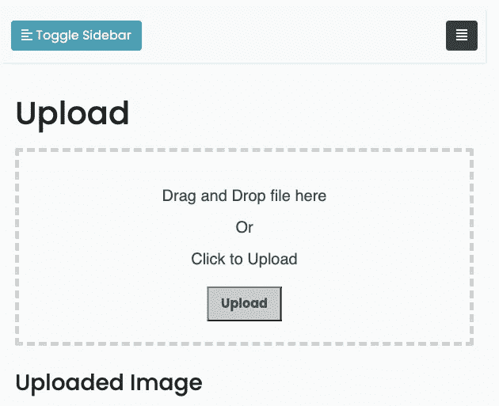
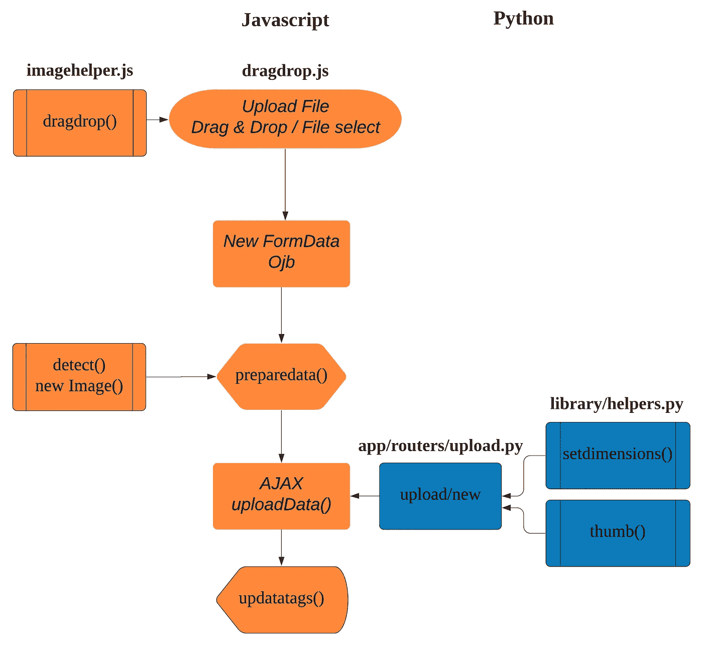
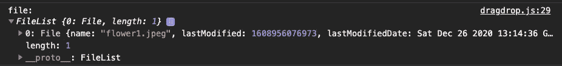
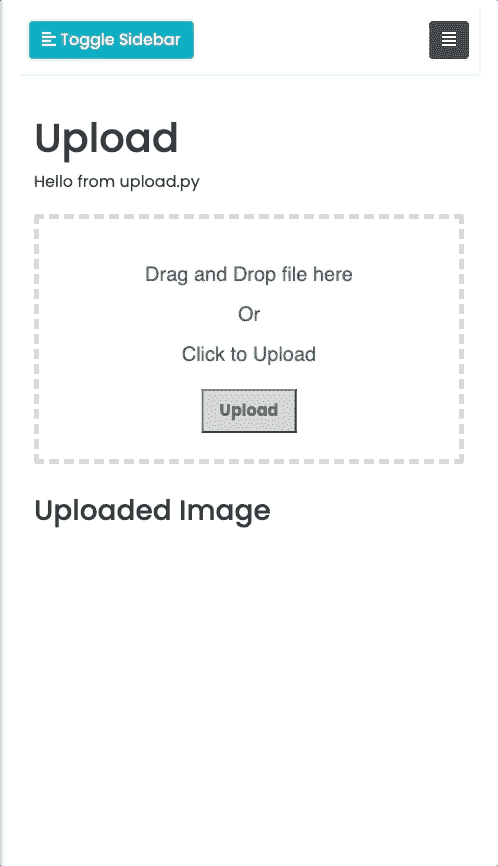
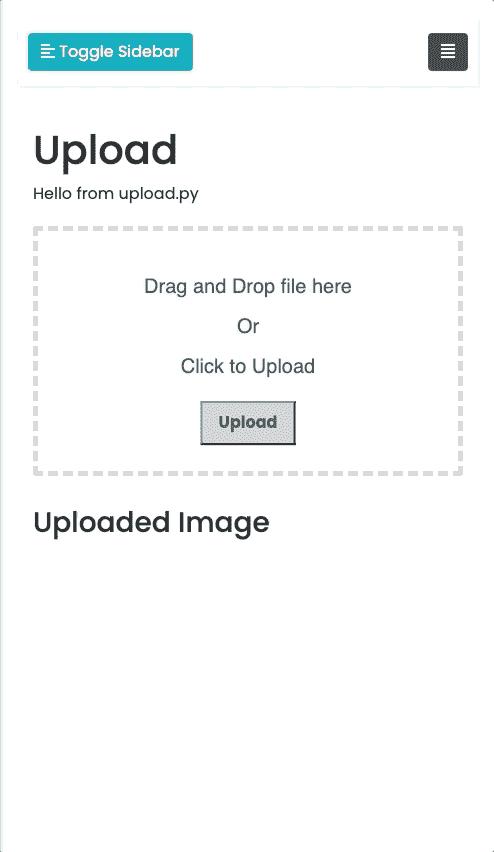

# 如何用 FastAPI 和 JavaScript 构建一个拖放表单

> 原文：<https://towardsdatascience.com/how-to-build-a-drag-drop-form-with-python-javascript-f5e43433b005?source=collection_archive---------10----------------------->

## 创建上传文件表单的分步教程


[由故事创建的云向量——www.freepik.com](https://www.freepik.com/vectors/cloud)

[更新:2022–1–5 引导程序 5]

```
**Table of Contents**
· [Introduction](#bf70)
· [Set-Up](#8b46)
· [Installing Python Packages Using requirements.txt](#5c70)
· [Structure](#ea1a)
· [Creating the Upload Page](#66a4)
  ∘ [① How to add a router in app/main.py](#e2ac)
  ∘ [② Adding a link to the templates/include/topnav.html](#3174)
  ∘ [③ Creating a controller app/routers/upload.py](#7931)
  ∘ [④ Creating a view page, templates/upload.html](#64d7)
· [Creating Upload Area](#577b)
  ∘ [Updating upload.html](#b8e6)
· [Plan of Procedure](#8a8f)
· [Adding Drag & Drop Functions](#af7f)
· [Python Codes](#1b9a)
· [Adding the upload/new Post Method](#5b10)
· [Demo Using Drag and Drop](#1613)
· [Demo Using File Select](#0db0)
· [Conclusion](#baaf)
· [Updates](#0bcc)
· [References](#fc90)
```

# 介绍

本文展示了如何使用 Python 和 Javascript 构建一个拖放表单。上传文件允许用户在你的应用上分析他们的数据或图像。我们在本教程中使用 FastAPI [1],但是您可以将它应用到 Flask 或其他 Python 框架中。FastAPI 是一个现代的高性能 web 框架，用于基于标准 Python 类型提示用 Python 3.6+构建 API。HTML 拖放[2]接口使应用程序能够在浏览器中使用拖放功能。

随文章编码或抓取[最终编码](https://github.com/shinokada/fastapi-webstarter-demo)。

[演示](https://fastapi-webstarter-demo.deta.dev/)

(选项)这些文章，“[创建虚拟环境](/python-environment-101-1d68bda3094d#258a)”和“[使用 Gitstart 创建 GitHub 存储库](/automate-creating-a-new-github-repository-with-gitstart-1ae961b99866)”将帮助您设置 Python 环境。如果你想免费托管你的 FastAPI 应用，请阅读“[如何在 Heroku Free 上部署 FastAPI 应用](/how-to-deploy-your-fastapi-app-on-heroku-for-free-8d4271a4ab9)”。

# 设置

我们在 [FastAPI Web Starter](https://levelup.gitconnected.com/building-a-website-starter-with-fastapi-92d077092864) 之上构建应用程序。FastAPI Web Starter 是一个用 FastAPI 和 Jinja 构建的静态网站。

```
$ git clone [git@github.com](mailto:git@github.com):shinokada/fastapi-web-starter.git
$ cd fastapi-web-starter
```

# 使用 requirements.txt 安装 Python 包

在根目录下创建`requirements.txt`文件。

我们将`Pillow`添加到 FastAPI Web Starter 的`requirements.txt`中。`Pillow`【3】是一个 Python 成像库。

使用此 rquirements.txt 安装 Python 包:

```
$ pip install -r requirements.txt
```

运行服务器:

```
$ uvicorn app.main:app --reload --port 8000
```

请访问 [http://127.0.0.1:8000/](http://127.0.0.1:8000/)

# 结构

FastAPI Web Starter 拥有大部分文件。我们将在本文中创建丢失的文件。

# 创建上传页面

让我们创建一个新页面。我们需要在`app/main.py`中添加①一个路由器，②顶部菜单中的一个链接，③一个控制器`app/routers/upload.py`，④一个查看页面。

## ①如何在 app/main.py 中添加路由器

我们在`app/main.py`中为`upload`增加一条新的路线:

[完整代码](https://gist.github.com/shinokada/8615843fd1d68cd92b9c355e081e91cc)

```
...
from app.routers import upload, twoforms, unsplash, accordion
...
app.include_router(upload.router)
```

我们从`app.routers`导入`upload`，包含路由器`upload.router`。这让我们可以访问[http://127 . 0 . 0 . 1:8000/upload](http://127.0.0.1:8000/upload)。

## ②向 templates/include/topnav.html 添加链接

[完整代码](https://gist.github.com/shinokada/9a3c8081f351f6e7c7d30727bd9f3064)

```
<li class="nav-item {{'active' if active_page == 'upload' }}">    
    <a class="nav-link" href="/upload">Upload</a>          
</li>
```

我们使用 Jinja 的 if 语句来检查`active_page`是否为`upload`。如果是这样，它将添加`active`类。

## ③创建控制器 app/routers/upload.py

第 1 行:我们导入 FastAPI 的 APIRouter。我们可以将这个文件包含在`app/main.py`中。

第 5 行:我们创建一个`APIRouter`对象，`router`。

第 9-12 行:我们使用 URL 为`/upload`的`get`方法。我们使用`HTMLResponse`返回一个名为`upload.html`的 HTML 文件。现在，我们向 HTML 文件返回一个变量`result`。

## ④创建视图页面，templates/upload.html

第 1 行:我们扩展了 FastAPI Web Starter 中的`[base.html](https://gist.github.com/shinokada/47e29b95570ccb3950b8e2d77b8abb4d)` [。](https://gist.github.com/shinokada/47e29b95570ccb3950b8e2d77b8abb4d)

第 2 行:我们将`active_page`设置为`upload`。这确保了它将在顶部导航菜单中添加`active`类。

第 12 行:显示`result`。

让我们启动服务器:

```
$ uvicorn app.main:app --reload --port 8000
```

访问[http://127 . 0 . 0 . 1:8000/upload](http://127.0.0.1:8000/upload)


# 创建上传区域

## 更新 upload.html

我们将在`templates/upload.html`中创建一个 div `upload-area`。

第 17 行:因为我们不仅允许用户拖放，还允许用户**选择要上传的文件**，所以我们也添加了一个提交按钮。

第 37 行:添加`dragdrop.js`。请注意`type="module"`。这允许我们在`dragdrop.js`中导入另一个 javascript 文件。

让我们为`static/css/mystyle.css`中的上传页面添加一些样式:

现在页面看起来像这样:



上传区。图片作者。

# 程序计划

以下流程图是按顺序上传文件的总结过程。对于本例，我们将上传一个图像文件并创建一个缩略图。



有序的总结过程。图片作者。

我们用 JavaScript 处理大部分过程，用 Python 创建一个缩略图。我们将在下一节中逐一介绍上述过程。

# 添加拖放功能

`static/js/imagehelpers.js`有两个功能。

`detect()`函数查找图像的宽度和高度。它接受一个图像 URL 和一个回调。它创建一个新的图像对象，并使用 URL 分配图像`src`。我们找到图像的宽度和高度，并在回调中使用它们。我们将使用图像的宽度和高度来确定缩略图的宽度和高度。

在`dragdrop()`函数中，我们使用`dragger`、`drop`和`dragenter`事件来改变用户在`upload-area`上拖动文件时的文本。我们添加`preventDefault()`和`stopPropagation()`来防止浏览器的默认动作。

在最后一行，我们导出了这两个函数，这样我们就可以将它们导入到另一个 javascript 文件中。

在`static/js/dragdrop.js`中:

第 1 行:因为我们使用了`type="module"`，所以我们可以从`./imghelper.js`导入`detect()`和`dragdrop()`函数。

第 4 行:运行导入的`dragdrop()`函数。

第 6–20 行:`preparedata()`函数使用`file`作为源创建一个图像 URL blob。它使用导入的`detect()`函数和创建的图像 URL blob。回调函数使用的`window.width()`、`imgWidth`和`imgHeight -`都在`detect()`函数返回的`result`中。我们将它们存储在`data`对象中，并使用`stringily()`函数将 JavaScript 对象转换成 JSON 字符串。我们追加它和删除的文件。然后我们运行`uploadData()`函数。

第 23–36 行:这个部分控制用户放下文件时的动作。首先，它会将文本更改为“我们正在上传您的文件”。

`event.originalEvent.dataTransfer.files`返回文件列表。



从 e . original event . data transfer . files 返回的值

我们用它来定义`file`变量，获取窗口宽度，`winWidth`并获取列表中第一个被删除的文件。如果拖放的文件与`imageType`匹配，则将其发送给`preparedata()`功能。否则，更改文本“请使用图像文件。再试一次。”。

第 39–41 行:这将触发“选择文件”对话框。

第 44–54 行:该部分与第 28–36 行相同。

第 57–69 行:这个 AJAX 部件将数据发送到 URL `/upload/new`。一旦成功，它运行`updatatags()`功能。

第 71–76 行:我们使用一个`img`标签设置 HTML 内容，并将文本改回`"Drag and Drop file here<br />Or<br />Click to Upload"`。

# Python 代码

我们给`library/helpers.py`增加了四个功能。

`setdimensions()`计算并返回缩略图的尺寸。

`create_workspace()`返回一个目录路径，使用`uuid.uuid4()`创建一个唯一的目录名。

`thumb()`创建缩略图并保存在目录中。

`image_trannspose_exif()`防止创建的图像旋转。

# 添加上传/新发布方法

更新`app/routers/upload.py`:

第 1 行:从`fastapi`导入`File`和`UploadFile`。

第 4 行:从`../library/helpers`导入所有函数。

第 18 行:添加参数，`imgdata`和`file`。

第 19 行:`imgdata[0]`包含`winWidth`、`imgWidth`和`imgHeight`。我们使用`eval()`将字符串转换成 Python 字典。

第 22 行:创建目录路径并将其存储在`workspace`变量中。

第 24 行:将拖放的文件名保存到`file_name`。

第 26 行:存储`img_full_path`变量的完整路径。

第 27–29 行:将拖放的文件保存在目录中。

第 31–35 行:创建一个缩略图并将路径存储到`thumb_path`变量。

第 37–40 行:返回`img_full_path`和`thumb_path`。这些值将在`dragdrop.js`中用于在页面上插入缩略图。

# 使用拖放进行演示



# 使用文件选择进行演示



# 结论

上传的图像可以在您的应用程序中进行分析。在以后的文章中，我们将介绍如何在图像中找到主色。因为我们在目录中有原始图像和缩略图，所以我们可以根据工作量使用其中一个图像。

**通过** [**成为**](https://blog.codewithshin.com/membership) **的会员，可以完全访问媒体上的每一个故事。**


[https://blog.codewithshin.com/subscribe](https://blog.codewithshin.com/subscribe)

# 更新

[更新:2022–1–5 Bootstrap 5]
[更新:2021–11–07 FastAPI&依赖项更新]
[更新:2021–08–15 Python 和依赖项更新]

# 参考

*   [1] [FastAPI](https://fastapi.tiangolo.com/)
*   [2] [MDN Web Docs HTML 拖放 API](https://developer.mozilla.org/en-US/docs/Web/API/HTML_Drag_and_Drop_API)
*   [枕头](https://github.com/python-pillow/Pillow)