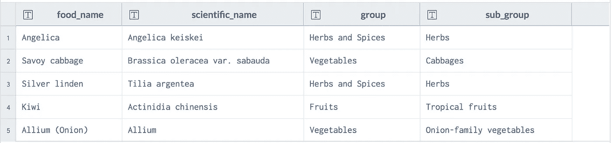
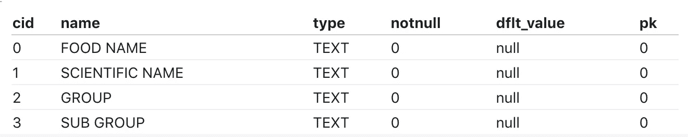
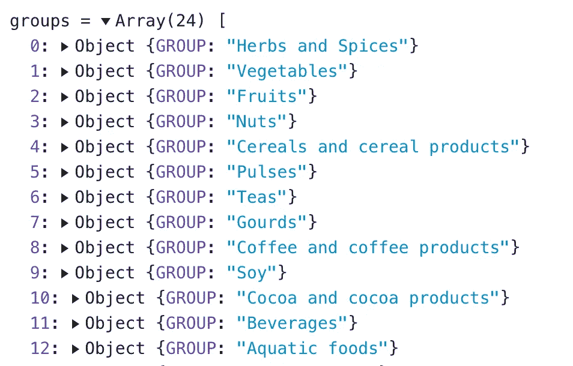
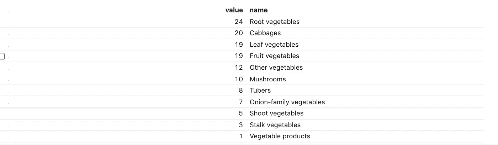

# 如何通过 sqlite3 在 Observablehq 中构建动态条形图

> 原文：<https://towardsdatascience.com/how-to-build-a-dynamic-bar-chart-in-observablehq-through-sqlite3-f8f8b6509ac8?source=collection_archive---------29----------------------->

## 数据可视化

## 一个现成的笔记本，利用了 Observablehq 提供的最新 sqlite3 特性


照片由[卢克·切瑟](https://unsplash.com/@lukechesser?utm_source=medium&utm_medium=referral)在 [Unsplash](https://unsplash.com?utm_source=medium&utm_medium=referral) 拍摄

最近，Observablehq 团队发布了一个新功能，允许将 sqlite3 数据库导入笔记本。这个特性非常强大，因为它允许通过经典的 SQL 语法动态查询数据集。Mike Bostock 提供的原始教程可在[此链接](https://observablehq.com/@observablehq/sqlite)获得。

在本教程中，我利用新的 sqlite3 特性构建了一个简单的条形图，它可以根据用户的选择动态更新。

作为示例数据集，我使用通用食品数据库，该数据库由 data.world 提供，可通过链接获得[。下表显示了通用食品数据库的快照:](https://data.world/alexandra/generic-food-database)



作者图片

在本教程中，我们将构建一个动态条形图，显示每个子组的项目数，前提是该组。组选择是通过下拉选择完成的。

# 将 CSV 文件转换为。

通用食品数据库以 CSV 文件发布，因此，在下载后，必须将其转换为. db 文件。然后，它可以作为文件附件上传到可观察的笔记本中。

为了执行到的转换。db，首先我们必须从[其官网](https://www.sqlite.org/download.html)下载 sqlite3。我们可以解压缩下载的文件夹，并从命令行进入该文件夹。从 sqlite3 文件夹中，我们可以启动 sqlite3 命令:

```
./sqlite3
```

现在 sqlite3 终端打开，我们可以创建一个新的数据库，即`food_db`:

```
.open food_db
```

我们可以按如下方式导入通用食物表:

```
.mode csv                                                               .import /path/to/your/file/generic-food.csv food_table
```

在前面的示例中，我们已经将 CSV 文件导入到了 food_table 表中。现在我们可以检查该表是否已被正确导入:

```
.schema
```

输出应该如下所示:

```
CREATE TABLE food_table(
   "FOOD NAME" TEXT,
   "SCIENTIFIC NAME" TEXT,
   "GROUP" TEXT,
   "SUB GROUP" TEXT
);
```

如果我们查看运行 sqlite3 命令的文件夹，我们可以看到有一个名为`food_db`的文件。这个文件可以作为 Observablehq 提供的`sqlite()`函数的输入。

# 将数据库加载到 Observable

现在我们可以在 Observable 中创建新的笔记本并导入数据库。我们可以单击页面右上角的三个点，然后选择文件附件:


作者图片

我们从文件系统中选择文件，并将其上传到可观察的笔记本中。我们可以通过下面一行代码加载数据库:

```
db = FileAttachment("food_db").sqlite()
```

我们可以通过`describe()`函数列出数据库中包含的所有表格:

```
db.describe()
```

它给出了以下输出:


作者图片

`describe()`函数也可以接收表名作为输入:

```
db.describe('food_table')
```

它给出了以下输出:



作者图片

# 查询数据库

我们准备查询数据库。我们可以使用 SQL 语法来构建任何查询。例如，如果我们想要列出所有组，我们可以运行以下查询:

```
groups = db.query('SELECT DISTINCT(`GROUP`) from food_table')
```

下图显示了`group`变量的快照:



作者图片

我们可以构建一个包含所有组的下拉菜单:

```
viewof term = Inputs.select(groups.map(d => d.GROUP), {value: "Vegetables", label: "Group"})
```

注意，我们已经将`group`变量转换为一个对象列表。下拉选择的输出如下所示:

我们可以通过询问属于通过下拉选择选择的组的所有子组来再次查询数据库:

```
data = db.query('SELECT count(*) AS value, `SUB GROUP` AS name FROM food_table WHERE `GROUP` LIKE $1 GROUP BY name ORDER BY value DESC', [`%${term}%`])
```

我们可以将结果显示为表格:

```
Inputs.table(data)
```

它给出了以下输出:



作者图片

# 构建条形图

最后，我们可以按照[链接](https://observablehq.com/@d3/bar-chart)中提供的示例来构建条形图。结果如下所示:

如果您回到本文并在下拉选择中选择另一个组，您应该会在条形图中看到变化。仅此而已！

# 摘要

在本教程中，我已经说明了如何利用 Observable 提供的新的 sqlite3 特性来构建一个动态条形图。

完整的笔记本可以从[这里](https://observablehq.com/@alod83/how-to-build-a-dynamic-bar-chart-through-sqlite3)下载。

如果你想了解我的研究和其他活动的最新情况，你可以在 [Twitter](https://twitter.com/alod83) 、 [Youtube](https://www.youtube.com/channel/UC4O8-FtQqGIsgDW_ytXIWOg?view_as=subscriber) 和 [Github](https://github.com/alod83) 上关注我。

# 相关文章

</how-to-insert-an-observablehq-graph-into-a-html-page-57a9f4546ecf>  </some-interesting-articles-and-resources-on-data-visualisation-that-i-discovered-in-june-c00b58d15946>  </how-to-improve-d3-js-graphs-with-annotations-252fbb9c5bb5> [## 如何改进带注释的 D3.js 图形

towardsdatascience.com](/how-to-improve-d3-js-graphs-with-annotations-252fbb9c5bb5)