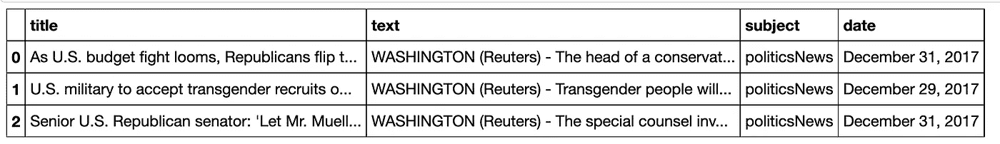
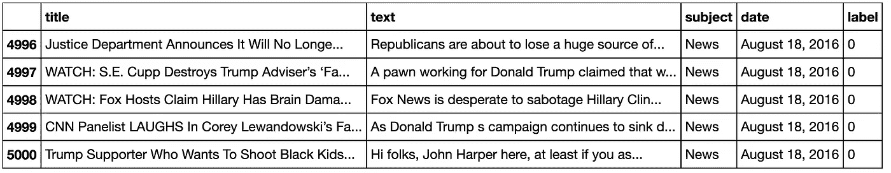
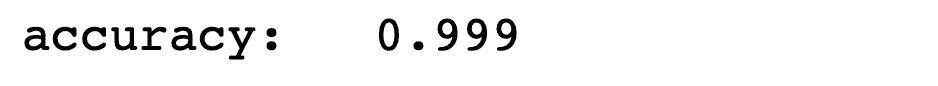
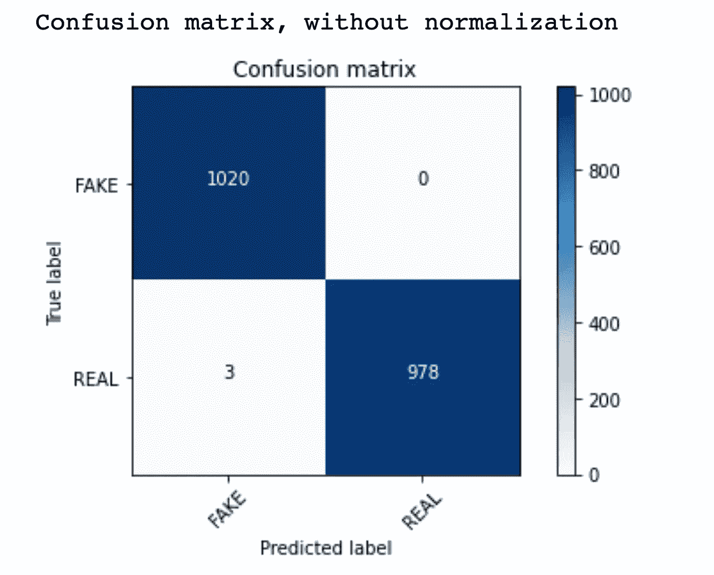
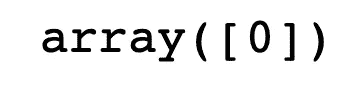
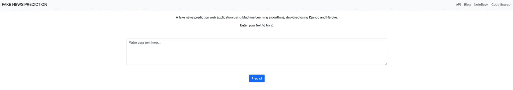

# 如何使用 Flask 构建假新闻检测 Web App

> 原文：<https://towardsdatascience.com/how-to-build-a-fake-news-detection-web-app-using-flask-c0cfd1d9c2d4?source=collection_archive---------10----------------------->

## 机器学习部署

## 用 Flask 部署文本分类模型


照片由来自 [Unsplash](https://unsplash.com/) 的 [Markus Winkler](https://unsplash.com/photos/BCvjjPU5RG4) 拍摄

随着不同社交网络的采用，假新闻的传播势不可挡。在推特、脸书、Reddit 上，人们利用假新闻传播谣言，赢得政治利益和点击率。

检测假新闻对于一个健康的社会至关重要，检测假新闻有多种不同的方法。从机器学习的角度来看，假新闻检测是一个**二元分类问题**；因此，我们可以使用传统的分类方法或最先进的神经网络来处理这个问题。

本教程将从头开始创建一个**自然语言处理**应用程序，并将其部署在 Flask 上。最终，您将拥有一个运行在本地机器上的假新闻检测 web 应用程序。请看这里的预告。

本教程采用以下结构组织:

*   第一步:将数据从 Kaggle 加载到 Google Colab。
*   第二步:文本预处理。
*   第三步:模型训练和验证。
*   步骤 4:挑选并加载模型。
*   第五步:创建一个 Flask 应用程序和一个虚拟环境。
*   第六步:添加功能。
*   结论。

**注:**完整的笔记本在 [GitHub](https://github.com/fangyiyu/Fake_News_Detection_Flask/blob/main/Fake_news_detection.ipynb) 上。

# 第一步:将数据从 Kaggle 加载到 Google Colab

嗯，机器学习项目最基础的部分就是数据。我们将使用来自 Kaggle 的[虚假和真实新闻数据集来构建我们的机器学习模型。](https://www.kaggle.com/clmentbisaillon/fake-and-real-news-dataset)

我以前写过一篇关于如何从 Kaggle 下载数据到 Google Colab 的博客。请随意按照里面的步骤操作。

文件夹里有两个独立的 CSV 文件，*真*和*假*，分别对应真假新闻。让我们看看数据是什么样的:

```
true = pd.read_csv('True.csv')
fake = pd.read_csv('Fake.csv')
true.head(3)
```



真实 CSV 文件的前三行(图片由作者提供)

# 第二步:文本预处理

数据集有四列，但它们还没有标签，让我们先创建标签。假新闻作为标签 0，真新闻标签 1。

```
true['label'] = 1
fake['label'] = 0
```

数据集是相对干净和有组织的。为了提高训练速度，我们使用两个数据集中的前 5000 个数据点来构建模型。您还可以使用完整的数据集来获得更全面的结果。

```
*# Combine the sub-datasets in one.*
frames = [true.loc[:5000][:], fake.loc[:5000][:]]
df = pd.concat(frames)
df.tail()
```



用于训练和测试的组合数据集(图片由作者提供)

我们还可以将要素和标签分开，并制作一份数据帧的副本，供以后培训使用。

```
X = df.drop('label', axis=1) 
y = df['label']
# Delete missing data
df = df.dropna()
df2 = df.copy()
df2.reset_index(inplace=**True**)
```

酷！时间对于真正的文本预处理，这包括删除标点符号，降低所有大写字符，删除所有停用词， [*词干*](https://searchenterpriseai.techtarget.com/definition/stemming) ，很多时候我们把这个过程叫做 [***标记化***](https://www.analyticsvidhya.com/blog/2019/07/how-get-started-nlp-6-unique-ways-perform-tokenization/) 。

```
**from** **nltk.corpus** **import** stopwords
**from** **nltk.stem.porter** **import** PorterStemmer
**import** **re**
**import** **nltk**nltk.download('stopwords')
ps = PorterStemmer()
corpus = []**for** i **in** range(0, len(df2)):
    review = re.sub('[^a-zA-Z]', ' ', df2['text'][i])
    review = review.lower()
    review = review.split()

    review = [ps.stem(word) **for** word **in** review **if** **not** word **in** stopwords.words('english')]
    review = ' '.join(review)
    corpus.append(review)
```

接下来，让我们使用 **TF-IDF 矢量器**将每个记号转换为矢量，也就是矢量化记号或 [**单词嵌入**](https://machinelearningmastery.com/what-are-word-embeddings/#:~:text=A%20word%20embedding%20is%20a,challenging%20natural%20language%20processing%20problems.) 。您可以使用其他单词嵌入技术来处理这个数据集，如 Word2Vec、Glove，甚至 BERT，但我发现 TF-IDF 足以生成准确的结果。

TF-IDF(词频—逆文档频率)的简明解释:它通过同时考虑一个单词在一个文档中的频率和同一语料库中其他文档的频率来计算该单词的重要性。

例如， *detection* 这个词在这篇文章中出现的比较多，但在 MEDIUM 语料库的其他文章中却没有出现；因此“检测”是这篇文章中的一个关键词，但是“ *term* ”这个词几乎在任何文档中都存在，出现频率很高，所以它并不那么重要。

关于 TF-IDF 更详细的介绍可以在这个[媒体博客](/tf-idf-explained-and-python-sklearn-implementation-b020c5e83275)中找到。

```
**from** **sklearn.feature_extraction.text** **import** TfidfVectorizer
tfidf_v = TfidfVectorizer(max_features=5000, ngram_range=(1,3))
X = tfidf_v.fit_transform(corpus).toarray()
y = df2['label']
```

大部分完成了！让我们做最后一步，拆分数据集进行训练和测试！

```
**from** **sklearn.model_selection** **import** train_test_split
X_train, X_test, y_train, y_test = train_test_split(X, y, test_size=0.2, random_state=0)
```

# 步骤 3:模型训练和验证

你可以在这里尝试多种分类算法:逻辑回归、SVM、XGBoost、CatBoost 或神经网络。我使用的是 [*在线被动攻击算法*](https://jmlr.csail.mit.edu/papers/volume7/crammer06a/crammer06a.pdf) *。*

```
**from** **sklearn.linear_model** **import** PassiveAggressiveClassifier
**from** **sklearn** **import** metrics
**import** **numpy** **as** **np**
**import** **itertools**classifier = PassiveAggressiveClassifier(max_iter=1000)
classifier.fit(X_train, y_train)
pred = classifier.predict(X_test)
score = metrics.accuracy_score(y_test, pred)
print("accuracy:   **%0.3f**" % score)
```



模型精度(图片由作者提供)

相当不错的成绩！让我们打印混淆矩阵来看看误报和漏报。

```
**import** **matplotlib.pyplot** **as** **plt**

**def** plot_confusion_matrix(cm, classes,
                          normalize=**False**,
                          title='Confusion matrix',
                          cmap=plt.cm.Blues):

    plt.imshow(cm, interpolation='nearest', cmap=cmap)
    plt.title(title)
    plt.colorbar()
    tick_marks = np.arange(len(classes))
    plt.xticks(tick_marks, classes, rotation=45)
    plt.yticks(tick_marks, classes)

    **if** normalize:
        cm = cm.astype('float') / cm.sum(axis=1)[:, np.newaxis]
        print("Normalized confusion matrix")
    **else**:
        print('Confusion matrix, without normalization')

    thresh = cm.max() / 2.
    **for** i, j **in** itertools.product(range(cm.shape[0]), range(cm.shape[1])):
        plt.text(j, i, cm[i, j],
                 horizontalalignment="center",
                 color="white" **if** cm[i, j] > thresh **else** "black")

    plt.tight_layout()
    plt.ylabel('True label')
    plt.xlabel('Predicted label')cm = metrics.confusion_matrix(y_test, pred)
plot_confusion_matrix(cm, classes=['FAKE', 'REAL'])
```



作者图片

因此，在使用 TF-IDF 矢量器的平衡数据集中，使用被动-主动算法，我们得到了 3 个假阳性，没有假阴性。

让我们使用一个看不见的数据集进行验证，比如说来自*假* CSV 文件的第 13070 个数据点。我们预期分类模型的结果是 0。

```
# Tokenization
review = re.sub('[^a-zA-Z]', ' ', fake['text'][13070])
review = review.lower()
review = review.split() 
review = [ps.stem(word) **for** word **in** review **if** **not** word **in** stopwords.words('english')]
review = ' '.join(review)# Vectorization
val = tfidf_v.transform([review]).toarray()# Predict 
classifier.predict(val)
```



模型输出(图片由作者提供)

酷！我们得到了我们想要的。您可以尝试完整数据集中更多看不见的数据点。我相信这个模型会给你一个满意的答案，而且准确度很高。

# 第 4 步:挑选和加载模型

现在，是时候清理(保存)模型和矢量器了，这样你就可以在其他地方使用它们了。

```
**import** **pickle** pickle.dump(classifier, open('model2.pkl', 'wb'))
pickle.dump(tfidf_v, open('tfidfvect2.pkl', 'wb'))
```

再来看看不训练能不能用这个模型。

```
# Load model and vectorizer
joblib_model = pickle.load(open('model2.pkl', 'rb'))
joblib_vect = pickle.load(open('tfidfvect2.pkl', 'rb'))
val_pkl = joblib_vect.transform([review]).toarray()
joblib_model.predict(val_pkl)
```


酸洗模型的输出(图片由作者提供)

我们得到了相同的输出！这正是我们所期望的！

现在模型已经准备好了，是时候部署它并检测 web 应用程序上的任何消息了。

# 第五步:创建一个 Flask 应用程序和一个虚拟环境

Flask 是一个轻量级的 [WSGI](https://wsgi.readthedocs.io/en/latest/what.html) web 应用框架。与 Django 相比，Flask 更容易学习，但是出于安全考虑，它不适合用于生产。出于这个博客的目的，你将学习 Flask。相反，你可以自由地跟随我的另一个教程[学习如何使用 Django](https://medium.com/geekculture/how-to-build-a-lotto-generator-web-application-using-django-and-visual-studio-code-on-macos-91307d48165c?sk=b1761c4ea2f1157d0eb8106c0ede1839) 部署一个应用。

1.  从终端或命令行创建一个新目录:

```
mkdir myproject
cd myproject
```

2.在项目目录中，为项目创建一个虚拟环境。

如果您没有安装 *virtualen* ，运行以下命令在您的终端中安装环境。

```
pip install virtualenv
```

在安装了 *virtualen* 之后，运行下面的代码来创建一个 env。

```
virtualenv <ENV_NAME>
```

替换<env_name>中 env 的名称</env_name>

通过以下方式激活环境:

```
source <ENV_NAME>/bin/activate
```

您可以在需要时使用以下命令移除 env:

```
sudo rm -rf <ENV_NAME>
```

现在你的 env 已经准备好了。让我们先安装烧瓶。

```
pip install flask
```

是时候构建 web 应用程序了！

# 步骤 6:添加功能

首先，让我们在同一个目录中创建一个新文件，包含以下内容，并将其命名为 app.py，我们将在该文件中添加一些功能。将上一步中经过酸洗的模型和矢量器移动到同一个目录中。

我们要构建四个函数: *home* 用于返回主页；*预测*用于得到分类结果，判断输入的新闻是假的还是真的； *webapp* 用于返回网页上的预测； *api* 是将分类结果转换成 JSON 文件，构建外部 api。

你可能会发现官方文件对你很有帮助。

```
from flask import Flask, render_template, request, jsonify
import nltk
import pickle
from nltk.corpus import stopwords
import re
from nltk.stem.porter import PorterStemmerapp = Flask(__name__)
ps = PorterStemmer()# Load model and vectorizer
model = pickle.load(open('model2.pkl', 'rb'))
tfidfvect = pickle.load(open('tfidfvect2.pkl', 'rb'))# Build functionalities [@app](http://twitter.com/app).route('/', methods=['GET'])
def home():
    return render_template('index.html')def predict(text):
    review = re.sub('[^a-zA-Z]', ' ', text)
    review = review.lower()
    review = review.split()
    review = [ps.stem(word) for word in review if not word in stopwords.words('english')]
    review = ' '.join(review)
    review_vect = tfidfvect.transform([review]).toarray()
    prediction = 'FAKE' if model.predict(review_vect) == 0 else 'REAL'
    return prediction[@app](http://twitter.com/app).route('/', methods=['POST'])
def webapp():
    text = request.form['text']
    prediction = predict(text)
    return render_template('index.html', text=text, result=prediction)[@app](http://twitter.com/app).route('/predict/', methods=['GET','POST'])
def api():
    text = request.args.get("text")
    prediction = predict(text)
    return jsonify(prediction=prediction)if __name__ == "__main__":
    app.run()
```

您可以在前面的部分看到一个*index.html*文件，它是应用程序的主页。在根文件夹中创建一个名为*“模板”*的文件夹，在里面创建一个文件*“index . html”*。现在让我们给页面添加一些内容。

```
<!DOCTYPE HTML>
<html><head>
 <meta charset="utf-8">
 <meta http-equiv="X-UA-Compatible" content="IE=edge">
 <title>Fake News Prediction</title>
 <link href="[https://cdn.jsdelivr.net/npm/bootstrap@5.0.2/dist/css/bootstrap.min.css](https://cdn.jsdelivr.net/npm/bootstrap@5.0.2/dist/css/bootstrap.min.css)" rel="stylesheet"
  integrity="sha384-EVSTQN3/azprG1Anm3QDgpJLIm9Nao0Yz1ztcQTwFspd3yD65VohhpuuCOmLASjC" crossorigin="anonymous">
 <script src="[https://cdn.jsdelivr.net/npm/bootstrap@5.0.2/dist/js/bootstrap.bundle.min.js](https://cdn.jsdelivr.net/npm/bootstrap@5.0.2/dist/js/bootstrap.bundle.min.js)"
  integrity="sha384-MrcW6ZMFYlzcLA8Nl+NtUVF0sA7MsXsP1UyJoMp4YLEuNSfAP+JcXn/tWtIaxVXM"
  crossorigin="anonymous"></script>
 <script src="[https://cdnjs.cloudflare.com/ajax/libs/jquery/3.1.1/jquery.min.js](https://cdnjs.cloudflare.com/ajax/libs/jquery/3.1.1/jquery.min.js)"></script></head><body>
 <nav class="navbar navbar-expand-lg navbar-light bg-light">
  <div class="container-fluid">
   <a class="navbar-brand" href="/">FAKE NEWS PREDICTION</a>
   <button class="navbar-toggler" type="button" data-bs-toggle="collapse" data-bs-target="#navbarNavAltMarkup"
    aria-controls="navbarNavAltMarkup" aria-expanded="false" aria-label="Toggle navigation">
    <span class="navbar-toggler-icon"></span>
   </button>
   <div class="nav navbar-nav navbar-right" id="navbarNavAltMarkup">
    <div class="navbar-nav">
     <a class="nav-link" target="_blank"
      href="[https://rapidapi.com/fangyiyu/api/fake-news-detection1/](https://rapidapi.com/fangyiyu/api/fake-news-detection1/)">API</a>
     <a class="nav-link" target="_blank"
      href="[https://medium.com/@fangyiyu/how-to-build-a-fake-news-detection-web-app-using-flask-c0cfd1d9c2d4?sk=2a752b0d87c759672664232b33543667/](https://medium.com/@fangyiyu/how-to-build-a-fake-news-detection-web-app-using-flask-c0cfd1d9c2d4?sk=2a752b0d87c759672664232b33543667/)">Blog</a>
     <a class="nav-link" target="_blank"
      href="[https://github.com/fangyiyu/Fake_News_Detection_Flask/blob/main/Fake_news_detection.ipynb](https://github.com/fangyiyu/Fake_News_Detection_Flask/blob/main/Fake_news_detection.ipynb)">NoteBook</a>
     <a class="nav-link" target="_blank" href="[https://github.com/fangyiyu/Fake_News_Detection_Flask](https://github.com/fangyiyu/Fake_News_Detection_Flask)">Code Source</a>
    </div>
   </div>
  </div>
 </nav><br>
 <p style=text-align:center>A fake news prediction web application using Machine Learning algorithms, deployed using Django and Heroku. </p>
 <p style=text-align:center>Enter your text to try it.</p>
 <br>
 <div class='container'>
  <form action="/" method="POST">
   <div class="col-three-forth text-center col-md-offset-2">
    <div class="form-group">
     <textarea class="form-control jTextarea mt-3" id="jTextarea'" rows="5" name="text"
      placeholder="Write your text here..." required>{{text}}</textarea><br><br>
     <button class="btn btn-primary btn-outline btn-md" type="submit" name="predict">Predict</button>
    </div>
   </div>
  </form>
 </div>
 <br>
 
 <p style="text-align:center"><strong>Prediction : {{result}}</strong></p>
 <script>
     function growTextarea (i,elem) {
    var elem = $(elem);
    var resizeTextarea = function( elem ) {
        var scrollLeft = window.pageXOffset || (document.documentElement || document.body.parentNode || document.body).scrollLeft;
        var scrollTop  = window.pageYOffset || (document.documentElement || document.body.parentNode || document.body).scrollTop;  
        elem.css('height', 'auto').css('height', elem.prop('scrollHeight') );
          window.scrollTo(scrollLeft, scrollTop);
      };
      elem.on('input', function() {
        resizeTextarea( $(this) );
      });
      resizeTextarea( $(elem) );
  }

  $('.jTextarea').each(growTextarea);
</script>
</body></html>
```

上面的脚本创建了这样一个网页:



假新闻检测网络应用用户界面(图片由作者提供)

现在，您可以通过在终端中键入以下命令来运行您的应用程序:

```
python3 app.py
```

您将能够在本地运行您的应用程序，并对模型进行测试。

# 结论

在本教程中，您构建了一个机器学习模型来从真实新闻中检测假新闻，并保存该模型以使用 Flask 构建一个 web 应用程序。web 应用程序正在您的本地机器上运行，您可以尝试使用 Heroku、AWS 或 DigitalOcean 等云服务将其公开。我已经在 Heroku 部署了地雷。请随意试一试。

我希望你喜欢这次旅行。欢迎留言评论，在 [Linkedin](https://www.linkedin.com/in/fangyiyu/) 与我联系。