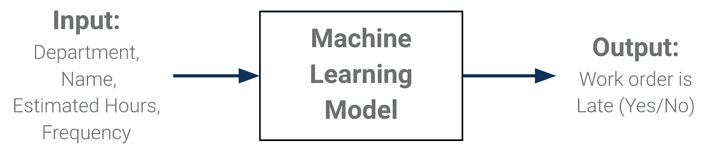
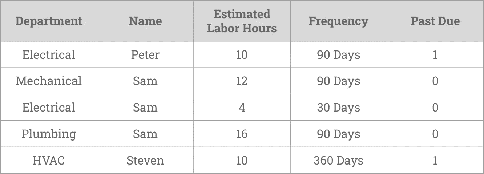
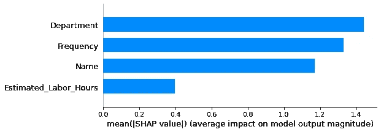
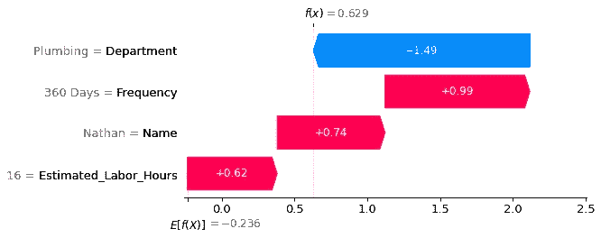
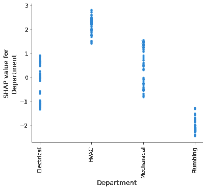

# 如何构建首次机器学习项目(带完整代码)

> 原文：<https://towardsdatascience.com/how-to-build-a-first-time-machine-learning-project-with-full-code-3c34ab0d36c3?source=collection_archive---------20----------------------->

## 使用设施操作示例的机器学习演练


[郭锦恩](https://unsplash.com/@spacexuan?utm_source=medium&utm_medium=referral)在 [Unsplash](https://unsplash.com?utm_source=medium&utm_medium=referral) 上拍照

虽然机器学习看起来势不可挡，但在寻找潜在的开始方式时，知道从哪里开始是关键。一个很好的出发点是看看企业在哪里执行可重复的过程。作为一个在设施运营和可靠性工程领域有几年职业背景的人，我的日常经验让我深入了解了机器学习如何应用于可重复流程的运营。

当我第一次对机器学习感兴趣时，我正在寻找通过开发实际创造商业价值的技术解决方案来应用我新发现的兴趣的方法。然而，我经常发现，我在早期学习中去的许多来源都是推销他们专有的 ML 平台或软件，而我并不想购买。虽然这些公司可能有价值，但我决心学习如何在不依赖昂贵的第三方解决方案的情况下应用机器学习。

出于这个原因，我创建了一个样本机器学习项目，它可以通过开放源代码技术免费完成，进入门槛相对较小，并去除了一些你不想购买的软件的任何“专有数据”或“隐藏的销售宣传”。相反，它旨在成为一个起点，激励其他人尝试机器学习，并可能利用代码来创建他们自己的解决方案。(尽管这个示例与设施行业相关，但是这个演练可以应用于您可能拥有的任何领域专业知识中的任何“重复过程”。)

# 问题陈述和背景

按时完成维护对于设施可靠地提供其商业价值至关重要，如今许多运营都使用 CMMS(计算机化维护管理系统)来记录和控制正在进行的工作。存储在这些企业数据库系统中的是工作是否按时完成的所有历史记录(通常称为工作订单)。机器学习可以用来帮助找到数据中的模式，以便做出主动决策，确保按时完成正确的工作。

# 机器学习项目概述

以下是我们的机器学习项目将做什么的高级概述:

1.  从历史工单数据中学习
2.  将工作单的特性作为输入
3.  预测未来的工作订单是否会延迟
4.  提供输入如何影响预测的详细解释



模型概述(图片由 Cory Randolph 提供)

# 详细演练

对于这个详细的演练，我将只显示和解释相关的代码部分，因为整个代码可以在 Google Colab [这里](https://github.com/coryroyce/Facilities_ML_Project/blob/main/Notebooks/Facilities_ML_Project.ipynb)查看和运行。

## 数据

许多工厂运营依赖于存储工作订单历史信息的企业数据库。为了这个项目，我创建了 500 个虚构的工作指令，反映了在这种系统中发现的信息类型。当试图识别自己的数据时，我发现在开始机器学习项目时有 5 个好问题可以问。我在我的文章[*5 个简单的问题为一个机器学习项目寻找数据*](/5-simple-questions-to-find-data-for-a-machine-learning-project-d92f0d54c16f) 中对这个过程做了详细的解释



样本数据(图片由 Cory Randolph 提供)

每个特征/列的解释:

**部门** =给定工单/维护任务中正在执行的工作类型的部门名称。(例如，电气、机械等)

**姓名** =完成工作的技术人员的姓名。(为此示例数据随机生成的虚构名称)

**预计工时** =给定工单/任务预计需要的大概工时数。

**频率** =必须再次完成这些工作指令/任务的频率间隔。(例如，90 天的任务意味着每年要完成 4 次(365 天/ 90 天))。

**过期** =特定工单是否过期的标签。(例如，1 =工作订单过期，0 =工作订单按时完成。)

要获得 Jupyter 笔记本中的完整数据:

```
# Set the url of where the csv data can be downloaded fromurl = 'https://raw.githubusercontent.com/coryroyce/Facilities_ML_Project/main/Data/Maintenace_Past_Due_Sample_Data.csv'# Load the csv data into a Pandas DataFrame to easily work with the data in pythondf = pd.read_csv(url)
```

接下来，我们处理数据，以便通过将特征/输入(表示为“X”)与标签/输出(表示为“y”)分离，ML 模型可以使用该数据。然后保存 20%的数据作为测试数据，用于验证 ML 模型是否真的在学习模式，而不仅仅是记忆训练数据。

```
# Separate the features/inputs from the labels/outputsX = df.copy()y = X.pop('Past_Due')# Split the data into train and test data with 20% of the data to test the modelX_train, X_test, y_train, y_test = train_test_split(X, y, test_size=0.2, random_state=1)
```

## 机器学习模型

既然数据已经加载并准备好进行处理，我们就可以开始创建机器学习模型了。如果您刚刚开始使用 ML，值得注意的是，我们的模型是一个监督分类模型，具有数值和分类特征数据。Catboost 是一个 ML 框架，在简单性和良好性能方面非常适合，不需要太多的超参数调整。为了更好地理解这些 ML 模型如何更详细地工作，一个好的起点是谷歌的[机器学习速成班](https://developers.google.com/machine-learning/crash-course)。

因为我们使用的是 CatBoost 库，所以我们可以只用两行代码创建和构建一个性能良好的模型:首先，将模型设置为 CatBoost 分类器。接下来，根据我们之前设置的数据对其进行拟合/训练。

```
# Select the ML Model typemodel = CatBoostClassifier()# Fit the model to the training datamodel.fit(X_train, y_train, cat_features=['Department', 'Name', 'Frequency'], eval_set=(X_test, y_test))
```

运行上面的代码块后，我们现在有了一个经过训练的机器学习模型，我们可以用它来预测未来的工作订单是否会延迟。

## 衡量标准

现在，我们已经有了一个训练有素的机器学习模型，我们需要检查我们的模型有多“好”，并了解它是否可以提供关于工作订单是否可能延迟的有用预测。虽然有大量的指标或方法来评估一个模型有多好，但最有用和最容易理解的指标是准确性(要更深入地了解准确性，请查看杰瑞米·乔登的文章， [*评估机器学习模式* l](https://www.jeremyjordan.me/evaluating-a-machine-learning-model/) )。简而言之，准确性是模型做出正确预测的百分比。因此，在决定工作订单是否会延迟时，50%的准确率与随机猜测或抛硬币是一样的。

使用一个名为 [SKlearn](https://scikit-learn.org/) 的通用 ML 库使得获得我们模型的准确性变得非常简单。

```
# Store the predicted scores from the test datasetpreds_test = model.predict(X_test)# Print the accuracy of the test predictionsprint(f'Model Accuracy on test data: {metrics.accuracy_score(y_test, preds_test)*100}%')
```

虽然根据数据分割和模型训练，整体精度可能略有不同，但我最近获得的精度是 89%。这意味着我们有一个模型可以正确预测一个工作订单是否会延迟大约 10 次。

## 预测

有了我们有效且准确的模型，价值就来自于对未来工作订单的预测。这使业务人员能够洞察何时需要调整流程，以确保有可能延迟的工作能够提前得到主动解决。

接下来的代码块显示了如何预测单个工作订单，但可以很容易地修改为进行批量预测，以检查下个月到期的所有工作订单，然后将它们导出到 csv、excel 或 Google 表中，以最适合您的企业正在使用的操作流程。

```
# Manually input any combination of features to get a prediction (Note: Order of data has to match the column orders)sample = ['Electrical', 'Chris', 4,'90 Days']# Send the sample to the model for predictionsample_prediction = model.predict(sample)# Display predictionprint(f'Current Sample is predicted as {sample_prediction} \n(Note: 1 = Past Due, 0 = On Time)')
```

## 解释(奖金)

这种预测工作订单是否会延迟的工作机器学习模型已经在一个很好的地方增加了商业价值，但打开机器学习的“黑匣子”可以帮助我们更多地理解数据，并提供对“为什么”模型做出某种预测的洞察。能够提供详细的解释有助于在内部以及向客户/顾客建立项目的可信度。

一个越来越受欢迎的帮助解释的工具叫做 [SHAP](https://shap.readthedocs.io/en/latest/) 。为了让文章的以下部分更容易阅读，我将省略详细的代码，只展示视觉效果和解释(完整的代码可以在[这里](https://github.com/coryroyce/Facilities_ML_Project/blob/main/Notebooks/Facilities_ML_Project.ipynb)找到)。

第一层解释来自模型概要层，需要回答的一个重要问题是:“哪些特性/输入是最重要的，它们有多重要？”有几种不同的方法可以直观地看到 SHAP，为了简单起见，我们将使用条形图汇总图。



SHAP 特征重要性汇总图(图片由 Cory Randolph 提供)

此汇总条形图显示部门对模型的影响最大，而估计工时对模型的影响最小。

下一个需要回答的问题是:“每个输入实际上对模型的预测有多大影响？”这里，SHAP 工具再次为任何单个工单提供了一种查看这种情况的方法。



单一预测的 SHAP 瀑布图(图片由 Cory Randolph 提供)

为了理解该图，我们从左下方的 E[f(x)]开始，它基本上是给定工单的预期输出，向右移动(红色)显示工单延迟的变化增加，向左移动(蓝色)显示工单延迟的机会减少。

*   估计工时为 16 小时，增加了此工作单延迟的可能性。
*   将 Nathan 作为技术人员分配给工作单也增加了工作单延迟的可能性。
*   一年 360 天的频率也会增加迟到的几率。
*   将管道作为一个部门可以显著降低工作订单延迟的可能性。

总的来说，由于最终的 f(x)位于起始位置 E[f(x)]的右侧，因此该工作单将被预测为延迟，但是现在我们有了一个关于为什么会得出该结论的详细解释。

最后要问的问题是:“是哪几组详细的数据导致工单延期？”在 SHAP，帮助回答这个问题的工具叫做依赖图。这些图帮助我们深入了解输入的实际值(包括分类值和数值值),并了解它们如何影响模型的预测。虽然[完整代码文件](https://github.com/coryroyce/Facilities_ML_Project/blob/main/Notebooks/Facilities_ML_Project.ipynb)显示了每个特性/输入的这些图，但让我们只看一下部门的依赖图。



SHAP 依赖情节的部门(图像由科里伦道夫)

为了理解该图，如果您在 0 值处画一条水平线，那么该线以上的值将指示该部门的工作订单延迟的可能性，而 0 以下的值将指示工作订单将按时完成。总之，HAVC 部门有很高的延迟工作订单的可能性，而管道有很低的延迟工作订单的可能性。电气和机械相当平衡，有相似数量的延迟和准时工作订单。

这也成为可操作的数据。既然我们看到 HVAC 和延迟工作订单之间存在关联，我们可以进一步询问业务问题；暖通是不是人手不足？暖通空调中是否有特定类型的工作会导致迟到问题？管道系统做了哪些改变，让他们能够按时完成工作？

# 摘要

总之，早期 ML 项目可以分为 4 个主要阶段:

*   定义最初的业务问题
*   确定哪些可重复的过程提供可用的数据
*   创建工作机器学习模型
*   生成详细的解释

使用提供的代码作为模板，我希望你将通过这 4 个阶段中的每一个来创造一些有价值的东西。

如果你读完了这篇教程，并且能够在你自己的项目中使用它，请在下面的评论部分分享你的经验和应用。我真的很想知道你是如何利用机器学习来解决问题的。

**快速参考**

*   [全码](https://github.com/coryroyce/Facilities_ML_Project/blob/main/Notebooks/Facilities_ML_Project.ipynb)
*   [*为一个机器学习项目寻找数据的 5 个简单问题*](/5-simple-questions-to-find-data-for-a-machine-learning-project-d92f0d54c16f)
*   [谷歌的机器学习速成班](https://developers.google.com/machine-learning/crash-course)
*   [Catboost](https://catboost.ai/)