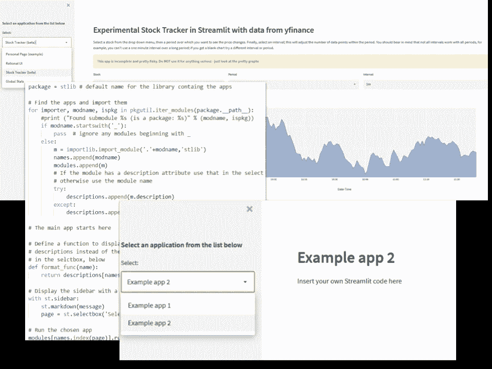
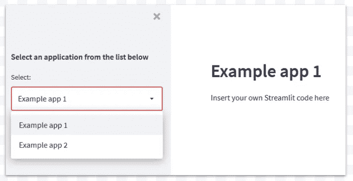

# 如何将 Streamlit 应用程序库构建为单个 Web 应用程序

> 原文：<https://towardsdatascience.com/how-to-build-a-gallery-of-streamlit-apps-as-a-single-web-app-466682190629?source=collection_archive---------12----------------------->

## 数据可视化

## 下载一个免费模板，插入多个 Streamlit 应用程序，就大功告成了



作者图片

我使用 Streamlit 已经有一段时间了，并且已经编写了一些实验性的应用程序。虽然我对它们很满意(就它们而言——它们只是简单的例子),但没有一个值得拥有专门的网页。

那么，呈现可以从单个网页访问的应用程序库的最佳方式是什么呢？

你可以把所有代码放在一个应用程序中，然后用一个`if`语句在它们之间进行选择(正如我在本文的[中所做的那样)，但是这不是很容易扩展——一旦你使用了几个以上的应用程序，就会变得混乱。](/a-multi-page-interactive-dashboard-with-streamlit-and-plotly-c3182443871a)

那么，如何创建一个应用程序库，用一个调度程序根据下拉菜单中的选择调用每个应用程序呢？这样，应用程序就被编写成独立的功能。您只需创建一个库文件夹来包含应用程序，然后 dispatcher 调用相应的文件夹。

我认为那听起来更好。

## Mustrapp 一个简单的框架

因此，为此，我创建了一个名为*Mustrapp*(**Mu**l ple**Str**eamlit**App**s)的应用程序模板(可以免费下载)，这使得创建多个 Streamlit 应用程序的过程变得非常简单。

为了让应用程序工作，你需要将它们组织起来，使它们位于一个名为`run()`的可调用函数中。并且，理想情况下(但不是必须的)，包含一个描述字符串，该字符串将被用作下拉菜单中的文本(如果您没有提供，将使用模块名称)。

所以，一个应用程序看起来会像这样:

```
description = "My first app"
def run():
   st.header("This is my first app")
   st.write("I hope you like it")if __name__ == "__main__":
   run()
```

你可以在一个应用中拥有尽可能多的功能，但是它必须从一个叫做`run` 的功能开始，这是唯一的要求。最后一个`if`语句是可选的，但是很有用，因为它允许您将单个应用程序作为独立应用程序运行，或者作为多应用程序的一部分运行。它主要检查该函数是否作为主模块被调用(在这种情况下，它的`__name__`将是 `__main__`)。如果它作为一个库模块被调用(这就是我们想要做的),那么`__name__`将是模块名。

能够将应用程序作为一个独立的功能来运行对于调试非常有用，因为您不需要应用程序的其他部分来运行。

假设你写了上面的 app，保存在一个文件`app1.py`里。

然后，您可以编写另一个应用程序`app2.py`，如下所示:

```
description = "My second app"
def run():
   st.header("This is my second app")
   st.write("Here is an image:")
   st.image("image.png")if __name__ == "__main__":
   run()
```

然后，我们将这些文件放在一个名为`stlib` 的文件夹中——这将是我们的库文件夹，我们所有的应用程序都将存放在这里。为了让 Python 将这个文件夹识别为一个库，它需要包含一个名为`__init__.py`的文件。如果你已经下载了模板，它已经在那里了。

调度程序位于个人文件夹中。这是我们启动 Streamlit 应用程序时将运行的程序。我打算把它叫做`index.py`。

所以我们完整的应用程序是这样构建的:

```
/home
 |
 |-- index.py
 |
 |-- /stlib
       |
       |-- __init__.py
       |
       |-- app1.py
       |
       |-- app2.py
```

要运行应用程序，请执行以下命令:

```
streamlit run index.py
```

这将在您的浏览器中弹出:



示例应用程序—作者图片

您可以在本文末尾的要点中看到 dispatcher 的完整代码(太长了，这里不包括)。最后，我还会提供一个 Github 资源库的链接，您可以在这里克隆或下载完整模板的 zip 文件，包括调度程序、目录结构和几个虚拟应用程序。

但基本上是这样运作的。

首先，我们导入 Streamlit 库(当然)以及我们需要的其他库。(它还将布局设置为*宽。*这个是可选的，但在我看来，如果你打算使用侧边栏，看起来会更好，就像我们在这里做的一样——如果你愿意，可以删除它。)

然后我们开始识别库中的应用程序(`stlib`，并在名为`names`、`modules`和`descriptions`的全局数组中记录应用程序的名称、模块引用和描述。`stlib`库中的任何模块都被视为 Streamlit 应用，除非其名称以`_`字符开头。通过这种方式，您可以添加非应用程序库模块(例如`_mylibrary.py`)，如果您需要的话，它们不会被作为 Streamlit 应用程序选中。

完成此操作后，我们创建一个包含模块名称的下拉菜单(显示描述，如果可用),一旦选择，从`modules`数组中选择适当的模块，并执行其功能`run()`。换句话说，对应于选择的应用程序正在运行。

就算我自己说，这个也挺管用的。将 dispatcher 应用程序与任意数量的可调用应用程序一起使用很容易，维护起来也非常简单。现在，我们可以在一个网页上一次性部署任意数量的迷你应用程序。

这些都不是火箭科学，但我希望它有用。你可以在这里看到一个使用这个模板[的示例网站，你可以从它的](http://ajstreamlit.herokuapp.com/) [Github 库](https://github.com/alanjones2/mustrapp)下载或者克隆完整的模板。

一如既往地感谢阅读，如果你想知道我什么时候发表新文章，请考虑在这里[注册一个电子邮件提醒](https://alan-jones.medium.com/subscribe)。我也偶尔在[子栈](https://technofile.substack.com/)上发布免费的时事通讯。请在下面留下任何评论，或者您可以通过 [LinkedIn](https://www.linkedin.com/in/alan-jones-032699100) 或 [Twitter](https://twitter.com/MrAlanJones) 联系。

<https://alanjones2.github.io/>  

有趣的是，这里是调度程序代码:

调度员代码