# 如何使用开源工具构建 GitHub 活动仪表板

> 原文：<https://towardsdatascience.com/how-to-build-a-github-activity-dashboard-with-open-source-b3d60277e9a3?source=collection_archive---------19----------------------->

## 将 Airbyte 和 Metabase 结合在一起


作者形象

在本文中，我们将利用 [Airbyte](http://airbyte.io/) (一种开源数据集成平台)和[元数据库](https://www.metabase.com/)(一种供贵公司每个人提问和从数据中学习的开源方式)来构建上面的 GitHub 活动仪表板。

Airbyte 为我们提供了一套丰富的源连接器，其中之一就是 GitHub 连接器，它允许我们从 GitHub repo 中获取数据。

我们将使用这个连接器获取 [airbyte](http://github.com/airbytehq/airbyte) repo 的数据，并将它们复制到 Postgres 数据库目的地。

然后，我们将该数据库连接到元数据库，以便创建活动仪表板。

我们需要的是:

*   饭桶
*   码头工人
*   码头工人写作
*   Airbyte
*   Postgres 数据库
*   GitHub 访问令牌
*   元数据库

# 第 1 步:使用 Airbyte 将数据从 GitHub 复制到 Postgres

## 设置 Airbyte

如果您的机器上已经有 Airbyte，您可以跳过这一步。

要在您的机器上设置 Airbyte，请确保您有 Docker 和 Docker 编写设置以及 git。然后，打开一个终端，并前往您想下载 Airbyte 的位置，然后运行:

```
git clone [https://github.com/airbytehq/airbyte.git](https://github.com/airbytehq/airbyte.git)‍
```

您需要通过运行 cd airbyte 进入克隆的 airbyte repo，然后运行:

```
docker-compose up
```

或者如果您使用的是最新版本的 Docker CLI，您可以运行:

```
docker compose up
```

上述命令将创建并启动 Airbyte 容器。完成后，您可以通过 [http://localhost:8000/](http://localhost:8000/) 访问 Airbyte(您可以继续设置您的首选项，然后保持 Airbyte web 应用程序打开，我们很快会回来)

## 建立 Postgres 数据库

该数据库将是来自 GitHub 的数据的目的地。为了设置这个，我们将通过 docker 运行 postgres 容器，如下所示:

```
docker run --rm --name github-destination -e POSTGRES_PASSWORD=password -p 3003:5432 -d postgres‍
```

如果您是第一次运行上述命令，它将从 Docker Hub 注册表下载 Postgres 映像，然后将其作为名为 **github-destination** 的容器运行。

我们还通过将环境变量 **POSTGRES_PASSWORD** 传递给密码值来设置数据库密码。

我们还将容器的 5432 端口绑定到 3003 端口上的主机。最后，我们在后台运行带有-d 标志的容器。

现在我们已经建立了目标数据库，让我们转到 Airbyte web 应用程序，并创建一个从 Airbyte GitHub 源到 Postgres 数据库的连接。

## 创建 Airbyte 连接

回到浏览器中的 Airbyte web 应用程序，单击应用程序右上角的*新来源*按钮，进入添加新 Airbyte 来源的页面。

输入名称 **github-source** 作为信号源名称，点击下拉菜单，选择 Github connector 作为信号源类型。选择 GitHub 源类型后，您将看到两个文本框。首先是输入您想要的存储库。在这个框中，键入 **airbytehq/airbyte** ，然后，在第二个框中，您需要提供一个 GitHub 访问令牌，您可以从这里的[获得](https://github.com/settings/tokens)。

确保您授予令牌 repo 和 write:discussion 权限。填写完所有字段后，点击“设置来源”按钮。

如果设置成功，您将被带到目的地屏幕，在那里您将添加一个新的目的地。

点击*添加目的地*按钮，在随后的下拉菜单中，点击*添加新目的地*。然后，您将看到一个添加目的地名称的页面。输入我们之前创建的 Postgres 容器的名称(github-destination)，然后选择 Postgres 作为目的地类型。

之后，您将看到一些文本框，用于输入数据库连接的详细信息。为我们之前创建的 Postgres 容器输入值:

*   主机—本地主机
*   3003 年后
*   模式-公共(保留默认值)
*   数据库— postgres
*   密码—密码
*   用户名— postgres

然后点击基本的标准化切换按钮来检查它，因为我们希望 Airbyte 标准化来自 GitHub 的数据。总的来说，用户界面应该是这样的:

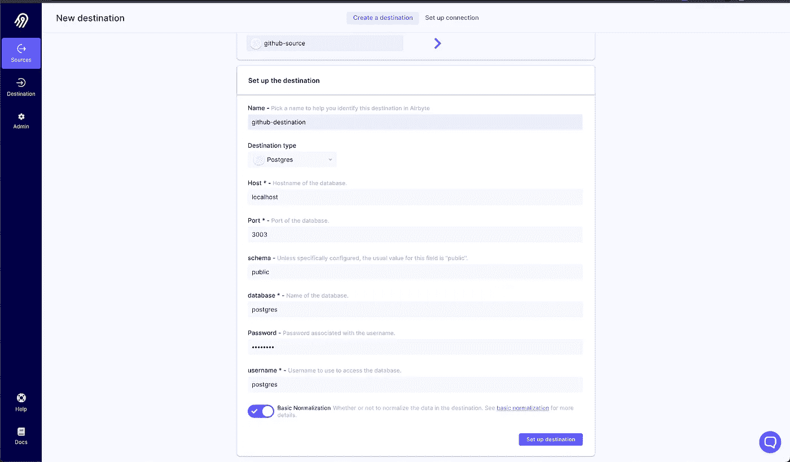

作者图片

然后点击设置目的地按钮。如果您的凭证对于数据库来说都是正确的，那么 postgres 目的地应该已经设置好了，现在您需要建立从源(GitHub)到目的地(Postgres)的连接。

您应该选中下面截图中的复选框，然后在同步频率下拉列表中选择 Airbyte 每小时尝试复制数据的频率。然后，点击*设置连接*按钮。

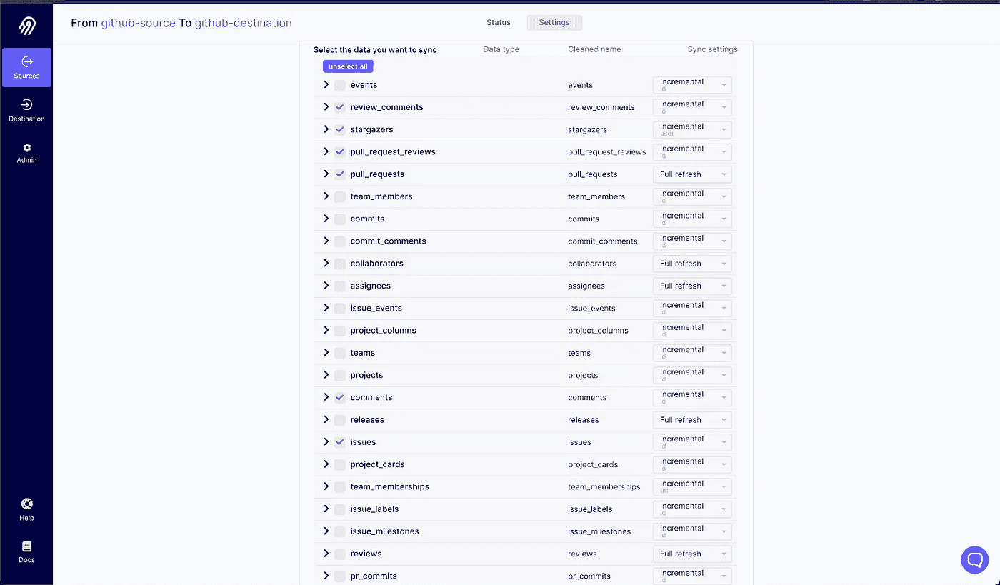

作者图片

您将被带到源页面，单击源，您将看到您的同步状态。同步需要一段时间才能完成。

完成后，您将看到状态从运行更改为成功。此外，字节数指的是 Airbyte 从 GitHub 提取到 Postgres 数据库中的数据字节。‍

那不是很多工作，是吗？你可以拍拍自己的背，因为你刚刚将数据从 GitHub 同步到 Postgres 数据库。

让我们继续将该数据库连接到元数据库，这样我们就可以开始创建我们的仪表板了。

# 步骤 2:将 PostgreSQL 数据库连接到元数据库

## 正在安装元数据库

‍
Metabase 是一个开源的分析工具，你可以通过几种方式开始使用它；使用。jar 文件，将其安装为 Mac 应用程序或使用 Docker 容器。

在本教程中，我们将使用 Mac 应用程序(你也可以在[这里](https://www.metabase.com/docs/latest/operations-guide/installing-metabase.html)找到适合你的安装)。为此，只需运行:

如果你用的是 Mac，你可以从[这里](https://www.metabase.com/docs/latest/operations-guide/running-the-metabase-mac-app.html)下载元数据库应用。下载后，启动应用程序并完成帐户注册，您将看到元数据库仪表板:

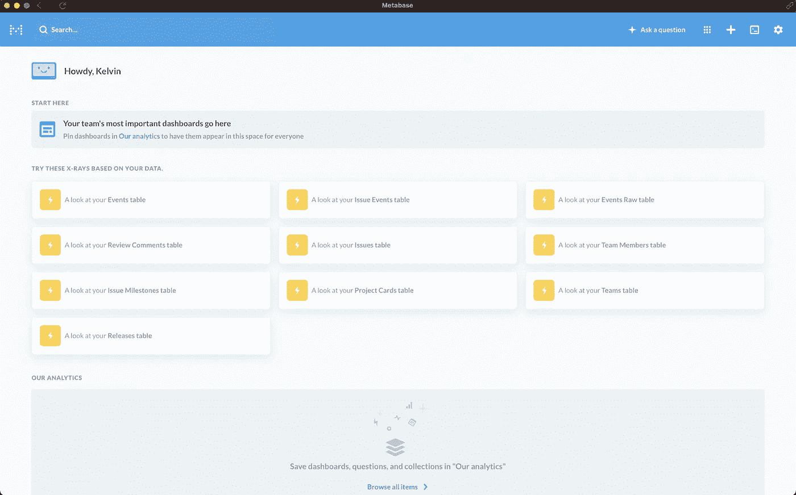

作者图片

## 在元数据库中设置 Postgres 数据库

为了设置我们的数据库，我们将单击 Metabase 应用程序菜单栏上的 cog(设置)图标，并选择 admin 选项以进入 admin 视图，我们可以在其中添加数据库:

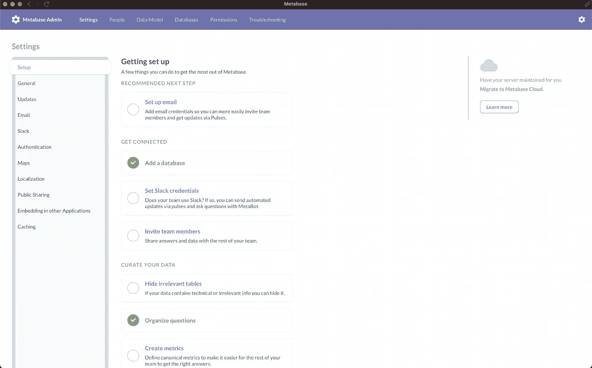

作者图片

单击 add a database 按钮，您将看到一个表单，您应该选择 PostgreSQL 作为您选择的数据库，然后填写连接参数，这将是我们为保存来自 GitHub 的数据而创建的 PostgreSQL 数据库的参数

填写详细信息，以匹配我们之前创建的 PostgreSQL 数据库的凭据。‍

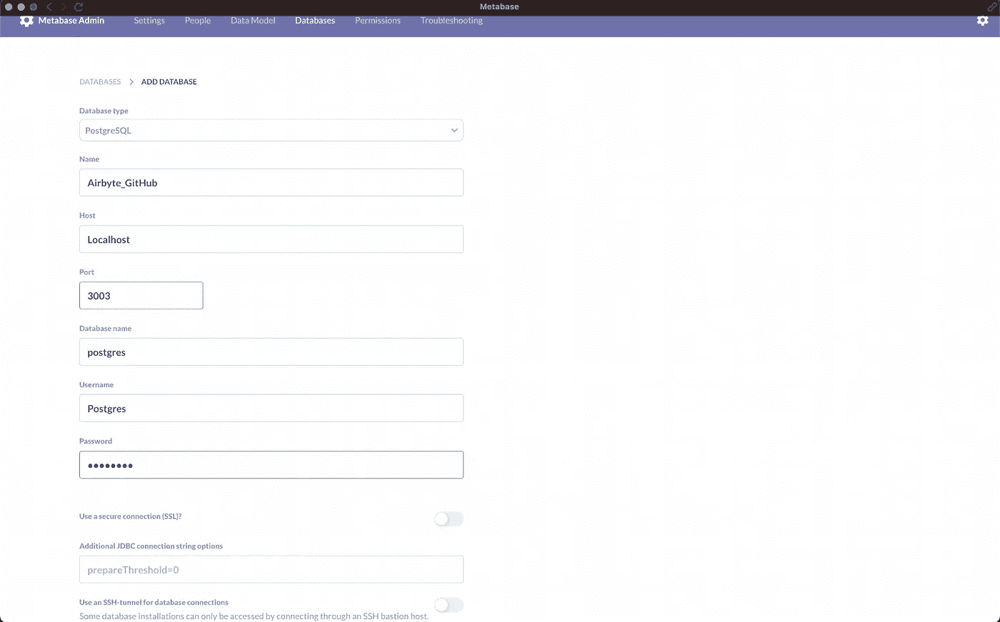

作者图片

然后，当您输入完数据库凭据后，单击 save，您的数据库将被完全加载到元数据库中，为我们开始创建仪表板做好准备。

# 步骤 3:在元数据库中创建仪表板

Metabase 基于对数据的提问，因此为了构建我们的 GitHub 仪表板，我们将提出以下问题:

*   每天都有新的天文学家
*   贡献了新的问题
*   每天 PR 贡献者的数量
*   每天来自非团队成员的新评论
*   每天来自非团队成员的新问题

## 每天都有新的天文学家

注意:我们通常需要处理日期时间类型，以便为我们的仪表板找到演化度量，所以如果您注意到您需要的字段不是合适的类型，比如 **starred_at** 是 **VARCHAR** 类型而不是数据时间，您可以转到元数据库中的管理视图，单击数据模型选项，并告诉元数据库转换该字段

因此，我们将使用 Metabase 的一般工作流程是单击菜单栏顶部的**提问**按钮。然后选择你想问的问题类型。我们将从一个简单的问题开始:


作者图片

然后你选择你想要处理的数据。如果一切配置正确，应该会出现一个名为 Airbyte_GitHub 的数据源。然后让我们选择我们想要使用的表，因为对于第一个问题，我们想要观星者的数量，我们选择观星者表。‍

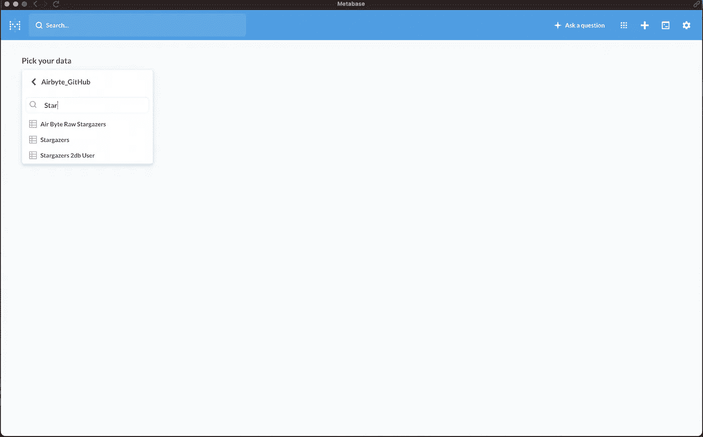

作者图片

然后，您将看到所选表格中的数据。对于这第一个，我们将看到 Stargazers 表中的数据。‍

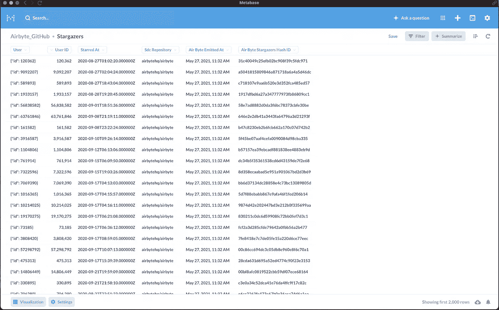

作者图片

为了计算我们第一个问题的答案，点击“总结”按钮，按**分组，以**开始，按**计数**总结，然后你就有了第一个问题的答案:一天中新的观星者的数量。

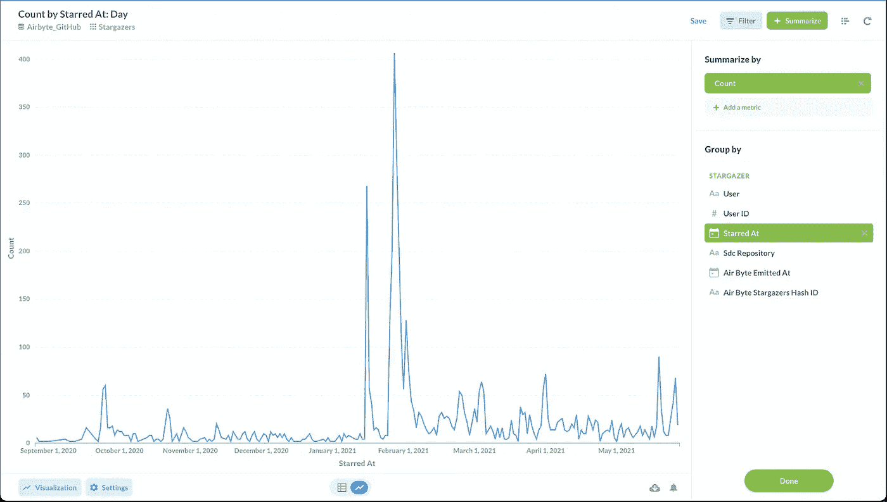

作者图片

点击右上角的蓝色**保存**按钮来保存问题，并确保你在线模式下进行可视化。保存时，Metabase 会提示您将其添加到仪表板中，这正是我们想要的！‍

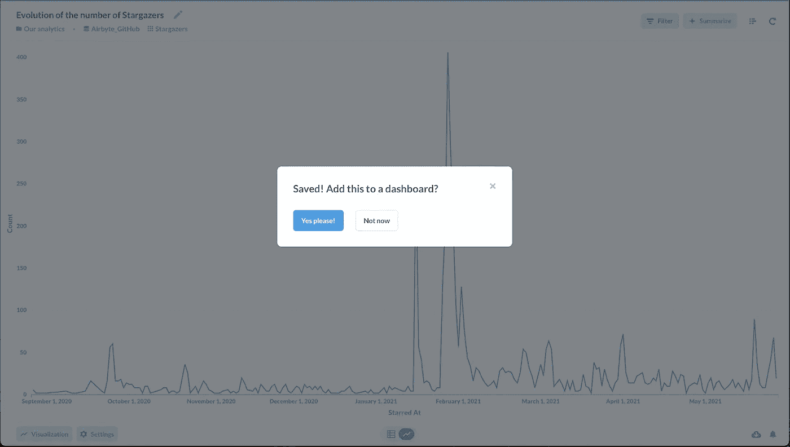

作者图片

点击创建一个新的仪表板，命名您的仪表板，并点击创建。然后，您可以根据自己的情况调整仪表板卡的大小，点击保存，我们的第一个问题就有了答案！

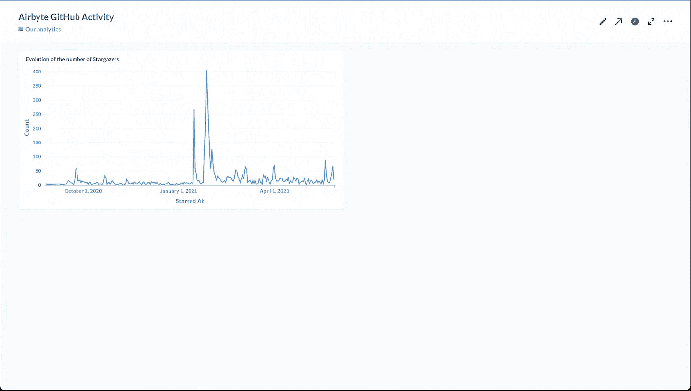

作者图片

对于我们需要问的其余问题，步骤非常相似，因此我们将只提及我们正在使用的表，并显示可视化以及我们在到达那里时使用的设置。

## 公关人员数量的变化

*表:拉取请求*

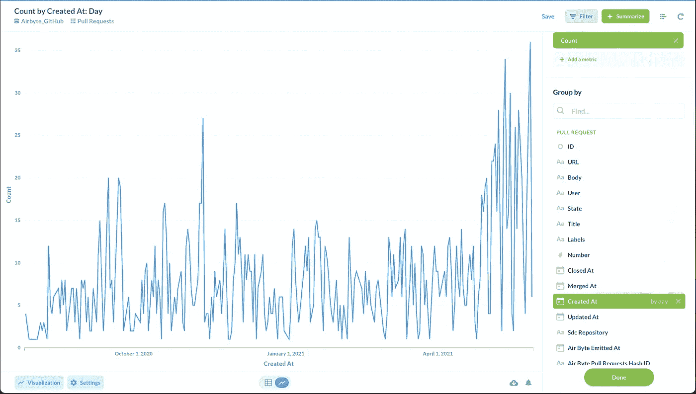

作者图片

## 发行人数量的演变

*表格:问题*


作者图片

## 来自非团队成员的新评论数量的变化

*表:注释*

我们将使用“作者关联”字段过滤掉合作者的任何评论。

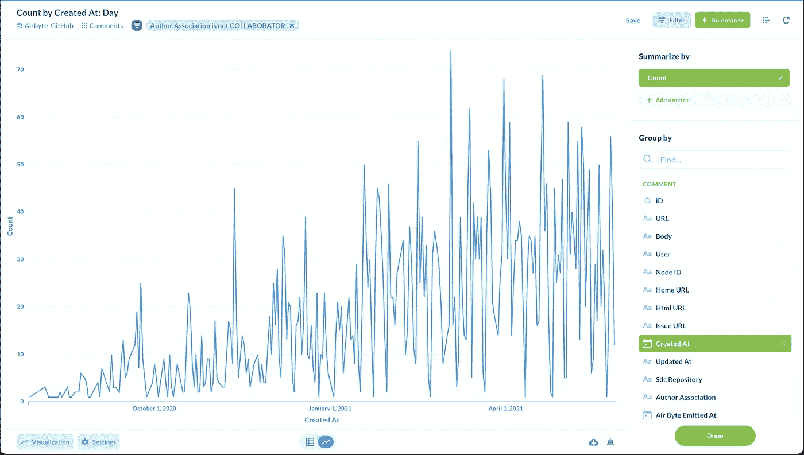

作者图片

## 来自非团队成员的新问题数量的变化

*表:问题*

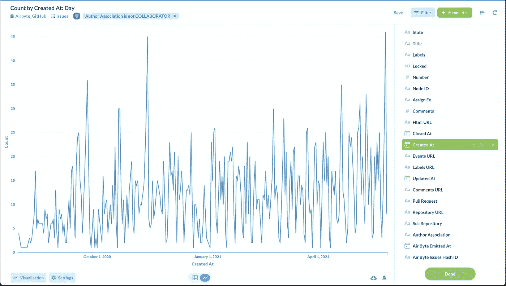

作者图片

# 结束了。

在本文中，我们使用 GitHub Airbyte 连接器从 GitHub repo 获取数据，并将数据存储在 PostgreSQL 数据库中。然后，我们设置元数据库，并提出问题来可视化数据。

这是 GitHub 仪表板的成品，带有我们在 Metabase 上的可视化效果:

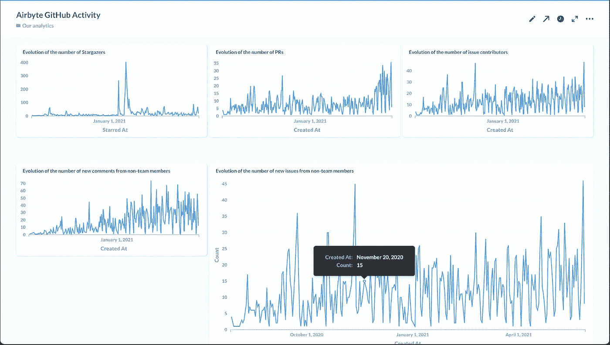

作者图片

## 额外学分

以下是使用相同过程可以获得答案的其他问题:

*   来自非团队成员的#新评论的演变
*   来自非团队成员的#新问题的演变
*   来自非团队成员的#新 PRs 的演变
*   非团队成员互动的首次评论时间(第 50、90 百分位)
*   PR 第一次审核前的时间(第 50、90 百分位)

*最初发表于* [*Airbyte*](https://airbyte.io/recipes/build-a-github-activity-dashboard-for-your-project)