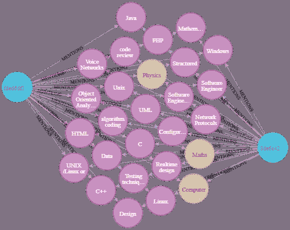
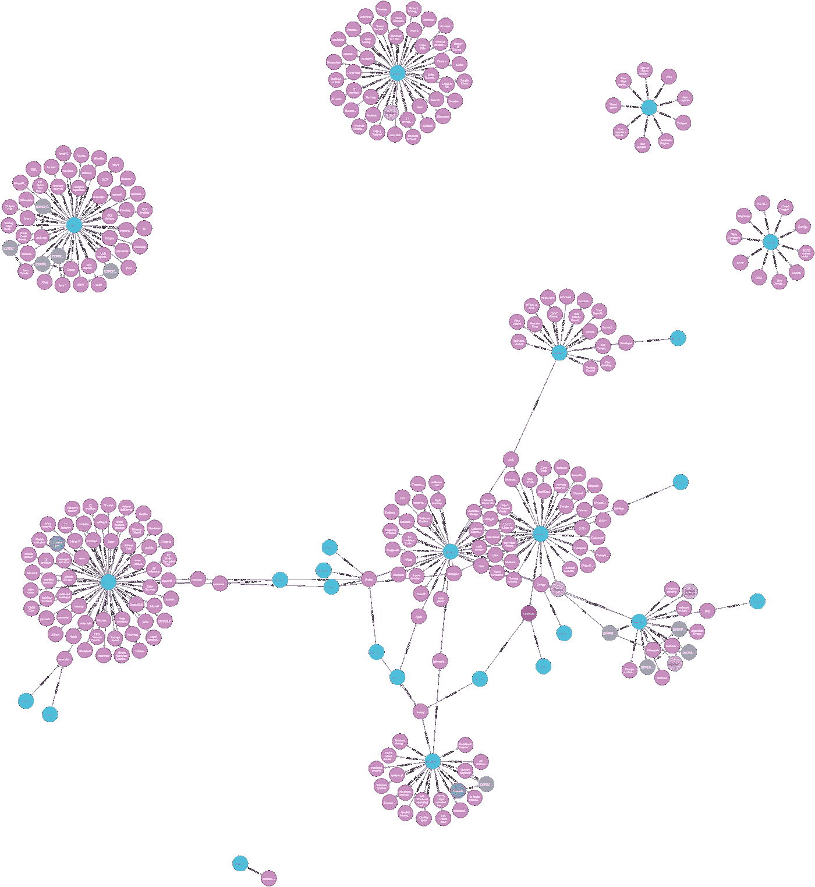
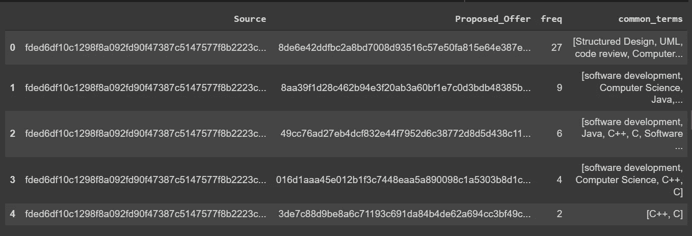
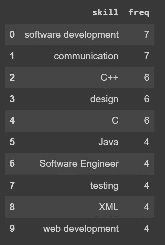
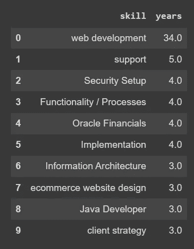
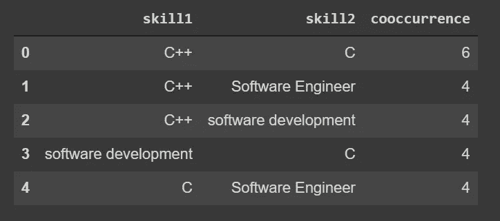

# 如何用 Neo4J 和变形金刚搭建知识图

> 原文：<https://towardsdatascience.com/how-to-build-a-knowledge-graph-with-neo4j-and-transformers-72b9471d6969?source=collection_archive---------2----------------------->

## 使用自定义命名实体识别和关系提取模型



图片作者:Neo4j 中的知识图谱

# 介绍

在我的上一篇文章“使用 BERT Transformer 构建求职知识图”中，我们探讨了如何使用定制 Transformer 模型提取的实体和关系，从职位描述中创建知识图。虽然我们能够使用 Python 库 [networkX](https://networkx.org/) 获得节点和关系的良好视觉效果，但实际的图形存在于 Python 内存中，而不是存储在数据库中。当试图创建一个可伸缩的应用程序时，这可能会有问题，因为您必须存储一个不断增长的知识图。这就是 Neo4j 的优势所在，它使您能够将图表存储在一个功能齐全的数据库中，从而允许您管理大量数据。此外，Neo4j 的 Cypher 语言丰富，易于使用，非常直观。

在本文中，我将展示如何使用基于转换器的命名实体识别(NER)和 spacy 的关系提取模型，从工作描述中构建知识图。这里描述的方法可以用于任何不同的领域，例如生物医学、金融、保健等。

以下是我们将要采取的步骤:

*   在 google colab 中加载我们微调过的变压器 NER 和空间关系提取模型
*   创建一个 Neo4j 沙箱并添加我们的实体和关系
*   查询我们的图表，找到与目标简历最匹配的工作，找到三个最受欢迎的技能和最高技能的共现

有关如何使用[ubai](https://ubiai.tools)生成训练数据以及微调 NER 和关系提取模型的更多信息，请查看以下文章:

*   【UBIAI 简介:面向自然语言处理应用的易用文本注释
*   [如何使用具有空间 3 的 BERT 变换器训练联合实体和关系提取分类器](https://ubiai.tools/blog/article/How-to-Train-a-Joint-Entities-and-Relation-Extraction-Classifier-using-BERT-Transformer-with-spaCy3)
*   [如何用空间 3 微调 BERT 变压器](https://ubiai.tools/blog/article/how-to-fine-tune-bert-transformer-with-spacy3)

工作描述数据集在 [Kaggle](https://www.kaggle.com/airiddha/trainrev1) 中公开。

在本教程结束时，我们将能够创建如下所示的知识图。



作者图片:职位描述知识图

# 命名实体和关系抽取

*   首先，我们加载 NER 和关系模型的依赖关系以及 NER 模型本身，该模型之前已经过微调，可以提取技能、文凭、文凭专业和多年经验:

*   加载我们要从中提取实体和关系的作业数据集:

*   从作业数据集中提取实体:

在将提取的实体输入到关系提取模型之前，我们可以先看一下这些实体:

```
[('stock market analysis', 'SKILLS'),
 ('private investor', 'SKILLS'),
 ('C++', 'SKILLS'),
 ('Investment Software', 'SKILLS'),
 ('MS Windows', 'SKILLS'),
 ('web development', 'SKILLS'),
 ('Computer Science', 'DIPLOMA_MAJOR'),
 ('AI', 'SKILLS'),
 ('software development', 'SKILLS'),
 ('coding', 'SKILLS'),
 ('C', 'SKILLS'),
 ('C++', 'SKILLS'),
 ('Visual Studio', 'SKILLS'),
 ('2 years', 'EXPERIENCE'),
 ('C/C++ development', 'SKILLS'),
 ('data compression', 'SKILLS'),
 ('financial markets', 'SKILLS'),
 ('financial calculation', 'SKILLS'),
 ('GUI design', 'SKILLS'),
 ('Windows development', 'SKILLS'),
 ('MFC', 'SKILLS'),
 ('Win', 'SKILLS'),
 ('HTTP', 'SKILLS'),
 ('TCP/IP', 'SKILLS'),
 ('sockets', 'SKILLS'),
 ('network programming', 'SKILLS'),
 ('System administration', 'SKILLS')]
```

我们现在准备预测关系；首先加载关系提取模型，确保将目录更改为 rel_component/scripts，以访问关系模型所需的所有脚本。

```
cd rel_component/
```

```
Predicted relations:  entities: ('5+ years', 'software engineering') --> predicted relation: {'DEGREE_IN': 9.5471655e-08, 'EXPERIENCE_IN': 0.9967771}  entities: ('5+ years', 'technical management') --> predicted relation: {'DEGREE_IN': 1.1285037e-07, 'EXPERIENCE_IN': 0.9961034}  entities: ('5+ years', 'designing') --> predicted relation: {'DEGREE_IN': 1.3603304e-08, 'EXPERIENCE_IN': 0.9989103}  entities: ('4+ years', 'performance management') --> predicted relation: {'DEGREE_IN': 6.748373e-08, 'EXPERIENCE_IN': 0.92884386}
```

# Neo4J

我们现在准备将我们的作业数据集和提取的数据加载到 neo4j 数据库中。

*   首先，启动一个 [neo4j 空白沙箱](https://sandbox.neo4j.com/?usecase=blank-sandbox)并添加您的连接细节，如下所示:

*   接下来，我们将文档、实体和关系添加到知识图中。请注意，我们需要从实体 EXPERIENCE 的名称中提取整数年数，并将其存储为一个属性。

现在开始有趣的部分。我们准备启动知识图并运行查询。让我们运行一个查询来查找与目标概要文件最匹配的职务:

以表格形式显示常见实体的结果:



在图形可视化中:


作者图片:基于最佳工作匹配

虽然该数据集仅由 29 个职位描述组成，但是这里描述的方法可以应用于具有数千个职位的大规模数据集。只需几行代码，我们就可以立即提取与目标概要文件最匹配的职务。

让我们找出最受欢迎的技能:

```
query = """MATCH (s:SKILLS)<-[:MENTIONS]-(o:Offer)RETURN s.name as skill, count(o) as freqORDER BY freq DESCLIMIT 10"""res = neo4j_query(query)res
```



和需要最高年经验的技能:

```
query = """MATCH (s:SKILLS)--(r:Relation)--(e:EXPERIENCE) where r.type = "EXPERIENCE_IN"return s.name as skill,e.years as yearsORDER BY years DESCLIMIT 10"""res = neo4j_query(query)res
```



网站开发和支持需要最高年的经验，其次是安全设置。

最后，让我们检查一下最常出现的一对技能:

```
neo4j_query("""MATCH (s1:SKILLS)<-[:MENTIONS]-(:Offer)-[:MENTIONS]->(s2:SKILLS)WHERE id(s1) < id(s2)RETURN s1.name as skill1, s2.name as skill2, count(*) as cooccurrenceORDER BY cooccurrenceDESC LIMIT 5""")
```



# 结论:

在这篇文章中，我们描述了如何利用基于变形金刚的 NER 和斯帕西的关系提取模型，用 Neo4j 创建知识图。除了信息提取之外，图拓扑可以用作另一个机器学习模型的输入。

将 NLP 与 Neo4j 的 graph DB 结合起来，将会加速许多领域的信息发现，在医疗保健和生物医学领域有更显著的应用。

如果您有任何问题或想要为您的特定案例创建定制模型，请在下面留言或发送电子邮件至 admin@ubiai.tools。

在推特上关注我们 [@UBIAI5](https://twitter.com/UBIAI5)