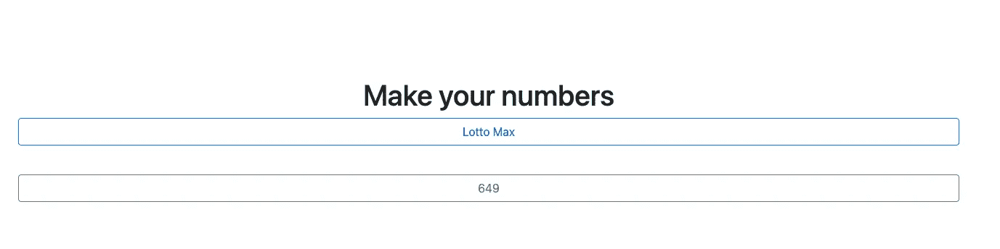
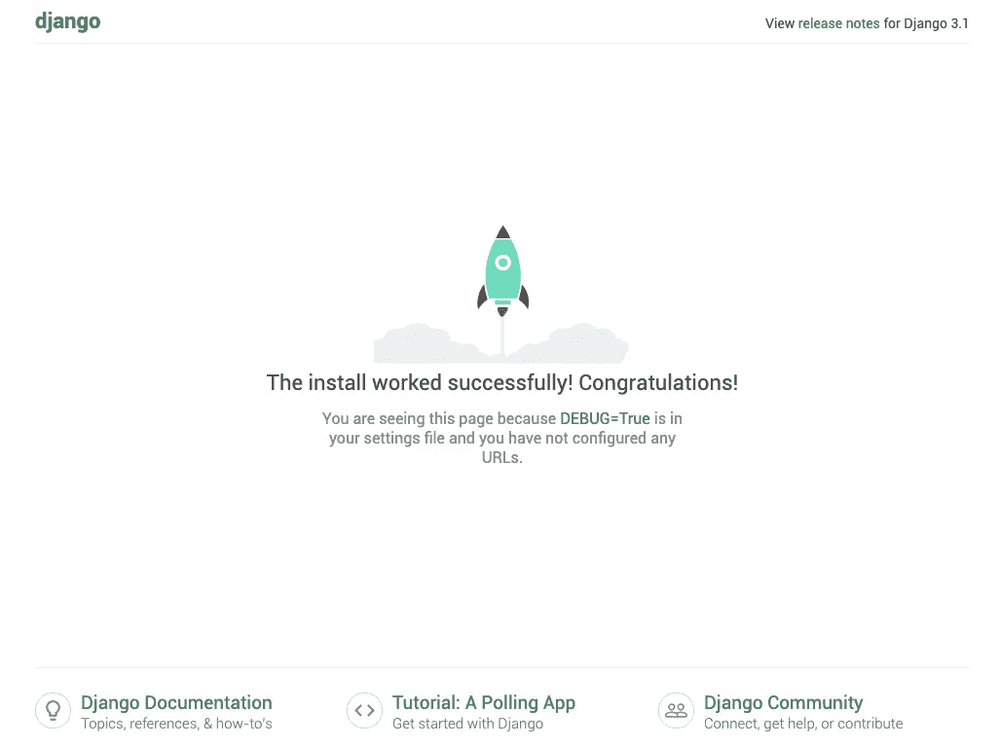
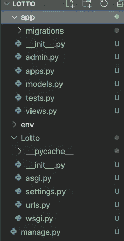
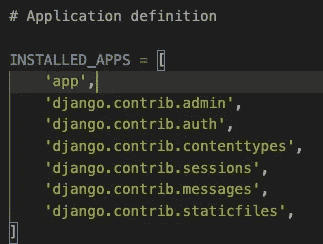
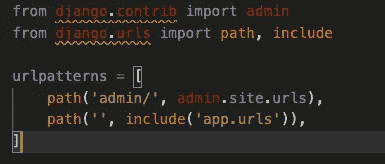
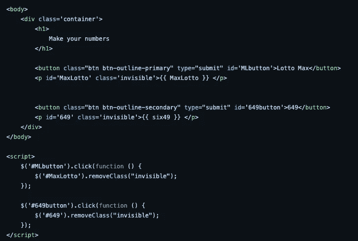
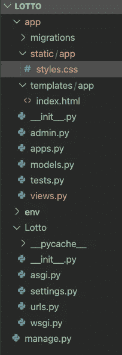
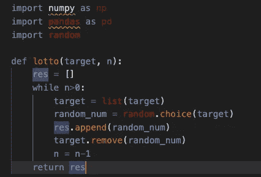
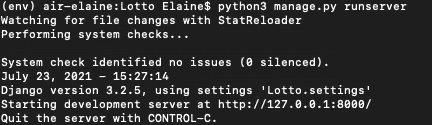

# 如何在 macOS 上使用 Django 和 Visual Studio 代码构建 Lotto Generator Web 应用程序

> 原文：<https://towardsdatascience.com/how-to-build-a-lotto-generator-web-application-using-django-and-visual-studio-code-on-macos-91307d48165c?source=collection_archive---------25----------------------->

## WEB 开发

## 使用 Django 构建有趣的项目


照片由来自 [Unsplash](https://unsplash.com/) 的[埃里克·麦克林](https://unsplash.com/photos/4ACaUyPyjoY)拍摄

# 介绍

在本教程中，您将使用 Django 构建一个乐透生成器 web 应用程序。

[Django](https://www.djangoproject.com/) 是一个 Python web 框架，它简化了 web 开发中的常见实践。它是可靠的，也有一个充满活力的稳定库生态系统，支持日常开发需求。

对于这个项目，您将使用 HTML、CSS 作为前端语言，Python 作为后端语言，Django 作为后端框架。在本教程结束时，您将拥有一个完全正常工作的应用程序，它允许您随机生成两组数字 [LottoMax](https://www.olg.ca/en/lottery/play-lotto-max-encore/about.html?gclid=CjwKCAjwruSHBhAtEiwA_qCppgef5FdkTIqbsHau_W4pX6un_hiOKuUkhZnnl30FvCgeDO6zbsO5gBoCSLgQAvD_BwE&gclsrc=aw.ds) 和 [649](https://www.olg.ca/en/lottery/play-lotto-649-encore/about.html) 。你可以在这里看到现场演示。



App UI(图片来自作者)

**注意:**本教程的源代码可以在 [GitHub](https://github.com/fangyiyu/WebDevPortfolio/tree/main/Lotto_Generator) 上获得。

# 先决条件

要完成本教程，您需要:

1.  [安装并设置 Python 3 的本地编程环境](https://www.digitalocean.com/community/tutorial_series/how-to-install-and-set-up-a-local-programming-environment-for-python-3)。
2.  使用 MacOS 操作系统。
3.  [安装 Visual Studio 代码。](https://code.visualstudio.com/docs/setup/mac)

**警告:**本教程中提供的代码是用于教育目的，而不是用于生产用途。

# 步骤 1——创建 Django 项目。

1.  在您的终端中运行以下命令来创建一个 Django 项目。

```
django-admin startproject <PROJECT_NAME>
```

2.通过以下方式进入项目文件夹:

```
cd <PROJECT_NAME>
```

3.运行以下代码启动一个应用程序:

```
python3 manage.py startapp <APP_NAME>
```

现在您已经创建了一个基本的 Django 应用程序。您可以运行以下命令来查看本地计算机上的 web 应用程序。

```
python3 manage.py runserver
```

你的 Django app 将在 [http://127.0.0.1:8000/](http://127.0.0.1:8000/) 开发。在这一步，web 应用程序将如下图所示。



图片来自作者

输入 Control+C 退出服务器。

# 步骤 2—创建虚拟环境。

在这一步，您将创建一个虚拟环境(env)来存储这个特定项目的所有依赖项。

1.  如果您没有安装 *virtualen* ，运行以下命令在您的终端中安装环境。

```
pip install virtualenv
```

2.在安装了 *virtualen* 之后，运行下面的代码来创建一个 env。

```
virtualenv <ENV_NAME>
```

在<env_name>中替换您的 env 的名称</env_name>

3.通过以下方式激活环境:

```
source <ENV_NAME>/bin/activate
```

您可以在需要时使用以下命令移除 env:

```
sudo rm -rf <ENV_NAME>
```

现在你的 env 已经准备好了。是时候建造一些有趣的东西了！

# 步骤 3—在根目录中配置 settings.py 和 urls.py

现在，在 visual studio 代码中打开 Django 项目文件夹。

您应该会看到这样的项目结构:



你的 Django 项目的结构(图片来自作者)

我使用“Lotto”作为我的项目名，“app”作为应用名，“env”作为环境名。

1.  在您的根目录(在我的例子中是文件夹“Lotto ”)中，单击 setting.py，并将您的 APP_NAME 添加到 INSTALLED_APPS。



图片来自作者

2.在同一个文件夹中，点击 urls.py，导入库 *include* 并将应用中的所有 URL 添加到 *urlpatterns* 。urls.py 将如下所示:



图片来自作者

# 第 4 步—添加模板。

1.  在你的 app 目录下，新建一个名为[*templates*](https://docs.djangoproject.com/en/3.2/topics/templates/)*的文件夹。* Django 依靠模板动态生成 HTML。在*模板*中，请新建一个与你的 APP_NAME 同名的文件夹(在我这里是 *app* )，然后在这个文件夹中新建一个名为【index.html 的文件。您将在这个 HTML 文件中构建您的网页。
2.  由于我们正在建立一个乐透生成器应用程序，我们希望应用程序随机生成符合乐透最大值和 649 规则的数字集，所以在网页上，我们需要两个按钮，单击按钮，生成的数字将出现在屏幕上。你可以基于这个目的或者按照下面的代码来构建应用程序:



index.html(图片来自作者)

3.你还需要导入库来使用 Jquery 和 Bootstrap，关于 HTML 文件的完整代码请参考 [Github Repo](https://github.com/fangyiyu/Lotto_Generator/blob/main/app/templates/app/index.html) (我在 Repo 中做了三个按钮，但是对于我们的教程两个就够了)。

4.在您的 APP_NAME 中创建一个名为 *static* 的新文件夹，然后创建一个与您的 APP_NAME 同名的新文件夹。在这个文件夹中，创建你的 [CSS 文件](https://github.com/fangyiyu/Lotto_Generator/blob/main/app/static/app/styles.css)。静态文件夹用于保存所有的[静态文件](https://docs.djangoproject.com/en/3.2/howto/static-files/)，包括图片、JavaScript 和 CSS 文件。

现在，Django 项目的结构应该是这样的:



你的 Django 项目的结构(图片来自作者)

# 步骤 5—添加视图

1.  在你的 app 目录下，创建一个名为 predict.py 的文件，生成一定范围内的随机数。



predict.py(图片来自作者)

2.单击 views.py，开始在这里创建视图。

每个[视图](https://docs.djangoproject.com/en/3.2/topics/http/views/)都是一个 Python 函数，接受 Web 请求并返回 Web 响应。视图本身包含返回响应所需的任意逻辑。

对于 Lotto Generator 应用程序，我们将构建一个视图函数来返回两个列表:一个用于 Lotto Max，它将返回 1 到 50 范围内的 7 个随机数，一个用于 649，它将返回 1 到 50 范围内的 6 个随机数。

您的 [view.py](https://github.com/fangyiyu/Lotto_Generator/blob/main/app/views.py) 将如下所示:

```
from django.shortcuts import renderfrom . import predictimport numpy as npimport pandas as pdimport random# Create your views here.def index(request):MaxLotto_range = range(1,51)MaxLotto = predict.lotto(MaxLotto_range, 7)MaxLotto = sorted(MaxLotto) six49_range = range(1, 50)six49 = predict.lotto(six49_range, 6)six49 = sorted(six49) return render(request, 'app/index.html',{"MaxLotto": MaxLotto,"six49": six49})
```

# 第 6 步—添加 urls.py

最后，在您的 app 目录中添加一个名为 [urls.py](https://docs.djangoproject.com/en/3.2/topics/http/urls/) 的新文件，并添加与您创建的 Python 函数(您的视图)对应的所有 URL 路径。

```
from django.urls import include, pathfrom . import viewsurlpatterns = [path("", views.index, name="index"),]
```

万岁！您的应用程序已经可以运行了！

# 第 6 步—运行应用程序

在您的终端上运行以下命令:

```
python3 manage.py runserver
```

Ops 似乎还没有安装依赖项。

让我们先安装它们。

在您的终端中:

```
 pip install Django numpy pandas
```

然后，跑

```
python3 manage.py runserver
```

您的终端将显示:



运行后的终端(图片来自作者)

我们把网址(http://127.0.0.1:8000/)复制粘贴到你的浏览器，看看你都建了什么！

看到了吗？然后点击按钮。现在你有你的乐透发电机运行！

# 结论

在本文中，您将使用 Django 和 VS 代码从头开始构建一个乐透生成器。您在根目录中配置了 settings.py 和 urls.py，在 app 目录中添加了模板、静态文件和 urls.py，并在 views.py 中创建了一个函数，该函数带有您创建的帮助器函数，用于生成随机数。

如果你想了解更多关于使用 Django 建立机器学习模型或个人投资组合的信息，欢迎访问我的 [GitHub repo](https://github.com/fangyiyu) 或在下面发表评论。我很乐意把我一路走来学到的东西分享给公众，以尽量减少你花在搜索 Google 和 StackOverflow 上的时间。

在 [Linkedin](https://www.linkedin.com/in/fangyiyu/) 上向我问好。