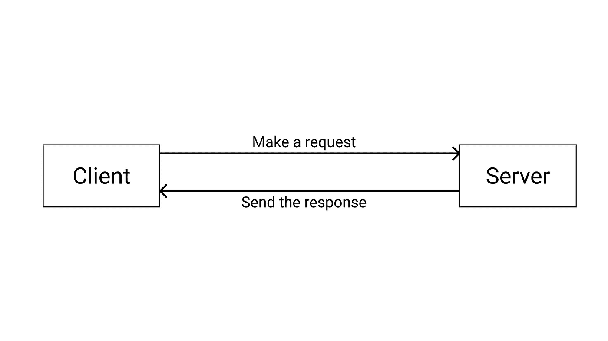
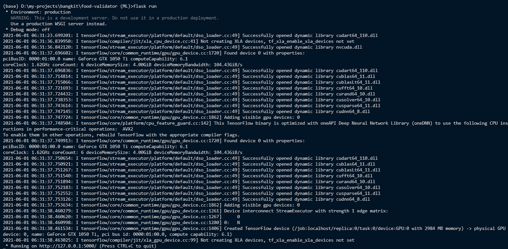
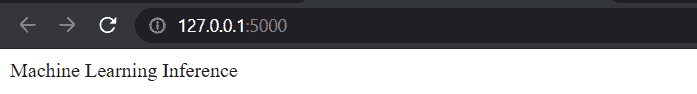
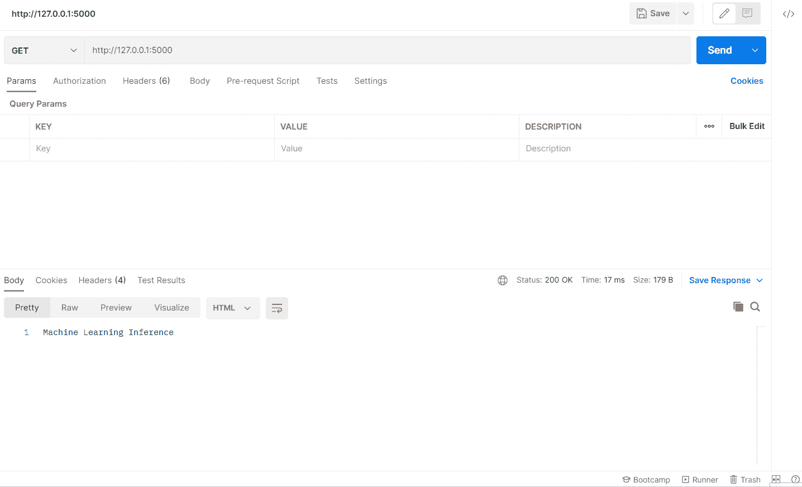

# 如何使用 Flask 构建机器学习 API

> 原文：<https://towardsdatascience.com/how-to-build-a-machine-learning-api-using-flask-2fb345518801?source=collection_archive---------4----------------------->

## 让我们把你的 ML 模型应用到现实生活中吧！


卢卡·布拉沃在 [Unsplash](https://unsplash.com/s/photos/web?utm_source=unsplash&utm_medium=referral&utm_content=creditCopyText) 上的照片

# 介绍

机器学习(ML)是一种很好的方式来完成无法显式编码的任务，例如图像分类。但是当模型已经构建好了，如果我们不把它部署到应用程序中，它就没有用了。

部署是机器学习工作流中的一个重要步骤。这是我们希望将 ML 模型应用到应用程序中的一个步骤。之后，我们可以在现实生活中使用该模型。

但是我们如何将模型创建为应用程序呢？我们可以构建一个应用编程接口(API)。有了它，我们可以从任何地方访问模型，无论是在移动应用程序上还是在 web 应用程序上。在 Python 中，有一个库可以帮助我们构建 API。它叫烧瓶。

本文将向您展示如何使用 Flask 为我们的机器学习模型构建 REST API。事不宜迟，我们开始吧！

# REST API

在我们进入实现之前，让我解释一下 REST API。REST API 代表表述性状态转移应用程序编程接口。

REST API 的机制是这样的。假设你想在谷歌上搜索猫的照片。第一步是向谷歌发送一个请求，给他们一个类似“猫照片”的查询。然后，服务器会给你的电脑发送一个响应，就是猫咪照片的汇编。

关于 REST API 就这些了！这是作为客户端的你们之间的交流方式，通过向服务器请求一些东西，然后服务器会向你发送响应。下面是 REST API 如何工作的一个例子。



这个形象是作者创造的

# 履行

现在您已经理解了 REST API 的基本概念。让我们进入使用 Flask 的实现。我们将介绍几个流程:

1.  导入库
2.  加载机器学习模型
3.  构建预处理和预测图像的函数
4.  初始化 flask 对象
5.  设置向用户浏览器返回某些内容的路径和函数
6.  运行并测试 API

## 导入库

第一步是加载库。我们将导入的库是 TensorFlow、Flask、Pillow 和其他支持库。如果没有安装这些库，可以使用 pip 命令进行安装。

以下是导入库的代码:

## 加载模型

加载库之后，下一步是加载机器学习模型。在这种情况下，我将使用我的图像分类器模型，在使用 TensorFlow 之前，我已经对它进行了预训练。该模型将预测图像是否包含食物。

下面是加载模型的代码:

> 旁注:
> 如果你在 GPU 上训练模型，想在 CPU 上运行它们，也没问题。TensorFlow 支持这一点，你根本不需要调整模型。

## 构建预处理和预测图像的函数

加载模型后，下一步是创建函数来处理图像。因为我们将从客户端的请求中获取图像，所以我们将使用 io。BytesIO 函数将图像加载到我们的 Python 代码中。之后，我们只需要调用。从我们的模型预测函数来预测结果。

下面是预处理和预测图像的代码:

## 初始化 flask 对象

构建完函数后，现在让我们初始化 Flask 对象。此外，我们在 Flask 对象参数上设置名称。这一步是为了确保运行 web 应用程序时 python 脚本是可读的。

下面是执行该操作的命令:

## 设置路线和功能

现在让我们设置路线和我们想要运行的功能。路由是访问网络上特定功能的一种方式。当我们访问路由时，它将运行一个函数，并将消息返回给用户。

基于超文本传输协议(HTTP)方法，每条路由都有不同的交互方式。我们可以使用几种 HTTP 方法。

第一个是 GET 方法，我们只访问路由，不发送任何数据。第二个是 POST 方法。在这个方法中，我们可以访问路由，也可以向它发送数据。

还有像 PUT、PATCH 和 DELETE 方法这样的方法。但我们不会进一步谈论它。这次我们将只使用 GET 和 POST 方法。

现在让我们创建两条路线。第一个是“/”路由路径。该路由将返回 API 的欢迎消息。因此，我们会给这个路由一个 GET 方法。

第二个是“/predict”路由路径。该路径将从图像返回预测结果。我们将使用 POST 方法将图像发送到路由中。此外，我们需要设置密钥，这样应用程序就可以知道图像在哪里。我们将使用“file”键作为图像文件的标识符。

以下是设置路线及其功能的代码:

## 运行 API

在我们构建了函数和它们的路径之后，现在让我们运行 API。但是在我们运行 API 之前还有最后一步。我们需要添加。像这样将方法路由到我们的代码中:

现在转到您的终端，运行以下命令之一(确保您与 API 文件位于同一路径):

```
**flask run**OR**python app.py**
```

如果您运行该命令，它将返回如下结果:



从上面可以看到，它显示了来自 TensorFlow 的几个日志。别担心。这只是一个我们可以忽略的警告。只要你能看到“正在运行”的消息，就意味着你的 API 正在运行。

现在我们通过地址 [http://127.0.0.1:5000/](http://127.0.0.1:5000/) 访问 API，其中 127.0.0.1 是你的本地地址，5000 是访问 API 的端口号。如果它成功了，它会在网上这样显示:



太好了！我们的 API 完美启动。让我们试试 API，看它能不能预测一个图像里面有没有食物。我们可以使用一个名为 Postman 的应用程序来测试我们之前创建的 API。你可以在这里下载[。](https://www.postman.com/downloads/)

这是结果的预览，



# 结束语

从上面可以看出，API 可以捕捉图像并返回预测结果。意味着我们的 API 已经在工作了。干得好！

现在，您已经使用 Flask 构建了机器学习 API。我希望这篇文章能帮助你理解 REST API 的概念。此外，它还可以指导您在自己的项目中开发自己的 API。

如果你对这篇文章感兴趣，你可以关注我的媒体以获得更多类似的文章。此外，如果您有任何问题或想与我交谈，您可以在 [**LinkedIn**](https://www.linkedin.com/in/alghaniirfan/) 上与我联系。

如果您仍然困于编写 API，这里是 API 的完整代码，

谢谢你看我的文章！

## 参考

[1][https://www . smashingmagazine . com/2018/01/understanding-using-rest-API/](https://www.smashingmagazine.com/2018/01/understanding-using-rest-api/)