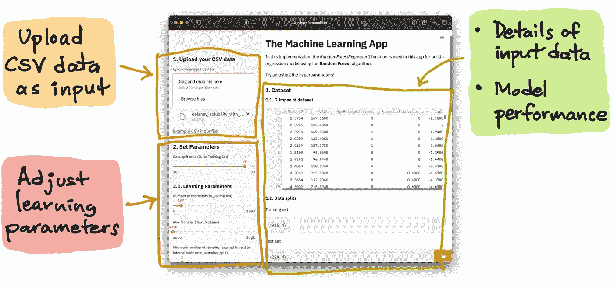
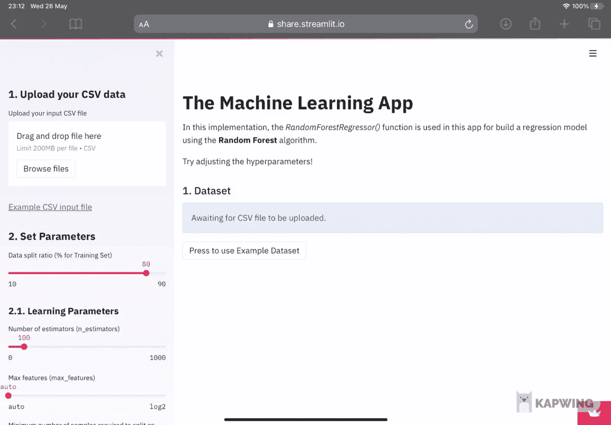
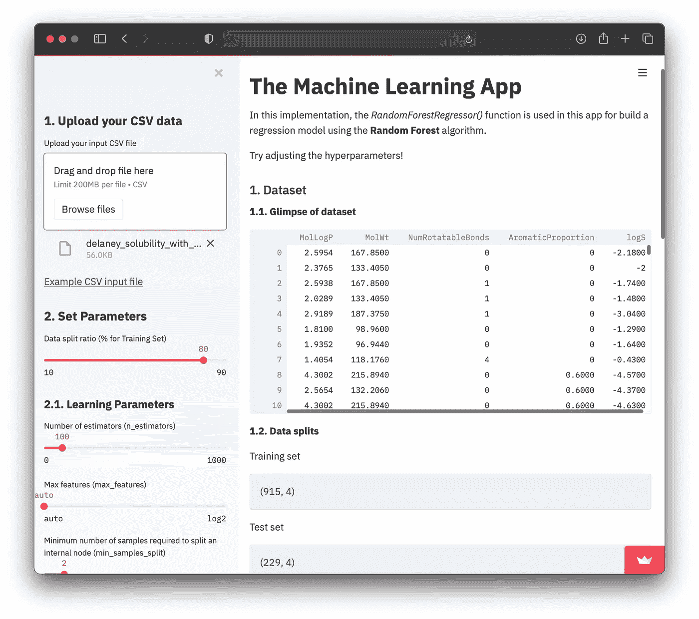

# 如何用 Python 构建机器学习 App

> 原文：<https://towardsdatascience.com/how-to-build-a-machine-learning-app-a9dfed2616fb?source=collection_archive---------9----------------------->


由 [envato elements](https://1.envato.market/c/2346717/628379/4662) 的 [alexdndz](https://elements.envato.com/user/alexdndz/graphics) 使用图像创建(经许可)。

## [数据科学](https://medium.com/tag/data-science) | [机器学习](https://medium.com/tag/machine-learning)

## < 150 lines of Python code

Have you ever wished for a web app that would allow you to build a machine learning model automatically by simply uploading a CSV file? In this article, you will learn how to build your very own machine learning web app in Python in a little over 100 lines of code.

The contents of this article is based on a YouTube video by the same name that I published a few months ago on my YouTube channel ([数据教授](https://www.youtube.com/channel/UCV8e2g4IWQqK71bbzGDEI4Q)中从头开始的一步一步教程)，作为本文的补充。

[**如何搭建机器学习 App | Streamlit # 13**](https://youtu.be/eT3JMZagMnE)**@**[**数据教授**](https://www.youtube.com/channel/UCV8e2g4IWQqK71bbzGDEI4Q) **YouTube 频道**

# 模型部署的重要性

在深入探讨之前，让我们先退后一步，看看全局。数据收集、数据清理、探索性数据分析、模型构建和模型部署都是数据科学生命周期的一部分。以下是生命周期的摘要信息图:


**数据科学生命周期。**(由 Chanin Nantasenamat 又名数据教授绘制)

作为数据科学家或机器学习工程师，能够部署我们的数据科学项目以完成数据科学生命周期对我们来说至关重要。使用 Django 或 Flask 等已建立的框架部署机器学习模型可能是一项艰巨和/或耗时的任务。

# 机器学习应用概述

概括地说，我们今天要构建的 web 应用程序本质上将接受一个 CSV 文件作为输入数据，应用程序将使用它来构建一个使用随机森林算法的回归模型。

现在，让我们详细了解一下 web 应用程序前端和后端的情况。

## 前端

用户可以将自己的数据集上传为 CSV 文件，还可以调整学习参数(在左侧面板中)，调整这些参数后，将构建一个新的机器学习模型，然后显示其模型性能(在右侧面板中)。



**机器学习 app 的解剖。**左侧面板接受输入，右侧面板显示结果。

**上传 CSV 数据作为输入**
CSV 文件的第一行应该有一个标题(包含列名),随后是数据集的后续行(第 2 行及之后)。我们可以看到，在左侧面板的上传框下方有一个到示例 CSV 文件的链接( [*示例 CSV 输入文件*](https://raw.githubusercontent.com/dataprofessor/data/master/delaney_solubility_with_descriptors.csv) )。让我们看看下面显示的这个示例 CSV 文件:

**应用程序中链接的示例 CSV 文件的前几行摘录。**

**调整学习参数**
上传 CSV 文件后，你应该可以看到已经建立了一个机器学习模型，其结果显示在右边的面板中。应当注意，该模型是使用默认参数构建的。用户可以通过滑块输入来调整学习参数，每次调整都会建立一个新的模型。

## 模型输出(右侧面板)

在右侧面板中，我们可以看到显示的第一个数据是 *1 中的输入数据帧。数据集*部分及其结果将显示在 *2 中。型号性能*部分。最后，模型构建中使用的学习参数在 *3 中提供。型号参数*部分。



**上传输入 CSV 文件后建立的模型。**

至于模型性能，显示了训练集和测试集的性能度量。由于这是一个回归模型，决定系数(R^2)and 误差(均方误差或平均绝对误差)。

## 后端

现在，让我们从更高的层面来看看这款应用的内部工作原理。

上传输入 CSV 文件后，该文件的内容将被转换成 Pandas 数据帧并赋给`df`变量。然后，数据帧将被分成`X`和`y`变量，以准备作为 Scikit-learn 的输入。接下来，这两个变量用于使用用户在左侧面板中指定的值进行数据分割(默认情况下使用 80/20 分割比率)。关于数据分割维度和列名的详细信息打印在应用程序前端的右侧面板中。然后，使用主要子集(80%子集)构建随机森林模型，并应用构建的模型对主要子集(80%)和次要子集(20%)进行预测。然后，该回归模型的模型性能被报告到 *2 下的右侧面板中。模型性能部分*。

# 本教程中使用的技术堆栈

这将只使用 3 个 Python 库来实现，包括 Streamlit、Pandas 和 Scikit-learn。

Streamlit 是一个易于使用的 web 框架，允许您立即快速实施数据驱动的应用程序。

Pandas 是一个数据结构工具，可以处理、操作和转换表格数据集。

Scikit-learn 是一个强大的工具，它为用户提供了构建机器学习模型(即，可以执行各种学习任务，包括分类、回归和聚类)的能力，并配备了示例数据集和特征工程功能。

# 逐行解释

这个应用程序的完整代码如下所示。代码跨度为 131 行，为了使代码可读，在注释行旁边添加了空格。

## 第 1–6 行

*   从 scikit-learn 库中导入由`streamlit`、`pandas`和各种函数组成的必备库。

## **第 8–12 行**

*   **第 8–10 行:**注释解释了第 11–12 行的作用。
*   **第 11–12 行:**使用`st.set_page_config()`功能设置页面标题及其布局。在这里，我们可以看到我们将`page_title`设置为`'The Machine Learning App’`，而`layout`设置为`'wide’`，这将允许应用程序的内容适合浏览器的整个宽度(即，否则默认情况下，内容将被限制在固定宽度)。

## 第 14–65 行

*   **第 14–15 行:**解释第 16–65 行的注释。
*   **第 16 行:**这里我们定义了一个名为`build_model()`的自定义函数，下面从第 17 行开始的语句将指示这个函数将做什么
*   **第 17-18 行:**存储在`df`变量中的输入数据帧的内容将被分成两个变量(`X`和`Y`)。在第 17 行，除了最后一列之外的所有列都将被分配给`X`变量，而最后一列将被分配给`Y`变量。
*   **第 20–21 行:**第 20 行是注释，说明第 21 行在做什么，就是使用`train_test_split()`函数对输入数据(存储在`X`和`Y`变量中)进行数据拆分。默认情况下，数据将以 80/20 的比例分割，80%的子集将分配给`X_train`和`Y_train`，而 20%的子集将分配给`X_test`和`Y_test`。
*   **第 23–27 行:**第 23 行使用 Markdown 语法将`1.2\. Data splits`打印为粗体文本(也就是说，在这里我们可以看到，我们在短语之前和之后使用了**符号，我们希望使文本像在`**1.2\. Data splits**`中一样粗体)。接下来，我们将打印`X`和`Y`变量的数据维度，其中第 24 行和第 26 行将使用`st.write()`函数打印出`Training set`和`Testing set`，而第 25 行和第 27 行将使用`st.info()`函数打印出数据维度，方法是分别在`X_train`和`X_test`变量后添加`.shape`，如`X_train.shape`和`X_test.shape`所示。请注意，`st.info()`功能将在变量输出周围创建一个彩色框。
*   **第 29–33 行:**与第 23–27 行的代码块类似，该代码块将打印出分别存储在`X.columns`和`Y.name`中的 X 和 Y 变量名。
*   **第 35–43 行:**`RandomForestRegressor()`函数将用于建立回归模型。构建随机森林模型的各种输入参数将使用应用程序前端左侧面板中的用户指定值(在后端，对应于第 82–97 行)。
*   **第 44 行:**现在将使用`rf.fit()`函数训练模型，作为输入参数，我们将使用`X_train`和`Y_train`。
*   **第 46 行:**使用`st.subheader()`功能将打印出`2\. Model performance`部分的标题。
*   **第 48–54 行:**第 48 行使用`st.markdown()`功能打印`2.1\. Training set`的标题。第 49 行使用`rd.predict()`函数，使用`X_test`作为输入参数，应用训练模型对训练集进行预测。第 50 行打印要为决定系数(R2)打印的性能指标的文本。第 51 行使用`st.info()`函数，通过使用`Y_train`和`Y_pred_train`(代表训练集的实际 Y 值和预测 Y 值)作为输入参数，经由`r2_score()`函数打印 R2 分数。第 53 行使用`st.write()`函数打印下一个性能指标的文本，这是错误。接下来，第 54 行通过使用`Y_train`和`Y_pred_train`作为输入参数，使用`st.info()`函数通过`mean_squared_error()`函数打印均方误差值。
*   **第 56–59 行:**这段代码执行完全相同的过程，但是它将在测试集上执行，而不是在训练集上执行。因此，不使用训练集数据(`Y_train`和`Y_pred_train`)，而是使用测试集数据(`Y_test`和`Y_pred_test`)。
*   **第 64–65 行:**第 64 行使用`st.subheader()`功能打印标题`3\. Model Parameters`。

## **第 67–75 行**

此处将打印 web 应用程序的标题。第 68 行和第 75 行开始和结束使用`st.write()`函数以 Mardown 语法编写页面标题。第 69 行使用`#`符号将文本设为标题 1 大小(根据 Markdown 语法)。第 71 和 73 行将打印关于 web 应用程序的描述。

## **第 78–100 行**

*   这里描述了左侧工具条面板的几个代码块。第 78 行注释了接下来的几个代码块是关于什么的，哪个是用于收集用户指定输入的左侧边栏面板。
*   第 79–83 行定义了 CSV 上传框。第 79 行通过`st.sidebar.header()`功能将`1\. Upload your CSV data`打印为标题。请注意，我们在`st`和`header`之间添加了`.sidebar`，以指定这个标题应该进入侧边栏。否则，如果它被写成`st.header()`，那么它将转到右边的面板。第 80 行将`st.sidebar.file_uploader()`函数分配给`uploaded_file`变量(即，该变量现在将表示用户上传的 CSV 文件内容)。第 81–83 行将打印到示例 CSV 文件的链接，用户可以使用该文件来测试应用程序(在这里，您可以随意用 CSV 文件格式的自定义数据集替换它)。
*   第 85–87 行以注释开始，说明下面的代码块将与随机森林模型的参数设置有关。第 86 行然后使用`st.sidebar.header()`函数打印`2\. Set Parameters`作为标题文本。最后，第 87 行使用`st.sidebar.slider()`函数创建了一个滑动条，其中它的输入参数指定`Data split ratio (% for Training Set)`作为滑块的文本标签，而 4 组数值(`10, 90, 80, 5`)代表最小值、最大值、默认值和增量步长值。最小值和最大值用于设置滑动条的边界，我们可以看到最小值是 10(显示在滑动条的最左边)，最大值是 90(显示在滑动条的最右边)。如果用户不调整滚动条，将使用默认值 80。增量步长将允许用户以步长 5(例如 75、80、85 等)递增或递减滑块值。)
*   第 89–93 行定义了`2.1\. Learning Parameters`中学习参数的各种滑动条，与第 87 行描述的方式相似。这些参数包括`n_estimators`、`max_features`、`min_samples_split`和`min_samples_leaf`。
*   第 95–100 行以类似于第 87 行描述的方式定义了`2.2\. General Parameters`中通用参数的各种滑动条。这些参数包括`random_state`、`criterion`、`bootstrap`、`oob_score`和`n_jobs`。

## **第 102–103 行**

注释:接下来的代码块将把模型输出打印到主面板或右侧面板中。

## **第 108–134 行**

*   应用 if-else 语句来检测 CSV 文件是否已上载。首次加载 web 应用程序时，它将默认为`else`语句，因为尚未上传任何 CSV 文件。加载 CSV 文件后，`if`语句被激活。
*   如果`else`语句(第 113-134 行)被激活，我们将看到一条消息，显示`Awaiting for CSV file to be uploaded`以及一个可点击的按钮`Press to use Example Dataset`(稍后我们将解释这个按钮的作用)。
*   如果`if`语句(第 108-112 行)被激活，上传的 CSV 文件(其内容包含在`uploaded_file`变量中)将被分配给`df`变量(第 109 行)。接下来，使用`st.markdown()`函数打印标题`1.1\. Glimpse of dataset`(第 110 行)，然后打印`df`变量的数据帧内容(第 111 行)。然后，`df`变量中的 dataframe 内容将被用作`build_model()`自定义函数的输入参数(即前面第 14–65 行中描述的),在该函数中将构建随机森林模型，其模型结果将被显示到前端。

# 运行 web 应用程序

好了，现在 web 应用程序已经编写好了。让我们继续运行 web 应用程序。

## 创造康达环境

让我们假设您是从零开始，您将必须创建一个新的 conda 环境(这是一个确保代码可再现性的好主意)。

首先，在终端命令行中创建一个名为`ml`的新 conda 环境，如下所示:

```
conda create -n ml python=3.7.9
```

其次，我们将登录到`ml`环境

```
conda activate ml
```

## 安装必备库

首先，下载 requirements.txt 文件

```
wget [https://raw.githubusercontent.com/dataprofessor/ml-auto-app/main/requirements.txt](https://raw.githubusercontent.com/dataprofessor/ml-auto-app/main/requirements.txt)
```

其次，安装如下所示的库

```
pip install -r requirements.txt
```

## 下载机器学习 web 应用程序文件

现在，下载数据教授的 GitHub repo 上托管的 web 应用程序文件，或者使用上面找到的 134 行代码。

```
wget [https://github.com/dataprofessor/ml-app/archive/main.zip](https://github.com/dataprofessor/ml-app/archive/main.zip)
```

然后解压缩内容

```
unzip main.zip
```

进入`main`目录

```
cd main
```

现在你在`main`目录中，你应该能够看到`ml-app.py`文件。

## 启动 web 应用程序

要启动应用程序，请在终端命令行中键入以下内容(即，还要确保`ml-app.py`文件位于当前工作目录中):

```
streamlit run ml-app.py
```

稍后，您将在终端提示符下看到以下消息。

```
> streamlit run ml-app.pyYou can now view your Streamlit app in your browser.Local URL: http://localhost:8501
Network URL: http://10.0.0.11:8501
```

最后会弹出一个浏览器，你会看到应用。



**机器学习 web app 截图。**

恭喜，您现在已经创建了机器学习 web 应用程序！

# 接下来呢？

要使您的 web 应用程序对全世界公开和可用，您可以将其部署到互联网。我在 YouTube 上制作了一个视频，展示如何在 [*Heroku*](https://www.heroku.com/) 和[*Streamlit Sharing*](https://streamlit.io/sharing)上做到这一点。

*   [如何将数据科学 Web App 部署到 Heroku](https://www.youtube.com/watch?v=zK4Ch6e1zq8)
*   [如何部署 Data Science Web App 以简化 it 共享](https://www.youtube.com/watch?v=kXvmqg8hc70)

## 订阅我的邮件列表，获取我在数据科学方面的最佳更新(偶尔还有免费赠品)!

# 关于我

我是泰国一所研究型大学的生物信息学副教授和数据挖掘和生物医学信息学负责人。在我下班后的时间里，我是一名 YouTuber(又名[数据教授](http://bit.ly/dataprofessor/))制作关于数据科学的在线视频。在我做的所有教程视频中，我也在 GitHub 上分享 Jupyter 笔记本([数据教授 GitHub page](https://github.com/dataprofessor/) )。

[](https://www.youtube.com/dataprofessor) [## 数据教授

### 数据科学、机器学习、生物信息学、研究和教学是我的激情所在。数据教授 YouTube…

www.youtube.com](https://www.youtube.com/dataprofessor) 

# 在社交网络上与我联系

YouTube:[【http://YouTube . com/data proper/](http://youtube.com/dataprofessor/)
网站:[【http://data proper . org/](https://www.youtube.com/redirect?redir_token=w4MajL6v6Oi_kOAZNbMprRRJrvJ8MTU5MjI5NjQzN0AxNTkyMjEwMDM3&q=http%3A%2F%2Fdataprofessor.org%2F&event=video_description&v=ZZ4B0QUHuNc)【正在建设】
LinkedIn:[【https://www . LinkedIn . com/company/data proper/](https://www.linkedin.com/company/dataprofessor/)