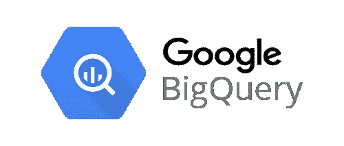
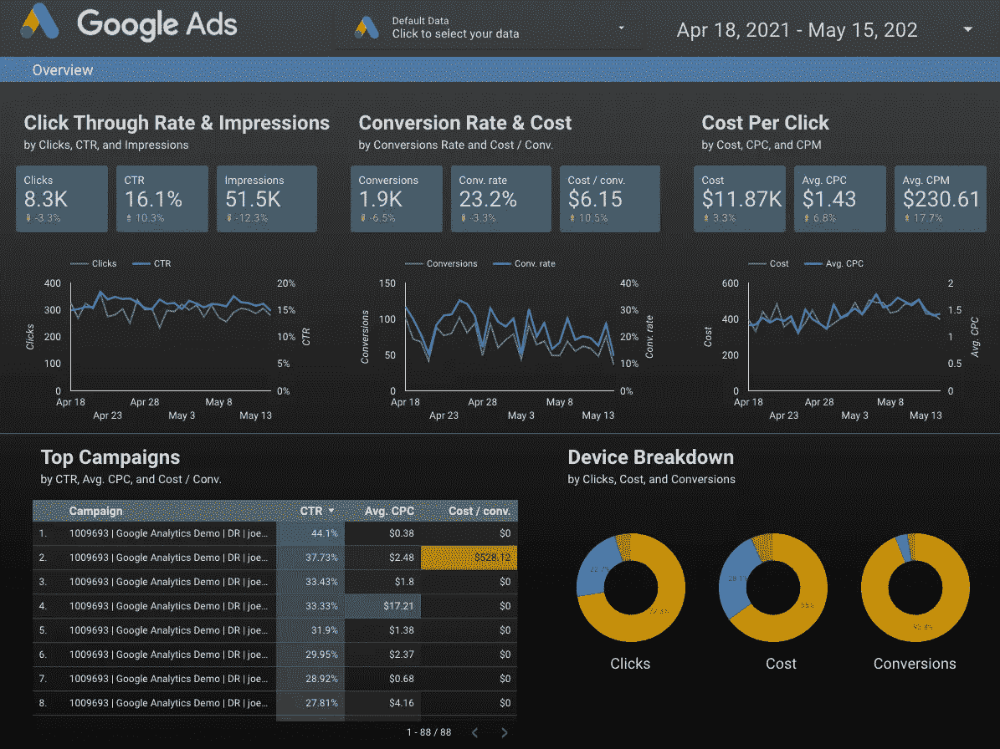

# 如何免费构建现代数据堆栈

> 原文：<https://towardsdatascience.com/how-to-build-a-modern-data-stack-for-free-e1e983963062?source=collection_archive---------14----------------------->

## 没有工程团队的创业者的简单指南

[阿克森](https://unsplash.com/@akson?utm_source=medium&utm_medium=referral)在 [Unsplash](https://unsplash.com?utm_source=medium&utm_medium=referral) 上拍照

从大型企业到早期创业公司，各种规模的公司都在处理数据。所有行业的企业，无论是零售、金融还是教育，都面临着一个共同的分析挑战:如何最好地了解他们产品的市场？在一个经济学家称数据为数字经济最有价值的资源的世界里，那些释放数据价值的人将在竞争中脱颖而出。

对于初创公司来说，有时你需要对你的产品、市场和客户进行详细的研究，以做出战术性的商业决策，从而保持领先地位。这包括从各种数据源收集数据，如脸书等营销平台、谷歌分析的网络流量数据和您自己的应用程序数据，将这些数据集成到一个集中的平台，并创建报告和仪表板。

应对这些挑战的最常见的解决方案需要一大套工具，每个工具执行一组单独的流程。这通常需要数据工程团队学习、构建、操作和监控数据管道，这为多点故障创造了机会，并且需要一个漫长的过程来获取可用格式的数据。

没有资源或资金来雇佣技术团队来构建和管理整个工作流程的小公司正在错过他们的数据金矿。幸运的是，我们看到越来越多的工具迎合技术含量较低的用户，如摄取即服务工具，它可以使用拖放或转换工具从各种来源收集数据，这些工具只需要 SQL 知识。

本文将指导如何在不需要数据工程团队的情况下，以非常低的成本(甚至没有成本)构建现代数据堆栈。在高层次上，它遵循许多成功公司使用的设计原则。这不是一个技术指南，而是对数据生态系统中存在的工具以及如何将它们组合在一起的介绍。

例如，我们将专注于可以与 Google 云平台一起使用的工具，但是非常欢迎您为我将在每个部分列出的其他产品切换工具。

事不宜迟，我们开始吧！

# 现代数据堆栈

现代数据堆栈管道(来源:[https://venturebeat . com/2020/10/21/the-2020-Data-and-ai-landscape/](https://venturebeat.com/2020/10/21/the-2020-data-and-ai-landscape/))

现代数据栈(MDS)是一套以云平台上强大的数据仓库为中心的工具。它通常由四个阶段组成:

1.  **收集:**从各种数据源收集数据的摄取阶段，这些数据源包括数据库、web 应用程序和 API。
2.  **加载:**一个基于云的数据仓库，数据被加载到其中。
3.  **转换**:用于清理原始数据和应用业务逻辑的转换工具。
4.  **分析**:终端用户可以使用数据创建报告，并通过可视化工具收集见解。

让我们看看每个阶段，看看我们可以使用什么工具来创建我们自己的现代数据堆栈。

请阅读最后部分，了解如何申请高达 20，000 美元的 GCP 信用来帮助您完成所有这些。

# 数据仓库

谷歌大查询(来源:[https://cloud.google.com/bigquery](https://cloud.google.com/bigquery))

数据仓库是来自多个来源的各种数据的中央存储区域。它允许您轻松地将任何规模的所有数据汇集在一起，并通过分析仪表盘、运营报告或高级分析为您的所有用户提供洞察。

[大查询](https://cloud.google.com/bigquery)是 Google Cloud 的全托管企业数据仓库。它是为实现业务灵活性而设计的**无服务器**(不需要前期硬件配置或管理)**高度可扩展**(在几秒钟内查询大型数据集)**经济高效**(只需为使用付费)。

Big Query 的设置非常简单，可以通过 Google Cloud 控制台访问，不需要编程设置。一旦您创建了帐户和项目，它就会自动启用。官方指南可以在这里找到[。](https://cloud.google.com/bigquery/docs/quickstarts/quickstart-web-ui)

谷歌云每月免费提供 1TB 的查询 T21 和 10GB 的存储空间，这对一个刚刚开始数据之旅的公司来说绰绰有余。

该领域的其他竞争对手包括:

*   [雪花](https://www.snowflake.com/)
*   [微软的 Azure Synapse 分析](https://azure.microsoft.com/en-gb/services/synapse-analytics/)
*   [亚马逊的红移](https://aws.amazon.com/redshift/?whats-new-cards.sort-by=item.additionalFields.postDateTime&whats-new-cards.sort-order=desc)

# 摄取

摄入(来源:[https://fivetran.com](https://fivetran.com/)

现在我们已经有了数据仓库，我们需要一个摄取工具来从各种来源获取原始数据，如应用程序数据、社交媒体平台的营销数据和网站日志。

为了遵循 [ELT 设计](https://www.talend.com/resources/elt-vs-etl/)，我们将研究将数据直接加载到数据仓库的方法，而不是加载到其他存储产品，如数据库和云存储。

市场上的几个玩家提供了一个**摄取即服务**工具，包括 [Stitch](https://www.stitchdata.com/) 、 [Fivetran](https://fivetran.com/) 和 [Airbyte](https://airbyte.io/) 。这些公司已经创建了连接脸书、Salesforce、Google Analytics 等热门资源的连接器。允许您通过 web UI 在几分钟内将数据接收到您的数据仓库中，这对于非技术人员来说非常有吸引力，可以快速访问他们的数据并专注于分析，而不是工程。

不幸的是，这些服务都有不同价格的付费模式。一般来说，定价结构基于配额和接收的行数。详细情况可以在他们的网站上找到。

因为这是一篇关于如何免费做这件事的文章…这里有一个你可以实现的解决方案，但是需要更多的技术知识和管理。

如果您正在寻找技术含量较低的实现，请随意跳过这一部分。

[KOBU 机构](https://unsplash.com/@kobuagency?utm_source=medium&utm_medium=referral)在 [Unsplash](https://unsplash.com?utm_source=medium&utm_medium=referral) 上拍摄的照片

[Singer](https://www.singer.io/) 是一个开源框架，用于从数据源提取数据并将其加载到任何目的地(例如数据仓库)。你可以在他们的公共 [GitHub 库](https://github.com/singer-io)中找到用 python 写的数据提取脚本的代码。

代码是开源的，这意味着任何人都可以在自己的项目中自由使用这些脚本。这个存储库由位于 Talend 的工程团队管理，开源社区对此做出了贡献。Stitch 使用相同的 Singer 代码来支持他们的产品，这意味着他们在其网站上提供的任何连接器都使用与 Singer 存储库中相同的代码。

当你使用 Stitch 的时候，你实际上是在为一个漂亮的、易于导航的 web UI 付费，它为每个连接器提供了一个调度程序，并且计算机为那个连接器运行 Singer 代码。

因此，我们的免费版本需要一个**存储库**来存储代码，**计算资源**来执行连接器的 Singer 代码，该连接器从数据源提取数据并将其加载到数据仓库，还需要一个**调度器**来触发该运行。

在 GCP 上，我们可以使用[云资源**存储库**](https://cloud.google.com/source-repositories) 来存储连接器的 Singer 代码。接下来，我们将构建一个 Docker 映像来安装执行 Singer 代码所需的 python 包，并将其存储在[容器注册表](https://cloud.google.com/container-registry)中。

对于我们的**计算**，使用[云运行](https://cloud.google.com/run?utm_source=google&utm_medium=cpc&utm_campaign=emea-gb-all-en-dr-bkws-all-all-trial-e-gcp-1010042&utm_content=text-ad-none-any-DEV_c-CRE_463726553641-ADGP_Hybrid%20%7C%20BKWS%20-%20EXA%20%7C%20Txt%20~%20Compute%20~%20Cloud%20Run-KWID_43700059490201703-aud-606988878694%3Akwd-677335472779-userloc_1006886&utm_term=KW_cloud%20run-NET_g-PLAC_&gclid=EAIaIQobChMIkpStm-P27wIV0e7tCh1LiwDvEAAYASAAEgLPavD_BwE&gclsrc=aw.ds)，它用于在完全托管的无服务器平台上开发和部署可扩展的容器化应用。它使用按使用付费的结构，所以你只需在你的代码运行时付费，这使得它非常实惠。

最后，我们可以使用[Cloud**Scheduler**](https://cloud.google.com/scheduler)来触发这个管道运行一个批处理作业，及时地将数据从我们的源复制到数据仓库。

有关运行无服务器批量加载的更详细的实践指南，请查看这篇文章。

在价格方面，云资源存储库对最多 5 个用户是免费的，你可以免费存储多达 50GB 的 T2。云调度程序每月给你 **3 个免费工作**。下表总结了 Cloud Run 提供的免费层。

云运行定价(来源:[https://cloud.google.com/run/pricing](https://cloud.google.com/run/pricing)

在我看来(和我的经验)，如果你使用摄取即服务工具，可能会有更高的投资回报率，尤其是如果你是一个早期创业公司。您可以在一个中心位置访问数百个连接器，每个连接器都可以在几分钟内设置好，不需要管理或编程技能，节省了大量时间和精力。

# 转换

dbt 架构(来源:[https://github.com/fishtown-analytics/dbt](https://github.com/fishtown-analytics/dbt))

原始数据加载到数据仓库后，就可以进行转换了。在转换阶段，将一系列规则或函数应用于加载的数据。常见的转换任务包括重命名列、联接多个表和聚合数据。

dbt(数据构建工具)是一个命令行工具，使数据分析师和工程师能够更有效地转换他们仓库中的数据。使用 dbt，您可以在遵循软件工程原则的同时，用 SQL 编写数据转换代码，使其非常容易被分析师访问。最大的优势是分析师掌控整个分析工程工作流程，从编写代码到部署和文档。不需要雇佣数据工程师或 python 开发者。

dbt 是开源的，所以通过命令行界面(CLI)使用 dbt**总是免费的**。dbt 还提供名为 [dbt Cloud](https://docs.getdbt.com/docs/dbt-cloud/cloud-overview) 的付费服务，该服务提供各种功能，包括基于浏览器的 IDE、作业调度、CI/CD 构建、日志记录、快照等。这些功能中的大部分可以通过 CLI 版本实现，但是需要用户对 IDE 和 git 等更加熟悉。但没什么太难的。

幸运的是，dbt Cloud 为**提供了一个永远免费的开发人员席位，**这意味着如果你是一个单身创始人或者你已经雇佣了你的第一个分析师，你可以获得 dbt Cloud 的所有好处，而无需支付任何费用。

该领域的其他竞争对手包括:

*   [数据表单](https://dataform.co/)(最近被谷歌云收购)
*   [Databricks](https://databricks.com/) (最近与谷歌云结成合作伙伴。Azure、AWS 上也支持)

# 分析学

谷歌广告概览报告示例(图片由作者提供)

最后但同样重要的是，我们有报告层，最终用户可以在其中访问他们的数据。分析师构建交互式仪表盘和报告来可视化他们的数据，从而做出更明智的业务决策。

[Google Data Studio](https://datastudio.google.com/overview) 是 GCP**的免费**数据可视化工具，可以将你的数据转化为信息丰富且完全可定制的仪表盘和报告。它将您的所有数据源同步到一个单一的报告体验中，使多个用户能够通过可视化创建和共享引人注目的故事。您可以轻松地将您的数据连接到几乎任何数据源，包括电子表格、社交媒体平台、谷歌广告、大查询等。

用户界面非常简单，易于浏览(尤其是如果你熟悉 Google Drive 的布局)。Data Studio 提供了各种各样的模板来帮助您入门，因此您不必从头开始构建。

Data Studio 提供了一整套可视化工具，您可以将它们添加到您的报告中，包括条形图、谷歌地图、数据透视表和图像等等。所有这些都是完全可定制的，能够使用拖放功能编辑可视化的格式和样式。

您可以通过电子邮件或共享报告链接，在企业内部以及与您的客户共享报告。用户可以被授予“查看”或“编辑”权限。

该领域的其他竞争对手包括:

*   [旁观者](https://looker.com/)
*   [画面](https://www.tableau.com/en-gb)
*   [动力匕](https://powerbi.microsoft.com/en-us/)

# 结论

如果你能走到这一步，那就做得很好！我们高度概括了什么是现代数据堆栈，当前生态系统中有哪些工具可用，以及如何为您的公司构建一个工具。

现在，您已经准备好创建一个端到端的管道，从各种来源引入数据，转换数据，将其加载到一个数据仓库中，以便使用仪表板和自定义可视化进行报告。

如果你正在开始这个数据之旅，或者不确定从哪里开始，可以考虑申请[谷歌云启动计划](https://cloud.google.com/startup)。该计划旨在通过为您提供利益和支持来帮助您茁壮成长，从而支持早期初创企业在谷歌云上建立业务。一些好处包括谷歌云积分、谷歌工作空间订阅(正式 G-Suite)、导师和技术培训资源等等。

之前，[我在一家早期创业公司](https://medium.com/swlh/what-is-it-like-working-at-an-early-stage-start-up-70b0d80cd61a)工作，通过这个项目，我能够获得价值 2 万美元的免费谷歌云积分，为期一年。

数据生态系统非常庞大，并且正在快速增长，因此希望本指南能让您了解现有的工具以及它们是如何组合在一起的。不言而喻，您最终设计和构建的堆栈取决于您公司的领域和用例。

随着数据的增长，将需要更多的自定义实施，这需要移出免费层，为资源付费，使用高级工具，并雇佣您的第一位工程师。但当你最终到达那里时，你很可能已经有了投资或现金流，所以是时候在数据之旅中迈出下一步了。

请在评论中告诉我，你是如何在启动时构建数据堆栈的。

**如果你喜欢这篇文章，何不注册 medium，通过这个链接阅读更多精彩内容。**

【https://medium.com/@jonathan.moszuti/membership】T5[T6](https://medium.com/@jonathan.moszuti/membership)