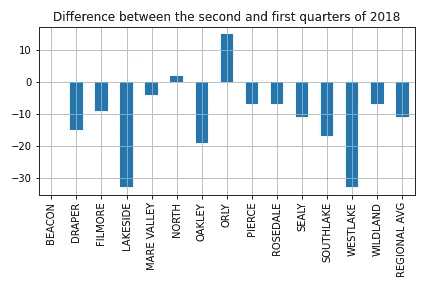
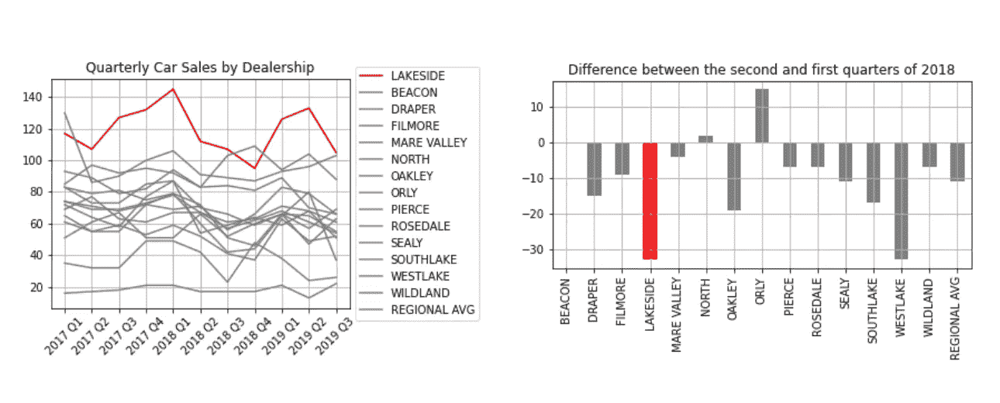

# 如何从数据中构建叙事

> 原文：<https://towardsdatascience.com/how-to-build-a-narrative-from-data-85e327940c13?source=collection_archive---------27----------------------->

## [数据新闻](https://towardsdatascience.com/tagged/data-journalism)，数据科学讨论

## 根据设置-冲突-解决范例分析数据的一些技巧

图片来自 [Pixabay](https://pixabay.com/?utm_source=link-attribution&utm_medium=referral&utm_campaign=image&utm_content=719174)

对于一个天生不会讲故事的数据科学家来说，从数据中构建一个故事并不容易。然而，通过遵循一些技巧，数据科学家可以从数据中提取知识，并基于数据构建精彩的故事。

> 我们用数据的形状来引导我们的焦点。

我们将分析这些数据，以便发现一些模式，这将是我们叙述的重点。

关键是一个**数据叙述并不包含所有的数据**，而只包含有趣的数据，也就是那些吸引观众注意力的数据！

正如这个[奇谈](https://www.youtube.com/watch?v=r5_34YnCmMY)中所描述的，每一个产生巨大影响的故事都遵循三个步骤:

*   **设置** —上下文，事情发生前的情况；
*   **冲突**——一个事实，它的发生改变了现状。在商业和金融领域，这种冲突也被称为断点事件。你应该问是什么导致了这种变化。
*   **决议** —冲突后的新情况。

这三个步骤缺一个，就没有故事。比如下面这个情节就很无聊，它什么都没说，只说价值在增加。没有故事。如果你想建立一个叙事，你应该搜索其他数据。

作者图片

让我们考虑经销商的[季度汽车销量，由下面的图表示，它代表了整个情况。你可以在我的](https://community.storytellingwithdata.com/exercises/one-little-changeand-a-redesign) [Github 库](https://github.com/alod83/data-science/blob/master/DataNarrative/DataNarrative.ipynb)中找到几乎所有的图表和 Python 代码。

作者图片

这个情节不可读。事实上，读者不能立即识别出信息。因此，在故事的开始，我们必须确定至少一个冲突，这使得故事有趣。

为了识别冲突，我们可以横向(历时视图)或纵向(共时视图)查看图表。通过横向观察图表，我们可以发现随时间的变化。例如，对于 Lakeside，我们可以识别不同的冲突，这些冲突对应于峰值，如下图所示:

作者图片

纵向分析该图，我们寻找不同经销商的行为。比如 2018 年第一季度，几乎所有的车都有一个峰值，之后是下降。为什么？

作者图片

一旦发现冲突，数据叙述就可以开始了。每个冲突都应该单独分析，也就是说，应该用不同的叙述和一系列情节来表现。

先说湖滨线的行为。下图显示了 2018 年第一季度发生的冲突的设置-冲突-解决范式。对 2018 年第四季度发生的冲突也可以做同样的分析。

作者图片

我们注意到，湖滨销售在 2018 年第一季度出现增长，然后下降，直到 2018 年第四季度出现其他情况，湖滨销售再次开始增长。

为了发现 2018 年第一季度发生了什么，我们可以为 2018 年第一季度和第二季度对应的所有汽车拍摄两张情况图。

2018 年第一季度(图片由作者提供)

2018 年第二季度(图片由作者提供)

前两个数字无法描述这种情况，因此我们可以尝试了解 2018 年第二季度和第一季度的差异。

作者图片

在这种情况下，情况就很清楚了。几乎所有的经销商都有负值，除了奥利和诺斯。湖滨和西湖销售情况最差。

现在，下一个问题是:为什么？2018 年第一季度发生了什么事，对汽车销量产生了负面影响？让我们试着用谷歌搜索一下答案。我找到了[这篇有趣的文章](https://www.cnbc.com/2018/12/13/us-auto-sales-to-drop-below-17-million-for-first-time-since-2014.html)和这篇[的报道](https://www.nada.org/WorkArea/DownloadAsset.aspx?id=21474861098)，它们解释了 2018 年轻型卡车销量出现了不可思议的增长(约 70%)，从而产生了汽车销量的下降。

相反，由于不同的政策，Orly (O'Reilly Automotive)没有经历这种下降。事实上，该协会制定了一个很好的股票回购计划，正如本文中所描述的，这使得它能够增加销售额。

综上所述，原图可以用以下两个图代替:

作者图片

现在，可以通过搜索这些年来其他经销商的财务状况来丰富叙述。但是我把这个任务留给你:)

# 摘要

在本文中，我展示了如何从数据中提取知识。首先，应该对整个情况有一个大致的了解。通常，这张图片是不可读的，但它可以帮助你识别有趣的方面，或*冲突*，可以进一步分析。

然后，应该分别调查每个冲突。可以绘制许多试探性的图表，直至正确的图表，这有助于理解冲突期间和冲突后的局势。

最后，应该通过搜索新的数据和信息，尤其是在网上搜索，来回答所有出现的问题。

关于图形改进的进一步讨论，你可以阅读我的[以前的帖子](/how-to-build-high-impact-graphs-for-data-science-55ce19d1ab32)，购买[这些精彩的书籍](https://www.storytellingwithdata.com/books)并保持关注:)

如果你想了解我的研究和其他活动的最新情况，你可以在 [Twitter](https://twitter.com/alod83) 、 [Youtube](https://www.youtube.com/channel/UC4O8-FtQqGIsgDW_ytXIWOg?view_as=subscriber) 和 [Github](https://github.com/alod83) 上关注我。

# 相关文章

 [## 如何为数据科学构建高影响力的图表

### 提高数据可视化技能的一些技巧

towardsdatascience.com](/how-to-build-high-impact-graphs-for-data-science-55ce19d1ab32)  [## 上下文分析能帮助提取有意义的见解吗？

### 通过上下文分析从数据中提取有意义见解的三种策略

towardsdatascience.com](/can-context-analysis-help-extract-meaningful-insights-178a21a88e9f)  [## 数据新闻和数据科学是一回事吗？

### 答案是否定的，我会解释原因

pub.towardsai.net](https://pub.towardsai.net/are-data-journalism-and-data-science-the-same-thing-77ba7ec794d4) 

# 人工智能内容作者能帮助数据科学家吗？

不要浪费时间一遍又一遍地重写同一份报告。随着人工智能写作工具的普及，报告可以自动编写，无需人工干预，节省您的时间和精力。该任务只需几秒钟即可完成，因此您每次都可以停止从头开始编写。

人工智能内容写作工具是人工智能写作助手的一种形式，它可以自动生成报告。数据科学家可以使用该工具来撰写报告。

此处继续阅读[。](https://medium.com/geekculture/could-an-ai-content-writer-help-a-data-scientist-fd7886e36b57)

# 保持联系！

*   跟着我上[媒体](https://medium.com/@alod83?source=about_page-------------------------------------)
*   注册我的[简讯](https://medium.com/subscribe?source=about_page-------------------------------------)
*   在 [LinkedIn](https://www.linkedin.com/in/angelicaloduca/?source=about_page-------------------------------------) 上连接
*   在推特上关注我
*   跟着我上[脸书](https://www.facebook.com/alod83?source=about_page-------------------------------------)
*   在 [Github](https://github.com/alod83?source=about_page-------------------------------------) 上关注我