# 如何使用 Python 和 Statsmodels 构建泊松隐马尔可夫模型

> 原文：<https://towardsdatascience.com/how-to-build-a-poisson-hidden-markov-model-using-python-and-statsmodels-f7aa3f46f847?source=collection_archive---------6----------------------->

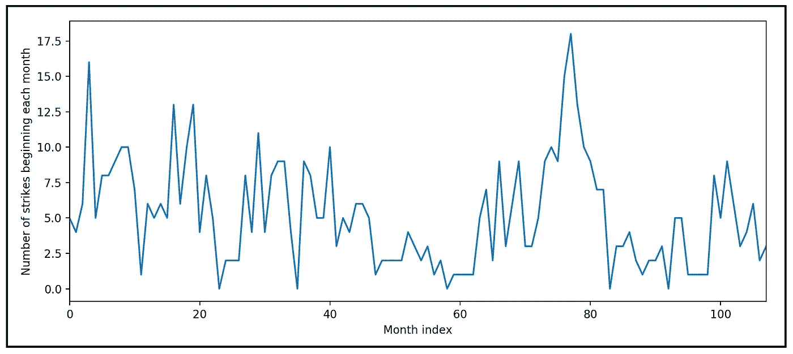

美国制造业罢工与时间的关系(数据来源: [R 数据集](https://github.com/vincentarelbundock/Rdatasets/blob/master/datasets.csv#L609))(图片由作者提供)

## 使用泊松 HMM 的逐步教程

一个**泊松隐马尔可夫模型**是两个回归模型的混合:一个**泊松回归模型**是可见的，一个**马尔可夫模型**是“隐藏的”。在泊松 HMM 中，泊松模型预测的平均值不仅取决于泊松模型的回归变量，还取决于隐马尔可夫过程所处的当前状态或区域。

在之前的一篇文章中，我们研究了泊松隐马尔可夫模型的架构，并考察了它的理论基础。如果你不熟悉马尔可夫模型或泊松模型，我鼓励你在这里回顾一下:

[](/the-poisson-hidden-markov-model-for-time-series-regression-236c269914dd) [## 时间序列回归的泊松隐马尔可夫模型

### 如何混合使用两个强大的随机过程来模拟时间序列数据

towardsdatascience.com](/the-poisson-hidden-markov-model-for-time-series-regression-236c269914dd) 

在本文中，我们将通过 Python 和 statsmodels 中的一步一步的教程来构建和训练一个泊松 HMM，它基于美国制造业中真实世界的劳工罢工数据集，在统计建模的文献中被广泛使用。

# 制造业罢工数据集

为了说明模型拟合过程，我们将使用以下开源数据集:


制造业罢工(数据来源:[美国 BLS](https://www.bls.gov/) 通过 [R 数据集](https://github.com/vincentarelbundock/Rdatasets/blob/master/datasets.csv#L609)

该数据集是一个月度时间序列，显示了从 1968 年到 1976 年每月开始的美国制造业活动与美国制造业合同罢工数量之间的关系。

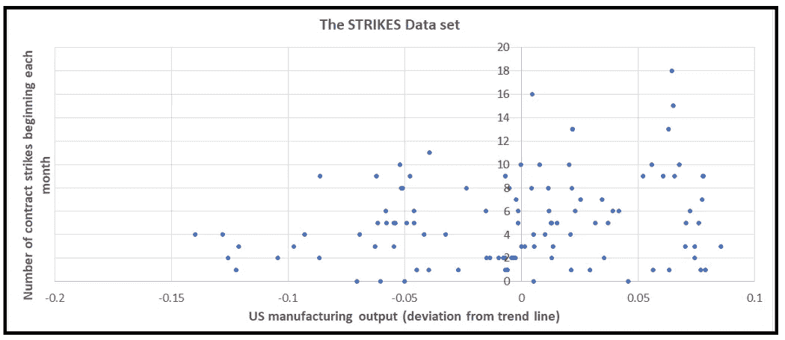

STRIKES 数据集(来源: [R 数据集](https://github.com/vincentarelbundock/Rdatasets/blob/master/datasets.csv#L609))(图片由[作者](https://sachin-date.medium.com/))

这个数据集在 R 中可用，可以使用 Python [statsmodels 数据集包](https://www.statsmodels.org/devel/datasets/index.html)获取。

本文教程用的是 **Python** ，不是 r

# 回归目标

我们的目标是调查制造业产出(*产出*变量)对制造业罢工发生率(*罢工*变量)的影响。换句话说，制造业产出的差异是否“解释”了每月罢工次数的差异？

让我们导入所有需要的包，将 strikes 数据集加载到 Pandas DaraFrame 中，并检查 *strikes* 相对于时间的曲线:

```
**import** math
**import** numpy **as** np
**import** statsmodels.api **as** sm
**from** statsmodels.base.model **import** GenericLikelihoodModel
**from** scipy.stats **import** poisson
**from** patsy **import** dmatrices
**import** statsmodels.graphics.tsaplots **as** tsa
**from** matplotlib **import** pyplot **as** plt
**from** statsmodels.tools.numdiff **import** approx_hess1, approx_hess2, approx_hess3 ***#Download the data set and load it into a Pandas Dataframe*** strikes_dataset = sm.datasets.**get_rdataset**(dataname=**'StrikeNb'**, package=**'Ecdat'**)***#Plot the number of strikes starting each month***plt.**xlabel**('Month index')
plt.**ylabel**('Number of strikes beginning each month')
strikes_data['strikes'].**plot**()
plt.**show**()
```

我们看到下面的情节:


打击次数与时间的关系图(图片由作者提供)

上下摆动的撞击模式表明时间序列可能是自相关的。让我们通过查看*撞击*列的 [**自相关**](/the-intuition-behind-correlation-62ca11a3c4a) 图来验证这一点:

```
tsa.**plot_acf**(strikes_data[**'strikes'**], **alpha**=0.05)
plt.**show**()
```

我们看到下面的情节:

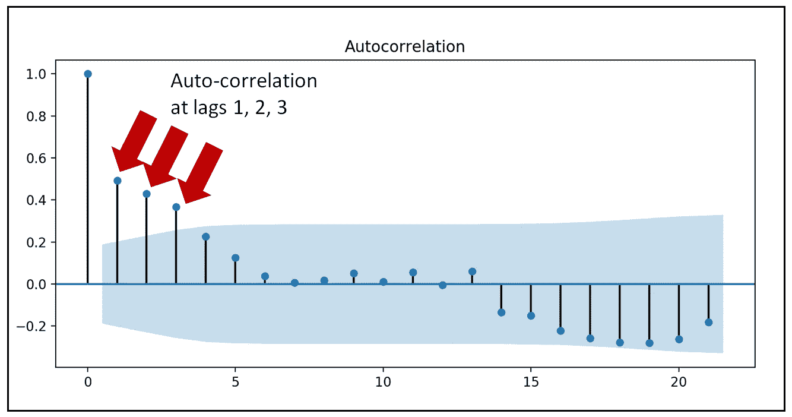

走向的自相关图(图片由作者提供)

滞后 0 处的完全相关将被忽略，因为值总是与其自身完全相关。在滞后-1 时有很强的相关性。滞后 2 和 3 的相关性可能是滞后 1 相关性的多米诺骨牌效应。这可以通过绘制*击*的 [**部分自相关**](/understanding-partial-auto-correlation-fa39271146ac) 图来确认。

```
tsa.**plot_pacf**(strikes_data['strikes'], **alpha**=0.05)
plt.**show**()
```

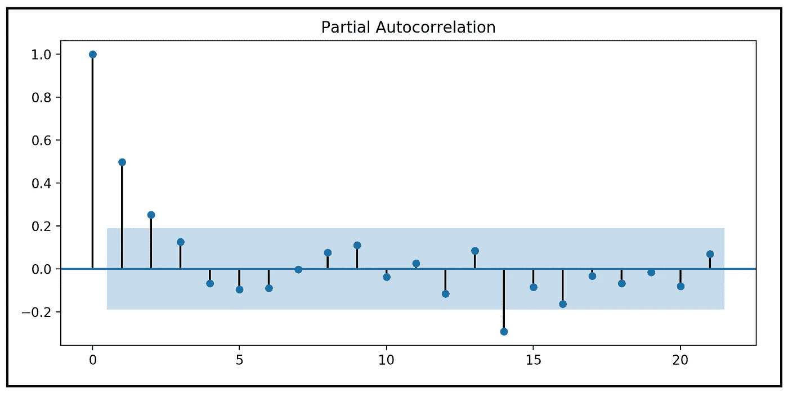

走向的部分自相关图(图片由作者提供)

部分自相关图揭示了以下内容:

*   在滞后-0 时，部分自相关为 1.0。这是意料之中的，可以忽略不计。
*   PACF 图在滞后-1 处显示了强的部分自相关，这表明 AR(1)过程。
*   滞后 2 的相关性刚好在 5%的显著性界限之外。所以，它可能重要，也可能不重要。

总的来说，ACF 和 PACF 曲线表明在滞后-1 时有明确的强自回归影响。因此，除了*输出*变量之外，我们应该包括*打击*在滞后-1 的滞后版本作为回归变量。

# 回归策略

我们的策略将基于**在*输出*和在滞后-1** *的*撞击*的延时副本上回归*撞击*。*

由于 strikes 包含整数数据，我们将使用**泊松回归模型**来研究*输出*和 *strikes* 之间的关系。

我们将额外假设制造业在低可变性和高可变性周期之间冲击数据周期，这可以使用 2 状态离散马尔可夫过程来建模。

为什么我们只为马尔可夫模型选择了两个区域？为什么不是 3 或 4 个政权？答案很简单，最好从具有最少可能状态的马尔可夫模型开始，以避免过度拟合。

总之，我们将使用一个**二态泊松隐马尔可夫模型**来研究制造业产量对罢工的关系。

因此，我们有:

## 因变量(内生变量)

**y** = *罢工*

## 回归变量(外部变量)

***X***=*【output，strikes _ LAG _ 1】+我们即将描述的隐马尔可夫模型相关变量。*

我们将首先说明模型的泊松部分，然后看看如何“混合”马尔可夫模型。

泊松模型的均值(不考虑马尔可夫模型的影响)可以表示如下:

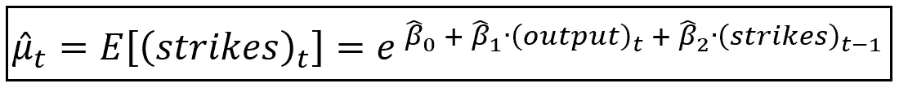

时间 t 的预期冲击值是时间 t 的输出和前一时间步的冲击数(和回归截距)的函数(图片由作者提供)

由于我们假设*走向*为泊松分布，其概率质量函数如下:

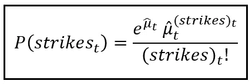

泊松分布撞击变量(图片由作者提供)

## 处理“模型爆炸”和零值数据

我们的泊松模型有一个问题。让我们再来看看说明书的意思:


时间 t 的预期冲击值是时间 t 的输出和前一时间步的冲击数(和回归截距)的函数(图片由作者提供)

如果 *(strikes)_(t-1)* 项的系数 *β_2* 大于 *0* ，我们将面临所谓的“模型爆炸”效应，这是由从 *(strikes)_(t-1)* 到*(strikes)_(t)*的正反馈循环引起的但是 *(strikes)_(t-1)* 为零时 *(strikes)_(t-1)* 未定义。我们将通过做两件事来解决这个问题:

1.  我们引入一个指示变量 *d_t* ，当 *(strikes)_(t-1)* 时设置为 1，否则设置为 *0* ，并且，
2.  每当*(冲击)_(t-1)* 为零时，我们将*(冲击)_(t-1)* 设置为 *1.0* 。

以上两个干预的净效果是，每当原始数据集中的 *(strikes)_(t-1)* 为零时，强制优化器训练 *d_t* 的系数。Cameron 和 Trivedi 在他们的书 [*计数数据的回归分析*](http://cameron.econ.ucdavis.edu/racd/count.html) *中详细讨论了这种方法(参见第 7.5 节:自回归模型)。*

考虑到上述变化，泊松过程均值的一个更稳健的规范如下:

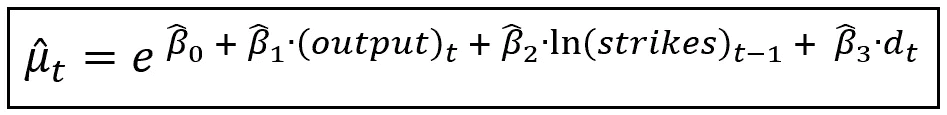

作为时间 t 输出、前一时间步的撞击次数的自然对数和指示变量(和回归截距)的函数的时间 t 的撞击期望值(图片由作者提供)

## 马尔可夫模型中的混合

现在，让我们注入 2 态马尔可夫模型的影响。这导致所有的回归系数***β_ cap****=【β_ cap _ 0，β_cap_1，β_cap_2，β_ cap _ 3】*，因此拟合的平均值 *μ_cap_t* 变成马尔可夫状态特定的，如下所示。注意附加的下标 *j* 表示在时间 *t* 有效的马尔可夫状态:

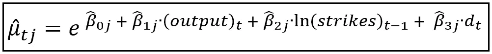

对应于 state=j 马尔可夫状态特定均值(图片由作者提供)

假设马尔可夫状态变量 *s_t* 在时间 *t* 处于状态 *j* 中，则在时间 *t* 观察到特定计数的*撞击*的相应马尔可夫特定泊松概率如下:


在时间 t 观察到特定撞击计数的马尔可夫状态相关概率(图片由作者提供)

其中，马尔可夫状态转移矩阵 ***P*** 为:


2 状态马尔可夫过程的状态转移矩阵(图片由作者提供)

并且包含在时间 *t* 的状态概率分布的马尔可夫状态概率向量如下:

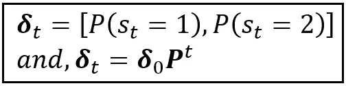

2 态马尔可夫模型的时间相关状态概率(图片由作者提供)

根据上下文中的上述讨论，让我们重申*走向*数据集的泊松隐马尔可夫模型的外生和内生变量:

## 因变量(内生变量)

**y** = *打击*

## 回归变量(外部变量)

***X*** = *【输出，ln (strikes_LAG_1)，d_t】和* ***P***

## 培训和优化

训练泊松 PMM 涉及优化回归系数的马尔可夫状态相关矩阵(注意，在 Python 代码中，我们将使用该矩阵的转置):

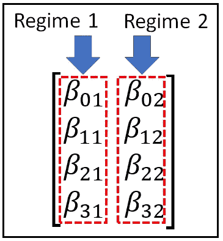

马尔可夫状态特定回归系数矩阵(图片由作者提供)

并且还优化状态转移概率(矩阵 ***P*** ):


2 状态马尔可夫过程的状态转移矩阵(图片由作者提供)

优化将通过 [**最大似然估计**](https://en.wikipedia.org/wiki/Maximum_likelihood_estimation) 完成，其中优化器将找到*和 ***P*** 的值，这将最大化观察到 ***y*** 的可能性。我们将使用 statsmodels 提供的 [**BFGS**](https://en.wikipedia.org/wiki/Broyden%E2%80%93Fletcher%E2%80%93Goldfarb%E2%80%93Shanno_algorithm) 优化器来执行优化。*

*有一个小问题我们需要解决。在整个优化过程中，马尔可夫状态转移概率 *p_ij* 需要遵守以下约束，即所有转移概率都位于[0，1]区间内，并且跨越任意一行 ***P*** 的概率总和总是 1:*

**

*所有马尔可夫状态转移概率遵守的约束(图片由作者提供)*

*在优化期间，我们通过定义大小为 *(k x k)* 的矩阵 ***Q*** 来处理这些约束，该矩阵充当 ***P*** 的代理，如下所示:*

**

*代理矩阵 **Q** (图片作者提供)*

*我们不是优化 ***P*** ，而是通过允许 *q_ij* 在-∞到+∞之间自由变化来优化*。在每次优化迭代中，**我们通过将*****的值标准化到区间***【0.0，1.0】*来获得 *p_ij* **，如下:*****

****

**标准化 **Q** 矩阵以获得 **P** 矩阵(图片由作者提供)**

**至此，让我们回到我们的*打击*数据集。**

# **准备用于培训的 strikes 数据集**

**我们看到在*打击*时间序列中，在滞后-1 处有很强的相关性，添加*打击*的滞后-1 拷贝作为回归变量。**

```
**strikes_data['strikes_lag1'] = strikes_data['strikes'].**shift**(1)**#Drop rows with empty cells created by the shift operation** strikes_data = strikes_data.**dropna**()**
```

**创建指标函数，计算指标变量 *d1* 的值如下:如果*击* == 0， *d1* = 1，否则 *d1* = 0。**

```
**def **indicator_func**(x):
    if x == 0:
        return 1
    else:
        return 0**
```

**将 *d1* 的列添加到数据框中:**

```
**strikes_data['d1'] = strikes_data['strikes_lag1'].**apply**(indicator_func)**
```

**调整滞后的*撞击*变量，当其值为 0 时，将其设置为 1。**

```
**strikes_data['strikes_adj_lag1'] = np.**maximum**(1, strikes_data['strikes_lag1'])**
```

**添加 strikes_lag1 的自然对数作为回归变量。**

```
**strikes_data['ln_strikes_adj_lag1'] = np.**log**(strikes_data['strikes_adj_lag1'])**
```

**用 [Patsy](https://patsy.readthedocs.io/en/latest/quickstart.html) 语法形成回归表达式。不需要显式指定回归截距 *β_0* 。Patsy 将自动在 ***X*** 中包含一个占位符。**

```
**expr = 'strikes ~ output + ln_strikes_adj_lag1 + d1'**
```

**使用 Patsy 雕刻出 ***y*** 和 ***X*** 矩阵。**

```
**y_train, X_train = **dmatrices**(expr, strikes_data, return_type='dataframe')**
```

**让我们看看 X 和 y 矩阵的结果:**

```
****print**(y_train)**
```

**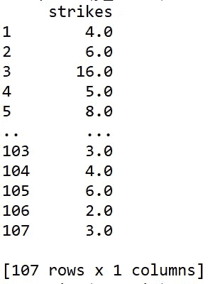**

**y_train(图片由作者提供)**

```
****print**(X_train)**
```

**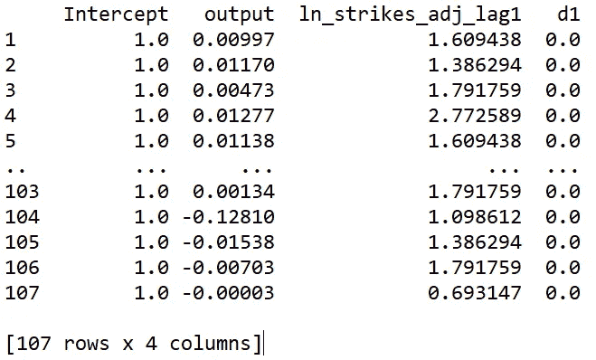**

**X_train(图片由作者提供)**

**在我们继续之前，我们需要构建`PoissonHMM`类。为此，我们将使用 statsmodels 提供的类`[**GenericLikelihoodModel**](https://www.statsmodels.org/dev/_modules/statsmodels/base/model.html#GenericLikelihoodModel)`。**

# **创建自定义泊松隐马尔可夫模型类**

**我们将创建的`PoissonHMM`类将扩展`GenericLikelihoodModel`类，以便我们可以使用定制的对数似然函数来训练模型。让我们从定义`PoissonHMM`类的构造函数开始。**

```
****class** PoissonHMM(**GenericLikelihoodModel**):
    **def __init__**(self, endog, exog, **k_regimes**=2, **loglike**=None, 
                 **score**=None, **hessian**=None,
                 **missing**=**'**none**'**, **extra_params_names**=None, **kwds):
        **super**(**PoissonHMM**, self).**__init__**(**endog**=endog, **exog**=exog, 
            **loglike**=loglike, **score**=score, **hessian**=hessian, 
            **missing**=missing, **extra_params_names**=extra_params_names, 
            **kwds**=kwds)**
```

**现在，让我们用下面几行代码填充构造函数，即 PoissonHMM 的`*__init__*` 方法:**

**首先，我们将因变量转换成 statsmodels 喜欢使用的 numpy 数组。我们还会复制政权的数量。**

```
**self.y = np.**array**(self.endog)
self.k_regimes = k_regimes**
```

**接下来，设置状态特定回归系数 ***β的*k×m*大小矩阵。*** m= `self.**exog**.**shape**[1]`是包含截距的回归系数的个数:**

```
*self.beta_matrix = np.**ones**([self.k_regimes, self.**exog**.**shape**[1]])*
```

*设置代理转移概率矩阵 ***Q*** 的 *k x k* 矩阵。将其初始化为 *1.0/k* 。*

```
*self.q_matrix = np.**ones**([self.k_regimes,self.k_regimes])*(1.0/self.k_regimes)**print**('self.q_matrix='+**str**(self.q_matrix))*
```

*设置泊松平均的状态矩阵。这些将在优化循环期间更新。*

```
*self.mu_matrix = []*
```

*设置真实马尔可夫转移概率的 *k x k* 矩阵，该矩阵将使用前面描述的标准化技术从 q 矩阵中计算出来。初始化为 *1.0/k* 。*

```
*self.gamma_matrix = np.**ones**([self.k_regimes, self.k_regimes])*(1.0/self.k_regimes)**print**('self.gamma_matrix='+**str**(self.gamma_matrix))*
```

*设置马尔可夫状态概率( ***π*** 向量)。但是为了避免与回归模型的平均值(也称为*)混淆，我们将遵循 [Cameron 和 Trivedi](http://cameron.econ.ucdavis.edu/racd/count.html) 中使用的约定，并使用符号 ***δ*** 。**

```
**self.delta_matrix = np.**ones**([self.**exog**.**shape**[0],self.k_regimes])*(1.0/self.k_regimes)**print**('self.delta_matrix='+**str**(self.delta_matrix))**
```

**初始化优化器将要优化的参数 ***β*** 和 ***Q*** 的初始值向量。**

```
**self.start_params = np.**repeat**(np.**ones**(self.**exog**.**shape**[1]), **repeats**=self.k_regimes)self.start_params = np.**append**(self.start_params, self.q_matrix.**flatten**())**print**('self.start_params='+**str**(self.start_params))**
```

**初始化一个非常小的特定于机器的数字。它被我们即将编写的自定义对数似然函数所使用。**

```
**self.EPS = np.**MachAr**().eps**
```

**最后，初始化优化器的迭代计数器。**

```
**self.iter_num=0**
```

**`PoissonHMM`类的完整构造函数如下所示:**

**PoissonHMM 类的构造函数**

**接下来，我们将覆盖`GenericLikelihoodModel`的`nloglikeobs(self, params)`方法。这个方法由优化器在每次迭代中调用一次，以获得与传递给它的所有`params`的当前值相对应的对数似然函数的当前值。**

```
****def** nloglikeobs(self, params):**
```

**让我们用下面的函数来填充这个方法，我们将很快定义这些函数:**

**从所有参数的当前值重构 ***Q*** 和 ***β*** 矩阵。**

```
**self.**reconstitute_parameter_matrices**(params)**
```

**建立泊松平均的状态矩阵。**

```
**self.**compute_regime_specific_poisson_means**()**
```

**通过将所有的 ***Q*** 值标准化到 0 到 1 的范围来构建马尔可夫转移概率矩阵。**

```
**self.**compute_markov_transition_probabilities**()**
```

**建立马尔可夫状态概率分布的 *(len(y) x k)* 矩阵 delta。**

```
**self.**compute_markov_state_probabilities**()**
```

**计算每个观察值的对数似然值。该函数返回对数似然值的大小为*len(****y****)*的数组。**

```
**ll = self.**compute_loglikelihood**()**
```

**递增迭代计数。**

```
**self.iter_num=self.iter_num+1**
```

**打印出迭代总结。**

```
****print**('ITER='+**str**(self.iter_num) + ' ll='+**str**(((-ll).**sum**(0)))**
```

**最后，返回求反的对数似然数组。**

```
**return -ll**
```

**下面是整个`nloglikeobs(self, params)`的方法:**

**下面是从`nloglikeobs(self, params)`方法调用的助手方法的实现:**

**从所有参数的当前值重建 ***Q*** 和 ***β*** 矩阵:**

**建立泊松平均的状态矩阵:**

**通过将所有的 ***Q*** 值标准化到 0 到 1 的范围，构建马尔可夫转移概率 ***P*** 的矩阵:**

**建立马尔可夫状态概率分布的 *(len(y) x k)* 大小 ***δ*** 矩阵。**

**最后，计算泊松马尔可夫模型的所有对数似然值:**

**让我们重写超类中的一个方法，该方法尽力计算一个可逆 Hessian，以便可以成功计算所有训练参数的标准误差和置信区间。**

```
**def **hessian**(self, params):
    for approx_hess_func **in** [approx_hess3, approx_hess2, 
                            approx_hess1]:
        H = approx_hess_func(**x**=params, **f**=self.loglike, 
            **epsilon**=self.EPS)
        if np.**linalg**.**cond**(H) < 1 / self.EPS:
            print('Found invertible hessian using' + 
                str(approx_hess_func))
            return H
    **print**('DID NOT find invertible hessian')
    H[H == 0.0] = self.EPS
    return H**
```

**综上所述，下面是 PoissonHMM 类的完整类定义:**

**现在我们已经有了自定义的`PoissonHMM`类，让我们继续在我们的*(****y _ train****，****X _ train****)*数据集上训练它，这个数据集是我们使用 Patsy 创建的。**

**让我们回忆一下`PoissonHMM`的构造函数是什么样子的:**

```
****def** __init__(**self**, **endog**, **exog**, **k_regimes**=2, **loglike**=None, 
            **score**=None, **hessian**=None, **missing**=**'**none**'**, 
            **extra_params_names**=None, ****kwds**):**
```

**我们将使用 2 状态 HMM 进行实验，假设数据循环通过 2 个不同但隐藏的区域，每个区域都会影响泊松过程的均值。所以我们将 k_regimes 设置为 2:**

```
**k_regimes = 2**
```

**注意，PoissonHMM 带有一个`extra_param_names`参数。除了矩阵 ***X_train*** 的列名之外，这是我们希望优化器优化的参数列表。让我们初始化并构建这个额外参数名的列表。**

```
**extra_params_names = []**
```

**每个状态将有`len(X_train.columns)`个回归系数*被发送到模型中进行优化。所以，总的来说，`len(X_train.columns) * k_regimes` *β* 中的系数都要被优化。其中，对应于一个状态(比如状态 1)的系数已经以回归参数的形式被烘焙到`X_train`中。statsmodels 将从 ***X_train*** 矩阵中收集它们的名称。它会自动向模型提供这组参数的名称。因此，我们需要通过`extra_param_names`参数(因此得名`*extra*_param_names`)告诉 statsmodels 剩余参数集的名称，对应于剩余的政权。因此，我们将第二种状态的平衡参数组插入`extra_param_names`，如下所示:***

```
*for regime_num **in range**(1, k_regimes):
    for param_name in X_train.columns:
        extra_params_names.**append**(param_name+'_R'+**str**(regime_num))*
```

*该模型还将优化代理转移概率的*k×k*矩阵:矩阵 ***Q*** 所以也把它们发送到 extra_params 列表中:*

```
*for i **in** range(k_regimes):
    for j **in range**(k_regimes):
        extra_params_names.**append**('q'+**str**(i)+**str**(j))*
```

**注意:在 Python 代码中，我们选择使用基于 0 的马尔可夫状态索引。也就是说，我们在代码中提到的状态 1 是状态 0。**

*我们的`extra_param_names`名单现在准备好了。*

*创建一个`PoissonHMM`模型类的实例。*

```
*poisson_hmm = **PoissonHMM**(**endog**=y_train, **exog**=X_train, 
                        **k_regimes**=k_regimes,
                        **extra_params_names**=extra_params_names)*
```

*训练模型。注意，我们要求 statsmodels 使用 BFGS 优化器。*

```
*poisson_hmm_results = poisson_hmm.**fit**(**method**=’bfgs’, **maxiter**=1000)*
```

*打印出拟合的马尔可夫转移概率:*

```
***print**(poisson_hmm.gamma_matrix)*
```

*我们看到以下输出:*

```
*[[0.96884629 0.03115371]
 [0.0043594  0.9956406 ]]*
```

*这样，我们的马尔可夫状态转移矩阵**T5【P】T6**如下:*

**

*拟合的转移矩阵(图片由作者提供)*

*这对应于下面的状态转换图:*

*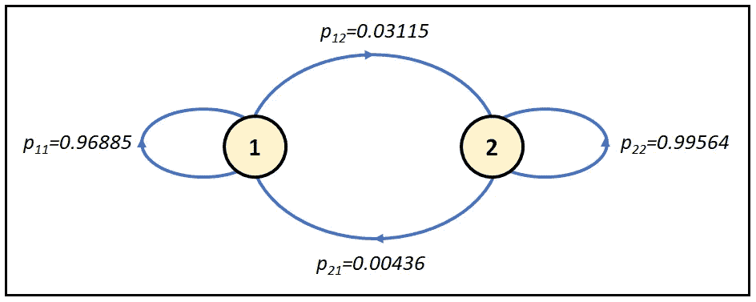*

*与泊松 HMM 关联的 2 状态隐马尔可夫过程的状态转移图(图片由作者提供)*

*状态转换图显示，一旦系统进入状态 1 或 2，它真的喜欢处于该状态，并且很少倾向于切换到另一个状态。*

*最后，打印出模型培训总结:*

```
***print**(poisson_hmm_results.**summary**())*
```

*我们看到以下输出。我已经调出了与两个马尔可夫状态 1 和 2 相对应的模型参数，以及 Q-matrix 值(如前所述，这些值恰好索引为 0)。*

**

*泊松隐马尔可夫模型的训练总结(图片由作者提供)*

*下面是我们在输出中观察到的一些情况:*

1.  *该模型适合于两个马尔可夫状态中的每一个的不同截距。在状态 1 和状态 2 中，截距( *β_0* )分别为 2.2891 和 0.7355。*
2.  *产出效应( *β_1* )在方案 1 中为-2.6620，表明制造业产出的增长与罢工次数成反比关系，在方案 2 中为 7.6534，表明随着制造业产出的增加，罢工次数也增加。*

# *拟合优度*

*正如我们从模型训练总结中看到的，模型无法找到 *β_01* 和 *q_11* 的有效标准误差就证明了这一点。参数 *β_31* 、β_22、 *β_32* 和 *q_01* 的 p 值不具有统计学意义。*

*然而，这是一个好的开始。*

*为了实现更好的拟合，我们可能希望用 3 或 4 状态马尔可夫过程进行实验，并且也用 statsmodels 提供的大量优化程序中的另一个进行实验，例如“nm”(牛顿-拉夫森)、“powell”和“basinhopping”。*

*顺便说一句，由于我们使用 statsmodels 的现成方法来打印训练摘要，所以训练摘要中打印的 df_model 值 3 会产生误导，应该忽略。*

*最后，将该模型的拟合优度与此处描述的**泊松自回归模型**以及此处[描述的**泊松 INAR(1)** 模型](/an-introduction-to-the-poisson-integer-arima-regression-model-b66d3ff2e6e5)进行比较将是有益的。所有三个模型都适用于相同的制造业罢工数据集:*

*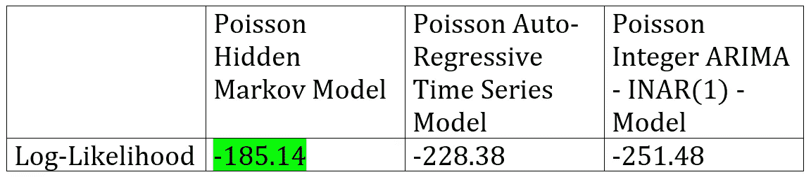*

*制造业罢工数据集上三个泊松时间序列模型的对数似然性比较(图片由作者提供)*

*我们可以看到[即使考虑到](/the-akaike-information-criterion-c20c8fd832f2)泊松 HMM 使用的大量拟合参数，泊松 HMM 模型比其他两种时间序列模型更有可能观察到*撞击*数据集值。*

# *从这里去哪里？*

*以下是一些建立在泊松 HMM 工作基础上的方法:*

1.  *我们可以尝试使用不同的优化器和/或通过引入更多的马尔可夫状态来提高`PoissonHMM`模型类的拟合度。*
2.  *我们可能要计算 PoissonHMM 类的 [**伪 R 平方**](/the-complete-guide-to-r-squared-adjusted-r-squared-and-pseudo-r-squared-4136650fc06c) 。[伪 R 平方](/the-complete-guide-to-r-squared-adjusted-r-squared-and-pseudo-r-squared-4136650fc06c)提供了一种比较非线性模型(如泊松-HMM)拟合异方差数据集的拟合优度的极好方法。*
3.  *回想一下，我们所用的泊松模型假设，在任何马尔可夫状态下，撞击的方差与该状态下撞击的平均值相同，这是一种称为等散度的性质。我们可以通过用一个 [**广义泊松**](/generalized-poisson-regression-for-real-world-datasets-d1ff32607d79) 或一个 [**负二项回归**](/negative-binomial-regression-f99031bb25b4) 模型代替泊松模型来间接检验这个假设。这些模型没有对数据做等分散假设。如果 GP-HMM 或 NB-HMM 比直接的泊松-HMM 产生更好的拟合优度，那么就有理由使用这些模型。*

*快乐造型！*

*以下是完整的源代码:*

# *引用和版权*

## *书*

*Cameron A. Colin，Trivedi Pravin K .， [*计数数据的回归分析*](http://cameron.econ.ucdavis.edu/racd/count.html) ，计量经济学学会专论№30，剑桥大学出版社，1998 年。国际标准书号:0521635675*

## *报纸*

*凯南 j .， [*美国制造业合同罢工的持续时间，计量经济学杂志*](https://www.sciencedirect.com/science/article/pii/0304407685900648) ，第 28 卷，1985 年第 1 期，第 5-28 页，ISSN 0304-4076，[https://doi . org/10.1016/0304-4076(85)90064-8。](https://doi.org/10.1016/0304-4076(85)90064-8.) [**PDF 下载链接**](https://www.ssc.wisc.edu/~jkennan/research/JEM85.pdf)*

*Cameron C. A .，Trivedi P. K .， [*基于回归的泊松模型过度离差测试*](https://www.sciencedirect.com/science/article/pii/030440769090014K) ，《计量经济学杂志》，第 46 卷，第 3 期，1990 年，第 347-364 页，ISSN 0304-4076，[https://doi . org/10.1016/0304-4076(90)90014-k .](https://doi.org/10.1016/0304-4076(90)90014-K.)*

## *数据集*

*文章中使用的制造业罢工数据集是统计软件中可供公众使用和实验的几个数据集之一，最值得注意的是，这里的[是一个 R 包](https://rdrr.io/rforge/Ecdat/man/StrikeNb.html)。在 GPL v3 许可下，Vincent Arel-Bundock 通过 vincentarelbundock.github.io/rdatasets 已经可以使用 Python 访问数据集。*

## *形象*

*本文中的所有图片版权归 [CC-BY-NC-SA](https://creativecommons.org/licenses/by-nc-sa/4.0/) 所有，除非图片下面提到了不同的来源和版权。*

# *相关文章*

*[](/a-beginners-guide-to-discrete-time-markov-chains-d5be17cf0e12) [## 离散时间马尔可夫链初学者指南

### 以及如何使用 Python 模拟离散马尔可夫过程的教程

towardsdatascience.com](/a-beginners-guide-to-discrete-time-markov-chains-d5be17cf0e12) [](/a-math-lovers-guide-to-hidden-markov-models-ad718df9fde8) [## 数学爱好者的隐马尔可夫模型指南

### 它们是如何工作的，以及它们为什么被“隐藏”起来。

towardsdatascience.com](/a-math-lovers-guide-to-hidden-markov-models-ad718df9fde8) [](/a-worms-eye-view-of-the-markov-switching-dynamic-regression-model-2fb706ba69f3) [## 马尔可夫转换动态回归模型的蠕虫视角

### 详细解释了 MSDR 模型，并使用真实世界数据集介绍了关于 MSDR 的 Python 教程

towardsdatascience.com](/a-worms-eye-view-of-the-markov-switching-dynamic-regression-model-2fb706ba69f3) 

*感谢阅读！如果您喜欢这篇文章，请* [***关注我***](https://timeseriesreasoning.medium.com/) *获取关于回归和时间序列分析的技巧、操作方法和编程建议。**