# 纪娜和伯特的金融问答——第一部分

> 原文：<https://towardsdatascience.com/how-to-build-a-production-ready-financial-question-answering-system-with-jina-and-bert-48335103043f?source=collection_archive---------3----------------------->

## 金融中的 NLP

## 关于如何构建生产就绪型财务 QA 系统的教程


(图片由作者提供)

*第 1 部分—学习如何使用神经搜索框架，* [***【纪娜】***](https://github.com/jina-ai/jina) *，构建一个* ***金融问答(QA)搜索应用*** *与*[*FiQA*](https://sites.google.com/view/fiqa/home)*数据集，*[*py torch*](https://pytorch.org/)*，以及*[](https://github.com/huggingface/transformers)

*[*第二部分*](/search-engine-evaluation-in-jina-856616eb7f6f) *—和纪娜一起学习如何评估和改善你的财务问答搜索结果**

*在我的硕士论文中，我使用一个名为 [FinBERT-QA](https://github.com/yuanbit/FinBERT-QA) 的微调 BERT 模型构建了一个财务 QA 系统。受金融行业对大规模自动分析非结构化和结构化数据的新兴需求的推动， **QA 系统可以通过促进金融顾问的决策为公司提供有利可图的竞争优势**。*

*我的论文的目标是搜索一个给定问题的相关答案段落的排序列表。以下是一个基于金融领域的问题示例和来自 [FiQA](https://sites.google.com/view/fiqa/home) 数据集的基本事实答案:*

*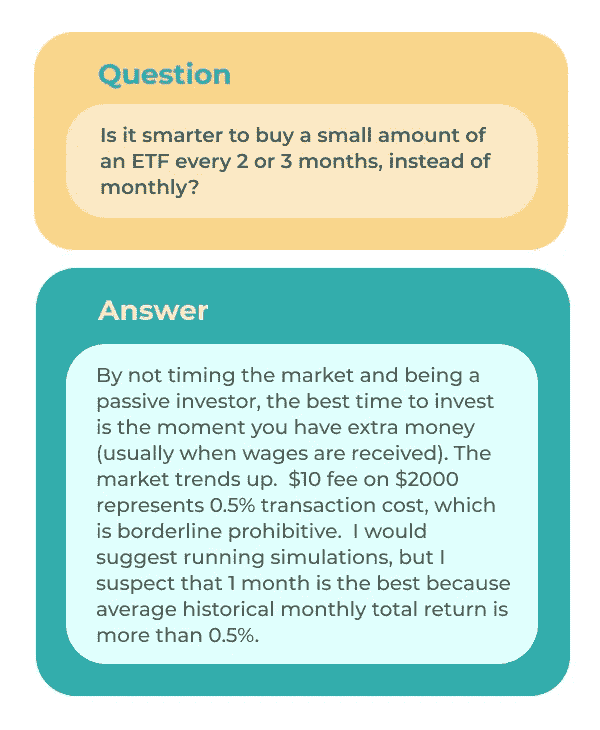*

*来自金融领域的 QA 示例。(图片由作者提供)*

*以下是 FiQA 提出的其他问题列表:*

```
*• What does it mean that stocks are “memoryless”?
• What would a stock be worth if dividends did not exist?
• What are the risks of Dividend-yielding stocks?
• Why do financial institutions charge so much to convert currency?
• Is there a candlestick pattern that guarantees any kind of future profit?
• 15 year mortgage vs 30 year paid off in 15
• Why is it rational to pay out a dividend?
• Why do companies have a fiscal year different from the calendar year?
• What should I look at before investing in a start-up?
• Where do large corporations store their massive amounts of cash?*
```

*金融 QA 是很难的，因为词汇表是上下文相关的，例如，机器很难理解什么是 ETF。尽管如此，**借助 BERT 的力量，我在三个评估指标(精度、MRR、NDCG)上将最先进的(SOTA)结果平均提高了 19%**。*

*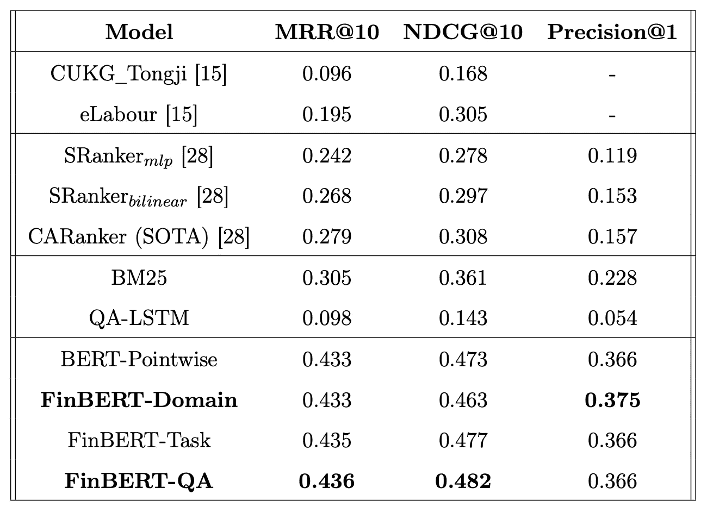*

*来自[芬伯特-QA](https://drive.google.com/file/d/1UyB9Ch9H1WnxW4WQgGWEoB-tAV1FMsf9/view) 的评估结果*

*尽管我的论文是关于金融领域的 QA，但我使用的方法可以应用于一般 QA 数据集或其他领域的 QA，如 T2 保险 T3。*

# *目录*

*[背景](#7aff)
[教程](#56ae)
[总结](#1a23)
[下一步:评测](#2f34)
[了解更多](#1505)*

# *背景*

## *什么是纪娜？*

**

*(图片来自[纪娜艾](https://github.com/jina-ai/jina))*

*TensorFlow 和 PyTorch 等开源深度学习框架通过高级编程接口为设计和快速实现基于神经网络的应用提供了构建模块。*

*同样，**纪娜**是一个**开源神经搜索框架**，它为设计和实现**基于神经网络的搜索应用**提供了构建模块。*

*由 [bert-as-service](https://github.com/hanxiao/bert-as-service) 和 [Fashion-MNIST](https://github.com/zalandoresearch/fashion-mnist) 的创建者共同创建，纪娜使开发者能够使用 **SOTA 预先训练的深度学习模型**来构建**生产就绪的云原生搜索系统**，其中系统的每个组件都是一个**微服务**，可以独立部署、扩展和维护。*

**

*(图片由作者提供)*

*如果你像我一样来自数据科学或学术背景，术语**云原生**和**微服务**可能听起来令人生畏。这就是为什么我们将在本教程中通过示例学习，并使用 NLP 任务，财务 QA，来熟悉纪娜的核心概念！*

## *BERT 的财务质量保证*

*在进入教程之前，我们先来了解一下如何用 BERT 搭建一个 QA 系统。我们的目标是当给定来自 [FiQA](https://sites.google.com/view/fiqa/home) 数据集的任务 2 的问题时，搜索前 k 个最相关的答案段落。*

*2018 年，谷歌预训练的用于迁移学习的 BERT 模型震动了 NLP 世界，并在众多任务上取得了 SOTA 结果，标志着 NLP 的 [ImageNet moment](https://ruder.io/nlp-imagenet/) 。*

*BERT 的巧妙之处在于，我们可以通过简单地将它转换为一个**二进制分类任务**来微调我们 QA 任务的预训练模型，其中输入是一个问题和一个答案的**串联，输出是一个二进制标签，指示 QA 对的**相关性分数**。然后，我们可以获得每个问答配对的 softmax 分数，以获得相关性的概率，并对这些分数进行排名。***

*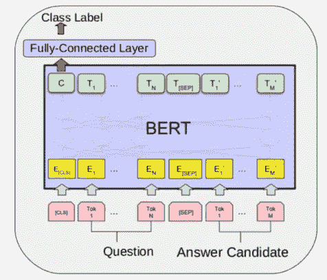*

*FinBERT-QA 为我们的 QA 任务提供的微调方法。输入是一个问题和一个答案的串联，输出是一个二进制标签，指示 QA 对的相关性分数。*

*FiQA 数据集大约有 6000 个问题和 57000 个答案。我们可以采用[段落重新排序](https://arxiv.org/pdf/1901.04085.pdf)方法，而不是对每个问题计算 57，000 次的概率。我们首先使用**检索器**返回每个问题的前 50 个候选答案，然后使用 **FinBERT-QA** ，一个基于 BERT 的模型，在 [FiQA](https://sites.google.com/view/fiqa/home) 数据集上进行微调，作为**重排序器**来计算相关性分数，并对前 50 个 QA 对进行重排序，以获得前 10 个答案。*

*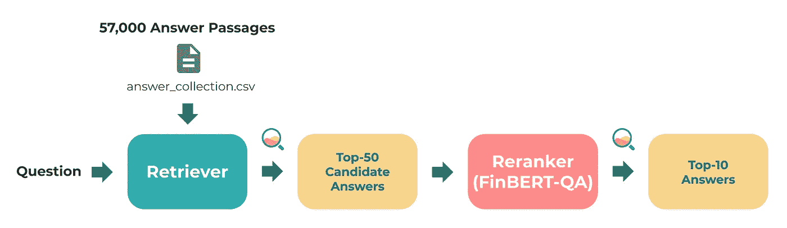*

*重新分级的质量保证管道。(图片由作者提供)*

*如果你对我论文的细节感兴趣，可以在这里了解更多[。](https://github.com/yuanbit/FinBERT-QA)*

## *为什么是纪娜？*

*为什么 SOTA 模型和结果不够好？*

***纪娜作为研究和工业之间的桥梁:***

*我的研究背后的动机是能够帮助财务顾问回答大规模报告中的问题。然而，我实现 QA 管道的方式是不可重用的，并且它不能扩展到业务需求。按照行业标准，它还不能投入生产。*

*由于**纪娜使我们能够构建包含微服务的云原生系统**，而不是将我的整个管道包装在单个 Docker 容器中，纪娜将把管道分解成组件(预处理器、编码器、索引器等)。).此外，这些组件中的每一个都将是一个独立 Docker 容器中的微服务，由[流 API](https://docs.jina.ai/chapters/flow/index.html) 管理。*

**

*(插图来自[多像素](https://www.manypixels.co/gallery/))*

*对于那些不熟悉云原生概念的人，你可以将微服务视为应用的独立组件，例如，使用 FinBERT-QA 对我们的问题和答案进行编码。然后，您可以创建多个独立的组件或微服务来构建类似 BERT 支持的 QA 系统的应用程序。由于应用程序的每个组件都可以独立部署，因此它们也可以单独扩展，并响应快速变化和业务需求。*

**

*(插图来自[多像素](https://www.manypixels.co/gallery/))*

*云原生是一种现代设计，越来越多的企业正在适应这种设计，因为它可以帮助他们节省资源并实现增长。然而，设计这样的系统并不容易。我们需要考虑许多原则、模式和最佳实践，例如，*每个组件将如何相互通信？他们如何并行工作？*幸运的是，**纪娜没有从零开始，而是为我们做了所有的艰苦工作，为我们提供了构建模块，这样我们就可以使用一种重新排序的方法轻松构建一个基于云的 BERT 支持的 QA 系统，并随时投入生产！***

# *辅导的*

*现在我们已经有了一个概述，让我们学习如何使用重新分级方法构建一个生产就绪的财务 QA 系统，并深入研究一些新的纪娜术语。我们将使用 [FinBERT](https://github.com/ProsusAI/finBERT) 将我们的问题和答案段落编码到嵌入中，并使用 [FinBERT-QA](https://github.com/yuanbit/FinBERT-QA) 对前 50 个答案匹配进行重新排序。*

***本教程的最终代码可以在** **这里找到** [**。**](https://github.com/yuanbit/jina-financial-qa-search)*

## *建立*

***克隆我们将在这里一起工作的存储库**:*

```
*git clone https://github.com/yuanbit/jina-financial-qa-search-template.git*
```

*我们将使用`jina-financial-qa-search/`作为我们的工作目录。*

***安装要求***

```
*pip install -r requirements.txt*
```

***下载数据和模型***

```
*bash get_data.sh*
```

*对于本教程，我们不会搜索来自 [FiQA](https://sites.google.com/view/fiqa/home) 数据集的所有 57，000 个答案段落。我们将使用一个名为`test_answers.csv`的样本数据集，包含大约 800 个答案段落。如果您想试验完整的数据集，可以使用`answer_collection.tsv`。*

***流程***

*在纪娜，我们将建立一个有两个管道的金融 QA 系统，一个用于索引我们的答案段落，另一个用于查询。这些管道被称为**流**，它们也用于管理微服务的状态和上下文，以及编排它们。让我们看看**索引流**和**查询流**的概况是什么样子的:*

*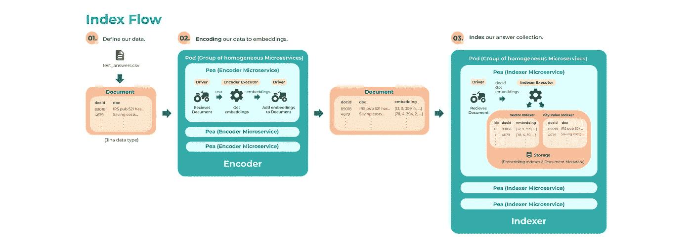*

*指数流。(图片由作者提供)*

*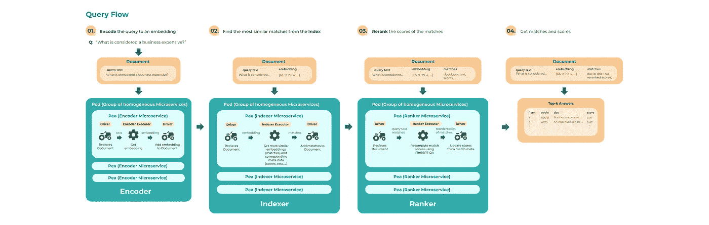*

*查询流程。(图片由作者提供)*

*为了理解这些流程，让我们从**索引流程**开始，逐一查看各个组件。*

## *指数流*

*索引流背后的主要思想是使用预先训练的 BERT 模型将我们所有的答案段落编码成嵌入，然后索引这些嵌入，以便可以在查询流中搜索它们。*

## *第一步。定义我们的数据*

*我们想要索引来自 FiQA 数据集的答案段落的子集，`dataset/test_answers.csv`:*

```
*398960	From  [http://financial](http://financial-)  
        dictionary.thefreedictionary.com/Business+Fundamentals  The  
        facts  that  affect  a  company's      underlying  value.  
        Examples  of  business      fundamentals  include  debt,     
        sure  you  file  the  NOL...
19183	If  your  sole  proprietorship  losses  exceed  all  other  
        sources  of  taxable income...
327002	To  be  deductible,  a  business  expense  must  be  both  
        ordinary  and  necessary.  An  ordinary  expense  is  one  
        that  is  common  and  accepted  in  your  trade  or  
        business.  A  necessary  expense...*
```

*我们的数据集由一列答案 id 和文本组成，在本教程中我们将它们分别表示为`docid`和`doc`。为了索引我们的数据，我们需要首先在一个名为`Document`的纪娜数据类型中定义它。*

*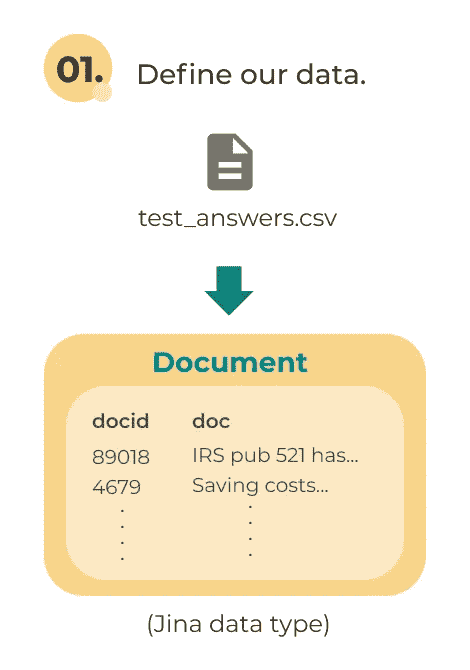*

*索引流——第 1 步，在一个名为 Document 的纪娜特定数据类型中定义我们的数据。(图片由作者提供)*

*在编程语言中，有 int、float、boolean 等数据类型。在 NumPy、TensorFlow 和 PyTorch 中，我们操作和传递诸如`ndarray`和`tensor`之类的对象，它们被称为**原始数据类型**。类似地，`Document`是表示数据的特定于纪娜的数据类型。*

***在文档中定义我们的数据***

*在我们的项目目录`jina-financial-qa-search/`中，`app.py`文件由我们将要构建的财务 QA 搜索应用程序组成。注意，我们在`config`函数中设置了数据路径，如下所示:*

*您可以将路径更改为`answer_collection.tsv`来索引整个数据集。*

*让我们首先确定我们从 jina 进口:*

*在完成了`config`函数之后，让我们创建一个 Python 生成器，并定义文档以包含与答案段落相对应的 id 和文本:*

*文档是我们**定义和查看 Protobuf** 中存储的内容的高级方式，纪娜用它来**使流程中的微服务能够相互通信**。它就像一个包含我们数据的信封，用于在我们流的微服务之间发送消息。不用直接处理 Protobuf，它将我们的数据序列化为字节，我们可以简单地打印我们的文档，并看到一个单独的答案段落如下所示:*

```
*id: "13755c6081bebe1a"
mime_type: "text/plain"
tags {
  fields {
    key: "id"
    value {
      number_value: 398960.0
    }
  }
}
text: "From  http://financial-dictionary.thefreedictionary.com/Business+Fundamentals  The  facts  that  affect  a  
company\'s underlying  value. Examples  of  business fundamentals  include  debt,  cash  flow, supply  of  and  demand  
for  the  company\'s      products,  and  so  forth.  For  instance, if  a  company  does  not  have  a sufficient  
supply  of  products,  it  will      fail.  Likewise,  demand  for  the  product      must  remain  at  a  certain  
level  in      order  for  it  to  be  successful.  Strong      business  fundamentals  are  considered essential  for  
long-term  success  and      stability.  See  also:  Value  Investing, Fundamental  Analysis.  For  a  stock  the  basic
fundamentals  are  the  second  column  of  numbers  you  see  on  the  google  finance  summary  page, P/E  ratio,  
div/yeild,  EPS,  shares,  beta.      For  the  company  itself  it\'s  generally  the  stuff  on  the  \'financials\'  
link    (e.g.  things  in  the  quarterly  and  annual  report,    debt,  liabilities,  assets,  earnings,  profit  etc."*
```

***当我们沿着索引流移动时，文档的内容将被改变**，例如，我们可以在索引流中看到，答案段落的嵌入在编码步骤之后被添加到文档中。*

*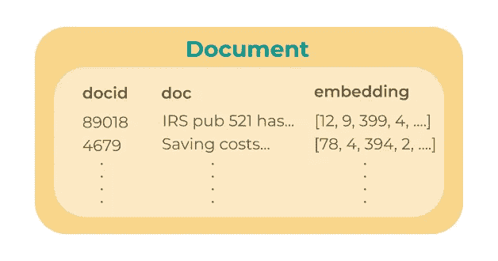*

*在编码步骤之后，答案段落的嵌入被添加到文档中。(图片由作者提供)*

*编码步骤使用一个**执行器**，即**编码器**。接下来让我们更深入地理解这一点。*

## *第二步。编码答案段落*

**

*(图片来自[纪娜艾](https://github.com/jina-ai/jina))*

*我们将在以后查看其他执行器，现在只关注编码器**和**。我们可以简单地利用[纪娜中心](https://github.com/jina-ai/jina-hub)，这是一个**开放注册表，用于通过容器映像**托管纪娜执行者，而不是使用 TensorFlow 或 PyTorch 结合拥抱面部变形器和我们自己实现编码器。*

*在纪娜中心有各种编码器和其他类型的执行器，用于不同的任务和数据类型(例如，图像、视频、音频、多模态)，允许我们**运送和交换可重用的组件，并构建各种基于深度学习的搜索引擎，例如，文本-图像、跨模态和多模态搜索。**因为我们的任务是文本到文本的搜索，所以在本教程中我们将使用[TransformerTorchEncoder](https://github.com/jina-ai/jina-hub/tree/master/encoders/nlp/TransformerTorchEncoder)。*

*在我们讨论如何在我们的索引流中使用编码器之前，让我们在这一步中理解三个更重要的纪娜概念:*

**

*(图片来自[纪娜艾](https://github.com/jina-ai/jina))*

*   ***驱动:**回忆纪娜使用 Protobuf 在流程中的微服务之间发送消息，消息的形式是字节。如果我们将文档直接传递给编码器，我们会遇到一个问题，因为编码器需要答案文本作为输入，而不是字节。*

*纪娜没有直接处理 Protobuf，而是使用**驱动**来**为执行器**翻译数据，这样我们只需要处理我们熟悉的数据类型(例如文本、图像、np、数组等等……)。对于每个执行器，都有一个相应的驱动程序来解释流中的消息，并将适当的数据传递给执行器。*

*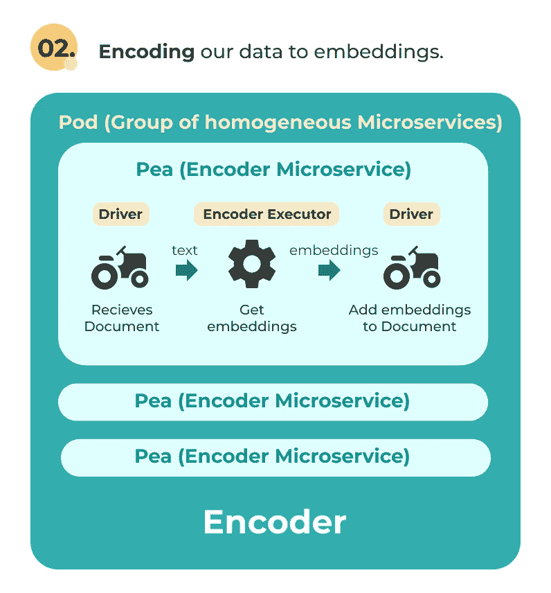*

*编码器—驱动程序以 yes 接收文档，并将文本传递给编码器。编码器输出文本的嵌入，同一驱动程序将它们添加到文档中。(图片由作者提供)*

*例如，在编码步骤中，驱动程序接收以字节为单位的文档，将其解释为文档，并将文档中的文本传递给编码器。在编码器输出相应文本的嵌入内容后，同一个驱动程序再次解释嵌入内容，并将它们添加到文档中。下面的文档显示了它是如何在编码步骤中被驱动程序转换的，并将作为下一个索引步骤的输入。*

**

*驱动程序通过在编码步骤中添加嵌入来转换文档。(图片由作者提供)*

**

*(图片来自[纪娜艾](https://github.com/jina-ai/jina))*

*   ***Pea:** 由于执行者需要一个驱动程序来处理我们的数据，所以它们都是流程中微服务的必要组件。因此，我们使用一个 **Pea** 将执行器和驱动程序包装在一起，得到我们的**编码器微服务**。*

*因此，Pea 是一个**微服务**，它不断地监听来自网关或流中其他 Pea 的传入消息，并在收到消息时调用驱动程序。作为微服务， **Peas 也可以在 Docker 中运行，在一个地方包含所有依赖和上下文。***

**

*(图片来自[纪娜艾](https://github.com/jina-ai/jina))*

*   ***Pod:** 为了优化我们的神经搜索应用，**纪娜提供了现成的并行化。**我们可以把它分成**多个进程**，而不是只有一个编码器。编码步骤的可视化显示了编码器被分成三个进程，每个进程由一个 Pea 包装。*

***为了让我们的多编码器微服务在功能上表现得像一个编码器，我们将一组同质(相同)pea 包装在一个 Pod 中**。因此，Pod 是一组**同类微服务**，也负责负载平衡、进一步控制和上下文管理。*

*这个设计的美妙之处在于，Pod 既可以在本地主机上运行，也可以通过网络在不同的计算机上运行，这使得我们的应用程序**是分布式的、高效的和可伸缩的**。*

*现在我们了解了这些基本概念， ***我们如何为编码器创建一个 Pod 呢？****

**

*(图片来自[纪娜艾](https://github.com/jina-ai/jina))*

*这听起来可能非常复杂，但是利用纪娜提供的构建模块，我们可以 **(1)设计一个索引流，以及(2)用两个简单的 YAML 文件创建一个编码器 Pod。这些 YAML 文件将允许我们在不触及纪娜代码核心的情况下定制我们的神经搜索应用程序。***

***I .为编码器创建一个 Pod***

*让我们首先在名为`pods`的文件夹中创建一个文件`encode.yml`。在`encode.yml`中，我们首先从纪娜中心指定我们想要使用的编码器的名称，`TransformerTorchEncoder`。*

*我们可以选择我们想要使用的模型，在我们的例子中，我们使用 [FinBERT](https://github.com/ProsusAI/finBERT) ，它在一个大型金融语料库上进一步预训练了`bert-base-uncased`。由于`TransformerTorchEncoder`是使用拥抱面部变形器实现的，如果[拥抱面部模型中枢](https://huggingface.co/docs)上有该模型，您也可以通过指定其名称来直接使用该模型。我们还可以包括其他超参数，如最大序列长度或池策略。*

*就这么简单！🐣**我们刚刚创建了一个基于深度学习的编码器微服务，准备进行并行化！**`pods`文件夹也将是我们需要的其他 pod 的目录，这些 pod 也将使用 YAML 文件来定义。*

***二。将编码器添加到索引流***

*现在我们已经准备好了编码器，让我们将它放入索引流中。让我们在名为`flows`的文件夹中创建一个文件`index.yml`。在`index.yml`中，我们通过给出`pods/encode.yml`文件的路径来指定索引流中的第一个 Pod，即`encoder`。通过使用`parallel`参数，我们可以指定我们想要将编码器分成多少个进程。这将是一个在`app.py`中指定的环境变量，我们将在最后查看。`parallel`也**决定了我们在每个豆荚里会有多少豌豆。***

*干得好！💪您刚刚为深度学习驱动的微服务创建了一个初始管道！接下来，让我们通过添加另一个包含索引器的 Pod 来完成索引流的设计。*

## *第三步。索引*

**

*(图片来自[纪娜艾](https://github.com/jina-ai/jina))*

*获得答案段落的嵌入后，我们将创建另一个名为**索引器**的执行器来存储我们的数据，以便在查询时可以检索到它们。与上一步类似，驱动程序接收文档，并将`docid`、`doc`和`embeddings`传递给索引器。*

*我们将使用**复合索引器**，它使用来自纪娜中心的 **(1)向量**和 **(2)键值索引器**作为单个索引器:*

1.  ***向量索引器:**存储答案嵌入，并被问题嵌入查询，以使用 k-最近邻算法检索最接近的答案嵌入。*
2.  ***键值(KV)索引器:**存储文档数据(文本、blob、元数据)，并通过文档 id(通常从向量索引器中提取)进行查询，以检索数据的信息，如答案 id 和文本。*

*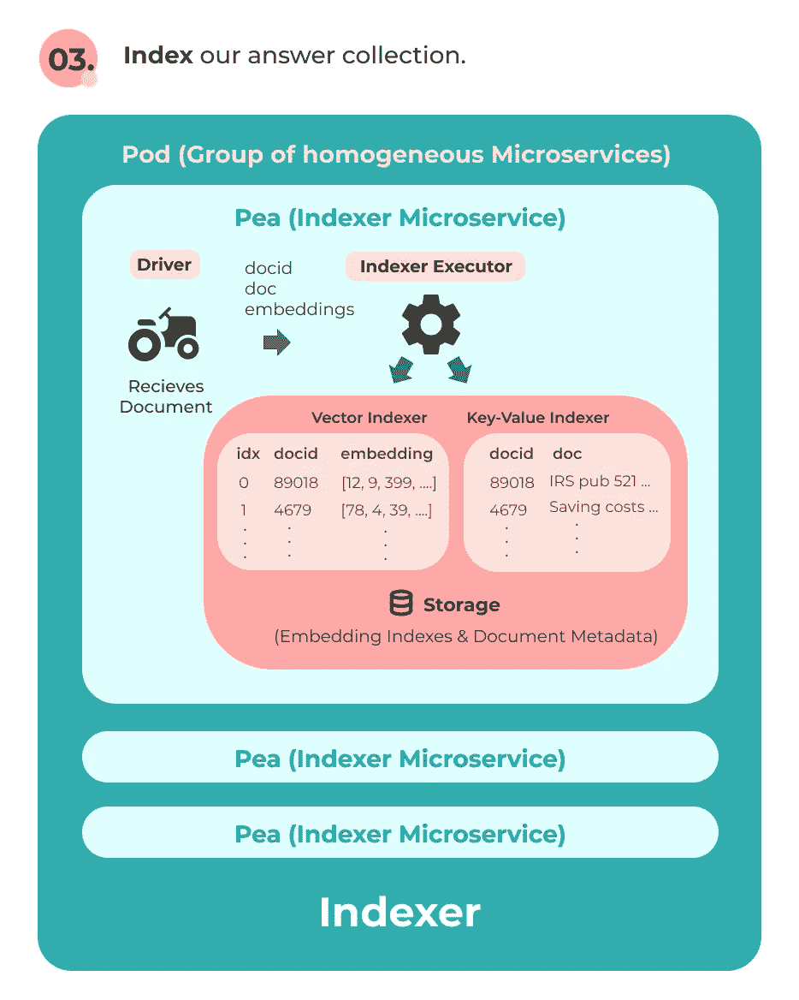*

*索引器将存储我们的数据，以便可以在查询时检索它们。(图片由作者提供)*

*我们再次将驱动程序和索引器包装在一个 Pea 中，将相同的 Pea 分组在一个 Pod 中，并使用 YAML 文件定义它们。*

***I .为索引器创建一个 Pod***

*让我们创建文件`pods/doc.yml`并将我们的复合索引器定义为`!CompoundIndexer`，其中组件`!NumpyIndexer`是矢量索引器，`!BinaryPbIndexer`是 KV 索引器。索引数据将分别存储在`vec.gz`和`doc.gz`中。`workspace`是存储索引的目录，它位于我们的工作目录中。*

***二。将索引器添加到索引流中***

*现在让我们回到`flows/index.yml`，将我们的索引器作为`doc_indexer`添加到索引流中。如果我们的数据很大，我们还可以在应用程序中添加分片来进行优化。这也将在`app.py`中用作环境变量，我们将在后面看到。*

*干得好！👏您刚刚设计了一个用于索引金融答案段落的云原生管道！我们还可以使用纪娜的[流 API](https://docs.jina.ai/chapters/flow/index.html) 来可视化索引流。首先让我们在终端中为`parallel`和`shards`设置环境变量:*

```
*export JINA_PARALLEL='1'
export JINA_SHARDS='1'*
```

*接下来，让我们在工作目录中打开一个`jupyter notebook`并执行以下操作:*

*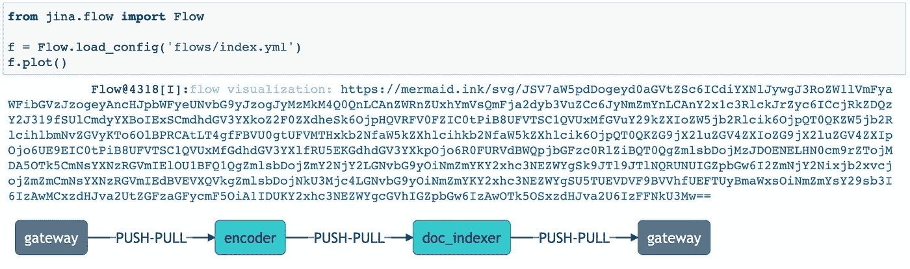*

*索引流可视化。(图片由作者提供)*

*这里我们看到我们的索引流有两个 Pods 编码器，`encoder`和索引器，`doc_indexer`。*

## *构建索引器应用程序*

*让我们看看如何在我们的搜索应用程序中使用索引流。在`app.py`中，我们可以更改`config`函数中的`parallel`来指示我们想要为每个 Pod 拆分多少个 pea(进程)。我们还可以更改`shards`来指示索引步骤期间的并行化。我们暂时不改变它们。这意味着我们每个豆荚里只有一粒豌豆。*

*我们先从纪娜的[流程 API](https://docs.jina.ai/chapters/flow/index.html) 中导入`Flow`:*

*在我们在[步骤 1 中添加的`index_generator`功能之后。定义我们的数据](https://jina.ai/2021/01/07/financial-qa-tutorial.html#step-1-define-our-data)，让我们添加`index`函数，该函数将首先加载我们在`flows/index.yml`中创建的索引流，并将输入文档从`index_generator`传递到该流。我们将`batch_size=16`设置为将答案段落编码到嵌入中。*

*我们现在准备索引我们的数据。在我们的工作目录中运行:*

```
*python app.py index*
```

*[](https://asciinema.org/a/381671) [## 指数

### 元比特录制

asciinema.org](https://asciinema.org/a/381671) 

最后，您将看到以下内容:

```
✅ done in ⏱ 1 minute and 54 seconds 🐎 7.7/s
        gateway@18904[S]:terminated
    doc_indexer@18903[I]:recv ControlRequest from ctl▸doc_indexer▸⚐
    doc_indexer@18903[I]:Terminating loop requested by terminate signal RequestLoopEnd()
    doc_indexer@18903[I]:#sent: 56 #recv: 56 sent_size: 1.7 MB recv_size: 1.7 MB
    doc_indexer@18903[I]:request loop ended, tearing down ...
    doc_indexer@18903[I]:indexer size: 865 physical size: 3.1 MB
    doc_indexer@18903[S]:artifacts of this executor (vecidx) is persisted to ./workspace/doc_compound_indexer-0/vecidx.bin
    doc_indexer@18903[I]:indexer size: 865 physical size: 3.2 MB
    doc_indexer@18903[S]:artifacts of this executor (docidx) is persisted to ./workspace/doc_compound_indexer-0/docidx.bin
```

好哇🙌我们完成了申请的第一部分！嵌入索引和文档数据将存储在名为`workspace`的目录中。

## 查询流程

在索引我们的数据之后，我们需要创建一个**查询流**。查询流背后的主要思想是使用相同的基于 BERT 的模型来**将给定的问题编码到嵌入中**并使用索引器来**搜索最相似的答案嵌入**。为了进一步改善搜索结果，我们将使用与我的论文相同的重新排序技术。因此，我们将需要添加另一个重新排序步骤，使用 FinBERT-QA 来重新计算纪娜返回的答案匹配的分数。


查询流程。(图片由作者提供)

让我们再一次一步一步地走一遍。

## 第一步。编码问题

让我们假设问题文本将是用户输入。纪娜将接受这个输入并定义一个新的文档。

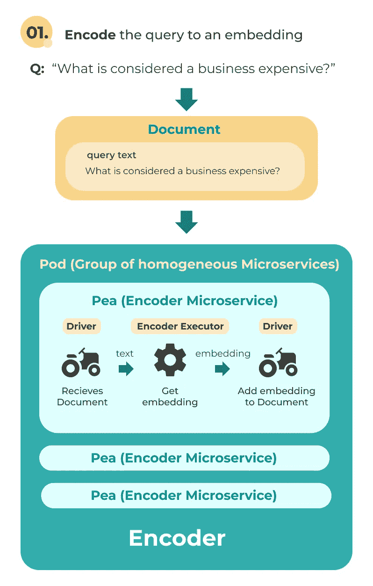

查询流中的编码器。(图片由作者提供)

**将编码器添加到查询流中**

就像索引流的编码步骤一样，我们使用相同的编码器对问题进行编码。因此，我们可以在我们的**查询流**中使用来自`pods/encode.yml`的相同编码器。我们将在`flows`文件夹中创建一个新的`query.yml`文件，并将编码器窗格添加到其中:

## 第二步。搜索索引

对问题进行编码后，问题嵌入将由驱动程序添加到文档中。然后，该文档被发送到下一个 Pod 中的索引器，驱动程序将把问题嵌入传递到索引器。然后，索引器将使用 k-nearest neighbors 算法搜索具有最相似嵌入的答案，并将前 k 个答案匹配的列表传递给要添加到文档中的驱动程序。

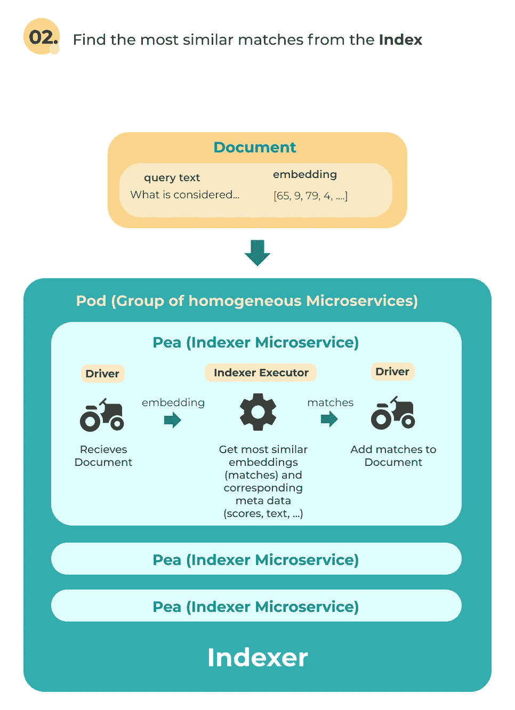

索引器将搜索具有最相似嵌入的答案。(图片由作者提供)

匹配将包含诸如`docid`、`doc`和匹配`match scores`的数据。因为我们也使用了索引流程中的同一个索引器，所以我们需要再次将索引器 Pod 添加到`flows/query.yml`:

## 第三步。重新分级


(图片来自[纪娜艾](https://github.com/jina-ai/jina))

让我们假设索引器在此时返回前 k 个答案匹配，我们想要重新计算匹配分数以获得更好的结果。纪娜有一类称为**排名器**的执行者，特别是 **Match2DocRankers** 通过计算新的分数对查询的匹配进行重新评分。如果你看看纪娜中心的排名器， [Levenshtein 排名器](https://github.com/jina-ai/jina-hub/tree/master/rankers/LevenshteinRanker)使用 Levenshtein 距离来重新计算比赛分数。

然而，我们不是使用距离度量来重新计算分数，而是希望在排名器中加载我们优化的 BERT 模型 FinBERT-QA，并通过使用问题和当前匹配答案的串联作为二进制分类任务的输入来重新计算分数。

这里的主要思想是将我们的查询文本和匹配(包含答案文本和匹配分数)传递给 Ranker，根据 FinBERT-QA 计算的相关性分数返回一个重新排序的匹配列表。然后，驱动程序将根据这个重新排序的列表更新文档中的匹配。

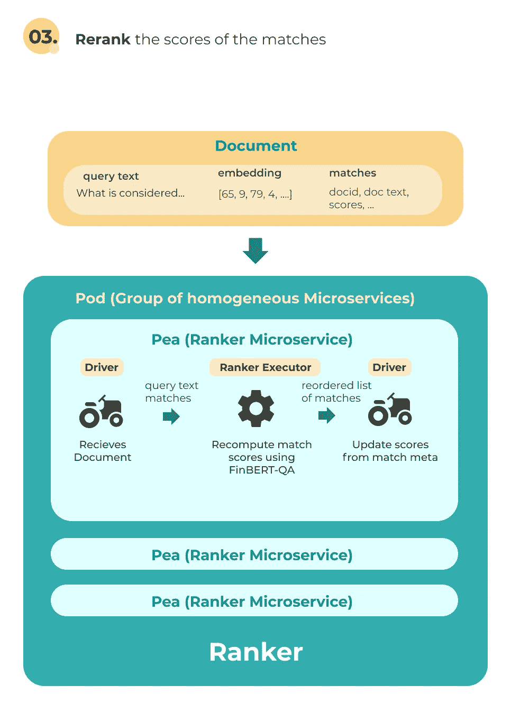

排名器使用 FinBERT-QA 重新计算匹配的分数。(图片由作者提供)

回想一下，Peas 可以在 Docker 中运行，这意味着我们可以简单地用我们的 Ranker 实现构建一个 Docker 映像，并在查询流中使用该映像。纪娜中心 API 让我们使用 Cookiecutter 来创建我们需要的所有文件的模板。让我们从确保安装了纪娜中心扩展开始:

```
pip install "jina[hub]"
```

## 构建自定义执行器

让我们首先创建模板，我们将需要为我们的自定义排名建立一个 Docker 图像。

**1。设置。**

在`jina-financial-qa-search/`目录中键入:

```
jina hub new
```

这将弹出一个向导，帮助您完成整个过程。让我们将我们的执行器命名为`FinBertQARanker`，并确保选择`4 - Ranker`作为执行器类型。我们将使用`jinaai/jina`作为我们将要构建的 Docker 图像的基础图像。

```
You've downloaded /Users/bithiah/.cookiecutters/cookiecutter-jina-hub before. Is it okay to delete and re-download it? [yes]: yes
 executor_name [The class name of the executor (UpperCamelCase)]: FinBertQARanker
 Select executor_type:
 1 - Encoder
 2 - Crafter
 3 - Indexer
 4 - Ranker
 5 - Evaluator
 Choose from 1, 2, 3, 4, 5 [1]: 4
 description [What does this executor do?]: recomputes match scores using FinBERT-QA                
 keywords [keywords to describe the executor, separated by commas]: 
 pip_requirements []: 
 base_image [jinaai/jina]: 
 author_name [Jina AI Dev-Team (dev-team@jina.ai)]: 
 author_url [https://jina.ai]: 
 author_vendor [Jina AI Limited]: 
 docs_url [https://github.com/jina-ai/jina-hub]: 
 version [0.0.1]: 
 license [apache-2.0]:
```

按回车键后，你会看到一个名为`FinBertQARanker`的新目录。您的文件结构现在应该如下所示:

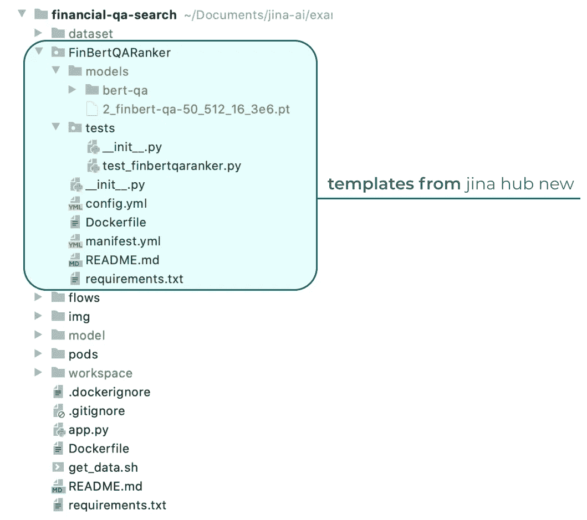

项目文件夹结构。(图片由作者提供)

我们将在`__init__.py`中实现我们的排序器逻辑，在`tests/test_finbertqaranker.py`中编写一些测试，并修改`Dockerfile`以包含构建图像所需的一切。

**排名者的代号可以在** [**这里找到**](https://github.com/yuanbit/jina-financial-qa-search/tree/master/FinBertQARanker) **。**

**2。填写重新分级的逻辑。**

我们现在将在`__init__.py`中实现我们的逻辑，应该如下所示:

纪娜为具有不同功能的执行器包含不同的基类。我们将使用的基本排名器类称为 **Match2DocRankers** ，它具有重新计算匹配分数的功能。

我们先把`BaseRanker`的基类改成`Match2DocRanker`。让我们也导入 **PyTorch** 使用纪娜和其他一些模块，我们将需要，以及定义我们当前的目录。

我们的逻辑将在使用纪娜的`TorchDevice`和`Match2DocRanker`的`FinBertQARanker`类中实现。稍后我们将在`Dockerfile`中下载我们需要的模型。让我们假设现在在文件夹`models/`中有两个模型:(1) `bert-qa/`和(2) `2_finbert-qa-50_512_16_3e6.pt`。

(1) `bert-qa`:根据[段落使用 BERT](https://github.com/nyu-dl/dl4marco-bert) 重新排序，在 MS 宏数据集上进行 bert-base-uncased 微调

(2) `2_finbert-qa-50_512_16_3e6.pt` : FinBERT-QA 模型——在 FiQA 数据集上微调`bert-qa`。

我们首先指定`bert-qa/`作为将用于初始化的预训练模型，`2_finbert-qa-50_512_16_3e6.pt`作为将用于计算 QA 关联分数的模型，以及 QA 对的最大序列长度:

然后，我们向该类添加一个`post_init`函数，使用拥抱面部变形器加载二进制分类任务的模型。确保将模型设置为评估模式。

现在让我们实现一个私有的`_get_score`函数来计算问题和前 k 个答案匹配的相关性分数。我们首先连接问题和每个 top-k 答案，并对它们进行编码，以获得模型需要的输入(`input_ids`、`token_type_ids`、`att_mask`)，使用来自 transformers 的标记器。

然后，我们将输入输入到模型中，并获得 QA 对相关的预测分数(`label = 1`)。我们将 softmax 函数应用于得分，以将预测得分转换为 0 到 1 之间的概率。然后，输出将是 QA 对的概率形式的相关性分数。

最后，让我们填写评分函数，该函数将用户的问题和纪娜的比赛分数作为输入，并使用`_get_scores`来重新计算新的分数:

**3。编写一个单元测试**

为了创建一个新的执行器，并使用纪娜中心 API 构建一个 Docker 映像，我们需要编写一个单元测试。我们可以在`tests/test_finbertqaranker.py`中找到这个的模板。我编写了一个简单的检查来计算给定查询的两个答案匹配的相关概率，并检查`FinBertQARanker`是否计算出与我们期望的相同的分数:

**4。添加要求**

除了纪娜，我们还在`FinBertQARanker`中使用 PyTorch 和变形金刚，所以让我们把它们添加到`FinBertQARanker/requirements.txt`:

```
torch==1.7.1
transformers==4.0.1
```

**5。准备文档**

让我们将我们的`Dockerfile`改为下面的内容，这将把模型下载到一个名为`models/`的文件夹中。

**6。使用纪娜中心 API 构建 Docker 映像**

我们终于准备好将`FinBertQARanker`构建成 Docker 映像了。在我们的工作目录中，让我们键入:

```
jina hub build FinBertQARanker/ --pull --test-uses --timeout-ready 60000
```

`--pull`如果我们的纪娜基础映像不在本地，则下载该映像。

`--test-uses`增加了一个额外的测试，以检查构建的映像是否可以通过纪娜的流程 API 成功运行。

`--timeout-ready`给我们的`post_init`函数加载模型的时间。

如果构建成功，您将看到以下消息:

```
HubIO@10240[I]:Successfully built ba3fac0f3a46
HubIO@10240[I]:Successfully tagged jinahub/pod.ranker.finbertqaranker:0.0.1-0.8.13
HubIO@10240[I]:building FinBertQARanker/ takes 6 minutes and 12 seconds (372.31s)
HubIO@10240[S]:🎉 built jinahub/pod.ranker.finbertqaranker:0.0.1-0.8.13 (sha256:ba3fac0f3a) uncompressed size: 3.3 GB
```

恭喜你🥳，你已经成功构建了一个标记名为`jinahub/pod.ranker.finbertqaranker:0.0.1-0.8.23`的 Docker 图像形式的定制执行器！接下来让我们看看如何在查询流中使用它。

**一、创建自定义排名框**

要使用我们的自定义排序器，`FinBertQARanker`，我们需要首先为排序器创建一个新的 Pod。让我们在`pods`文件夹中创建文件`rank.yml`。接下来，让我们将内容从`FinBertQARanker/config.yml`复制到`pods/rank.yml`，您应该有以下内容:

这将告诉查询流使用我们在 Exectuor 中实现的逻辑，`FinBertQARanker/__init__.py`。因为这个实现的代码被加载到 Docker 映像的`workspace`文件夹中，所以让我们在`__init__.py`之前添加`workspace/`。

到目前为止，我们使用的编码器和索引器执行器都使用 Pods 中的默认驱动程序。由于我们创建了自定义执行器，我们需要告诉 Ranker Pod 使用哪个驱动程序。在这种情况下，我们将使用`Matches2DocRankDriver`作为`Match2DocRanker`基础 Ranker 类。因此，我们的`rank.yml`将如下所示:

好哇🎊我们现在有了一个定制的等级舱！接下来让我们看看如何在查询流中使用它。

**二。在查询流中使用自定义排名器**

像其他 Executor Pods 一样，我们只需要在`doc_indexer`之后添加`ranker`，并通过在标签名称前面指定前缀`docker://`来告诉查询流使用我们刚刚创建的 Docker image 和 Ranker Pod。最终的`flows/query.yml`应该如下所示:

**请注意，Docker 图像的标签名称可能会根据当前的纪娜版本**而改变**。**确保相应地更改标签名称。

我们可以使用流程 API 在`jupyter notebook`中再次可视化查询流程，如下所示:

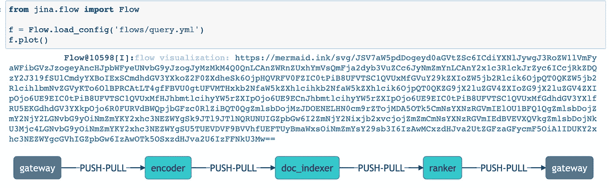

查询流可视化。(图片由作者提供)

这里我们看到我们的查询流有三个 pod，分别包含编码器、`encoder`和索引器、`doc_indexer`以及排序器、`ranker`。在查询流结束时，Ranker Pod 的驱动程序将根据我们的自定义 Ranker 计算出的概率，将文档中的匹配更改为一个重新排序的匹配列表。接下来，我们将看看如何在我们的`app.py`中访问这个决赛列表。

## 构建一个搜索应用程序

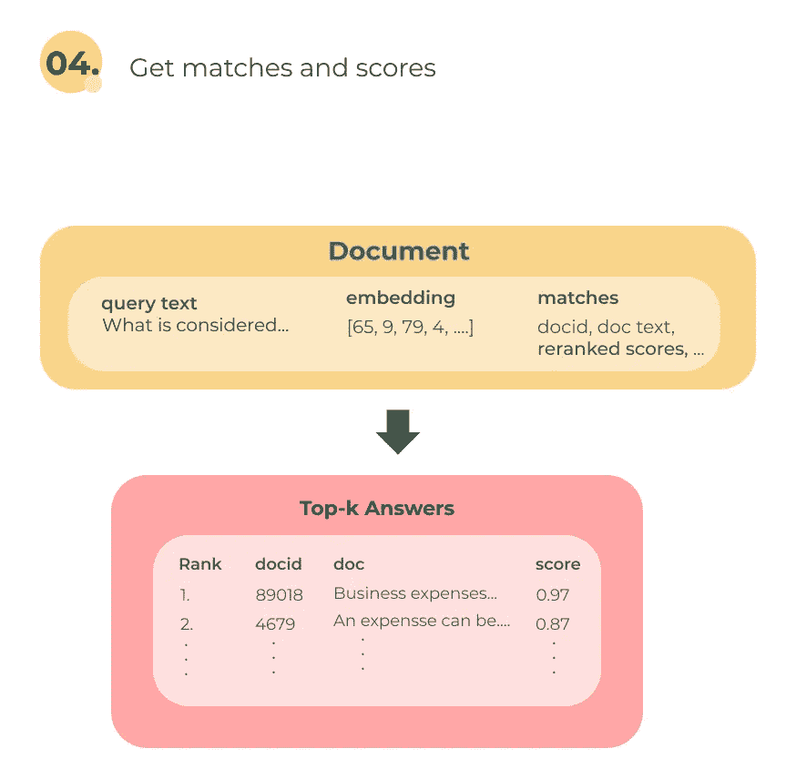

获取存储在文档中的匹配项和分数。(图片由作者提供)

由于我们的最终匹配及其关联概率存储在文档中，在`app.py`中，我们可以编写一个函数来打印出对用户输入的问题的响应。我们可以遍历文档中的匹配项`d.matches`，并打印出得分值和匹配的答案文本:

然后我们可以编写我们的`search`方法，该方法使用来自`flows/query.yml`的查询流，并将用户输入传递给`print_resp`。在`f.search_lines()`中，我们指定输入作为我们的用户查询，输出作为要打印的响应，以及我们想要检索的前 k 个答案。`f.search_lines()`很酷的一点是它自动为用户查询创建一个文档，就像 sugar magic 一样🍬！

万岁！🎉🎉🎉我们刚刚完成建立我们的金融问答搜索引擎！我们现在可以运行:

```
python app.py search
```

并尝试不同的问题！排名器可能需要一些时间来计算相关性分数，因为它使用的是基于 BERT 的模型。以下是问题示例列表:

```
• What does it mean that stocks are “memoryless”?
• What would a stock be worth if dividends did not exist?
• What are the risks of Dividend-yielding stocks?
• Why do financial institutions charge so much to convert currency?
• Is there a candlestick pattern that guarantees any kind of future profit?
• 15 year mortgage vs 30 year paid off in 15
• Why is it rational to pay out a dividend?
• Why do companies have a fiscal year different from the calendar year?
• What should I look at before investing in a start-up?
• Where do large corporations store their massive amounts of cash?
```

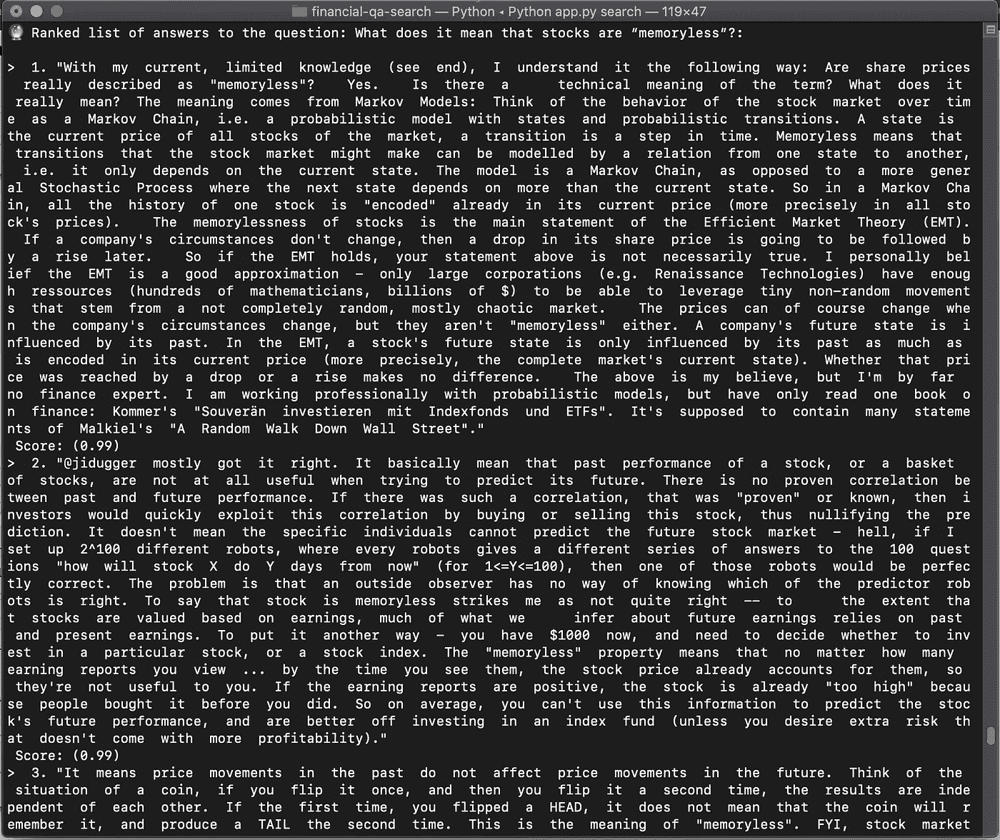

(图片由作者提供)

# 摘要

在这篇博客中，我介绍了纪娜的核心概念，并演示了如何构建一个生产就绪的财务 QA 系统。我还解释了如何使用纪娜中心 API 来创建一个 BERT 驱动的 Ranker 执行器。感谢纪娜提供的构建模块，我们可以在生产中轻松使用 SOTA 和强大的模型 FinBERT-QA。

我们刚刚用纪娜构建的神经搜索应用程序在我们自己的机器上本地运行，但也可以完全分布在网络中的多台机器上运行，使我们的应用程序高度可重用、可伸缩和高效。除此之外，常见的云原生特性，如持久性、调度、链接、分组和并行化都是现成的。

此外，还有其他领域的预训练 BERT 模型的变体，如[生物医学](https://github.com/dmis-lab/biobert)、[科学](https://github.com/allenai/scibert)和[法律](https://huggingface.co/nlpaueb/legal-bert-base-uncased)。您可以使用这些模型来构建一个 QA 搜索应用程序，并对结果进行实验！

# 后续步骤:评估

如果你已经完成了本教程，你可能会疑惑，**“我如何评估搜索结果？”**。很棒的问题！纪娜有一个称为**评估器**的执行器类，并且实现了通用的评估指标，比如精度和倒数误差。评估是一个重要的步骤，可以让我们改进搜索结果。我们将在[的下一篇教程](/search-engine-evaluation-in-jina-856616eb7f6f)中看到如何在我们的财务 QA 应用程序中添加评估器。

# 了解更多信息

要了解更多关于纪娜的情况，我推荐阅读以下文章:

*   [什么是纪娜和神经搜索？](https://medium.com/jina-ai/what-is-jina-and-neural-search-7a9e166608ab)
*   [从那时到现在:神经搜索和纪娜的精选列表](https://hanxiao.io/2020/10/19/A-Curated-List-of-Neural-Search-and-Jina-Framework-Designs/)

并且查看他们的 [Github](https://github.com/jina-ai/jina) 页面！

如果您想通过实践来了解纪娜，我鼓励您开始构建自己的示例并与社区分享，以帮助他们发展自己的开源生态系统！🚀例如，看看这个[社区项目——与纪娜合作建造的律师变形金刚](https://github.com/ArturTan/transformers-for-lawyers)。

我们看到了纪娜是多么多才多艺和可扩展，我们可以使用自己的逻辑和模型为 NLP、计算机视觉和其他 ML 搜索应用程序创建各种搜索应用程序。 [**纪娜 Hub**](https://github.com/jina-ai/jina-hub) **是一个很好的起点，在这里你可以使用可用的执行器来构建其他类型的搜索引擎(针对图片、视频等……)或者使用纪娜 Hub API 创建自己的执行器！**您可以随时回到本教程，再次浏览该过程。

# 社区

*   [Slack channel](http://slack.jina.ai) —开发者讨论纪娜的交流平台
*   [社区简讯](https://jina.ai/cdn-cgi/l/email-protection#dfb1baa8acb3baababbaadf4acaabdacbcadb6bdba9fb5b6b1bef1beb6) —订阅纪娜的最新更新、发布和活动消息
*   [LinkedIn](https://www.linkedin.com/company/jinaai/)——了解纪娜人工智能公司，寻找工作机会
*   [推特](https://twitter.com/JinaAI_)——关注纪娜·艾，并使用标签与他们互动`#JinaSearch`
*   [公司](https://jina.ai)——更多地了解纪娜 AI 公司及其对开源的承诺！* 

*非常感谢 **Joan Fontanals Martinez** 的指导和反馈。*

****来自《走向数据科学》编辑的提示:*** *虽然我们允许独立作者根据我们的* [*规则和指南*](/questions-96667b06af5) *发表文章，但我们并不认可每个作者的贡献。你不应该在没有寻求专业建议的情况下依赖一个作者的作品。详见我们的* [*读者术语*](/readers-terms-b5d780a700a4) *。**

**原载于 2021 年 1 月 7 日*[*https://jina . ai*](https://jina.ai/2021/01/07/financial-qa-tutorial.html)*。**