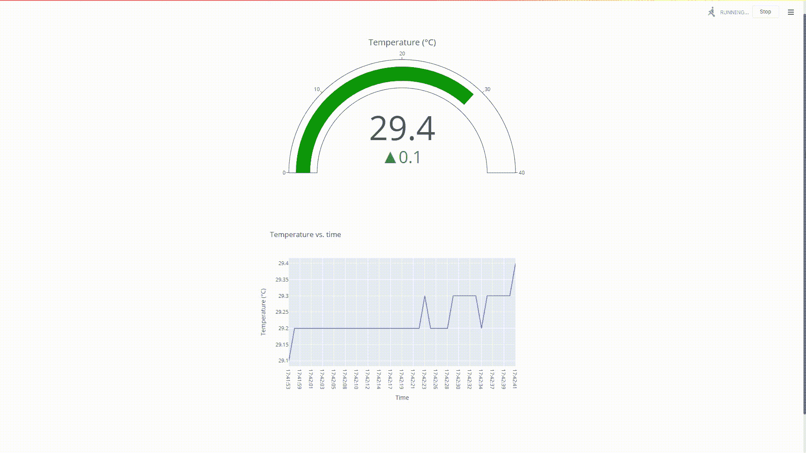
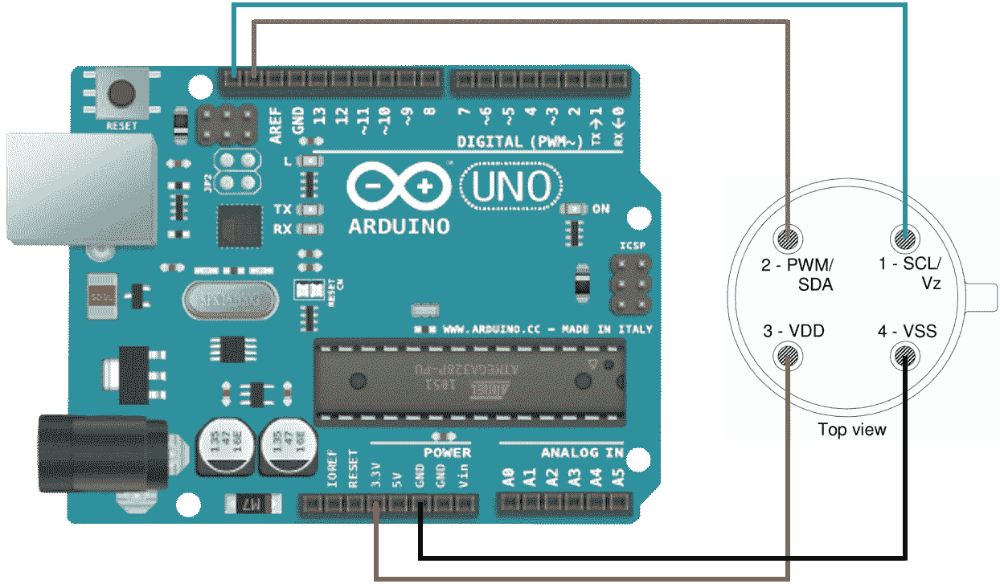
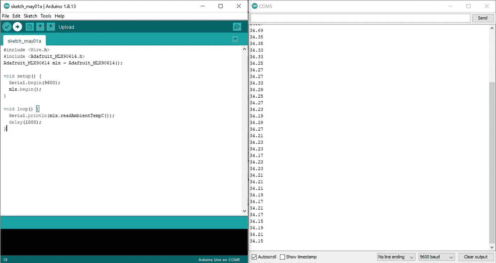
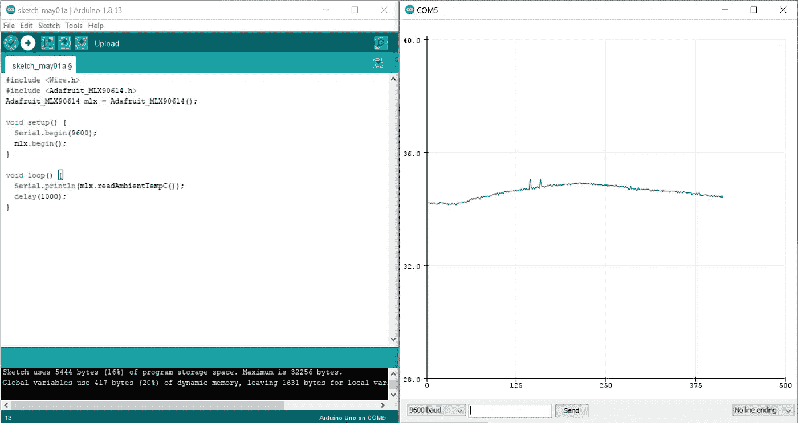
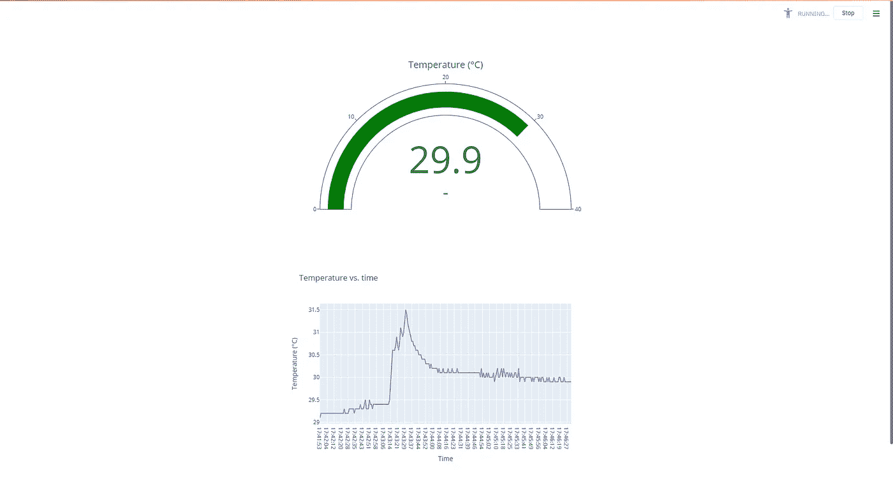

# 如何使用 Python 和 Arduino 构建实时 SCADA 系统

> 原文：<https://towardsdatascience.com/how-to-build-a-real-time-scada-system-using-python-and-arduino-7b3acaf86d39?source=collection_archive---------8----------------------->

## 创建记录和可视化真实世界数据的管道



SCADA 仪表板-作者可视。

## 介绍

我们这些曾经使用过 SCADA(监控和数据采集)系统的人，比如 OSIsoft 和 Oracle，都知道它们所提供的数据有多么宝贵。特别是对于数据和自然科学行业的许多人来说，SCADA 是按需提供真实世界数据的丰富来源。然而，这种系统并不便宜，普通人也不容易获得它们的服务。幸运的是，有一种方法可以用简单而廉价的设备创建自己的 SCADA 管道，并且很容易获得。在本教程中，我将向您展示如何设置一个环境温度信号，该信号将记录数据，并在您的计算机上显示一个实时仪表板。

## 1.阿尔杜伊诺

首先，我们将使用 Arduino Uno 板从 MLX9061 红外温度计读取温度值。



Arduino &红外温度计线路图——图片由作者提供。

如上所示连接红外温度计后，继续将以下程序上传到 Arduino。

如果您还没有这样做，首先使用 Arduino IDE 的库管理器在工具>管理库中下载并安装 Adafruit_MLX90614 库。

要验证 Arduino 和温度计是否按预期工作，请打开串行监视器(工具>串行监视器)，确保每秒打印一次温度记录，如下所示。



Arduino 串行监视器—图片由作者提供。

或者，您也可以打开 Arduino 的串行绘图仪(“工具”>“串行绘图仪”),查看环境温度的实时曲线图，如下所示。



Arduino 串行绘图仪—图片由作者提供。

## 2.计算机编程语言

既然 Arduino 和红外温度计正在工作并将数值打印到串行端口，我们需要获取 Python 中的读数来生成我们的 SCADA 仪表板。要通过串行 USB 连接将 Python 脚本与 Arduino 接口，我们需要下载并安装 Pyserial。继续启动 Anaconda 或您选择的任何其他 Python IDE，并键入以下命令:

```
pip install pyserial
```

为了生成一个可以与我们的仪表板交互的图形用户界面，我们将使用 [Streamlit](https://www.streamlit.io/) 。这个高度通用的 web 框架允许您快速开发应用程序并将其部署到 web 服务器上，或者在您的浏览器上本地运行它们。为了显示当前温度读数以及所有先前温度记录的图表，我们将使用[按钮](https://plotly.com/python/)。这是 JavaScript 的高度交互式数据可视化框架的 Python 绑定，允许您在指尖渲染令人眼花缭乱的视觉效果。

继续将以下源代码保存在本地目录中:

上述代码将启动到 Arduino 的连接，然后将按照指定的迭代次数从串行端口连续读取值。它将不断呈现和更新仪表和图表。最后，在循环完成后，端口将被关闭，一个包含所有记录的 CSV 文件将保存在您的本地目录中。

要运行上述脚本，请在 Anaconda 提示符下键入以下命令:

```
cd C:/Users/.../local_directory
streamlit run temperature_dashboard.py
```

这就是你在本地浏览器上运行的自己的实时 SCADA 仪表板。



SCADA 仪表板-作者图片。

## 提高

现在，您已经创建了一个具有实时数据可视化功能的 SCADA 系统，您可以通过使用 Arduino Uno WIFI 来进一步增强该系统，从而扩展您的信号范围。更多信息请参考 Arduino Uno WIFI 的配置[指南](https://www.arduino.cc/en/Guide/ArduinoUnoWiFi)。此外，您可以将各种不同的第三方传感器甚至致动器连接到同一个 Arduino，以增强监督和控制。

如果您想了解更多关于数据可视化和 Python 的知识，请随时查看以下(附属链接)课程:

## 使用 Streamlit 开发 Web 应用程序:

[](https://www.amazon.com/Web-Application-Development-Streamlit-Applications/dp/1484281101?&linkCode=ll1&tag=mkhorasani09-20&linkId=a0cb2bc17df598006fd9029c58792a6b&language=en_US&ref_=as_li_ss_tl) [## 使用 Streamlit 开发 Web 应用程序:开发和部署安全且可伸缩的 Web 应用程序…

### 使用 Streamlit 开发 Web 应用程序:使用……开发安全且可扩展的 Web 应用程序并将其部署到云中

www.amazon.com](https://www.amazon.com/Web-Application-Development-Streamlit-Applications/dp/1484281101?&linkCode=ll1&tag=mkhorasani09-20&linkId=a0cb2bc17df598006fd9029c58792a6b&language=en_US&ref_=as_li_ss_tl) 

## 使用 Python 实现数据可视化:

[](https://www.coursera.org/learn/python-for-data-visualization?irclickid=xgMQ4KWb%3AxyIWO7Uo7Vva0OcUkGQgW2aEwvr1c0&irgwc=1&utm_medium=partners&utm_source=impact&utm_campaign=3308031&utm_content=b2c) [## 用 Python 实现数据可视化

### “一图胜千言”。我们都熟悉这个表达。它尤其适用于试图…

www.coursera.org](https://www.coursera.org/learn/python-for-data-visualization?irclickid=xgMQ4KWb%3AxyIWO7Uo7Vva0OcUkGQgW2aEwvr1c0&irgwc=1&utm_medium=partners&utm_source=impact&utm_campaign=3308031&utm_content=b2c) 

## 面向所有人的 Python 专业化:

[](https://www.coursera.org/specializations/python?irclickid=xgMQ4KWb%3AxyIWO7Uo7Vva0OcUkGQgW16Ewvr1c0&irgwc=1&utm_medium=partners&utm_source=impact&utm_campaign=3308031&utm_content=b2c) [## 面向所有人的 Python

### 学习用 Python 编程和分析数据。开发收集、清理、分析和可视化数据的程序…

www.coursera.org](https://www.coursera.org/specializations/python?irclickid=xgMQ4KWb%3AxyIWO7Uo7Vva0OcUkGQgW16Ewvr1c0&irgwc=1&utm_medium=partners&utm_source=impact&utm_campaign=3308031&utm_content=b2c) 

## 物联网专业化编程简介:

[](https://www.coursera.org/specializations/iot?irclickid=xgMQ4KWb%3AxyIWO7Uo7Vva0OcUkGQgQzrEwvr1c0&irgwc=1&utm_medium=partners&utm_source=impact&utm_campaign=3308031&utm_content=b2c) [## 物联网编程介绍(IOT)

### 创建自己的物联网(IoT)设备。只需六门课程，即可设计并创建一个简单的物联网设备。设计…

www.coursera.org](https://www.coursera.org/specializations/iot?irclickid=xgMQ4KWb%3AxyIWO7Uo7Vva0OcUkGQgQzrEwvr1c0&irgwc=1&utm_medium=partners&utm_source=impact&utm_campaign=3308031&utm_content=b2c) 

## GitHub 资源库:

[](https://github.com/mkhorasani/arduino_python_scada_system) [## mkhorasani/arduino _ python _ SCADA _ system

### 如何使用 Python 和 Arduino 构建实时 SCADA 系统

github.com](https://github.com/mkhorasani/arduino_python_scada_system) 

# 新到中？您可以在此订阅并解锁无限文章[。](https://khorasani.medium.com/membership)