# 如何免费建立一个简单的作品集网站

> 原文：<https://towardsdatascience.com/how-to-build-a-simple-portfolio-website-for-free-f49327675fd9?source=collection_archive---------11----------------------->

由 [envato elements](https://1.envato.market/c/2346717/628379/4662) 的 [alexacrib](https://elements.envato.com/user/alexacrib) 使用图像创建(经许可)。

## [数据科学](https://medium.com/tag/data-science) | [机器学习](https://medium.com/tag/machine-learning)

## 在不到 10 分钟的时间内从头开始一步一步的教程

在这篇文章中，你将学习如何免费建立一个作品集网站来展示你的项目，无论是数据科学、软件开发还是网页开发。投资组合网站的一些好处有助于潜在雇主看到你经验的广度和深度，如果你来自一个非常规的背景(比如自学成才的专业人士等)，这可能会特别有帮助。).

我们今天将要建立的作品集网站将会在 GitHub 页面上免费托管。我会假设你有很少或没有 HTML 的经验。但是如果你有以前的经验，这个教程应该花费你更少的时间来完成。

我们这里有很多内容要讲，不再多说，让我们开始吧！

还可以看看 YouTube 上的同名视频( [*如何免费建立一个简单的作品集网站*](https://www.youtube.com/watch?v=6NXLGP65S2Q) )，你可以在阅读这篇博文的同时观看。

# 1.注册一个 GitHub 帐户

由于我们要在 GitHub 页面上托管网站，一个先决条件是要有一个 [GitHub](https://github.com) 帐户。所以如果你还没有，那就去注册一个吧。

前往 GitHub 网站注册。(右上方链接)。

# 2.创建新的存储库

因此，我们现在将创建一个新的存储库，作为您的新投资组合网站的主页。网站的内容(即文本、图像和您希望在网站上显示的任何其他文件)将包含在此存储库中。显示在您网站上的文本将存储在一个 Markdown 文件(`.md`文件)中，而不是 HTML 网页，我们将在接下来的几分钟内处理这个文件。

登录你的 GitHub 账户，点击顶部导航栏最右边的`+`按钮，下拉菜单中的`New repository`按钮，启动一个新的资源库，如下图所示。

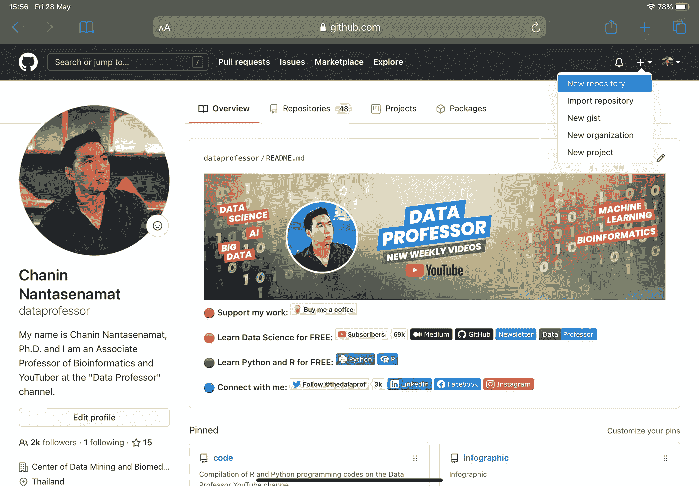

**点击右上角的+号，启动一个新的存储库。**

在此页面上，输入新存储库的名称。在本例中，我们将输入`Portfolio`，但是您也可以使用任何其他名称，例如您的全名(但是请确保使用下划线或破折号，而不是空格，例如`John_Doe`或`John-Doe`)。

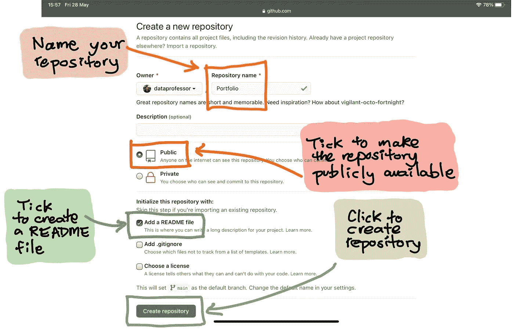

**输入新存储库的名称。**

为了允许网站公开，我们勾选了`Public`选项。

这里需要注意的是，我们已经勾选了一个框，这样一个`README.md`文件将会随着存储库的创建而自动创建。正是这个文件，网站内容将被放置在里面。

最后，点击`Create repository`按钮来创建存储库。

下面的屏幕截图将显示您的新存储库的主页。注意这里`README.md`的内容是空的。

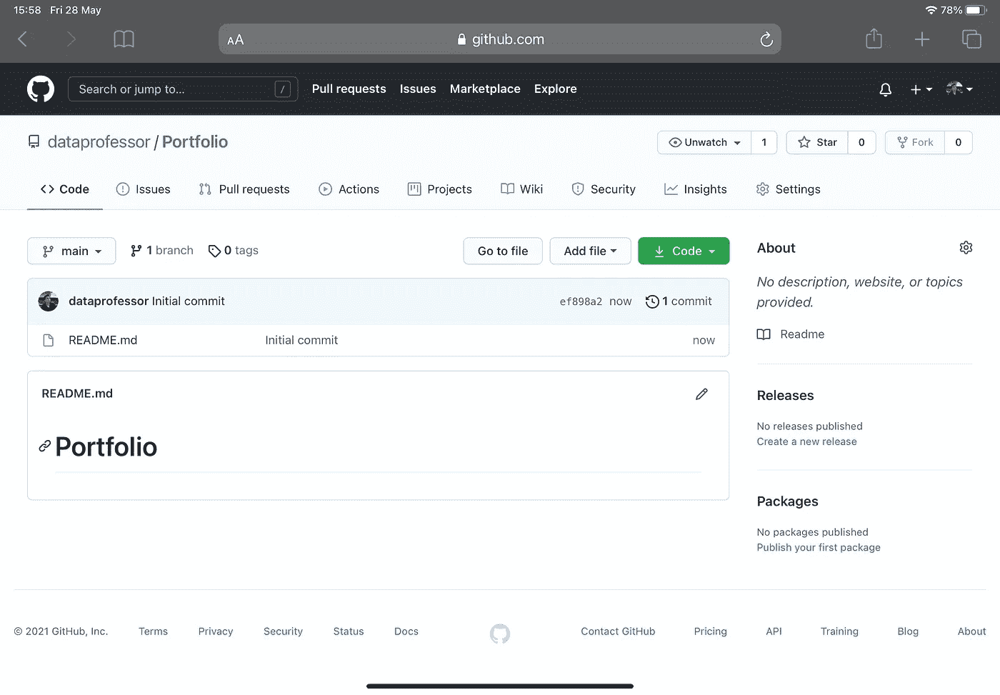

# 2.为存储库设置 GitHub 页面

默认情况下，存储库还不是一个网站，所以我们必须为它激活 GitHub 页面。为此，点击选项卡最右侧的`Settings`按钮(如 1 所示。下图中的黄色方框)。

接下来，您要点击左侧面板上的`Pages`按钮(如 2 所示。下图中的红框)，这将重新加载页面。

要实际激活 GitHub 页面，请单击位于`GitHub Pages`部分的`Source`子标题下的`None`下拉按钮(如下图 3.1 绿色框所示)，这将显示`main`分支，一旦显示，请单击它(如下图 3.2 绿色框所示)。

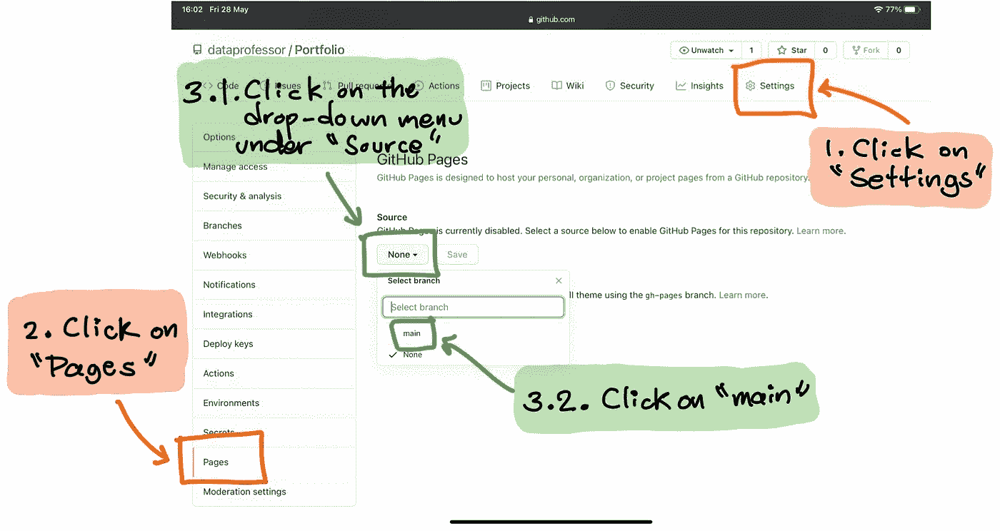

**为新创建的存储库激活 GitHub 页面。**

既然 GitHub Pages 已激活，您应该能够看到您的作品集网站的 URL，如下图中黄色高亮框所示。

在这个例子中，正在创建的 URL 在`https://dataprofessor.github.io/Portfolio`处可用，其中`dataprofessor`是我的 GitHub 用户名，`Portfolio`是存储库名称。记下这个 URL 并保存在手边，因为我们将在应用网站主题后访问它。

还要注意`Branch`现在被设置为`main`，如下图红框所示。

现在，我们将为我们的网站选择一个主题。点击`Theme Chooser`副标题下的`Choose a theme`按钮。

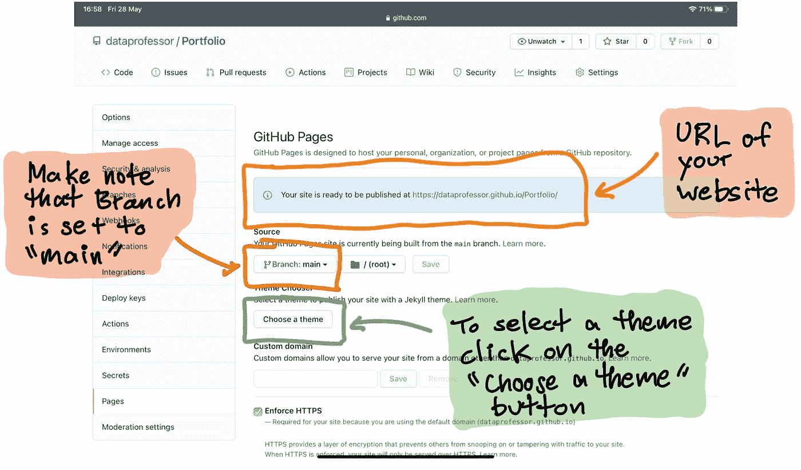

**GitHub Pages 现已激活，并显示其 URL。**(以黄色高亮框显示)

正如你将在下面的截图中看到的，有几个主题供你选择。在本例中，我们将选择`Cayman`主题并点击`Select theme`按钮。

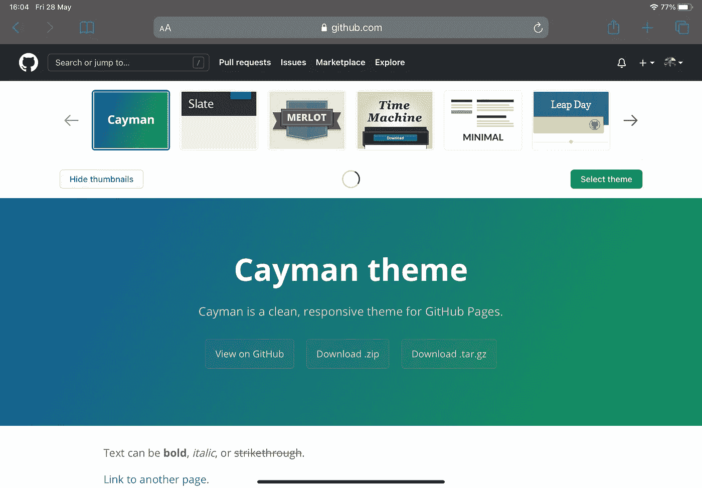

**为作品集网站选择主题。**

为了让你开始你的新网站的布局，你会看到`README.md`文件现在填充了示例文本。

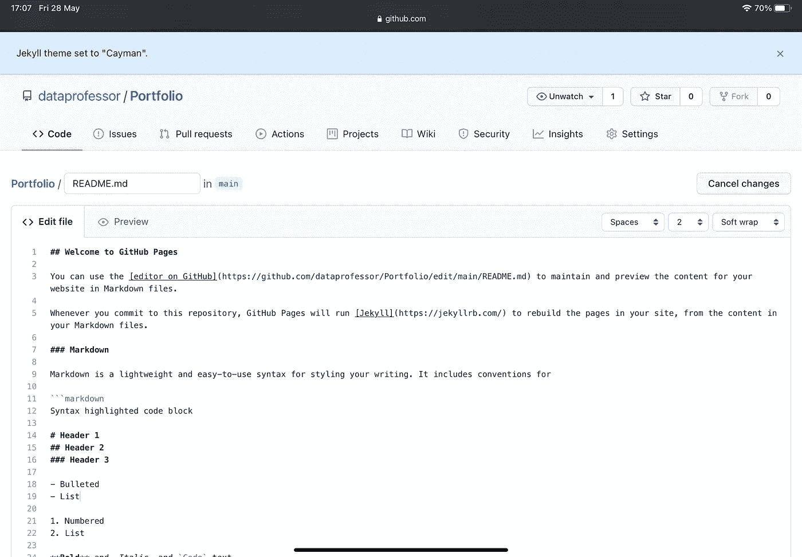

向下滚动到页面底部，点击`Commmit changes`按钮继续。

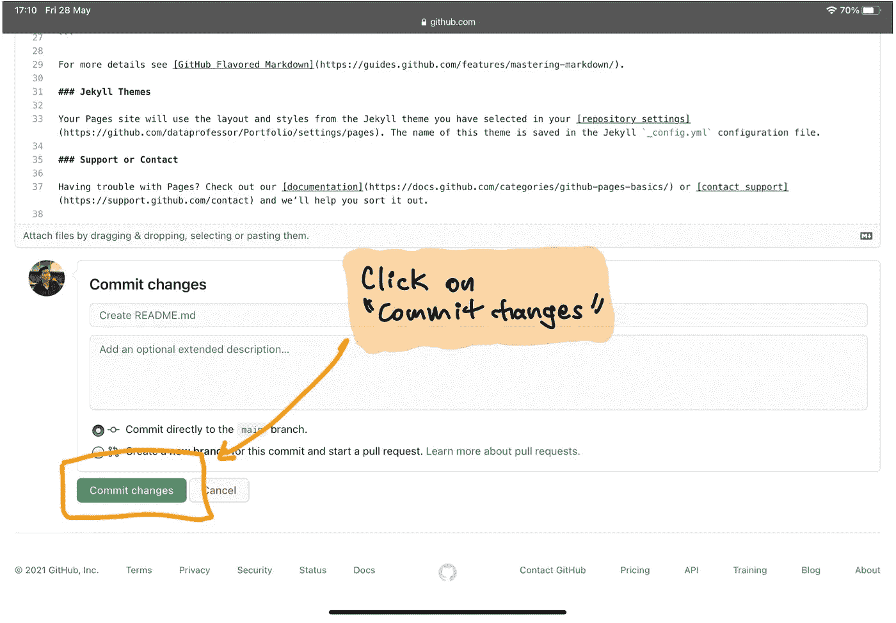

现在，通过粘贴我们之前记下的 URL 来访问我们的网站，在本例中是`https://dataprofessor.github.io/Portfolio`。

下面的屏幕截图显示了我们的网站，在选择主题后，示例内容已经自动填充了`README.md`文件。

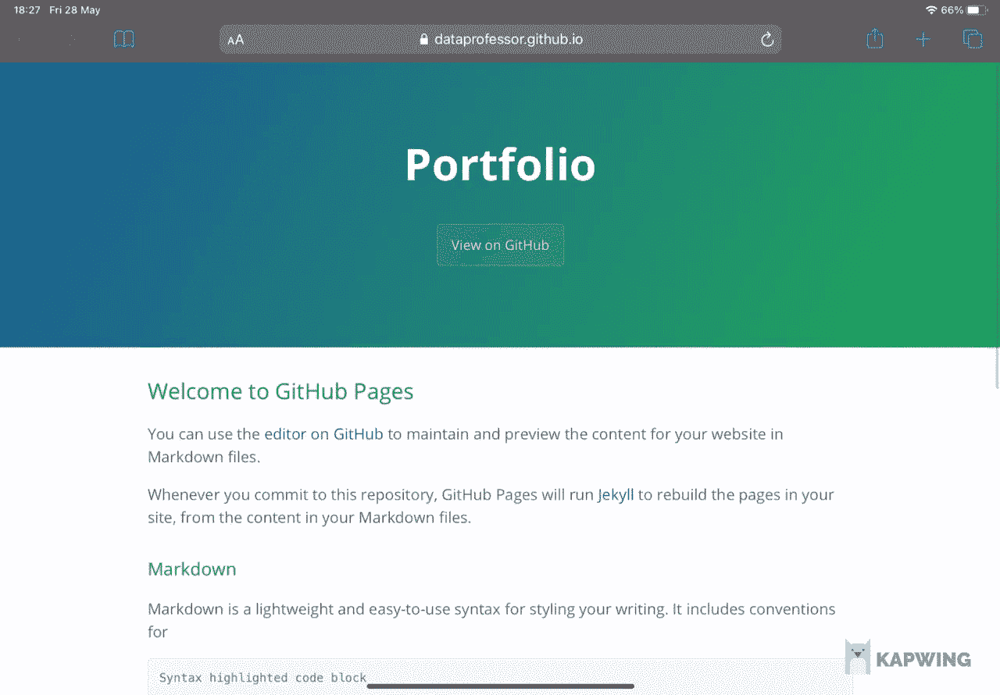

**带有示例内容的网站截图。**

# 3.将我们的信息添加到网站

现在，让我们继续将我们自己的个人资料添加到网站中。

正如我前面提到的，网站的内容包含在`README.md`文件中，我们在上面也看到了选择 Cayman 主题的示例内容。

在下面的代码框中，我为您提供了一个假设的概要信息，您可以将其用作模板。

让我们将下面的内容复制并粘贴到`README.md`文件中。要保存文件，向下滚动并点击`Commit changes`按钮。

上面代码框的内容是用 Markdown 写的，这是另一篇博文的主题。关于制作网站时可以参考的[减价清单](https://github.com/adam-p/markdown-here/wiki/Markdown-Cheatsheet)，我强烈推荐来自 [*亚当-p*](https://github.com/adam-p/markdown-here/wiki/Markdown-Cheatsheet) 的清单。

现在，再次刷新投资组合网站以查看新添加的个人资料信息。

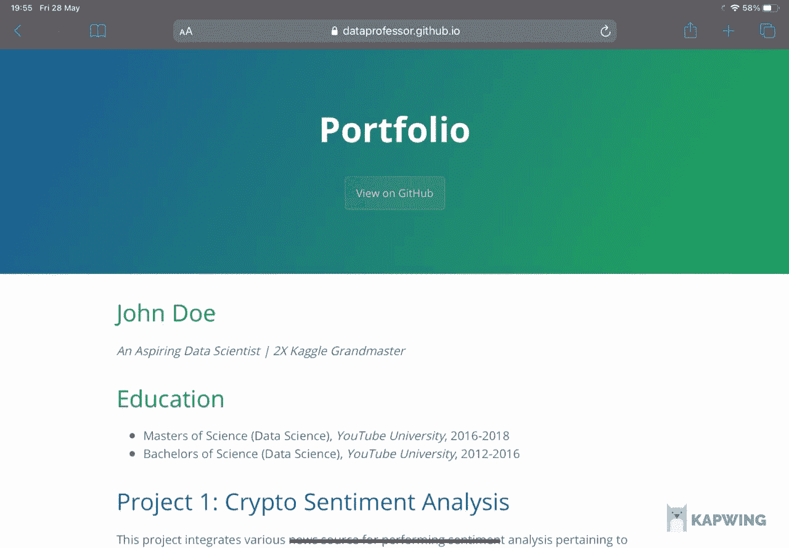

一个假想的有抱负的数据科学家 John Doe 的投资组合网站。

# 4.向网站添加图像

一张图片胜过千言万语，让我们用一些图片来增加网站的趣味吧。对于这个例子，我们将使用来自 ***Unsplash*** 的照片，它提供了大量的库存照片，您可以免费使用。

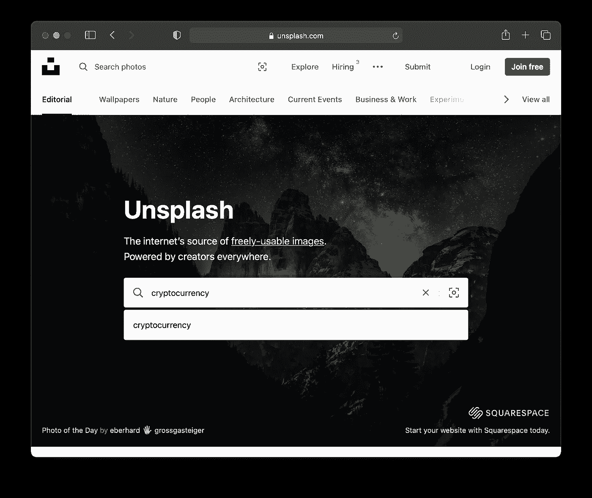

**在我们的网站上搜索图片。**

## 4.1.为项目 1 寻找图像

让我们搜索图片，用于我们假想的有抱负的数据科学家 John Doe 的作品集网站。从网站上可以看到，无名氏的**项目 1** 属于 ***加密货币*** 。因此，我们会找到一些相关的图像。

以下是关于加密货币图片的搜索结果。

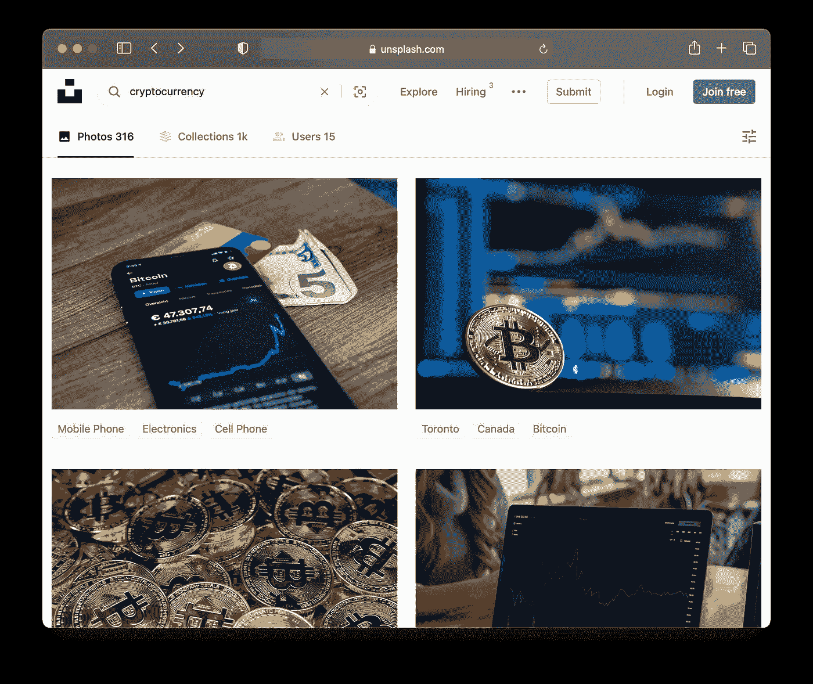

右上角的图像看起来很适合**项目 1** ，所以让我们使用它。所以你可以继续点击它。出现如下所示的弹出窗口，然后点击`Download free`按钮的向下箭头触发下拉菜单。这里，我们将采用`Small (640x427)`分辨率。

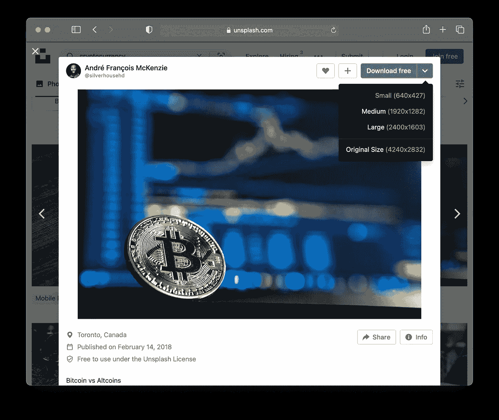

**来自 Unsplash 的图像，我们将用于项目 1。**照片由[andréFran ois McKenzie](https://unsplash.com/@silverhousehd?utm_source=unsplash&utm_medium=referral&utm_content=creditCopyText)在 [Unsplash](https://unsplash.com/s/photos/cryptocurrency?utm_source=unsplash&utm_medium=referral&utm_content=creditCopyText) 上拍摄。

下载图像后，底部会出现一个弹出窗口，为您提供属性文本和链接。你只需点击下图所示的`Copy to clipboard`图标。我们会将此粘贴到`README.md`文件中，以便此类信息包含在投资组合网站中。

**从 Unsplash 下载图像时出现的属性弹出窗口截图。**

## 4.2.为项目 2 寻找图像

由于 John Doe 的项目 2 (参见包含来自`README.md`文件的内容的代码框)是关于建立一个加密货币交易机器人，那么我们将使用下面的图像。

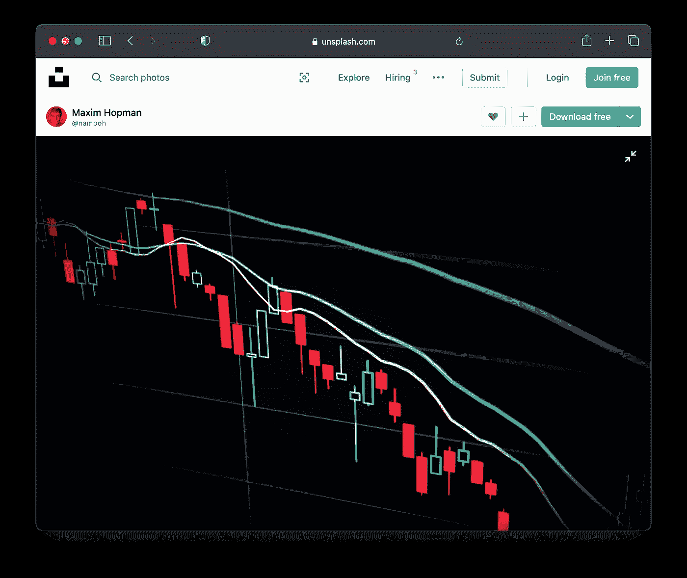

来自 Unsplash 的图像，我们将用于项目 2。马克西姆·霍普曼在 [Unsplash](https://unsplash.com/?utm_source=unsplash&utm_medium=referral&utm_content=creditCopyText) 上的照片。

## 4.3.上传图片到 GitHub 库

一旦图片下载到你的电脑，现在让我们把它上传到我们的 GitHub 库。

为此，点击`Add file`按钮，弹出一个下拉菜单。点击`Upload files`链接。

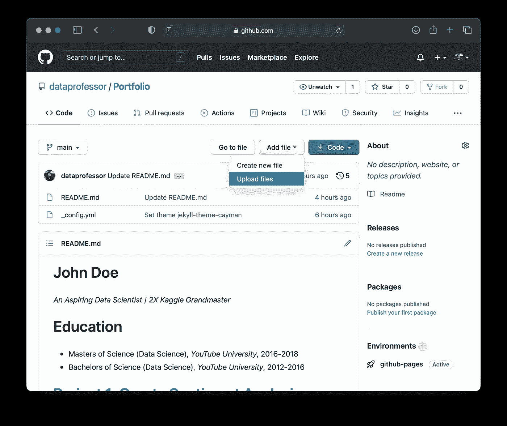

**点击“添加文件”按钮时“上传文件”链接的屏幕截图。**

可以通过两种方式上传文件:(1)直接将文件拖放到上传框中，或者(2)点击上传框中的`choose your files`链接。然后，点击页面底部的`Commit changes`按钮。

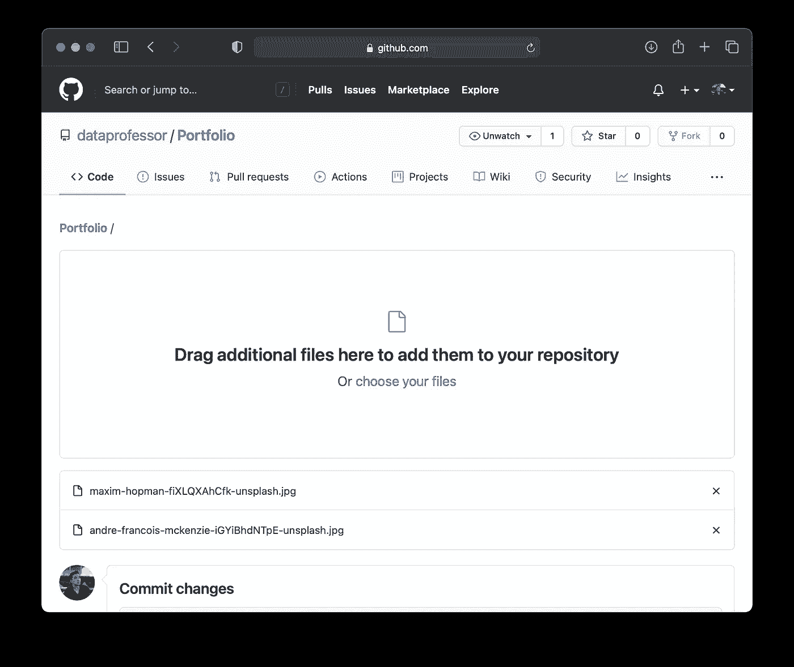

**通过直接拖放到上传框或点击“选择您的文件”链接来上传文件。**(这将弹出一个窗口，允许我们选择要上传的文件)。

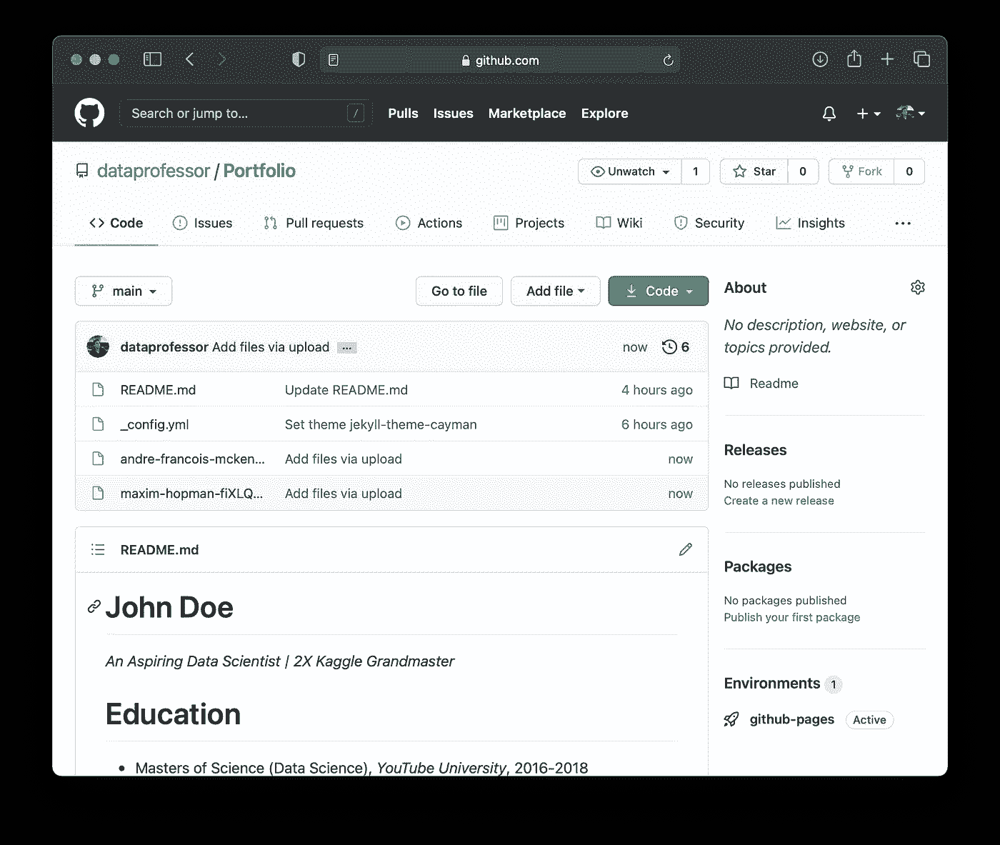

**GitHub 作品集截图。**这里我们可以看到有 4 个文件，由 2 个上传的图片组成，README.md 文件和 _config.yml 文件(主题选择后自动生成)。

## 4.4.给网站中的图像添加属性

在使用 Unsplash 的免费图片时，提供图片的引用也是一个很好的做法。为了您的方便，当您从 Unsplash 下载图像时，出现的弹出窗口会让您选择获取属性文本和链接(如第 4.1 节的最后一幅图像所示)，您要将它们复制并粘贴到`README.md`文件中。

对于**项目 1** 和**项目 2** ，以下两个属性代码块分别如下:

为了通过 Markdown 语法将图像添加到网站，我们将分别对**项目 1** 和**项目 2** 使用以下代码行:

让我们将上述 4 个代码块添加到`README.md`文件中**项目 1** 和**项目 2** 的标题下，我们将得到以下代码:

# 5.完整的作品集网站

恭喜你！现在，您已经在不到 10 分钟的时间内完成了作品集网站的创建！

**范例作品集网站:**[https://dataprofessor.github.io/Portfolio/](https://dataprofessor.github.io/Portfolio/)

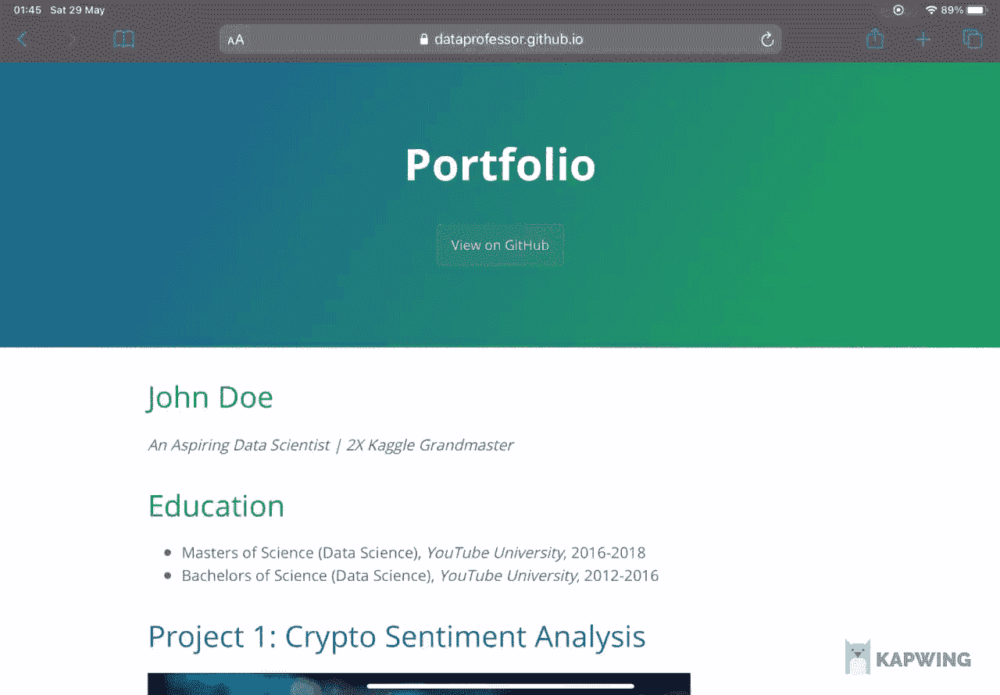

现在，您可以与全世界分享您的作品集网站(例如，在您的 LinkedIn、Twitter、名片等个人资料中包含 URL)。)!随着项目列表的增长，记得维护并定期更新网站。

请随意与我分享您的投资组合网站的链接。

## 订阅我的邮件列表，获取我在数据科学方面的最佳更新(偶尔还有免费赠品)!

# 关于我

我是泰国一所研究型大学的生物信息学副教授和数据挖掘和生物医学信息学负责人。在我下班后的时间里，我是一名 YouTuber(又名[数据教授](http://bit.ly/dataprofessor/))制作关于数据科学的在线视频。在我制作的所有教程视频中，我也在 GitHub 上分享 Jupyter 笔记本([数据教授 GitHub page](https://github.com/dataprofessor/) )。

 [## 数据教授

### 数据科学、机器学习、生物信息学、研究和教学是我的激情所在。数据教授 YouTube…

www.youtube.com](https://www.youtube.com/dataprofessor) 

# 在社交网络上与我联系

✅YouTube:[http://youtube.com/dataprofessor/](http://youtube.com/dataprofessor/)
♇网站:[http://dataprofessor.org/](https://www.youtube.com/redirect?redir_token=w4MajL6v6Oi_kOAZNbMprRRJrvJ8MTU5MjI5NjQzN0AxNTkyMjEwMDM3&q=http%3A%2F%2Fdataprofessor.org%2F&event=video_description&v=ZZ4B0QUHuNc)(在建)
♇LinkedIn:[https://www.linkedin.com/company/dataprofessor/](https://www.linkedin.com/company/dataprofessor/)
♇Twitter:[https://twitter.com/thedataprof](https://twitter.com/thedataprof)
♇Facebook:[http://facebook.com/dataprofessor/](https://www.youtube.com/redirect?redir_token=w4MajL6v6Oi_kOAZNbMprRRJrvJ8MTU5MjI5NjQzN0AxNTkyMjEwMDM3&q=http%3A%2F%2Ffacebook.com%2Fdataprofessor%2F&event=video_description&v=ZZ4B0QUHuNc)
♇github:[https://github.com/dataprofessor/](https://github.com/dataprofessor/)
♇insta gram:【t2t