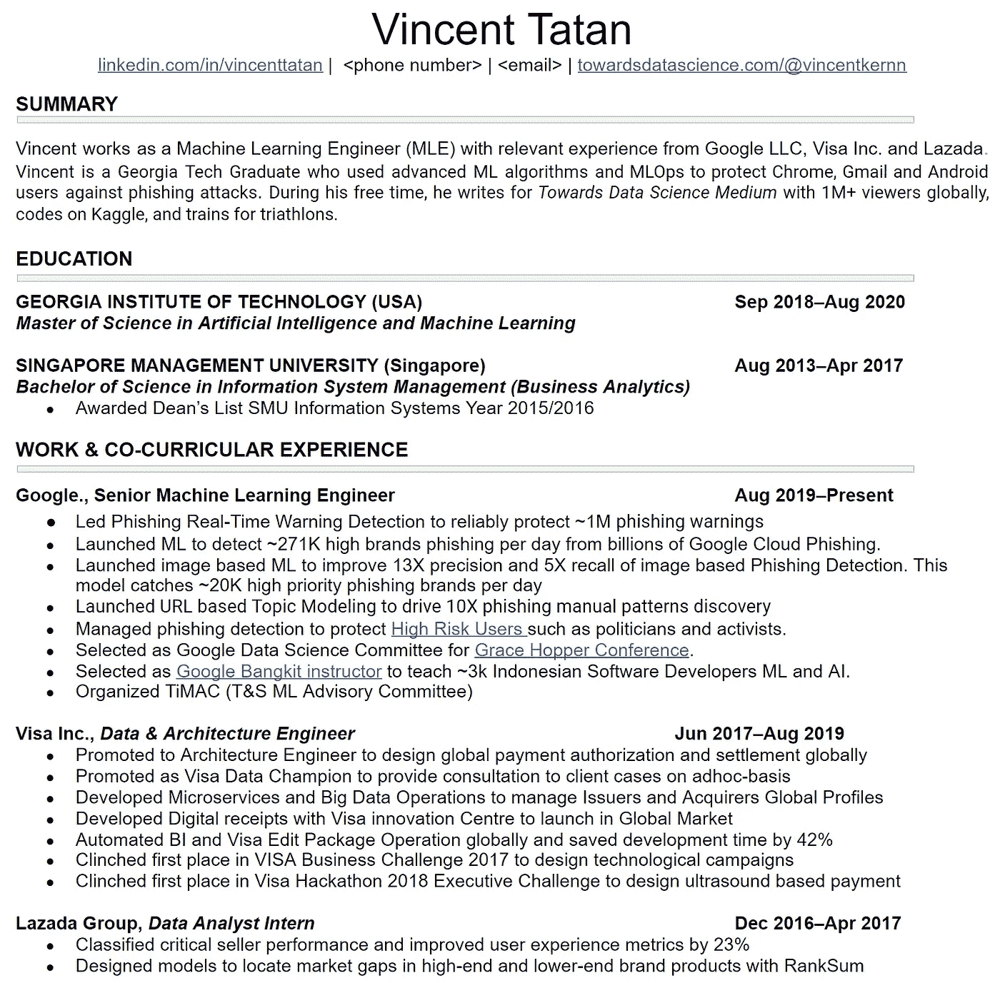

# 如何打造一份扎实的数据科技简历

> 原文：<https://towardsdatascience.com/how-to-build-a-solid-data-science-and-tech-resume-e899daceb271?source=collection_archive---------6----------------------->

## 给我的数据科学和技术学弟学妹们的建议

## 建议从谷歌和 Visa 等公司获得大的 DS-Tech 报价

来源( [unsplash](https://unsplash.com/photos/s9CC2SKySJM) )

# 问题陈述

> 我如何建立我的简历？
> 
> DS-Tech 工作需要哪些简历？

在这里，我想分享我的简历，它让我被谷歌录取。我也和内部和外部的招聘人员谈过，希望这个建议能帮助你建立一份出色的简历，在一家大公司找到工作。

# 什么是简历？

简历类似于 pokedex。在虚拟的口袋妖怪世界中，小智每次想抓一只口袋妖怪时都会使用 pokedex。pokedex 是一个快速的描述，总结了一种口袋妖怪和关键的属性/个性。

然后 Ash 会利用这些信息迅速决定他是否要捕捉口袋妖怪。这些信息需要很好地总结，以便快速做出决定，否则口袋妖怪会先攻击或逃跑。

同样，你的招聘人员和招聘经理需要决定你是否非常适合这家公司，并决定他们是否愿意花他们的资源来雇佣你。再慢一点，其他招聘人员可能会先联系你。

> 你是招聘者的 KPI
> 
> 所以现在的问题是:
> 
> 你如何最大限度地让招聘者注意到你？

资料来源(热图生成器)

# 台阶

根据我的经验，制作一份有吸引力的简历有 5 个步骤。

1.  **了解你的受众**:了解你申请的职位，让你的简历能够解决招聘经理的问题。
2.  **创建一个摘要:**创建一个 TL:DR 来引导招聘人员了解关于你的重要片段。
3.  讲述故事:创造一个清晰的故事来表明你产生影响的经历。这里可以用[星](https://www.zipjob.com/blog/star-method-resume/)的一般指引。
4.  **证明影响的事实:**保持简单甜蜜(接吻)。写清楚历史相关的故事。
5.  **格式化简历**:校对并确保简历清晰。

在更详细地剖析这些观点之前，我想和你分享一下我最近的一页简历。

我的一页简历(来源于作者)

# 了解你的受众

我们写作是为了让别人阅读并感兴趣。在大多数情况下，我们需要在制作一份有吸引力的简历之前了解招聘人员需要什么

以下是我们想从总体上考虑招聘人员的一些事实:

*   招聘人员很忙。他们为一个空缺职位筛选数百份简历。
*   招聘人员想要雇用你。他们有动力雇用你作为他们的关键绩效指标(KPI)。
*   **招聘人员关注文化/工作契合度**:他们需要确保他们有适合公司/工作描述(JD)的优质候选人

**考虑到这一点，你的策略应该是:**

*   用简单明了的方式压缩你的简历，以赢得招聘者的尊重。
*   **包括让你脱颖而出的艺术品/作品集/故事**。例如，如果 Desc (JD)的工作重点是数据挖掘，那么就提到你最近的大规模提取-转换-加载(ETL)管道项目。
*   **理解关键词(例如:数据挖掘、编程语言等)**招聘人员正在寻找并以有意义的方式放置它们。大多数招聘人员会先浏览，然后阅读其中的一小部分。。

# 创建摘要

> 尊重招聘人员的时间

你的总结应该浓缩成简单的 3-4 句话，概括你是谁以及你如何为公司增加价值。

**就我个人而言，我会将它分成多个部分:**

*   ***【目前工作经历】*** *Vincent 担任机器学习工程师(MLE)，拥有 Google LLC、Visa Inc .和 Lazada 的相关工作经验。*
*   ***【教育】*** *文森特是佐治亚理工学院的毕业生*
*   ***【当前重要任务/关键词】*** *谁使用了先进的 ML 算法和 MLOps 来保护 Chrome、Gmail 和 Android 用户免受钓鱼攻击。*
*   ***【微分器】*** *在空闲时间，他为在全球拥有 100 多万观众的数据科学媒体撰写文章，在 Kaggle 上编写代码，并为铁人三项训练。*

显然，摘要应该与你的身份和公司的需求紧密相关。例如，如果你的工作需要具备这种技能的候选人，你可能希望专注于你的 Android 应用程序开发的总结。

# 讲故事

记住你是在为你的读者写作。

## 重点关注:

1.  创造引人注目的故事，展示你如何为公司做出贡献。
2.  证明你能解决问题，并把价值带到桌面上。这是[每一次数据面试](/ace-your-data-analytics-interviews-ef114606c5d7)都在寻找的。

通过遵循这三条建议，你将会讲述一个引人注目的故事来吸引招聘者的目光。

*   ***【而不是】*** *通过这个项目/认证，我学会了利用深度学习进行物体检测。*
*   ***【考虑】*** *通过这个项目，我使用具有深度学习的对象检测来捕捉 50%以上的滥用，这节省了 500 万美元*

## 但是我没有一个令人信服的故事…

最终要脱颖而出，你需要准备一个伟大的投资组合，创造引人注目的故事。我在下面的文章中谈了更多的细节。

</how-to-build-your-ultimate-data-science-portfolios-ea0414d79a72>  

# 证明影响的事实

用你的事实简明扼要地突出技能。

这意味着用数字来表示你对以前公司的影响。

最终，你的数据驱动力越强，你的故事就越真实，招聘人员就越有可能抓住你。

*   我已经从检测滥用广告中节省了很多钱
*   我已经从检测辱骂性广告中节省了 500 万美元

# 格式化你的简历

招聘人员有偏见。所以他们可能会因为你简历内容之外的因素而拒绝你。

例如，招聘人员可能会根据你简历的整洁程度来判断你的文化契合度。他/她可能会根据他/她读到的东西来推测你的个性。

我听说过一个我认为非常符合职位描述的可靠候选人被拒绝，因为他们没有标准化句号(。)在他们的简历上签名。

如果你面临类似的拒绝，那将是一种耻辱。

**因此，请确保:**

*   **创建易于阅读的格式**。它又短又干净。
*   **使用标题线**突出关键信息。
*   **校对**是否有错字

# 常见问题

## LinkedIn 怎么样？

对我来说，LinkedIn 招聘人员的目标是“一般”的潜在候选人，而不是简历中的“特定”候选人。

在 LinkedIn，招聘人员会采取积极的方式进行猎头，而在简历中，申请人会采取积极的方式进入面试。

创建一个稳固的 LinkedIn 可以为你的职业生涯创造巨大的优势。比如从 LinkedIn，可以被 Google 猎头。

我的谷歌招聘人员在 LinkedIn 搜索引擎上插入“数据挖掘”一词后，发现我在顶部的个人资料中。

因此，对 LinkedIn 的一个一般建议是遵循这个 [SEO 指南](https://searchengineland.com/seo-guide-to-optimizing-your-linkedin-profile-for-more-connections-better-leads-315882)，放置与你的关键优势相关的故事/关键词，让 LinkedIn 搜索引擎做剩下的工作。

## 最佳简历长度是多少？

一般来说，如果你不申请研究，你的招聘人员应该对你的简历的 1-2 页感到满意。

就我个人而言，我建议用一页纸来确保你能抓住最重要的影响，而不是包括表面的细节。你的简历越短，你给吹毛求疵的招聘人员带来的错误就越少。

## 好的，下一步是什么？

在你完成一份出色的简历后，你可能想:

*   构建终极数据科学组合。

</how-to-build-your-ultimate-data-science-portfolios-ea0414d79a72>  

*   赢得你的数据面试。

</ace-your-data-analytics-interviews-ef114606c5d7>  

我真诚地希望这些技术能帮助你在数据科学/技术领域发展事业。

# 结论

希望一旦你读了这篇文章，你就知道如何写简历了。如果你有进一步的想法，请在评论中告诉我。

1.  了解你的受众:了解你申请的职位，让你的简历能够解决招聘经理的问题。
2.  **创建一个摘要:**创建一个 TL:DR 来引导招聘人员了解关于你的重要信息。
3.  **讲故事**:创造一个清晰的故事来表明你产生影响的经历。这里可以使用[星](https://www.zipjob.com/blog/star-method-resume/)的一般引导。
4.  **证明影响的事实:**保持简单甜蜜(接吻)。写清楚历史相关的故事。
5.  **格式化简历**:校对并确保简历清晰。

# 关于作者

文森特用 ML @ Google 对抗网络滥用。文森特使用高级数据分析、机器学习和软件工程来保护 Chrome 和 Gmail 用户。

除了在谷歌的工作，文森特还是[乔治亚理工学院计算机科学硕士校友](/5-biggest-tips-to-juggle-work-and-study-as-data-scientists-7cad143f10a)、三项全能运动员和[面向数据科学媒体的特约作家，该杂志在全球拥有 100 多万观众，为有志于数据科学的人和数据从业者提供指导](https://medium.com/@vincentkernn)。

最后，请通过 [**LinkedIn**](http://www.linkedin.com/in/vincenttatan/?source=post_page---------------------------) **，** [**Medium**](https://medium.com/@vincentkernn?source=post_page---------------------------) **或** [**Youtube 频道**](https://www.youtube.com/user/vincelance1/videos?source=post_page---------------------------) 联系文森特

[索利·德奥·格洛里亚](https://en.wikipedia.org/wiki/Soli_Deo_gloria)