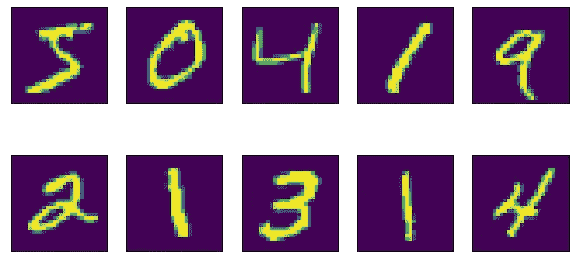
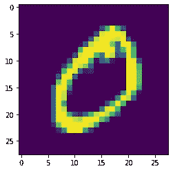
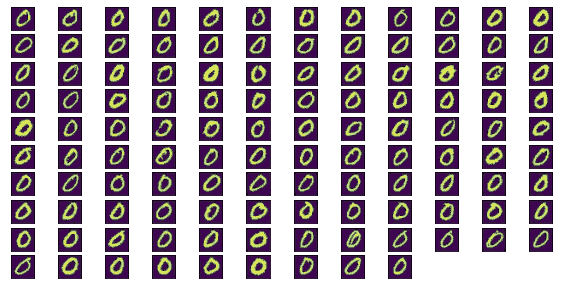

# 如何建立一个超级简单的手写数字识别器

> 原文：<https://towardsdatascience.com/how-to-build-a-super-easy-handwritten-numbers-identifier-463850ab7d68?source=collection_archive---------39----------------------->

## 余弦相似度的初学者友好使用

当你开始机器学习时，有几个众所周知的数据集(例如🥀的虹膜数据集)。其中有一个简单、流行和有趣的图像数据集，即由大量手写数字组成的 MNIST 数据集📝 [1].

在这里，我们将使用一个令人难以置信的简单想法来从这些图像中获取信息:*两个向量之间角度的余弦*。因此，这对 ML 或 DS 领域的新手来说尤其有利😉。你可能熟悉矢量的点积。在这种情况下，你可能知道它可以通过两种方式获得，分量乘积之和，幅度与角度余弦的乘积，*即*。对于三维空间中称为 A 和 B 的两个向量，我们有:

这被扩展到多个(有限)维度，并将所谓的*相似度*定义为角度[2]的余弦:

以这种方式，指向相同方向的两个向量，因此是“相似的”，具有接近 1 的*相似度*，并且当它们更不相似时，它会变得更低值(低至-1)。

到目前为止还不错，但现在让我们转向手写数字图像，以及如何使用这个概念来识别其中哪些数字是相似的。

一些 MNIST 数字。图片作者。

使用 Scikit-learn，可以轻松访问 MNIST 数据集[3]:

这里 *X* 包含了向量形式的每一位的数据信息。每个图像是 28×28 像素的矩阵，因此 *X* 向量有 784 个条目。这些向量就是我们想要比较的。为了尽可能简单起见，我将重点放在与零图像相对应的 *X[1]* 数字上，如下图所示:

对应于 X[1]的数字的绘图。图片作者。

任务是找到类似于*X【1】*的向量，并且假设它们也是零。下面的代码解决了这个问题，假设您已经导入了 numpy:

这里 *j=1* (所以*X【j】*是我们想要的零) *i* 遍历前 5000 个元素。在第 6 行，我们用 *pp* 代表 *X[i]* 和 *X[j]* 之间的点积。然后，在第 9 行，它除以给出角度余弦的向量范数的乘积(*相似度*)。请记住，我们希望这些值接近 1，所以从第 10 行到第 14 行，我们使用高斯函数来过滤接近 1 的值。sigma 的值可以考虑到最大的 sigma 来调整，我们将接受更多可能不太相似的向量。在第 13 行中，有一个条件，只取大于 0.3 的高斯函数的高度值，以确保所有向量对应于与所选向量相似的零。以下是这些值的结果:

检测到的零类似于第一次遇到的零。图片作者。

太神奇了！！它工作得很好，🥂.这里需要注意的是，这些不是所有的零，只是那些与我们选择的第一个更相似的零。但是，肯定有其他书写零的方式，让位于相同数字的不同形状。你可以用其他数字试试，只要这个数字有“好的形状”，就能得到好的结果。我的意思是，有些数字非常特殊，即使是人类也很难识别😅。

我在一个与基因组学相关的黑客马拉松中使用了同样的想法来识别肾脏疾病中表达的基因，并且工作得足够好以至于赢得了一个荣誉提名🔥。作为我的第二次黑客马拉松还不错！因此，除了简单之外，不要低估这项技术。

如果您想使用上面显示的代码，这里有 Colab 笔记本的链接:

 [## 那不勒斯-乌赫/梅迪姆波斯

### 中型笔记本。在 GitHub 上创建一个帐户，为 napoles-uach/MediumPost 开发做出贡献。

github.com](https://github.com/napoles-uach/MediumPost/blob/main/CosineSimilarity.ipynb) 

感谢阅读！！

参考资料:

[https://en.wikipedia.org/wiki/MNIST_database](https://en.wikipedia.org/wiki/MNIST_database)。

[https://en.wikipedia.org/wiki/Cosine_similarity](https://en.wikipedia.org/wiki/Cosine_similarity)。

[https://scikit-learn.org/stable/modules/generated](https://scikit-learn.org/stable/modules/generated/sklearn.datasets.load_digits.html)

[/sk learn . datasets . load _ digits . html](https://scikit-learn.org/stable/modules/generated/sklearn.datasets.load_digits.html)

查看我最近写的其他帖子:

 [## 用 Python 和 Pyvis 制作交互式网络图。

### 制作精美图表的简单方法。

towardsdatascience.com](/making-network-graphs-interactive-with-python-and-pyvis-b754c22c270)  [## 用 Colab 鉴定蛋白质-配体相互作用

### 设置自动停靠 Vina

towardsdatascience.com](/identifying-protein-ligand-interactions-with-colab-2cfd26ed469a)  [## 用于状态新冠肺炎关联分类的图卷积网

### 如何将地图映射到图卷积网络？

towardsdatascience.com](/graph-convolutional-nets-for-classifying-covid-19-incidence-on-states-3a8c20ebac2b)