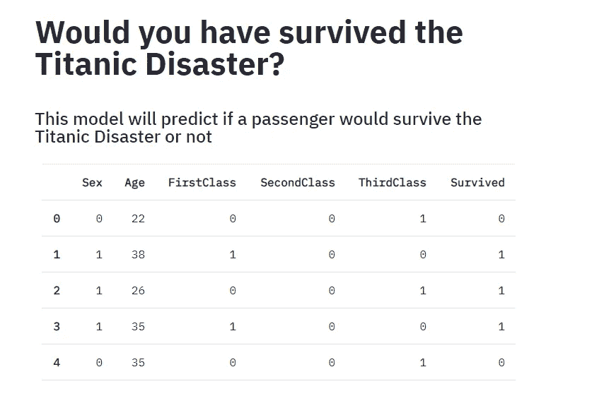
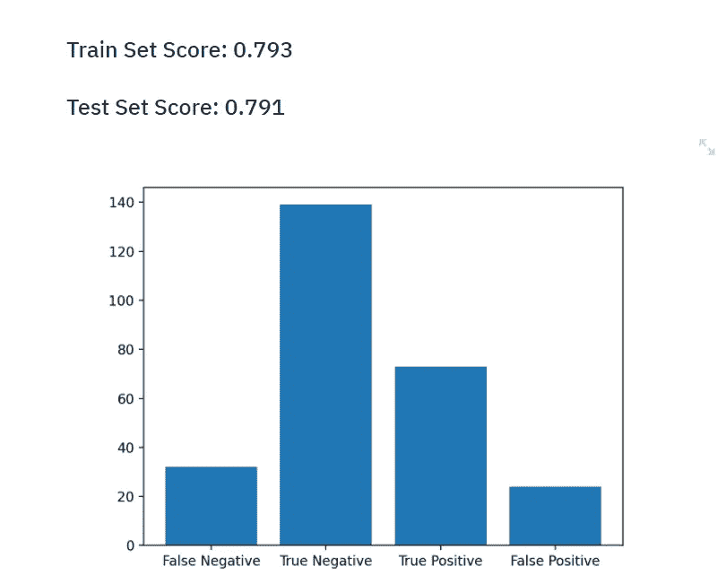
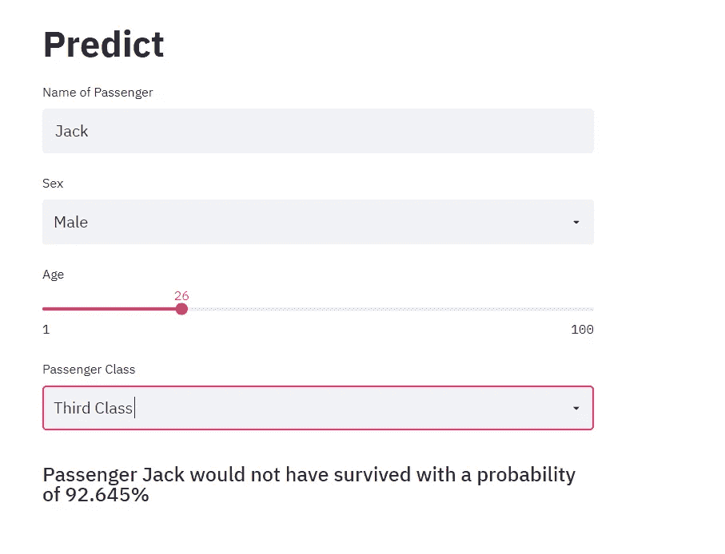

# 如何使用 Streamlit 为 2021 年的模型构建 UI

> 原文：<https://towardsdatascience.com/how-to-build-a-ui-for-your-model-in-2021-using-streamlit-3d1656fce3b8?source=collection_archive---------39----------------------->

## Streamlit 是一个开源的 Python 库，可以为各种目的构建 UI，它不局限于数据应用/机器学习。它简单易学，几行代码就可以创建一个漂亮的 web 应用程序。


查尔斯·德鲁维奥在 [Unsplash](https://unsplash.com/s/photos/ui?utm_source=unsplash&utm_medium=referral&utm_content=creditCopyText) 上拍摄的照片

# 目录

*   先决条件
*   安装所需的库
*   逻辑回归模型
*   简化用户界面
*   结论

# 为什么应该使用 Streamlit？

Streamlit 是一个 Python 库，它帮助我们在没有 HTML/CSS/JS 的情况下为我们的模型开发 ui。大多数模特死在 Jupyter 笔记本里，没有吸引力。但是，使用 Streamlit，您可以为您的模型创建一个干净的 UI，并向其他人展示它。构建 UI 可以让用户以更友好的格式使用您的模型。

*   你不需要处理 HTML/CSS/JSS。
*   它支持降价。
*   它提供了许多预构建的小部件，进一步减少了构建 UI 所花费的时间。
*   构建响应性用户界面。
*   使用 Streamlit 共享轻松部署 Streamlit 应用程序。
*   它是开源的，如果需要，你可以创建自己的小部件。

本教程将建立一个逻辑回归模型来预测一个人是否会在泰坦尼克号灾难中幸存。在构建模型之后，我们将使用 Streamlit 为我们的模型构建一个 web 应用程序和一个 UI。web 应用程序将让用户输入值并获得预测的结果。

# 先决条件

本教程的重点是 Streamlit，所以应该熟悉使用 scikit-learn 构建 ML 模型。

*   很好的理解 Python。
*   对数据清理和标准技术有基本的了解，如数字编码、一键编码。
*   熟悉 scikit-learn 库。
*   熟悉逻辑回归有所帮助，但不是必需的。
*   熟悉熊猫图书馆。
*   对 Matplotlib 库的基本了解。

# 安装所需的库

```
python -m venv venv
venv/Scripts/activate
pip install streamlit,scikit-learn, pandas, matplotlib
```

首先，我们需要创建一个虚拟环境来管理我们的包并安装所需的包:streamlit、scikit-learn、pandas 和 matplotlib。安装完成后，键入以下命令以确保 streamlit 已按预期安装。

```
streamlit hello
```

这将启动一个样例 Streamlit 应用程序。你可以在命令行上按 ctrl+C 来停止应用程序。

# 导入必要的库

我们需要导入所有已安装的库。

```
import streamlit as st
import pandas as pd
from sklearn.linear_model import LogisticRegression
from sklearn.model_selection import train_test_split
from sklearn.preprocessing import StandardScaler
from sklearn.metrics import confusion_matrix
import matplotlib.pyplot as plt
```

# 逻辑回归模型

首先，我们将加载 Titanic 数据集，并操作我们的数据集以满足我们的要求。你可以从 [Kaggle](https://www.kaggle.com/c/titanic/data?select=train.csv) 下载数据集。

# 加载数据帧

我们导入数据集并创建数据帧。

```
train_df = pd.read_csv("train.csv")
print(train_df.head())
```

您可以打印数据帧来检查其中的列。

在逻辑回归模型使用数据之前，我们需要对数据执行以下操作。

*   给特征“性别”分配一个数值
*   对功能“Pclass”使用一键编码
*   填写年龄栏中缺少的值。
*   仅选择所需的功能。

我们将定义一个函数来转换我们的数据，使其可用于我们的逻辑回归模型。

# 操纵数据

```
def manipulate_df(df):
	# Update sex column to numerical
	df['Sex'] = df['Sex'].map(lambda x: 0 if x == 'male' else 1)
	# Fill the nan values in the age column
	df['Age'].fillna(value = df['Age'].mean() , inplace = True)
	# Create a first class column
	df['FirstClass'] = df['Pclass'].map(lambda x: 1 if x == 1 else 0)
	# Create a second class column
	df['SecondClass'] = df['Pclass'].map(lambda x: 1 if x == 2 else 0)
	# Create a second class column
	df['ThirdClass'] = df['Pclass'].map(lambda x: 1 if x == 3 else 0)
	# Select the desired features
	df= df[['Sex' , 'Age' , 'FirstClass', 'SecondClass' ,'ThirdClass' 'Survived']]
	return df
```

*   对于`sex`列，如果乘客是男性，我们设置值为 0，如果乘客是女性，我们设置值为 1。
*   我们使用平均值来填充年龄列中缺失的数据。
*   我们对`Pclass.`使用一次热编码。
*   由于我们不专注于构建模型，我们将只从数据框架中选择 6 个特征。

# 列车测试分离

```
train_df = manipulate_df(train_df)
features= train_df[['Sex' , 'Age' , 'FirstClass', 'SecondClass','ThirdClass']]
survival = train_df['Survived']
X_train , X_test , y_train , y_test = train_test_split(features , survival ,test_size = 0.3)
```

我们将使用 70–30 的比例来分割数据集。

# 缩放要素数据

```
scaler = StandardScaler()
train_features = scaler.fit_transform(X_train)
test_features = scaler.transform(X_test)
```

我们需要对数据进行缩放，因此均值= 0，标准差= 1。

# 建立模型

```
# Create and train the model
model = LogisticRegression()
model.fit(train_features , y_train)
train_score = model.score(train_features,y_train)
test_score = model.score(test_features,y_test)
y_predict = model.predict(test_features)
```

在训练我们的模型之后，我们存储我们的模型的准确度分数。

> *我们已经成功建造了我们的模型。现在我们将继续简化它。*

# 细流

要运行 streamlit 应用程序，请键入以下命令。

```
streamlit run app.py
```

您应该会看到一个空白屏幕，因为我们现在没有显示任何组件。在右上角，选择“总是重新运行”。这告诉 Streamlit 在我们每次修改代码时重新加载。

# 标题和输入数据帧



Webapp 截图

我们将在 web 应用程序的这一部分使用以下功能:

*   **title( str )** :这个方法就像一个< h1 >标签。它接受一个字符串作为参数，并将文本显示为标题。
*   **subheader( str)** :类似于 title 方法，但是显示的文字字体比标题显示的字体要小。
*   **table(dataframe)**:table()方法将一个 data frame 作为参数，并显示出来。您也可以使用。dataframe()方法，而。table()方法显示了一个更好看的表格。

代码如下:

```
st.title("Would you have survived the Titanic Disaster?")
st.subheader("This model will predict if a passenger would survive the Titanic Disaster or not")
st.table(train_df.head(5))
```

st.table()的替代方法是 st.dataframe()。它们都支持 dataframe 并可以显示它，但是我更喜欢 st.table()，因为它看起来更好。

# 模型性能



web 应用的屏幕截图

首先，我们需要形成混淆矩阵并计算值。

```
confusion = confusion_matrix(y_test, y_predict)
FN = confusion[1][0]
TN = confusion[0][0]
TP = confusion[1][1]
FP = confusion[0][1]
```

我们可以使用 subheader()方法来显示训练和测试分数。

```
st.subheader("Train Set Score: {}".format ( round(train_score,3)))
st.subheader("Test Set Score: {}".format(round(test_score,3)))
```

现在，我们将使用上述数据创建一个条形图。

```
plt.bar(['False Negative' , 'True Negative' , 'True Positive' , 'False Positive'],[FN,TN,TP,FP])
```

为了显示图表，我们将使用 Streamlit 的 pyplot()方法。

```
st.pyplot()
```

您可以将 st.pyplot()视为 plt.show()的等价物。

# 接受用户的输入



web 应用的屏幕截图

接下来，我们允许用户输入数据并显示预测。

我们将使用以下方法:

*   **text_input(str)** :该方法将一个字符串作为参数，并以输入参数作为标签创建一个文本输入字段。
*   **st.selectbox(str，options = )** :这个方法创建一个下拉菜单。它接受两个参数，用作标签的字符串和选项列表。选项需要以字符串值列表的形式传递。
*   **st.slider(str，start，end，step)** :用给定的参数创建一个滑块。

代码显示如下:

```
name = st.text_input("Name of Passenger ")
sex = st.selectbox("Sex",options=['Male' , 'Female'])
age = st.slider("Age", 1, 100,1)
p_class = st.selectbox("Passenger Class",options=['First Class' , 'Second Class' , 'Third Class'])
```

每次用户输入时，脚本都会重新运行，相应的变量会存储输入值。

在我们使用这些值进行预测之前，我们需要对它们进行缩放和修改。

```
sex = 0 if sex == 'Male' else 1
f_class , s_class , t_class = 0,0,0
if p_class == 'First Class':
	f_class = 1
elif p_class == 'Second Class':
	s_class = 1
else:
	t_class = 1
input_data = scaler.transform([[sex , age, f_class , s_class, t_class]])
prediction = model.predict(input_data)
predict_probability = model.predict_proba(input_data)
```

*   首先，我们将 sex 的值设置为 0 或 1。
*   然后，我们对乘客类使用一键编码。
*   最后，我们缩放输入并计算预测和概率。

# 展示我们的预测

```
if prediction[0] == 1:
	st.subheader('Passenger {} would have survived with a probability of {}%'.format(name , round(predict_probability[0][1]*100 , 3)))
else:
	st.subheader('Passenger {} would not have survived with a probability of {}%'.format(name, round(predict_probability[0][0]*100 , 3)))
```

基于预测，我们显示一条文本消息。

> *我们现在已经为我们的模型*构建了一个用户界面

# 结论

只需几行额外的代码，我们就可以将一个简单而枯燥的脚本转换成一个具有整洁 UI 的 web 应用程序。许多人可能已经建立了一个模型来预测泰坦尼克号灾难中乘客的生存，但是为它建立一个 web 应用程序将使你脱颖而出。

我最近用 WordPress 创建了一个博客，如果你能看看的话，我会很高兴的😃

 [## Python 项目教程-使用这些 Python 项目教程改进您的简历/作品集。

### 使用 Streamlit 共享部署您的机器学习 Web 应用程序在我以前的文章中，我谈到过构建一个…

realpythonproject.com](https://realpythonproject.com/) 

在 LinkedIn 上与我联系

[](https://www.linkedin.com/in/rahulbanerjee2699/) [## Rahul baner JEE——产品工程实习生——EY | LinkedIn

### 查看 Rahul Banerjee 在世界上最大的职业社区 LinkedIn 上的个人资料。拉胡尔有 4 个工作列在他们的…

www.linkedin.com](https://www.linkedin.com/in/rahulbanerjee2699/) 

*最初发表于* [*版块*](https://www.section.io/engineering-education/streamlit-ui-tutorial/) *。木卫一 2021 年 1 月 6 日*