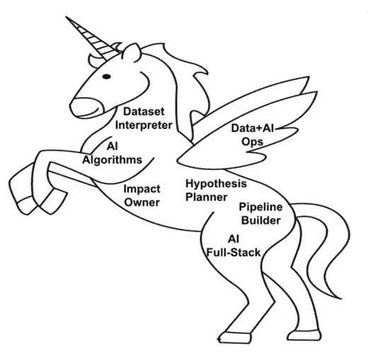

# 不追独角兽如何打造独角兽 AI 团队

> 原文：<https://towardsdatascience.com/how-to-build-a-unicorn-ai-team-without-chasing-unicorns-e28c054af86e?source=collection_archive---------27----------------------->

## 一个优秀人工智能团队的 7 个技能角色

GIF by [giphy](https://giphy.com/gifs/moodman-j0kQJxo5mzGYb4EvWK)

**文章原载于** [**VentureBeat**](https://venturebeat.com/2021/06/19/how-to-build-a-unicorn-ai-team-without-unicorns/)

你如何开始组建一个人工智能团队？好吧，雇用能够理解业务问题、能够将其转化为“正确的”人工智能构建模块、能够交付实施和生产部署的独角兽。听起来很容易！只不过这种独角兽的出现极为罕见。即使你找到了独角兽，你也很可能买不起它！

在我过去二十年领导数据+人工智能产品和平台的经验中，一个更有效的策略是专注于招募可靠的执行者，他们在团队中累计支持七个特定技能角色。

# 独角兽人工智能团队的 7 个技能角色

独角兽人工智能团队的七个技能角色(图片由作者提供)

# 数据集解释器角色

人工智能项目的生命线是数据。找到正确的数据集、准备数据并持续确保高质量是一项关键技能。有很多关于数据集的部落知识，所以你需要有人专门跟踪数据属性的含义和不同数据集的来源。与数据相关的一个挑战是处理组织内对业务指标的多种定义。在我的一个项目中，我们正在处理销售、财务和市场营销中“每月新客户”的八种定义。对于这种技能角色，一个很好的起点是一个传统的数据仓库工程师，他具有很强的数据建模技能，并且天生好奇如何将数据属性的含义与应用程序和业务操作相关联。

# 管道建造者角色

从多个来源获取数据到 AI 模型需要数据管道。在管道中，数据被清理、准备、转换并转化为 ML 特征。这些数据管道(传统数据仓库中称为[提取-转换-加载](https://en.wikipedia.org/wiki/Extract,_transform,_load)或 ETL)会变得非常复杂。组织通常拥有管道丛林，其中有数千条使用异构大数据技术构建的管道，如 [Spark](https://spark.apache.org/) 、 [Hive](https://hive.apache.org/) 和 [Presto](https://prestodb.io/) 。管道建造者角色侧重于以适当的健壮性和性能大规模地建造和运行管道。寻找这种角色的最佳地点是拥有多年批处理和实时事件管道开发经验的数据工程师。

# AI 全栈角色

AI 从设计、训练、部署、再训练，本质上都是迭代的。构建 ML 模型需要对代码、特性、数据集和模型配置的不同排列进行数百次实验。这个角色是人工智能领域知识和强大的系统构建技能的结合。他们专注于现有的 AI 平台，如 [Tensorflow](https://www.tensorflow.org/) 、 [Pytorch](https://pytorch.org/) ，或基于云的解决方案，如 [AWS](https://aws.amazon.com/sagemaker/) 、 [Google](https://cloud.google.com/vertex-ai) 和 [Azure](https://azure.microsoft.com/en-us/overview/ai-platform/) 。随着这些人工智能平台的民主化和广泛的在线课程，这种角色不再稀缺。根据我的经验，强大的软件工程背景加上他们对掌握人工智能的好奇心是一个极其有效的组合。在为这种角色招聘时，很容易遇到喜欢单飞而不是团队合作的天才——保持警惕，尽早淘汰他们。

# 人工智能算法角色

大多数人工智能项目很少需要从头开始或实现新的算法。这个角色的作用是在问题的背景下，在人工智能算法和技术的搜索空间上指导团队。它们有助于减少路线修正的死角，并有助于平衡解决方案的准确性和复杂性。鉴于专注于人工智能算法创新的地方的高需求，这种角色不容易获得。如果你负担不起找一个全职的人来掌握这项技能，可以考虑找一个专家做顾问或者创业顾问。另一个选择是投资培训全栈团队，给他们时间学习研究进展和算法内部。

# 数据+人工智能运营角色

AI 解决方案在生产中部署后，需要持续监控以确保其正常工作。生产中可能会出现很多问题:数据管道故障、质量差的数据、供应不足的模型推断端点、模型预测正确性的漂移、业务度量定义中不协调的变化，等等。该角色侧重于构建正确的监控和自动化，以确保无缝运营。与软件产品的传统开发运维相比，考虑到移动部分的数量，数据+人工智能运维要复杂得多。谷歌的研究人员将这种复杂性正确地总结为 CACE 原则:改变任何事情都会改变一切。寻找这种角色的一个很好的起点是有经验的数据运营工程师，他们渴望学习数据+人工智能领域。

# 假设规划者角色

人工智能项目充满惊喜！从原始数据到可用的人工智能的旅程不是一条直线。您需要灵活的项目规划——根据对数据集、功能、模型准确性、客户体验的假设的证明或否定进行调整。找到这种技能角色的一个好地方是传统的数据分析师，他们有在紧迫的期限内处理多个并发项目的经验。鉴于他们跟踪和平行假设的本能，他们可以成为优秀的项目经理。

# 影响所有者角色

影响所有者非常熟悉如何部署人工智能产品来实现价值的细节。例如，当使用人工智能解决与提高客户保持率相关的问题时，这个角色将完全理解与客户获取、保持和流失相关的旅程图。他们将负责定义支持团队专家如何实施人工智能解决方案中的客户流失预测，以减少流失。找到这种角色的最佳地方是在现有的业务团队中——理想情况下，是一个具有强烈产品直觉和实用主义的工程师。没有这个角色，团队最终会构建技术上可行的东西，而不是在端到端工作流中实际需要什么来产生价值。

总结一下，这七个技能人物角色是每个 AI 团队必备的。这些人物角色的重要性根据数据的成熟度、人工智能问题的类型以及更广泛的数据和应用程序团队可用的技能而有所不同。例如，与拥有少量大表的组织相比，拥有大量小表的组织中的数据解释者角色更加重要。在为 AI 团队中的每个技能角色确定正确的资历和基数时，应该考虑这些因素。希望，你现在可以开始建立你的人工智能团队，而不是等待独角兽出现！