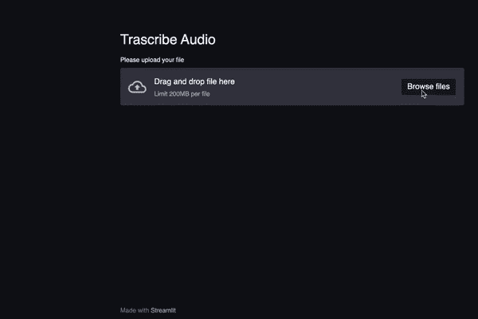
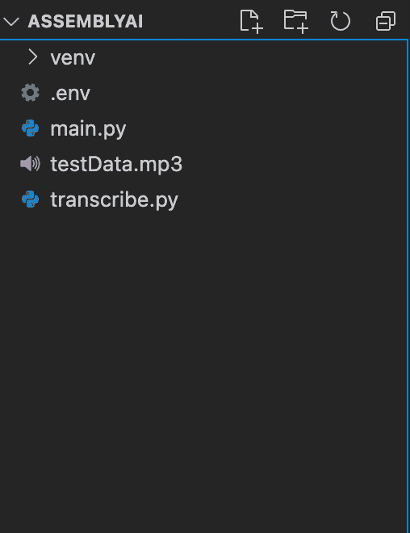
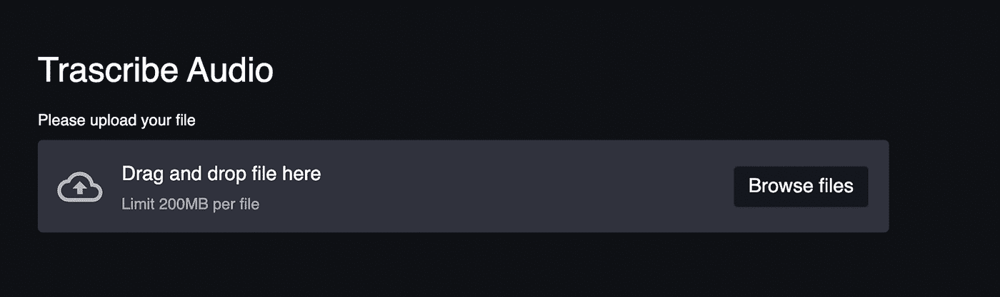

# 如何使用 Python 和 AssemblyAI 构建一个转录音频的 Web 应用程序

> 原文：<https://towardsdatascience.com/how-to-build-a-web-app-to-transcribe-audio-using-python-and-assemblyai-18f197253fd8?source=collection_archive---------11----------------------->

## 我们将使用 Streamlit 建立一个 web 应用程序，让用户上传他们的音频。AssemblyAI 的 API 将用于转录这个音频。我们也将建立一些很酷的动画



Web 应用程序的屏幕截图

你可以在[这里](https://share.streamlit.io/mesmith027/assemblyai_webapp/main/main.py)找到部署的应用

转录是将音频转换为文本的过程。虽然你可以实现一个机器学习模型来从音频中获取文本，但这很麻烦。

*   从音频信号中提取特征需要丰富的音频信号处理知识。
*   必须从各种来源挖掘/搜集大量数据。
*   需要具备 PyTorch 或 TensorFlow 等机器学习库的知识。

幸运的是，AssemblyAI 有一个免费的版本，让我们通过几个请求就可以转录音频。

在本文中，我们将构建一个 web 应用程序，它可以使用 AssemblyAI 和 [Streamlit](https://streamlit.io/) 转录音频，Streamlit 是一个 Python 库，用于构建机器学习模型的 ui。

你可以在这里找到带有完整[源代码的回购协议。](https://github.com/rahulbanerjee26/AssemblyAI_WebApp)

# 要求

*   一个 AssemblyAI 账户(免费注册[这里](https://app.assemblyai.com/login/)
*   一个 AssemblyAI API 密钥(你可以在这里找到它
*   Python 3.5+的基础知识(注意:本教程我将使用 Python 3.9)
*   虽然不是必需的，但是熟悉[请求库](https://docs.python-requests.org/en/master/)会有所帮助

# 我们将使用的库

# AssemblyAI

[AssemblyAI](https://www.assemblyai.com/) 用于将音频转换为文本。它提供了一个 REST API，可以在任何调用 REST API 的语言中使用，比如 JavaScript、PHP、Python 等。我们将使用 Python 向 API 发出请求。

# 细流

[Streamlit](https://streamlit.io/) 是一个开源的应用框架，用于构建机器学习模型的 UI，无需了解 HTML、CSS 或 JavaScript。它有一个广泛的预建组件库，可以用来在几分钟内构建一个简单的 UI。

# 要求

我们将使用[请求库](https://requests.readthedocs.io/)向 AssemblyAI 的 REST API 发出请求。

# Python-dotenv

我们将使用 [Python-dotenv](https://pypi.org/project/python-dotenv/) 库来读取变量。环境文件。

# 设置项目目录

使用命令行创建新的文件夹/目录

```
mkdir ASSEMBLYAI
```

为了保持秘密凭证的秘密性，将凭证存储在. env 文件中是一个很好的做法。然后，我们可以使用 [Python-dotenv](https://pypi.org/project/python-dotenv/) 库从。环境文件。如果愿意，我们也可以将它们存储在环境变量中。

在您创建的新目录 ASSEMBLYAI 中，创建两个新的 Python 文件和一个. env 文件

*如果使用 Windows:*

```
New-Item main.py, transcribe.py, .env
```

*如果使用 macOS 或 Linux:*

```
touch touch main.py && transcribe.py && touch .env
```

文件 main.py 将包含与 Streamlit UI 相关的所有代码，而文件 transcribe.py 将包含帮助器函数和与 AssemblyAI 的 API 交互的代码。

你可以从[这里](https://s3-us-west-2.amazonaws.com/blog.assemblyai.com/audio/8-7-2018-post/7510.mp3)下载一个样本 MP3 文件。将文件命名为“testData ”,并将其保存在 ASSEMBLYAI 目录中。

# 设置项目环境

确保你在 ASSEMBLYAI 目录下，如果你不只是使用 cd 命令来改变目录。

```
cd ASSEMBLYAI
```

# 如果这是你第一次使用虚拟环境，你必须安装 [virtualenv](https://pypi.org/project/virtualenv/)

*如果使用 Windows:*

```
python -m pip install — user virtualenv
```

*如果使用 macOS 或 Linux:*

```
python3 -m pip install — user virtualenv
```

# 首先，我们需要通过在命令行上输入以下代码来创建一个虚拟环境:

*如果使用 Windows:*

```
python -m venv venv
```

*如果使用 macOS 或 Linux:*

```
Python3 -m venv venv
```

然后，我们需要在命令行中使用以下命令来激活本地虚拟环境:

*如果使用 Windows:*

```
venv/Scripts/activate
```

*如果使用 macOS 或 Linux:*

```
source venv/bin/activate
```

有关如何设置虚拟环境的更多详细信息，请参考[本网站](https://packaging.python.org/guides/installing-using-pip-and-virtual-environments/)。

要分别安装 Requests、Steamlit 和 Python-dotenv 库，我们可以在命令行上输入这一行:

```
pip install streamlit, requests, python-dotenv
```

这将安装所需的最新库。



作者图片

这是你的文件结构应该看起来的样子。

# 将 API 密钥添加到。环境文件

*   打开。您在“设置项目环境”一节中创建的 env 文件。
*   添加以下内容:

```
API_TOKEN = “Your API Key”
```

*   将字符串“Your API Key”替换为 [Assembly AI](https://app.assemblyai.com/dashboard/) 给你的 API Key。

# 如何克隆回购并运行它

*   去 [GitHub repo](https://github.com/rahulbanerjee26/AssemblyAI_WebApp) 下载。
*   启动命令行，将目录更改为下载的文件夹。
*   按照上一节设置虚拟环境。
*   激活虚拟环境。
*   在下载的文件夹中创建一个. env 文件，并添加 API 密钥。(参考上一节。)
*   要安装所需的库，您可以手动键入名称并安装它们，或者使用提供的 requirements.txt 文件。

*如果使用 Windows:*

```
pip install streamlit, requests, python-dotenv
```

*如果使用 macOS 或 Linux:*

```
pip install streamlit requests python-dotenv
```

或者

```
pip install -r requirements.txt
```

*   一旦成功安装了所有要求，请键入以下命令

```
streamlit run main.py
```

这应该会运行 webapp。您可以尝试上传文件。

# 转录 mp3 文件

在构建 UI 之前，我们需要几个助手函数，我们可以用它们将文件上传到 AssemblyAI 的服务器，供模型处理并返回转录的文本。

助手函数的代码应该写在**transcripte . py**文件中

# 导入所需的模块

这段代码应该出现在**转录. py** 文件的开头

```
import os
from dotenv import load_dotenv
import requests
```

# 助手功能 1:将本地音频文件上传到 AssemblyAI

我们需要编写的第一个函数是上传存储在本地机器上的音频文件的方法。这个函数应该存在于**转录. py** 文件中

AssemblyAI 模型期望文件可以通过 URL 访问。因此，我们需要将音频文件上传到 blob 存储，以便通过 URL 访问。幸运的是，AssemblyAI 提供了一种快速简单的方法来实现这一点。

我们需要向以下 AssemblyAI API 端点发出 POST 请求:

```
[https://api.assemblyai.com/v2/upload](https://api.assemblyai.com/v2/upload)
```

该响应将包含一个指向该文件的临时 URL，我们可以将该 URL 传递回 AssemblyAI ' transcript` API 端点。该 URL 是仅可由 AssemblyAI 服务器访问的私有 URL。

所有上传的内容转录后会立即删除，永远不会保存。

我们将使用之前安装的 Python 请求库来发出 POST 请求

```
def get_url(token,data):
 ‘’’
 Parameter:
 token: The API key
 data : The File Object to upload
 Return Value:
 url : Url to uploaded file
 ‘’’
 headers = {‘authorization’: token}
 response = requests.post(‘https://api.assemblyai.com/v2/upload',
 headers=headers,
 data=data)
 url = response.json()[“upload_url”]
 print(“Uploaded File and got temporary URL to file”)
 return url
```

*   该函数接受两个参数:API 令牌和要上传的文件对象
*   我们向上述 AssemblyAI Upload API 端点发出 POST 请求，并将 API 令牌和文件对象作为请求体的一部分。
*   响应对象包含上传文件的 URL。该 URL 由函数返回。

# 助手功能 2:上传文件进行转录

现在我们有了一个函数来获取音频文件的 URL，我们将使用这个 URL 并向端点发出请求，端点将实际转录文件。这个函数也应该存在于 transcribe.py 文件中

最初，当我们请求转录时，音频文件具有“排队”状态。我们将在最后一个帮助函数中更多地讨论文件是如何从“排队”到“完成”的。现在，我们只需要向转录端点以及文件的 URL 发出请求。我们需要向以下 AssemblyAI API 端点发出请求:

```
[https://api.assemblyai.com/v2/transcript](https://api.assemblyai.com/v2/transcript)
```

这个函数与前面的函数非常相似。

```
def get_transcribe_id(token,url):
 ‘’’
 Parameter:
 token: The API key
 url : Url to uploaded file
 Return Value:
 id : The transcribe id of the file
 ‘’’
 endpoint = “https://api.assemblyai.com/v2/transcript"
 json = {
 “audio_url”: url
 }
 headers = {
 “authorization”: token,
 “content-type”: “application/json”
 }
 response = requests.post(endpoint, json=json, headers=headers)
 id = response.json()[‘id’]
 print(“Made request and file is currently queued”)
 return id
```

*   该函数接受两个参数:API 令牌和来自前面函数的音频文件 URL。
*   我们向 AssemblyAI“抄本”API 端点发出 POST 请求..如果音频文件当前未在处理中，则新文件会立即被处理。如果有正在进行的转录，则新的音频文件将排队，直到前一个作业完成。

如果您希望能够同时运行多个作业，您将需要[升级到高级计划](https://www.assemblyai.com/pricing)

*   响应对象将包含转录的 ID。这个 ID 和一个单独的端点将用于获取转录的状态。
*   该函数将返回这个 ID

# 助手功能 3:下载音频转录

一旦我们有了音频文件的转录 ID，我们就可以向以下 AssemblyAI API 端点发出 GET 请求，以检查转录的状态:

```
[https://api.assemblyai.com/v2/transcript/{transcribe_id}](https://api.assemblyai.com/v2/transcript/{transcribe_id})
```

只要没有遇到错误，转录的状态就从“排队”变为“处理中”再变为“完成”。

我们将需要轮询这个端点，直到我们得到一个状态为“completed”的响应对象。

我们可以利用一个 [*while 循环*](https://www.w3schools.com/python/python_while_loops.asp) 不断向端点发出请求。在循环的每次迭代中，我们将检查转录的状态。循环将继续运行，直到状态为“完成”。发出请求并等待状态完成的过程称为轮询。我们将在“构建 Streamlit UI”一节中实现这个轮询特性。

下面的函数将简单地获取处方的当前状态。这个函数应该存在于**转录. py** 文件中

```
def get_text(token,transcribe_id):
 ‘’’
 Parameter:
 token: The API key
 transcribe_id: The ID of the file which is being
 Return Value:
 result : The response object
 ‘’’ 
endpoint= f”https://api.assemblyai.com/v2/transcript/{transcribe_id}"
headers = {
 “authorization”: token
 }
 result = requests.get(endpoint, headers=headers).json()
 return result
```

# 助手功能 4:从 UI 请求转录

我们的第三个函数将连续调用前面的两个函数。

该功能也将连接到我们的 Streamlit UI 中的“上传”按钮。该函数只有一个参数:file 对象。该函数将执行以下操作

*   它将从我们的。环境文件。
*   它将使用令牌来调用先前定义的函数
*   它将返回转录 ID

下面是该函数的代码片段。这个函数应该存在于**transcripte . py**文件中:

```
def upload_file(fileObj):
 ‘’’
 Parameter:
 fileObj: The File Object to transcribe
 Return Value:
 token : The API key
 transcribe_id: The ID of the file which is being transcribed
 ‘’’
 load_dotenv()
 token = os.getenv(“API_TOKEN”)
 file_url = get_url(token,fileObj)
 transcribe_id = get_transcribe_id(token,file_url)
 return token,transcribe_id
```

*   我们将使用 **load_dotenv()** 函数来加载我们的。环境文件。然后我们将使用操作系统库中的 **get()** 函数，从。环境文件。
*   调用 **get_url()** 函数，将文件对象和令牌作为参数。
*   用 **get_url()** 函数返回的令牌和 **file_url** 调用**get _ transcripte _ id()**函数。
*   返回令牌和转录 ID。

# 构建 Streamlit UI

现在我们已经有了所有需要的助手函数，我们可以开始在 Streamlit UI 上工作了。

然而，在进入 Streamlit UI 的实际代码之前，让我们看一下我们将使用的 Streamlit 组件。

*   **header(string)、subheader(string)、text(string)** —这些组件在我们的 UI 上显示各种大小的文本。 **header()** 可以认为是< h1 >标签， **subheader()** 是< h2 >而 **text()** 是< p >
*   **file_uploader(label)** —创建一个上传文件的按钮。参数标签是显示在按钮上方的字符串。它返回一个文件对象。我们将使用它来接受来自用户的文件
*   **进度(整数)** —创建一个进度条。整数必须介于 0 和 100 之间。它表示指定任务完成的百分比。如果我们创建一个每次迭代睡眠时间为 0.1 s b/w 的 for 循环，我们就可以创建一个很酷的进度条动画。
*   **spinner(label)** —只要我们在标签的代码块中，标签就会显示。
*   气球() —这是展示气球的，是啊，真酷🎈

# 构建用户界面的组件

下面的代码应该写在 **main.py** 文件中。main.py 文件将是我们的 web 应用程序的入口点。

首先，我们需要导入所有需要的模块和库

```
import streamlit as st
from transcribe import *
import time
```

**转录**是**的名字**这个文件带有我们的帮助函数。

为了确保您当前已经导入了库，您可以尝试在命令行中运行以下命令。在运行该命令之前，确保您的虚拟环境已激活，并且您当前位于根文件夹(ASSEMBLYAI)中:

```
streamlit run main.py
```

您应该会看到一个空白的 web 应用程序。要重新运行应用程序，您可以单击汉堡菜单，然后单击重新运行，或者您可以打开 web 应用程序，然后按“Ctrl + R”或“Cmnd + R”

让我们首先创建一个标题和上传按钮。

在 **main.py** 文件中输入以下代码:

```
st.header(“Transcribe Audio”)
fileObject = st.file_uploader(label = “Please upload your file” )
```

重新运行应用程序后，您应该会看到以下内容



作者图片

最初，变量是“None”，一旦文件被上传，变量的值就是文件对象。

```
if fileObject:
 token, t_id = upload_file(fileObject)
 result = {}
 #polling
 sleep_duration = 1
 percent_complete = 0
 progress_bar = st.progress(percent_complete)
 st.text(“Currently in queue”)
 while result.get(“status”) != “processing”:
 percent_complete += sleep_duration
 time.sleep(sleep_duration)
 progress_bar.progress(percent_complete/10)
 result = get_text(token,t_id)
sleep_duration = 0.01
for percent in range(percent_complete,101):
 time.sleep(sleep_duration)
 progress_bar.progress(percent)
```

*   本质上，如果变量 **fileObject** 不为“None”，我们调用 **upload_file** 函数。
*   我们使用 while 循环来轮询端点。
*   创建一个进度条，在 while 循环的每一次迭代中，程序会休眠一秒钟，并将进度条的百分比递增 1
*   一旦状态变为“处理中”，睡眠时间将减少到 0.01 秒。这导致了一个非常酷的动画，开始时，进度条进展缓慢，一旦文件被处理，它的进展真的很快


作者 GIF

*   进度条显示为 100%时，我们再次轮询端点。这一次检查状态是否为“已完成”。我们使用 **spinner()** 函数在投票时在屏幕上显示文本:

```
st.balloons()
st.header(“Transcribed Text”)
st.subheader(result[‘text’])
```

*   一旦状态为“完成”，我们退出 while，并使用 **balloons()** 函数在屏幕上循环显示气球。
*   最后，我们在屏幕上显示转录的文本。


作者图片

# 结论

恭喜你！👏您已经成功构建了一个可以转录音频的 web 应用程序。您可以在 web 应用程序的基础上构建一些附加功能

*   AssemblyAI 允许用户指定[声学模型和/或语言模型](https://docs.assemblyai.com/guides/transcribing-with-a-different-acoustic-or-custom-language-model)。您可以使用 Streamli 的选择框构建一个类似[的下拉](https://docs.streamlit.io/en/latest/api.html#control-flow)功能。
*   添加一个功能，让用户记录他们的声音，并转录它。这可能有点复杂，因为 Streamlit 没有任何内置组件来录制语音。但是，您可以使用 HTML 和 JavaScript 来构建这样一个特性。查看[这个答案](https://discuss.streamlit.io/t/speech-to-text-on-client-side-using-html5-and-streamlit-bokeh-events/7888)供参考。

> 在 [LinkedIn](https://www.linkedin.com/in/rahulbanerjee2699/) 、 [Twitter](https://twitter.com/rahulbanerjee99) 上与我联系
> 
> 我最近开始了一个修改版的#100daysofcode 挑战。我的目标是写与 Python、数据科学或编程相关的内容。关注我在[媒体](https://medium.com/daily-programming-tips)上的进度