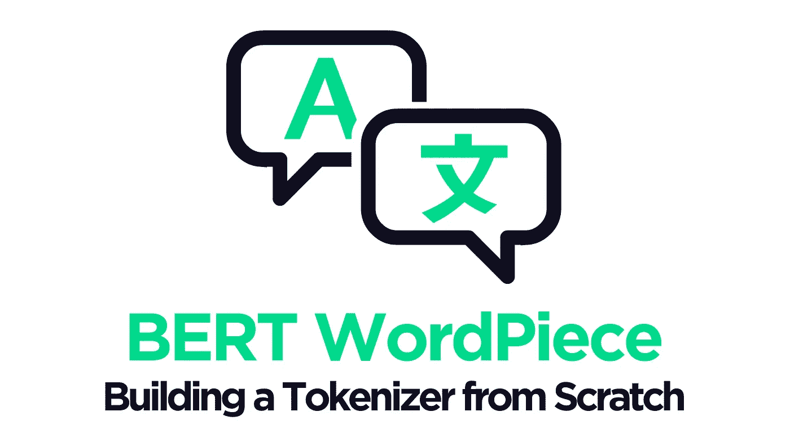
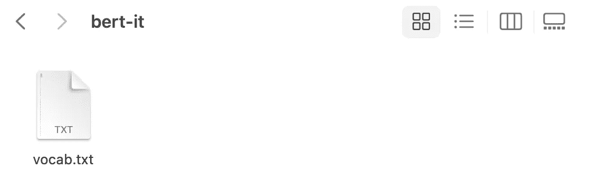
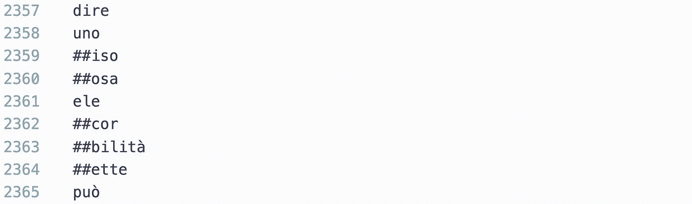

# 如何为 BERT 构建一个词块标记器

> 原文：<https://towardsdatascience.com/how-to-build-a-wordpiece-tokenizer-for-bert-f505d97dddbb?source=collection_archive---------1----------------------->

## [实践教程](https://towardsdatascience.com/tagged/hands-on-tutorials)

## 从头开始构建 BertTokenizer 的简单指南

作者图片

对于许多更具体的用例来说，从头构建一个转换器模型通常是唯一的选择。尽管 BERT 和其他 transformer 模型已经针对许多语言和领域进行了预训练，但它们并没有涵盖所有内容。

通常，这些不太常见的用例会从有人来构建特定的 transformer 模型中获益最多。它可能是一种不常用的语言或者一个不太懂技术的领域。

BERT 是一系列基于语言的机器学习中最受欢迎的转换器——从情感分析到问答。BERT 已经实现了跨越许多边界和行业的多样化创新。

对于许多人来说，设计新的 BERT 模型的第一步是记号赋予器。在这篇文章中，我们将看看 BERT 使用的 WordPiece tokenizer 看看我们如何从头开始构建自己的 WordPiece tokenizer。

# 文字片

BERT 使用所谓的**单词块**记号赋予器。它的工作原理是将单词拆分成完整的形式(例如，一个单词成为一个标记)，或者拆分成*单词片段*——其中一个单词可以拆分成多个标记。

一个有用的例子是我们有多种形式的单词。例如:

通过将单词拆分成单词块，我们已经识别出单词`"surfboard"`和`"snowboard"`通过单词块`"##board"`共享含义，我们甚至没有对我们的令牌进行编码，也没有通过 BERT 以任何方式对它们进行处理。

使用单词片段允许 BERT 轻松识别相关单词，因为它们*通常*共享一些相同的输入标记，然后这些标记被输入到 BERT 的第一层。

*作为旁注，还有许多其他的 transformer 记号赋予器——比如 SentencePiece 或者流行的* [*字节级字节对编码(BPE)记号赋予器*](/transformers-from-scratch-creating-a-tokenizer-7d7418adb403) *。它们各有利弊，但是最初的 BERT 使用的是单词块标记器。*

# 构建标记器

当构建一个新的标记器时，我们需要大量的非结构化语言数据。我的首选是 OSCAR 语料库——一个巨大的多语言数据集，涵盖了 166 种不同的语言。

然而，那里有许多数据集。HuggingFace 的`datasets`库也提供了对其中大部分内容的便捷访问。我们可以看到使用 Python 有多少:

一个很酷的 **1306** 数据集。其中许多也非常庞大——OSCAR 本身被分成 166 种语言，OSCAR 的许多“部分”包含万亿字节的数据。

我们可以用 HF 的`datasets`下载奥斯卡意大利语语料库。但是，我们应该小心，因为完整的数据集包含 11.3 亿个样本。总共约 69GB 的数据。HF 允许我们使用`split`参数指定我们只想要完整数据集的*部分*。

在我们的`split`参数中，我们已经指定我们想要来自`train`数据集的第一个`2000000`样本(大多数数据集被组织成`train`、`validation`和`test`集合)。尽管这仍然会下载完整的`train`集——它将被缓存在本地以备将来使用。

我们可以通过将`streaming=True`参数添加到`load_dataset`来避免下载和缓存整个数据集——在这种情况下`split`必须设置为`"train"`(没有`[:2000000]`)。

## 数据格式编排

下载完数据后，我们必须将其重新格式化为简单的明文文件，每个样本之间用一个换行符隔开。将每个样本存储在一个文件中会创建一个巨大的文本文件。所以，我们把它们分成许多份。

## 培养

一旦我们保存了所有简单的、换行符分隔的明文文件——我们继续训练我们的记号赋予器！

我们首先使用`pathlib`创建一个包含所有明文文件的列表。

然后，我们初始化并训练分词器。

这里有几个重要的参数需要注意，在初始化期间，我们有:

*   `clean_text` —通过删除控制字符并用空格替换所有空白来清除文本。
*   `handle_chinese_chars` —标记器是否包括汉字周围的空格(如果在数据集中找到)。
*   `stripe_accents` —我们是否删除重音，何时`True`这会使é → e、ⅳ→o 等。
*   `lowercase` —如果`True`标记器将大写和小写字符视为相等；A == a，B == b，等等。

在培训期间，我们使用:

*   `vocab_size` —我们的记号赋予器中记号的数量。在稍后的文本标记化过程中，未知单词将被分配一个不理想的`[UNK]`标记。我们应该尽可能减少这种情况。
*   `min_frequency` —一对令牌被合并的最小频率。
*   `special_tokens`—BERT 使用的特殊令牌列表。
*   `limit_alphabet` —不同字符的最大数量。
*   `workpieces_prefix` —添加到单词的*片段*的前缀(就像我们前面例子中的`**##**board`)。

在我们完成训练后，剩下的就是保存我们闪亮的新标记器。我们使用`save_model`方法来实现这一点——指定一个目录来保存我们的标记器和标记器名称:

就这样，我们构建并保存了我们的 BERT tokenizer。在我们的记号赋予器目录中*应该*找到一个文件— `vocab.txt`。

**vocab.txt** 文件的屏幕截图——我们新的令牌化器文本到令牌 ID 的映射。

在标记化过程中,`vocab.txt`用于将文本映射到标记，然后根据`vocab.txt`中标记的行号将标记映射到标记 id——这些 id 然后被输入到 BERT 中！

**vocab.txt** 的一小部分，显示令牌及其令牌 id(如行号)。

# 符号化

现在我们有了记号赋予器；我们可以继续使用`from_pretrained`加载它，就像我们使用任何其他标记器一样，我们必须指定保存标记器的本地目录。

我们也像往常一样标记:

这里我们返回大多数 BERT 任务需要的三个张量，`input_ids`、`token_type_ids`和`attention_mask`。我们可以看到由`2`代表的初始`[CLS]`令牌和由`3`代表的最终`[SEP]`令牌。

由于我们的`vocab.txt`文件包含我们的令牌和令牌 id 的映射(例如，行号)——我们可以通过将我们的`input_ids`令牌 id 与`vocab.txt`中的行对齐来访问令牌:

让我们试试另一个——如果你在意大利，这是一个不错的选择:

最后，让我们对将要拆分成多个单词片段的内容进行标记:

这就是我们构建和应用意大利 Bert tokenizer 所需的一切！

这就是本文的全部内容，涵盖了为 BERT 定制的单词块标记器的构建过程。

我希望你喜欢它！如果你有任何问题，请通过 [Twitter](https://twitter.com/jamescalam) 或在下面的评论中告诉我。如果你想要更多这样的内容，我也会在 [YouTube](https://www.youtube.com/c/jamesbriggs) 上发布。

感谢阅读！

[🤖《变形金刚》NLP 课程 70%的折扣](https://bit.ly/nlp-transformers)

# 参考

[HuggingFace Tokenizers 文档](https://huggingface.co/docs/tokenizers/python/latest/api/reference.html#module-tokenizers.pre_tokenizers)