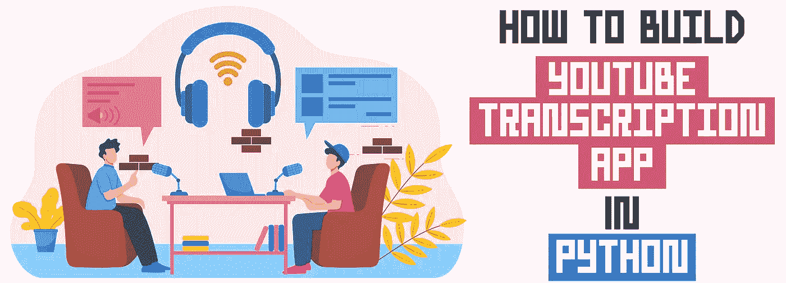
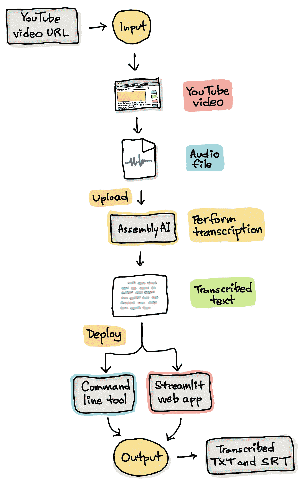
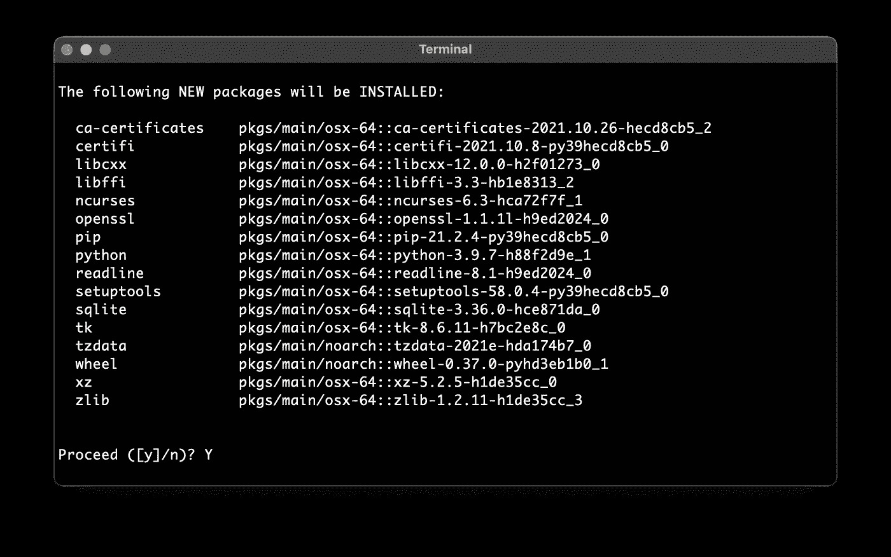
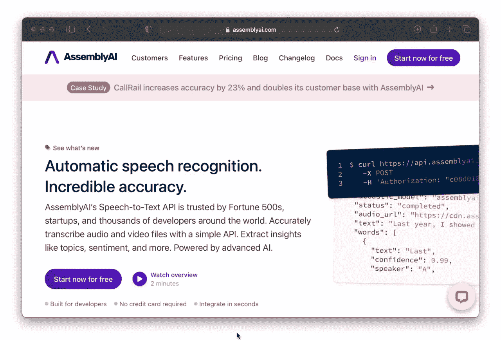
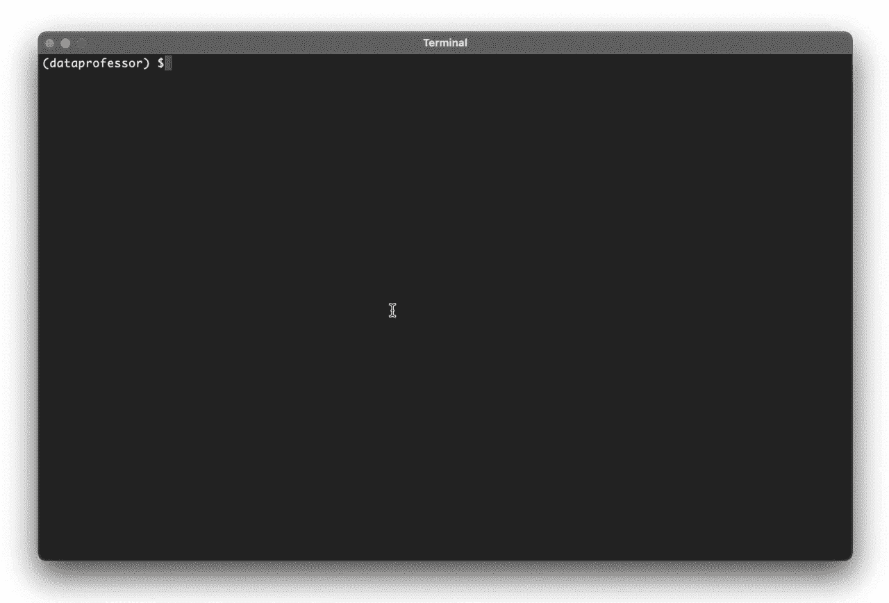
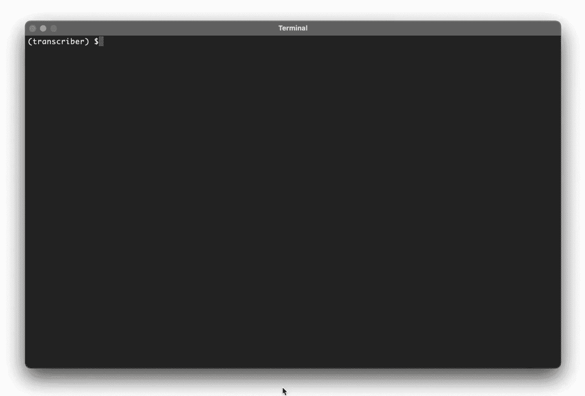

# 如何用 Python 构建 YouTube 转录 App

> 原文：<https://towardsdatascience.com/how-to-build-a-youtube-transcription-app-in-python-f15bab6eb250?source=collection_archive---------9----------------------->



由[eleven creative](https://elements.envato.com/user/elevencreativee)从 [envato elements](https://1.envato.market/c/2346717/628379/4662) 使用图像创建(经许可)。

## 使用 AssemblyAI 和 Streamlit 的分步教程

# 背景

或许，在你的学习之旅中，你想看一个小时的 YouTube 视频，或者你有一个 YouTube 视频播放列表要看，但你时间不够？

有两个可能的选择:

1.  找时间看视频
2.  转录视频(你可以浏览视频以获取关键观点)

如果您选择第二个选项，您将在本文中了解如何利用自动语音识别将 YouTube 视频中的音频转录为书面形式。简而言之，我们将用 Python 实现一个语音到文本的 Streamlit 应用程序，使用 AssemblyAI API 来执行 YouTube 视频的转录。

在我们继续之前，值得注意的是，我还为本文制作了一个补充视频，除了构建 Streamlit 应用程序，我们还构建了一个具有相同功能的命令行工具(*即*一个可以从命令行运行的简单 Python 脚本)。

[如何使用 AssemblyAI 和 Streamlit 在 Python 中构建自己的语音到文本转换应用](https://youtu.be/NNq_XBVk30w)

# 构建转录器应用程序的概念框架

也许，提供一个关于我们将要构建的转录器应用程序的高级概述会很好。



构建转录应用程序的概念框架。由作者绘制。

现在让我们开始构建应用程序吧！

# 建立工作环境

首先要做的是安装`conda`，我们将使用它来管理我们的工作环境。

现在，让我们用 Python 版创建一个新的 conda 环境。在这里，我们将环境命名为`transcriber`。

```
conda create -n transcriber python=3.9
```

当提示安装 Python 库依赖项时，只需输入`Y`，字面意思是“是”。



现在已经创建了环境，当您打开终端时，您可以键入以下内容来激活 conda 环境:

```
conda activate transcriber
```

完成后，您可以通过键入以下命令退出 conda 环境:

```
conda deactivate
```

# 下载 GitHub repo

我们现在将通过以下命令从 GitHub repo `transcriber-app`下载运行 transcriber 应用程序所需的所有文件:

```
git clone [https://github.com/dataprofessor/transcriber-app](https://github.com/dataprofessor/transcriber-app)
```

这将显示以下文件夹内容:

```
transcriber-app/
├─ .streamlit/
│  ├─ secrets.toml
├─ api.txt
├─ app.py
├─ requirements.txt
├─ transcriber.py
├─ README.md
```

接下来，安装必备库，本质上是`streamlit`和`pytube`库。

您可以通过以下方式实现这一点(仅选择并执行以下一项):

```
pip install requirements.txt
```

或者通过以下方式手动安装库:

```
pip install -U streamlit
pip install pytube
```

`-U`选项有助于将`streamlit`库更新到最新版本，以确保您可以访问最新版本。

# 从 AssemblyAI 获取 API 密钥

在运行 Streamlit transcriber 应用程序之前，我们需要从 AssemblyAI 获取 API 密钥。

这超级简单，只要做到以下几点:

1.  转到[装配 AI](https://www.assemblyai.com/?utm_source=youtube&utm_medium=social&utm_campaign=dataprofessor)
2.  注册并登录
3.  复制在右侧找到的 API 密钥。



演示如何获取 AssemblyAI API 的截屏。

# 运行命令行工具

需要注意的是，`api.txt`和`transcriber.py`是作为命令行工具运行转录器 app，可以通过以下命令执行:

```
python transcriber.py -i "[https://youtu.be/mkVjrB8g6mM](https://youtu.be/mkVjrB8g6mM)"
```

确保打开`api.txt`文件，并用 AssemblyAI 中的 API 键替换填充文本。

(注意:请随意用您选择的 YouTube 视频替换该 URL)



在命令行中运行转录器的截屏。

# 运行 Streamlit 应用

如果您在本地运行 Streamlit 应用程序，请确保打开`.streamlit/secrets.toml`文件，并用 AssemblyAI 中的 API 密钥替换填充文本。

要启动应用程序，请在终端中输入以下内容:

```
streamlit run app.py
```



运行 Transcriber Streamlit 应用程序的截屏。

# 将 Streamlit 应用部署到云

如果您正在部署到云，最简单的方法是使用 Streamlit Cloud 进行部署，这需要一个到 GitHub repo 的链接。重要的是不要上传`.streamlit/secrets.toml`到你的 GitHub repo，而是你可以从 Streamlit 云管理界面输入 API 密钥。

为此，您可以进入[应用仪表板](https://share.streamlit.io/)，在应用的下拉菜单下，点击**编辑机密**。从`secrets.toml`文件中复制内容并粘贴到文本框中。

# 代码的解释

## **第 1–7 行**

导入必备库。

## 第 9 行

打印出应用程序的标题。

## 第 10 行

使用`st.progress()`函数实例化进度条，并将初始值设置为`0`。

## 第 12–111 行

定义自定义的实用函数，执行所有的任务来转录 YouTube 视频。这由 8 个任务组成，如各种注释行所述，如下:
1)从 YouTube 视频检索音频文件
2。将 YouTube 音频文件上传到 AssemblyAI
3)转录上传的音频文件
4)提取转录 ID
5)检索转录结果
6)检查转录是否完成
7)打印转录文本
8)将转录文本保存到文件

在本文的补充视频中提供了深入的解释: [*如何使用 AssemblyAI 和 Streamlit*](https://youtu.be/NNq_XBVk30w) 在 Python 中构建自己的语音到文本转录 App。

## 第 113–141 行

实际应用从这里开始。简而言之，该应用程序接受 YouTube 视频的用户输入 URL，并将该信息转发给第 12-111 行中提到的自定义实用程序函数，以执行上述 8 项任务。

# 结论

恭喜你！现在，您已经构建了自己的转录器应用程序，用于将 YouTube 视频转换为转录文本。只需稍加调整，你就可以定制应用程序来转录任何视频或音频文件。

# 接下来读这些

*   [**如何掌握数据科学所需的 Python**](/how-to-master-python-for-data-science-1fb8353718bf)
    *下面是数据科学所需的必备 Python*
*   [**如何掌握数据科学的熊猫**](/how-to-master-pandas-for-data-science-b8ab0a9b1042)
    *下面是数据科学需要的必备熊猫*
*   [**如何用 Python 构建 AutoML App**](/how-to-build-an-automl-app-in-python-e216763d10cd)
    *使用 Streamlit 库的分步教程*
*   [**学习数据科学的策略**](/strategies-for-learning-data-science-47053b58c19f)
    *闯入数据科学的实用建议*
*   [**如何免费搭建一个简单的作品集网站**](/how-to-build-a-simple-portfolio-website-for-free-f49327675fd9)
    *不到 10 分钟从零开始的分步教程*

## ✉️ [订阅我的邮件列表，获取我在数据科学方面的最佳更新(偶尔还有免费赠品)!](http://newsletter.dataprofessor.org/)

# 关于我

目前，我是 Streamlit 的全职开发人员。此前，我是泰国一所研究型大学的生物信息学副教授，数据挖掘和生物医学信息学负责人。在我下班后的时间里，我是一名 YouTuber(又名[数据教授](http://bit.ly/dataprofessor/))制作关于数据科学的在线视频。在我制作的所有教程视频中，我也在 GitHub 上分享 Jupyter 笔记本([数据教授 GitHub 页面](https://github.com/dataprofessor/))。

[](https://www.youtube.com/dataprofessor) [## 数据教授

### 数据科学、机器学习、生物信息学、研究和教学是我的激情所在。数据教授 YouTube…

www.youtube.com](https://www.youtube.com/dataprofessor) 

# 在社交网络上与我联系

✅YouTube:[http://youtube.com/dataprofessor/](http://youtube.com/dataprofessor/)
♇网站:[http://dataprofessor.org/](https://www.youtube.com/redirect?redir_token=w4MajL6v6Oi_kOAZNbMprRRJrvJ8MTU5MjI5NjQzN0AxNTkyMjEwMDM3&q=http%3A%2F%2Fdataprofessor.org%2F&event=video_description&v=ZZ4B0QUHuNc)(在建)
♇LinkedIn:[https://www.linkedin.com/company/dataprofessor/](https://www.linkedin.com/company/dataprofessor/)
♇Twitter:[https://twitter.com/thedataprof](https://twitter.com/thedataprof)
♇Facebook:[http://facebook.com/dataprofessor/](https://www.youtube.com/redirect?redir_token=w4MajL6v6Oi_kOAZNbMprRRJrvJ8MTU5MjI5NjQzN0AxNTkyMjEwMDM3&q=http%3A%2F%2Ffacebook.com%2Fdataprofessor%2F&event=video_description&v=ZZ4B0QUHuNc)
♇github:[https://github.com/dataprofessor/](https://github.com/dataprofessor/)
♇insta gram: