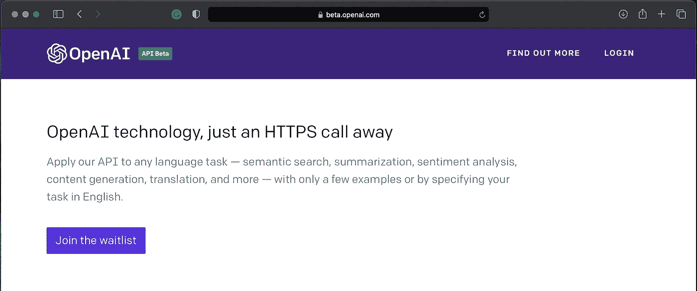

# 如何使用 GPT-3 在 10 分钟内构建令人惊叹的人工智能用例？

> 原文：<https://towardsdatascience.com/how-to-build-amazing-ai-use-cases-under-10-mins-using-gpt-3-ebc51b2b2b97?source=collection_archive---------9----------------------->

## 人工智能的未来

照片由 [Unsplash](https://unsplash.com/s/photos/machine-learning?utm_source=unsplash&utm_medium=referral&utm_content=creditCopyText) 上的 [h heyerlein](https://unsplash.com/@heyerlein?utm_source=unsplash&utm_medium=referral&utm_content=creditCopyText) 拍摄

你是否认为构建一个基于自然语言处理的人工智能应用程序，比如聊天机器人或翻译器，需要大量的数据科学技能，并且会花费大量的时间？它不总是正确的，这篇文章将帮助你更好地理解。我将展示如何使用 GPT-3 以最少的开发工作构建一些令人惊叹的基于自然语言处理的人工智能应用程序。在开始建造之前，让我们先了解一下 GPT 3 号是什么，GPT 3 号的所有特点是什么让它如此特别。

# 什么是 GPT-3？

GPT-3 是预训练的生成式 Transformer 3，它是一种在互联网上的大量数据集上训练的语言模型，由一家名为 OpenAI 的公司开发。GPT-3 是通过 API 提供的，目前，该 API 处于受控测试阶段，有一个等待名单，可以获得这个惊人的 API。

以下是为什么 GPT-3 模型被谈论得最多的一些原因

*   GPT-3 模型由 1750 亿个参数组成，以前的版本，GPT-2 模型只有 15 亿个参数。参数是将输入转换为输出的神经网络模型中的权重
*   它是一个生成模型，这意味着它有能力生成一个连贯的长单词序列作为输出
*   这种最先进的语言模型可以回答几乎任何传递给它的问题，而且以一种更人性化的方式
*   因此，模型训练中使用的数十亿个单词、文本和代码片段使它能够用多种编程语言自动编码
*   它的多语言文本处理也有助于处理英语以外的语言
*   最好的部分是 GPT-3 模型可以执行特定的任务，如成为一名翻译或聊天机器人或代码生成器，无需任何定制或任何特殊调整，它需要的只是一些训练示例

要了解更多关于这个神奇模型的技术细节，请点击[这里](https://www.zdnet.com/article/what-is-gpt-3-everything-business-needs-to-know-about-openais-breakthrough-ai-language-program/)。在这篇文章中，我将向你展示如何使用这个神奇的 API 来解决不同的基于 NLP 的人工智能用例。

# 获取 GPT-3 测试版 API

要构建本文中涵盖的用例，您需要访问 GPT-3 测试版 API。它目前只能通过邀请获得，您可以使用下面的链接申请访问。它将带您进入一个表格，其中会询问一些关于您的组织和您计划实施的项目的问题。

[https://beta.openai.com](https://beta.openai.com)

# 实施背景

为了与 GPT-3 API 接口，我将使用来自下面的[gp t3-沙箱](https://github.com/shreyashankar/gpt3-sandbox)仓库的脚本。我在这个库中使用的脚本是 API 文件夹中的 gpt.py，它使我能够访问 GPT-3 API，从而可以显示可以解决的不同用例。本文使用的脚本可以在[这里](https://github.com/rsharankumar/Use-Cases-using-GPT-3)找到

# 用例 1 —聊天机器人

在这里，我们不会传递任何训练示例，而只是直接访问 API 并将其用作聊天机器人。

在下面的例子中，我正在导入所需的包以及我们从“gpt3-sandbox”存储库中下载的脚本。我们将向模型传递三个参数，

*   发动机——有四个选项供我们选择，分别是达芬奇、阿达、巴贝奇、居里。我们将使用达芬奇，因为它是使用 1750 亿个参数训练的最强大的引擎
*   温度-通常介于 0 和 1 之间，用于控制生成输出的随机性。值为 0 使模型具有确定性，也就是说，每次执行时输出都是相同的，而另一方面，值为 1 时，生成的输出具有很高的随机性。
*   max _ tokens 最大完成长度

在下面的脚本中，需要询问的问题被传递给变量“prompt1 ”,然后使用 submit_request 函数传递给模型。结果存储在“output1”变量中，如下所示，

在上面的例子中，正如你所看到的，这个模型可以对所提的问题给出一个非常好的回答，而不需要调整。由于这里我们不提供任何训练示例，模型输出不需要总是响应，它可以提出一组类似的问题或与传递的输入相关的内容。通过提供一些训练样本，可以提高性能

# 用例 2 — LaTex —文本到等式

在下面的例子中，我们将看到文本到等式转换的实现，只需要很少的训练，这是其他预训练模型所不可能的。

在下面的示例中，温度值已经增加，以使响应具有一定的随机性，我们还将一些预定义的示例作为训练数据集传递给模型。只需 5 个例子，我们就可以训练模型将文本转换成方程。在使用已知示例训练模型之后，我们将以下内容作为输入“x 的平方加上 2 倍”,模型将其转换为一个等式。

# 用例 3—翻译(英语到法语)

就像上面的几个例子一样，我们可以训练模型像一个翻译一样工作。下面是翻译器模块的代码，我们在这里训练模型将英语文本翻译成法语，只有三个例子。

该模型能够以非常少的开发工作量执行特定的任务，如“外语翻译器”或“文本到等式转换器”,这使得它非常特别。

下面是一个教程视频，我提供了一个用例实现的演练。

# 一些使用 GPT-3 创建的酷应用程序

要了解更多使用 GPT3 构建的有趣应用程序，请查看本页[这里](https://gpt3examples.com)。

# 关于我

我是一名拥有超过 10 年经验的数据科学专家，并且已经撰写了 2 本数据科学方面的书籍。我写数据科学相关的内容是为了让它简单易懂。跟我上 [**中**](https://medium.com/@rsharankumar) **。**我也有一个 YouTube 频道，在那里我教授和谈论各种数据科学概念。如果有兴趣，可以订阅我下面的频道。

<https://www.youtube.com/c/DataSciencewithSharan> 