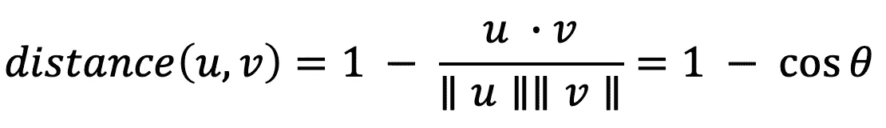

# 如何建立一个令人惊艳的音乐推荐系统？

> 原文：<https://towardsdatascience.com/how-to-build-an-amazing-music-recommendation-system-4cce2719a572?source=collection_archive---------6----------------------->

## 利用 Spotify 的数据生成音乐推荐。


马塞拉·拉斯科斯基在 [Unsplash](https://unsplash.com/s/photos/music?utm_source=unsplash&utm_medium=referral&utm_content=creditCopyText) 上的照片

你有没有想过 Spotify 是如何根据你的收听历史推荐歌曲和播放列表的？你想知道 Spotify 是如何找到与你已经听过的歌曲相似的歌曲的吗？

有趣的是，Spotify 有一个 web API，开发者可以用它来检索歌曲的音频特征和元数据，如歌曲的流行度、节奏、音量、音调和发行年份。我们可以使用这些数据来构建音乐推荐系统，根据用户所听歌曲的音频特征和元数据向用户推荐歌曲。

**在本文中，我将演示如何使用 Spotify 歌曲数据集和 Spotify 的 Python 客户端 Spotipy 来构建基于内容的音乐推荐系统。**

# 安装 Spotipy

Spotipy 是 Spotify Web API 的 Python 客户端，开发者可以轻松获取数据并查询 Spotify 的歌曲目录。在这个项目中，我使用 Spotipy 来获取数据，这些数据在我从 [Kaggle](https://www.kaggle.com/yamaerenay/spotify-dataset-19212020-160k-tracks) 访问的原始 Spotify 歌曲数据集中并不存在。您可以使用下面的命令安装 Spotipy 和 pip。

```
pip install spotipy
```

安装 Spotipy 后，您需要在 [Spotify 开发者页面](https://developers.spotify.com/)上创建一个应用，并保存您的客户端 ID 和密钥。

# 导入库

在下面的代码中，我导入了 Spotipy 和其他一些用于数据操作和可视化的基本库。你可以在 [GitHub](https://github.com/AmolMavuduru/SpotifyRecommenderSystem) 上找到该项目的完整代码。

```
import numpy as np
import pandas as pd
import matplotlib.pyplot as plt
import seaborn as sns
import spotipy
import os
%matplotlib inline
```

# 读取数据

为了建立一个音乐推荐系统，我使用了 [Spotify 数据集](https://www.kaggle.com/yamaerenay/spotify-dataset-19212020-160k-tracks)，它在 [Kaggle](https://www.kaggle.com/yamaerenay/spotify-dataset-19212020-160k-tracks) 上公开，包含超过 170，000 首不同歌曲的元数据和音频特征。我使用了这个数据集中的三个数据文件。第一个文件包含单首歌曲的数据，而接下来的两个文件包含按流派和歌曲发行年份分组的数据。

```
spotify_data = pd.read_csv('./data/data.csv.zip')
genre_data = pd.read_csv('./data/data_by_genres.csv')
data_by_year = pd.read_csv('./data/data_by_year.csv')
```

我在下面加入了列元数据，它是通过为每个数据帧调用熊猫 **info** 函数生成的。

**spotify_data**

```
<class 'pandas.core.frame.DataFrame'>
RangeIndex: 170653 entries, 0 to 170652
Data columns (total 19 columns):
 #   Column            Non-Null Count   Dtype  
---  ------            --------------   -----  
 0   valence           170653 non-null  float64
 1   year              170653 non-null  int64  
 2   acousticness      170653 non-null  float64
 3   artists           170653 non-null  object 
 4   danceability      170653 non-null  float64
 5   duration_ms       170653 non-null  int64  
 6   energy            170653 non-null  float64
 7   explicit          170653 non-null  int64  
 8   id                170653 non-null  object 
 9   instrumentalness  170653 non-null  float64
 10  key               170653 non-null  int64  
 11  liveness          170653 non-null  float64
 12  loudness          170653 non-null  float64
 13  mode              170653 non-null  int64  
 14  name              170653 non-null  object 
 15  popularity        170653 non-null  int64  
 16  release_date      170653 non-null  object 
 17  speechiness       170653 non-null  float64
 18  tempo             170653 non-null  float64
dtypes: float64(9), int64(6), object(4)
memory usage: 24.7+ MB
```

**流派 _ 数据**

```
<class 'pandas.core.frame.DataFrame'>
RangeIndex: 2973 entries, 0 to 2972
Data columns (total 14 columns):
 #   Column            Non-Null Count  Dtype  
---  ------            --------------  -----  
 0   mode              2973 non-null   int64  
 1   genres            2973 non-null   object 
 2   acousticness      2973 non-null   float64
 3   danceability      2973 non-null   float64
 4   duration_ms       2973 non-null   float64
 5   energy            2973 non-null   float64
 6   instrumentalness  2973 non-null   float64
 7   liveness          2973 non-null   float64
 8   loudness          2973 non-null   float64
 9   speechiness       2973 non-null   float64
 10  tempo             2973 non-null   float64
 11  valence           2973 non-null   float64
 12  popularity        2973 non-null   float64
 13  key               2973 non-null   int64  
dtypes: float64(11), int64(2), object(1)
memory usage: 325.3+ KB
```

**逐年数据**

```
<class 'pandas.core.frame.DataFrame'>
RangeIndex: 2973 entries, 0 to 2972
Data columns (total 14 columns):
 #   Column            Non-Null Count  Dtype  
---  ------            --------------  -----  
 0   mode              2973 non-null   int64  
 1   genres            2973 non-null   object 
 2   acousticness      2973 non-null   float64
 3   danceability      2973 non-null   float64
 4   duration_ms       2973 non-null   float64
 5   energy            2973 non-null   float64
 6   instrumentalness  2973 non-null   float64
 7   liveness          2973 non-null   float64
 8   loudness          2973 non-null   float64
 9   speechiness       2973 non-null   float64
 10  tempo             2973 non-null   float64
 11  valence           2973 non-null   float64
 12  popularity        2973 non-null   float64
 13  key               2973 non-null   int64  
dtypes: float64(11), int64(2), object(1)
memory usage: 325.3+ KBExploratory Data Analysis
```

基于上面的列描述，我们可以看到每个数据帧具有关于音频特征的信息，例如不同歌曲的可跳舞性和响度，这些信息也已经跨流派和特定年份进行了汇总。

# 探索性数据分析

该数据集非常有用，可用于多种任务。在建立推荐系统之前，我决定创建一些可视化工具，以便更好地理解数据和过去 100 年来音乐的趋势。

## 随着时间推移的音乐

使用按年份分组的数据，我们可以了解音乐的整体声音从 1921 年到 2020 年是如何变化的。在下面的代码中，我使用 Plotly 来可视化过去 100 年来歌曲的不同音频特征的值。

```
import plotly.express as px sound_features = ['acousticness', 'danceability', 'energy', 'instrumentalness', 'liveness', 'valence']
fig = px.line(data_by_year, x='year', y=sound_features)fig.show()
```

根据上面的情节，我们可以看到，音乐已经从 20 世纪初更多的声学和器乐声音过渡到 21 世纪初更多的舞曲和活力的声音。20 世纪 20 年代的大部分曲目很可能是古典和爵士风格的器乐作品。由于计算机和先进的音频工程技术的出现，2000 年代的音乐听起来非常不同，这些技术允许我们创建具有各种效果和节拍的电子音乐。

我们还可以看看音乐的平均节奏或速度在这些年里是如何变化的。下面的代码生成的图表也支持声音向电子音乐的急剧转变。

```
fig = px.line(data_by_year, x='year', y='tempo')fig.show()
```

根据上面的图表，我们可以清楚地看到，在过去的一个世纪里，音乐的发展速度明显加快了。这一趋势不仅是 20 世纪 60 年代迷幻摇滚等新流派的结果，也是音频工程技术进步的结果。

## 不同体裁的特点

该数据集包含不同歌曲的音频特征以及不同流派的音频特征。我们可以利用这些信息来比较不同的流派，了解它们在声音上的独特差异。在下面的代码中，我从数据集中选择了 10 个最流行的流派，并可视化了每个流派的音频特征。

```
top10_genres = genre_data.nlargest(10, 'popularity')
fig = px.bar(top10_genres, x='genres', y=['valence', 'energy', 'danceability', 'acousticness'], barmode='group')fig.show()
```

上述许多流派，如中国电穿孔是非常具体的，很可能属于一个或多个广泛的流派，如流行音乐或电子音乐。我们可以将这些高度特定的流派进行分类，并根据它们的音频特征来理解它们与其他流派的相似程度。

## 用 K-均值聚类流派

在下面的代码中，我使用了著名而简单的 K-means 聚类算法，根据每个流派的数字音频特征，将该数据集中的 2，900 多种流派分成 10 个聚类。

```
from sklearn.cluster import KMeans
from sklearn.preprocessing import StandardScaler
from sklearn.pipeline import Pipelinecluster_pipeline = Pipeline([('scaler', StandardScaler()), ('kmeans', KMeans(n_clusters=10, n_jobs=-1))])X = genre_data.select_dtypes(np.number)
cluster_pipeline.fit(X)
genre_data['cluster'] = cluster_pipeline.predict(X)
```

既然流派已经被分配到聚类中，我们可以通过在二维空间中可视化聚类来进一步进行分析。

## 用 t-SNE 可视化体裁聚类

每个流派都有许多音频特征，很难在高维空间中可视化聚类。但是，我们可以使用一种称为[t-分布式随机邻居嵌入](https://www.jmlr.org/papers/volume9/vandermaaten08a/vandermaaten08a.pdf)的降维技术，将数据压缩到一个二维空间中，如下面的代码所示。

```
from sklearn.manifold import TSNEtsne_pipeline = Pipeline([('scaler', StandardScaler()), ('tsne', TSNE(n_components=2, verbose=2))])
genre_embedding = tsne_pipeline.fit_transform(X)projection = pd.DataFrame(columns=['x', 'y'], data=genre_embedding)
projection['genres'] = genre_data['genres']
projection['cluster'] = genre_data['cluster']
```

现在，通过使用 Plotly 的散射函数，我们可以很容易地在二维坐标平面中可视化流派簇。

```
import plotly.express as pxfig = px.scatter(
    projection, x='x', y='y', color='cluster', hover_data=['x', 'y', 'genres'])
fig.show()
```

二维空间中的流派簇。

## 用 K-Means 聚类歌曲

为了理解如何建立一个更好的推荐系统，我们还可以使用 K-means 对歌曲进行聚类，如下所示。

```
song_cluster_pipeline = Pipeline([('scaler', StandardScaler()), 
                                  ('kmeans', KMeans(n_clusters=20, 
                                   verbose=2, n_jobs=4))],verbose=True)X = spotify_data.select_dtypes(np.number)
number_cols = list(X.columns)
song_cluster_pipeline.fit(X)
song_cluster_labels = song_cluster_pipeline.predict(X)
spotify_data['cluster_label'] = song_cluster_labels
```

## 基于主成分分析的歌曲聚类可视化

歌曲数据帧比流派数据帧大得多，所以我决定使用 PCA 而不是 t-SNE 进行降维，因为它的运行速度明显更快。

```
from sklearn.decomposition import PCApca_pipeline = Pipeline([('scaler', StandardScaler()), ('PCA', PCA(n_components=2))])
song_embedding = pca_pipeline.fit_transform(X)projection = pd.DataFrame(columns=['x', 'y'], data=song_embedding)
projection['title'] = spotify_data['name']
projection['cluster'] = spotify_data['cluster_label']
```

现在，我们可以使用下面的代码在二维空间中可视化歌曲集群。

```
import plotly.express as pxfig = px.scatter(projection, x='x', y='y', color='cluster', hover_data=['x', 'y', 'title'])
fig.show()
```

二维空间中的歌曲集群。

上面的情节是交互式的，所以当你悬停在点上时，你可以看到每首歌的标题。如果你花一些时间探索上面的情节，你会发现相似的歌曲往往位于彼此附近，集群内的歌曲往往至少有些相似。这个观察是我在下一节中创建的基于内容的推荐系统背后的关键思想。

# 构建基于内容的推荐系统

根据上一节的分析和可视化，很明显，相似的流派往往具有彼此靠近的数据点，而相似类型的歌曲也聚集在一起。

在实践层面上，这一观察非常有意义。相似的风格听起来相似，并且来自相似的时间段，而这些风格中的歌曲也是如此。我们可以利用这种想法，通过获取用户听过的歌曲的数据点，并推荐与附近数据点对应的歌曲，来构建推荐系统。

## 查找不在数据集中的歌曲

在我们建立这个推荐系统之前，我们需要能够容纳原始 Spotify 歌曲数据集中不存在的歌曲。我在下面定义的 **find_song** 函数从 Spotify 的目录中获取任何歌曲的数据，给出歌曲的名称和发行年份。结果以熊猫数据帧的形式返回，数据字段出现在我从 [Kaggle](https://www.kaggle.com/yamaerenay/spotify-dataset-19212020-160k-tracks) 下载的原始数据集中。

有关如何使用 Spotipy 的详细示例，请参考此处的[文档页面](https://spotipy.readthedocs.io/en/2.16.1/)。

## 生成歌曲推荐

现在终于可以搭建音乐推荐系统了！我使用的推荐算法非常简单，遵循三个步骤:

1.  **计算用户听过的每首歌曲的音频和元数据特征的平均向量。**
2.  **在数据集中找到 *n* 个最接近这个平均向量的数据点(不包括用户收听历史中歌曲的点)。**
3.  **拿这 *n* 点，推荐对应的歌曲**

该算法遵循在基于内容的推荐系统中使用的通用方法，并且是可推广的，因为我们可以用从经典欧几里德距离到余弦距离的大范围距离度量来数学地定义术语*最近*。为了这个项目的目的，我使用了余弦距离，这是为两个向量 *u* 和 *v* 定义的。



余弦距离公式。

换句话说，余弦距离是 1 减去余弦相似度，余弦是两个向量之间的夹角。余弦距离通常用在推荐系统中，并且即使当所使用的向量具有不同的量值时也能很好地工作。如果两首歌曲的向量是平行的，它们之间的角度将是零，这意味着它们之间的余弦距离也将是零，因为零的余弦是 1。

我在下面定义的函数在 Scipy 的 [**cdist**](https://docs.scipy.org/doc/scipy/reference/generated/scipy.spatial.distance.cdist.html) 函数的帮助下实现了这个简单的算法，用于查找两对点集合之间的距离。

该算法背后的逻辑听起来令人信服，但这个推荐系统真的有效吗？找到答案的唯一方法是用实际例子来测试它。

比方说，我们想为听 90 年代垃圾音乐的人推荐音乐，特别是涅槃乐队的歌曲。我们可以使用 **recommend_songs** 函数来指定他们的收听历史并生成推荐，如下所示。

```
recommend_songs([{'name': 'Come As You Are', 'year':1991},
                {'name': 'Smells Like Teen Spirit', 'year': 1991},
                {'name': 'Lithium', 'year': 1992},
                {'name': 'All Apologies', 'year': 1993},
                {'name': 'Stay Away', 'year': 1993}],  spotify_data)
```

运行此功能会产生下面的歌曲列表。

```
[{'name': 'Life is a Highway - From "Cars"',
  'year': 2009,
  'artists': "['Rascal Flatts']"},
 {'name': 'Of Wolf And Man', 'year': 1991, 'artists': "['Metallica']"},
 {'name': 'Somebody Like You', 'year': 2002, 'artists': "['Keith Urban']"},
 {'name': 'Kayleigh', 'year': 1992, 'artists': "['Marillion']"},
 {'name': 'Little Secrets', 'year': 2009, 'artists': "['Passion Pit']"},
 {'name': 'No Excuses', 'year': 1994, 'artists': "['Alice In Chains']"},
 {'name': 'Corazón Mágico', 'year': 1995, 'artists': "['Los Fugitivos']"},
 {'name': 'If Today Was Your Last Day',
  'year': 2008,
  'artists': "['Nickelback']"},
 {'name': "Let's Get Rocked", 'year': 1992, 'artists': "['Def Leppard']"},
 {'name': "Breakfast At Tiffany's",
  'year': 1995,
  'artists': "['Deep Blue Something']"}]
```

从上面的列表中我们可以看到，推荐算法产生了一个 90 年代和 2000 年代的摇滚歌曲列表。名单中的乐队如 Metallica，Alice in Chains 和 Nickelback 与 Nirvana 相似。排行榜上的第一首歌，“生活是一条高速公路”不是一首垃圾歌曲，但如果你仔细听，吉他即兴重复的节奏实际上听起来类似于涅槃乐队的“闻起来像青少年精神”。

如果我们想为听迈克尔·杰克逊歌曲的人做同样的事情呢？

```
recommend_songs([{'name':'Beat It', 'year': 1982},
                 {'name': 'Billie Jean', 'year': 1988},
                 {'name': 'Thriller', 'year': 1982}], spotify_data)
```

推荐函数给出了下面的输出。

```
[{'name': 'Hot Legs', 'year': 1977, 'artists': "['Rod Stewart']"},
 {'name': 'Thriller - 2003 Edit',
  'year': 2003,
  'artists': "['Michael Jackson']"},
 {'name': "I Didn't Mean To Turn You On",
  'year': 1984,
  'artists': "['Cherrelle']"},
 {'name': 'Stars On 45 - Original Single Version',
  'year': 1981,
  'artists': "['Stars On 45']"},
 {'name': "Stars On '89 Remix - Radio Version",
  'year': 1984,
  'artists': "['Stars On 45']"},
 {'name': 'Take Me to the River - Live',
  'year': 1984,
  'artists': "['Talking Heads']"},
 {'name': 'Nothing Can Stop Us', 'year': 1992, 'artists': "['Saint Etienne']"}]
```

排行榜首是洛德·斯蒂沃特的歌曲，他和迈克尔·杰克逊一样，在 20 世纪 80 年代成名。该列表还包含迈克尔·杰克逊的《颤栗者》的 2003 年版本，这是有意义的，因为用户已经听过这首歌的 1982 年版本。该榜单还包括 20 世纪 80 年代乐队的流行和摇滚歌曲，如《45 岁的星星》和《会说话的脑袋》。

我们可以使用更多的例子，但是这些例子应该足以展示推荐系统如何产生歌曲推荐。要获得更完整的示例，请查看该项目的 GitHub 库[。用这段代码随意创建你自己的播放列表！](https://github.com/AmolMavuduru/SpotifyRecommenderSystem)

# 摘要

Spotify 跟踪歌曲的元数据和音频特征，我们可以用它们来建立音乐推荐系统。在本文中，我演示了如何使用这些数据构建一个简单的基于内容的音乐推荐系统，该系统采用余弦距离度量。像往常一样，你可以在 [GitHub](https://github.com/AmolMavuduru/SpotifyRecommenderSystem) 上找到这个项目的完整代码。

如果你喜欢这篇文章，并且想了解更多关于推荐系统的知识，可以看看下面列出的我以前的一些文章。

</how-to-build-powerful-deep-recommender-systems-using-spotlight-ec11198c173c>  </how-you-can-build-simple-recommender-systems-with-surprise-b0d32a8e4802>  

# 加入我的邮件列表

你想在数据科学和机器学习方面变得更好吗？您想了解数据科学和机器学习社区的最新图书馆、开发和研究吗？

加入我的[邮件列表](https://mailchi.mp/e8dd82679724/amols-data-science-blog)，获取我的数据科学内容的更新。当你[注册](https://mailchi.mp/e8dd82679724/amols-data-science-blog)的时候，你还会得到我免费的**解决机器学习问题的逐步指南**！

# 来源

1.  Y.E. Ay， [Spotify 数据集 1921–2020，160k+曲目【T7，】，(2020)，Kaggle。](https://www.kaggle.com/yamaerenay/spotify-dataset-19212020-160k-tracks)
2.  长度范德马滕和 g .辛顿，[使用 t-SNE](https://www.jmlr.org/papers/volume9/vandermaaten08a/vandermaaten08a.pdf) 可视化数据，(2008)，《机器学习研究杂志》。
3.  页（page 的缩写）维尔塔宁等人。al，[SciPy 1.0:Python 中科学计算的基本算法](https://www.nature.com/articles/s41592-019-0686-2)，(2020)，自然方法。