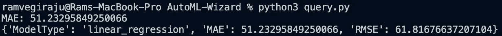
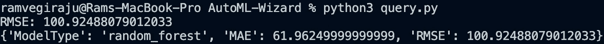

# 如何构建 AutoML API

> 原文：<https://towardsdatascience.com/how-to-build-an-automl-api-8f2dd5f687d1?source=collection_archive---------16----------------------->

## 构建可重用 ML 类的简单指南

图片来自[斯科特·格雷厄姆](https://unsplash.com/@homajob)的 [Unsplash](https://unsplash.com/photos/5fNmWej4tAA)

最近人们对[汽车](https://www.automl.org/automl/)很感兴趣。从开源项目到云中的可扩展算法，让非技术用户更容易使用 ML 的项目越来越多。云中 AutoML 的例子包括 [SageMaker Canvas](https://aws.amazon.com/blogs/aws/announcing-amazon-sagemaker-canvas-a-visual-no-code-machine-learning-capability-for-business-analysts/) 和 [Azure AutoML](https://docs.microsoft.com/en-us/azure/machine-learning/concept-automated-ml) 等等。在本文中，我们将不会在云上工作，而是向您展示如何构建一个简单的 Python API 来自动解决回归问题。有许多开源项目正在解决 [AutoML](https://awesomeopensource.com/projects/automl) 问题。

我将带您完成构建您自己的 AutoML 类的过程。即使您最终没有创建自己的包，构建可重用的类也是很好的编程实践。您还可以构建 API 来自动化 ML 中的许多冗余任务。一个例子是为 NLP 项目构建预处理类，你可以为基于文本的项目重用你的 API。要阅读这篇文章，你应该对 Python 和面向对象编程有很好的理解。

# 目录

1.  设置
2.  构建您的 API
3.  测试 API
4.  后续步骤和结论

## 1.设置

在我们开始构建 API 之前，您需要安装以下库:pandas、numpy 和 sklearn。下面的代码块将包含我们正在处理的导入。

进口

既然已经安装了所有必需的库，下一步就是设置我们要处理的类。我们的简单 API 有四个主要参数:**数据集**、**目标列**、**模型类型**和**度量类型**。对于数据集，我们将提供 CSV 数据集的路径。对于目标列，我们需要选择我们试图预测的列，因为它是在数据集中声明的。对于模型类型，我们在线性和随机森林回归中有两个选项可供选择。最后，对于公制类型，有平均绝对误差(MAE)和均方根误差(RMSE)。

AutoML 类已创建

我们还会用类方法填充一些参数。

现在我们已经准备好为预处理、模型训练和评估构建我们的方法。

## 2.构建您的 API

构建 AutoML API 的第一步是预处理函数。我们将读入数据，然后将其分成训练集和测试集。我们还检查我们的目标列参数是否存在于已经提供的数据集中。

预处理方法

既然我们已经有了我们训练和测试数据，我们可以把注意力集中在我们的模型构建/训练方法上。

训练方法

目前只有**两种模型**提供:**线性 _ 回归**和**随机 _ 森林**。我们检查以确保您输入了这两个模型中的一个，然后根据您的选择创建并训练所选的模型。

线性和随机森林回归

现在我们可以返回一个基于 metric_type 参数的度量。为此，我们可以创建一个 evaluate 方法，根据该参数的输入返回 MAE 或 RMSE。

评估方法

首先，我们检查以确保输入是受支持的指标之一，然后我们返回用户选择。如果我们想要完整的信息，我们可以使用 logModelInfo 方法，该方法具有模型类型和两个度量。一般来说，随着 API 变得越来越复杂，您将需要一个日志记录方法来跟踪您的查询。

日志信息

## 3.测试 API

现在我们可以用一些样本输入来测试我们的样本 API。

样本值输入

在这里，我们要求一个线性回归模型与 MAE 指标。

示例输出(作者截图)

我们可以使用随机森林模型和 RMSE 度量来尝试另一个样本。

样本 RF 输入

示例输出(作者截图)

## 4.后续步骤和结论

要访问示例的完整代码，请查看这个[链接](https://github.com/RamVegiraju/AutoML-API)。如您所见，为 ML 构建 Python 类是一个非常简单的过程。要构建复杂的真实世界级别的包，只需要几个额外的步骤和一个可重复的设置，查看这个[资源](https://www.freecodecamp.org/news/build-your-first-python-package/)就可以开始了。有大量的 AutoML 开源项目你可以开始参与。即使作为数据科学家，熟悉构建类、包，并在更深层次上理解您正在使用的开源工具或 AutoML 服务也是至关重要的。

*如果你喜欢这篇文章，请在*[*LinkedIn*](https://www.linkedin.com/in/ram-vegiraju-81272b162/)*上联系我，订阅我的媒体* [*简讯*](https://ram-vegiraju.medium.com/subscribe) *。如果你是新手，使用我的* [*会员推荐*](https://ram-vegiraju.medium.com/membership) *报名。*